# 0x00_使用规则
> GitHub@[orca-j35](https://github.com/orca-j35)，所有笔记均托管在 [eagle-notes](https://github.com/orca-j35/eagle-notes) 仓库

提供了对类 C 用户语言程序 ULP-user language programe 的支持。，可实现工具的完全定制化，包括对外部文件进行存取和互动操作，还能够导人其他设计工具或程序的数据，并生成Gcrber 文件和Excellon 文件。

向从EAGLE 的创始公司CadSoft 成为全球最大的电子分销商之- clement14（即之前的Premier Farnell 集团)公司旗下的成员后，其5 . 10 版首次集成了Designlink 接口。通过该接口提供的搜索窗口， 工程师可以直接对所需要的元件进行搜索，软件会向动连接到element14 的网络服务器数据库，并将搜索到的报价、库存数量、订货编号等元件信息显示在搜索窗口内。这时工程师可以在该窗口内轻松地完成产品订购或者导出订货列表。


## EAGLE 使用规则
EAGLE 提供了多种命令执行方式，这些方式都可以在EAGLE 的原理图、PCB 和元件库编辑器中实现，包括:
· 通过编辑器菜单执行;
· 通过命令输入框执行;
· 通过编辑器的按钮执行;
· 通过同时采用按钮和命令行输入的混合方式执行;
· 通过右击鼠标弹出菜单执行;
· 通过功能热键执行;
· 通过脚本文件执行;
· 通过户语言程序执行。
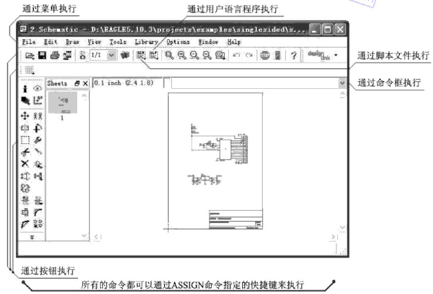
注意：在EAGLE 命令框中执行过的命令可以通过上下方向键来重新调用，这些命令在关闭软件前都会保存在历史记录中，以避免重复输入相同或相似的命令。
通过命令行输入的方式来执行命令能够快捷、准确地实现各种操作和配置，并且对于高级用户来说，将EAGLE 的一系列命令行集合组成脚本文件，或者采用类C 语言的ULP 用户语言程序，可以实现比单一命令行更复杂的操作以及各种额外的功能。

### 功能热键
在不与操作系统或 Linux Window Manager（窗口管理器）的设置冲突的情况下（例如 F1 键代表帮助），文本可以关联到各个功能键以及这些功能键与 Alt、Ctrl 和 Shift 键的组合（Mac OS-X 系统还包括 Cmd 键）。
当按下某个功能键时就相当于通过键盘输入相对应的文本。由于命令都可以通过文本的形式输入，所以每条带有特定参数的命令都可以分配一个功能键。通过这种方式甚至可以将多个命令组成的序列分配给一个功能键。
命令
ASSIGN
显示当前的功能键配置。
在分配窗口（assign window）中可以对热键配置进行修改。
New（新建）按钮可以用来定义一个新的功能键配置。单击 Del（删除）按钮可以删除选中的配置项，而 Change（修改）按钮则用于修改现有的功能键定义。
单击 OK（确定）来关闭对话框并保存设置，单击 Cancel（取消）则放弃功能键配置。
这些设置也可以通过原理图或 PCB 编辑器中的选项/分配菜单来实现。

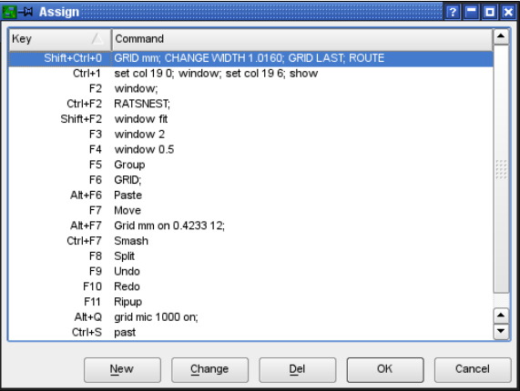

您也可以在 EAGLE.scr 文件中使用 ASSIGN 命令对功能键进行预设置（请参考第 100 页中的 eagle.scr 文件章节）。

例如：
组合键 Ctrl + Shift + G 显示 0.127mm 的栅格：
ASSIGN CS+G 'GRID MM 0.127 ON;‘
组合键 Alt + F6 将该层电路移动到顶层并启动 ROUTE 命令：
ASSIGN A+F6 'LAYER TOP; ROUTE'
组合键 Alt + R 首先显示顶层、焊盘、过孔以及尺寸，然后通过默认打印机进行打印：
ASSIGN A+R 'DISPLAY NONE 1 17 18 20; PRINT;'
字母 A、C、M 和 S 分别代表 Alt、Ctrl、Cmd（仅 Mac OS-X 系统）、以及Shift 键。
组合键 Alt + 0 用于使 Control Panel 前端显示。
组合键 Alt + 1 到 9 根据所打开的每个编辑器窗口标题栏的编号分配给不同的窗口。

### Script 脚本文件
脚本文件是一种功能强大的工具。它能够包含很长的命令序列，比如 defaultcolors.scr文件中对于所有电路层的特定颜色和填充方式的规定。
另一方面它还可以包含由其他程序的数据转换而来的网络表。命令SCRIPT用于执行脚本文件。许多ULP（用户语言程序）都能够创建可读的脚本文件以便修改PCB设计或者
原理图。例如EAGLE可以通过EXPORT命令（选择Netscript选项）将整个元件库以一个脚本文件的格式输出。该文件可以在文本编辑器中进行修改，然后可以再次导入使用。这种方式使元件库的修改变得非常简单。
在本章中将会进一步介绍脚本文件和EXPORT命令。

### 混合输入
各种不同的命令输入方式可以混合使用。
比如，您可以单击 CIRCLE 命令的图标（等同于在命令框中输入 CIRCLE），然后输入圆心和圆周上某一点的坐标，在命令框中的坐标格式为：
（2 2） （2 3） ←
假设当前单位设置为英寸，则以上数值表示一个半径为 1 英寸，圆心坐标为（2 2）的圆形。
无论 CIRCLE 命令以单击图标的方式输入还是在命令框中输入，其输出结果相同。

某些 EAGLE 命令需要与 Shift、Alt 或Ctrl 键联合使用。在 Mac OS-X 系统中，请使用 Cmd 键代替 Ctrl 键。

### EAGLE 的命令语法

#### 命令结尾的分号
分号一般用于脚本文件中每条命令的结尾处，用于终止该条命令以及与下一条命令隔开，并且让软件知道命令行后面不再需要其他参数。和C语言中的分号功能相同。
在命令框中一般不需要输入分号，直接回车运行命令即可。
通过双击，打开Control Panel 树形查看窗口Scripts 分支下的脚本文件.就可以查看分号在脚本文件巾的应用实例。
如果命令是通过脚本文件运行的，则每条命令都需要以分号结尾。如果用是键盘输入命令并且每条命令以 Enter 键符号结尾，则可以省略分号。
实例：
将某个元件移动到特定位置。
GRID MM 1;
MOVE IC1 （120 25） ;
另外您也可以输入对象的坐标：
MOVE （0.127 2.54） （120 25）;
IC1 位于坐标（0.127 2.54）并被移动到坐标（120 25）。
元件的当前坐标可以通过 INF0 命令来获取。
INFO IC1
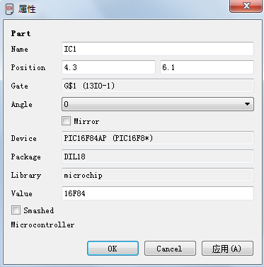
在定义了某个符号后，将某个引脚放置在特定位置。
PIN 'GND' PWR NONE SHORT R180 （0.2 0.4） ;
在 41 层 tRestrict 上绘制一个矩形的禁止布线区：
LAYER TRESTRICT;
RECT （0.5 0.5） （2.5 4） ;

#### 回车Enter
如果以命令行的方式输入 EAGLE 命令，则用 Enter 键来结束输入。在某些情况下命令必须用一个分号来结束，以便让 EAGLE 知道不会再有其他参数了。推荐在脚本文件中的所有命令都用分号结尾。
在本手册中很多地方都有输入 Enter 键的符号标志，以 ← 表示。但是因为以下实例中的命令可能会用于命令行方式或者脚本文件中，所以并没有添加 Enter 键符号或者分号。

#### 大写
EAGLE 命令不区分大小写，比如 GRID 与 grid 两种输入方式都可以运行命令。
语法：
GRID LINES
输入：
GRID LINES 或者 grid lines

#### 小写
这里小写的参数是指名称、数字或者关键字。例如：
语法：
GRID grid_ size grid_multiple
输入：
GRID 1 10
该命令将栅格宽度设置为 1mm（假设当前单位设置为 mm）。每个可见栅格宽度为 10mm 。 数 字 1 和 10 分 别 代 替 命 令 中 的 占 位 符 grid_ size 和grid_multiple。

#### 下划线
在参数和关键字的名称中常常使用下划线来使其代表的意思更加清晰易懂。请不要将下划线与空格符号混淆。
正如在上边的例子中一样，grid_ size 代表一个单独的参数，grid_multiple 则代表另一个单独的参数。
如果某个关键字带有一个下划线符号，比如以下命令中的 COLOR_LAYER
SET COLOR_LAYER layer_name color_word
则该符号的输入应该与其他符号的输入方式相同。例如：
SET COLOR_LAYER BOTTOM BLUE
该命令用于修改指定层的颜色，其中COLOR_LAYER 为常数，在执行时需要直接输入。
layer 和color 是变量，分别代表需要指定的层名称或编号以及需要指定的颜色名称或编号。
以下是PCB 编辑器中的实例:
SET COLOR_LAYER top red ; 第一种设置方式
SET COLOR_LAYER 1 4 ; 第二种设置方式
执行命令后，Top( 顶层)即第一层的颜色将会修改为红色(蓝色在PCB 编辑器中的编号为1，红色在PCB 编辑器中的编号为4) 。
关于其他带下划线的常数，请在Help 对话框中搜索"_"符号。

#### 命令的简写
EAGLE 中有些命令比较长，这时可以只输入其中一部分字符就能够被 EAGLE 识别，但需要保证所输入的简单字符不会发生歧义。
例如输入:
DI
按Enter 键后软件将自动将其识别为DISPLAY 命令，并弹出Display 设置对话框。

#### 空格
在可以使用空格的地方可输入任意数量的空格。

#### 二选一参数  I 
在某个命令支持多个可选参数的情况下， Help 对话框中解释该命令参数的用法时采用" I "符号来隔开多个参数，比如 Help 对话框对 SET 命令进行解释时，其中可以看到SET BEEP ON I OFF 的命令行语法，表示该命令后可输入ON 或者OFF 来启用或关闭声音提示功能，实际输入时不需要该符号。
实际输入时的命令如下：
语法：
SET BEEP ON | OFF
输入：
SET BEEP ON
或者
SET BEEP OFF
打开或关闭由特定操作引发的嗡鸣声。

#### 鼠标单击符号 • 
EAGLE 的 Help 对话框用" • "符号来表示单击鼠标左键，比如解释MOVE 命令的使用时:
MOVE • •..
输入：
MOVE ← （或单击该命令图标）
鼠标单击要移动的第一个对象
鼠标单击目的地
鼠标单击要移动的第二个对象
以此反复。
表示执行MOVE 命令后可以通过单击鼠标左键选择元件，然后在需要的位置再次单击
左键来将元件移动到新位置。输入命令时不需要输入该符号。

#### 重复符号 ..
EAGLE 在 Help 对话框中用".."来表示该符号前面的相同类型的参数可以一次输入多个，或者该命令可以多次执行。

比如在解释 DISPLAY 命令语法时，规则如下:
DISPLAY [option] layer_name.. 
option 是可选项，包括ALL 、NONE 、LAST 等。最后的" .. "符号表示可以输入多个层的名称，例如实际输入:
display none botton top pins
按Enter 键后软件将只显示Top 层、Bottom 层和Pins 层，并隐藏其他的层。
语法：
DISPLAY option layer_name..
输入：
DISPLAY TOP PINS VIAS
也可以使用电路层编号：
DISPLAY 1 17 18
这里将显示多个电路层。
如果要隐藏某个电路层（比如：底层）则输入：
DISPLAY -16

再比如MOVE 命令在H elp 对话框巾的操作方法表示如下:
MOVE • •..
说明运行MOVE 命令后，通过单击鼠标左键可以重复执行移动对象的功能。

#### 单击鼠标右键 >
主要用于对包含多个元件的元件组进行操作。例如用GROUP ALL命令选择所有元件后，再执行命令MOVE (0 0) (10 0) ，整个元件组将在X 轴上向右移动 10 个单位的距离。

#### 简写字符
EAGLE 命令中还可以单独或同时使用一些特殊字符，以表示执行命令时按住其对应按键不放，或者表示指定坐标的类别。它们分别如下:
• A : 代表Alt 键，用于选择备用栅格，例如命令GRID A 0.01 表示将备用栅格尺寸修改
为0.01 。
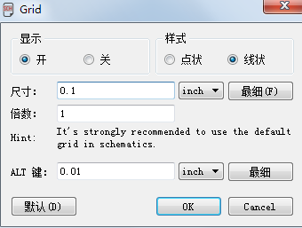
• C: 代表Ctrl 键或Mac OS X 系统下的Cmd 键。
• S: 代表Shift 键。
• R: 代表相对坐。
• P: 代表极坐标。
C 和 S 能够让各种命令以不同的方式执行。在各个命令的帮助页面中可以找到
更多的信息。

### 坐标的输入方法
该软件将每一次鼠标单击的位置都看作一对坐标值。如果需要在命令框中输入文本格式的命令，则可以通过键盘用以下方式输入坐标，而不需要通过鼠标来确定位置：
(x y)
这里的 x 和 y 表示由 GRID 命令选定的单位的数量。这种文本输入方式对于脚本文件特别有用。
当前鼠标的位置坐标可以通过（@）来获得。例如：
WINDOW  (@)
以文本形式输入坐标的实例：

例如您要输入一个具有精确尺寸的电路板轮廓。
GRID MM 1;
LAYER DIMENSION;
WIRE 0 （0 0） （160 0） （160 100） （0 100） （0 0）;
GRID LAST;
第一步将栅格尺寸修改 1mm。然后激活 dimension 层。接下来 WIRE 命令将线宽设置为 0 并且以四个给定的坐标绘制一个长方形。最后一条命令将栅格设置恢复为修改之前的状态，这是因为电路板设置通常都采用英寸为单位。

1. 绝对坐标的输入
EAGLE 中的绝对坐标是指编辑器中以原点为基准的坐标值，即某一点与原点的X 和Y 坐标轴之间的栅格数。
比如实际输入命令如下:
WIRE ( 0.6 0.6) (1.6 0.6)
按Enter 键，后将在编辑器中( 0.6 0.6)与(1.6 0.6)两点之间绘制一条线段。
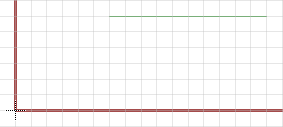

2. 相对坐标的输入
相对坐标是指相对于指定参考点的坐标值，坐标语法为(R x y) ,该值表示由 MARK 命令设置的一个参考点。如果您没有设置参考点，则坐标系统将使用绝对原点。。比如以下命令:
GRID MM 0 .5
MARK (20 10 )
VIA(R 5 12.5)
MARK
这些命令的作用是首先将栅格设置为0.5 mm ，然后用MARK 命令在相对于原点的(20 10) 坐标点上放置一个参考点，接下来该参考点的X 轴上5 mm ， Y 轴上12 . 5 mm 处放置一个过孔，最后删除该参考点。

3. 极坐标的输入
极坐标的语法为(P radius angle) ，即通过指定radius半径和angle角度来确定某一点的位置。极坐标主要用于在圆周上放置元件、过孔或焊盘，例如命令如下:
GRID MM 0 .5
MARK (20 10)
CIRCLE (R 0 0) (R 40 0)
VIA (p 40 0 )
VIA (p 40 120 )
VIA (P 40 240 )
这些命令的作用是首先将栅格设置为0.5 mm ，然后用MARK 命令在相对于原点的 (20 10) 坐标点上放置一个参考点，接下来以参考点为圆心，绘制一个半径为40 mm 的圆周，然后在圆周上分别在00° 120°和240° 的点放置过孔。
注意: 如果没有使用MARK 命令来制定参考点，软件将自动以默认的原点为参考点，即绘图中默认的(0 0) 坐标点。
GRID MM;
MARK （12.5 7.125）;
LAYER 21;
CIRCLE （R 0 0） （R 0 40）;
PAD （P 40 0）;
PAD （P 40 120）;
PAD （P 40 240）;
这些例子展示了在坐标（12.5 7.125）上放置一个参考点。然后在 21 层（tPlace 层）上绘制一个半径为 40mm 的圆形。最后在圆形上每隔 120°放置一个焊盘。
通过相对坐标可以很轻松的绘制一个圆形。因此我们不需要为了绘制圆形的下一个坐标值而关心圆形上某一点的绝对坐标。

### DISPLAY、GRID 和 WINDOW 命令的自定名称
您可以为 DISPLAY、GRID 和 WINDOW 命令设置自定名称。 这种名称是一组参数的组合，您可以用任何名称保存该组合并用相应的命令执行该组合。要访问自定名称只需要用鼠标右键单击命令图标即可。
在 Schematic（原理图）、Layout（PCB 设计）和 Library（库文件）中都保存了自定名称。因此这些名称可以在所有的 Schematic （ 原 理 图 ），Layout（PCB 设计）和Library（库文件）中使用。
#### 实例：DISPLAY 命令的自定名称
在 PCB 编辑器中使用 DISPLAY 命令来显示您需要的电路层，例如：
Top、Pads、Vias、和 Dimension 等层。
右键单击 DISPLAY 图 出现弹出菜单。

选择新建选项
输入自定名称，例如 Top_view
单击 OK 按钮
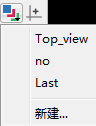
现在 DISPLAY 图标上的鼠标右键菜单中就会出现 Top_view 选项了。
如果您要通过命令行的方式调用该自定名称，则请输入：
DISPLAY TOP_VIEW 或 disp top_v
这里不区分大小写。在名称无歧义的情况下，您可以使用简写。对于自定名称的使用数量没有限制。
在命令框中输入 DISPLAY LAST 或者在 DISPLAY 图标上的右键弹出菜单中选择Last 选项，将恢复到上一次的电路层选择状态。在 DISPLAY 命令的帮助页面中可以获得更多信息。

#### GRID 命令的自定名称
GRID 命令自定名称的设置以及使用与 DISPLAY 命令完全相同。在其中一个编
辑窗口中设置适当的栅格，然后右键单击 GRID 图标 ，并在弹出菜单中选
择 New..选项来设置自定名称。
也可以通过命令行的方式进行设置。对于 GRID 命令自定名称的设置如下：
GRID = My_Grid inch 0.005 lines on
命令
grid my_grid 或者简写为 gri my
可以执行该自定名称。该命令不区分大小写，并且自定名称可以使用简写。

#### WINDOW 命令的自定名称
WINDOW 命令允许您为绘图区域中的某一部分设置一个自定名称。这些自定名称让您可以轻松的从绘图区中的一个位置切换到另一个位置。WINDOW 命令自定名称的设置于之前描述的 DISPLAY 命令相似。
在绘图区中选择适当的显示区域。
右键单击 WINDOW 命令的 Select 图标来打开弹出菜单。

单击新建选项并输入自定名称
假设自定名称为 upper_left：
则您可以通过命令行的方式来返回相应的显示区域，例如：
WINDOW Upper_ Left 或者简写为win upper_ l
另外也可以右键单击 WINDOW 命令的 Select 图标，然后选择弹出菜单中的upper_left 选项来实现操作。
在包含了多个工作页面的原理图中，不论自定名称最初设置于哪个工作页面中，都只针对当前活动的工作页面有效。

#### 自定名称的编辑、重命名和删除
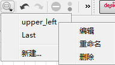
如果您要删除某个自定名称，您可以通过命令图标上的鼠标右键弹出菜单来实现。首先请右键单击命令图标来打开弹出菜单。然后再用鼠标右键单击自定名称。这时会弹出一个菜单。单击删除选项就可以删除相应的自定名称。
通过相同的操作还可以 Rename（重命名）或 Edit（编辑）自定名称。这些操作也可以通过命令行的形式来完成。在 DISPLAY、GRID 和 WINDOW 命令的帮助页面中能够获得更多信息。

### 命名和自动命名
#### 命名长度
EAGLE 中的名称可以是任意长度，没有任何限制。
#### 禁止规则和特殊属性
任何名称：都不能包含**空格**、**分号**或带**变音符号**的字母。并且请尽量避免使用**引号**和**其他特殊符号**（除 ASCII 表中 127 个符号以外的符号）。
元件名称：不能包含问号或者星号，因为这些符号用于代表封装变量（？）和技术（*）的占位符。
在焊盘名称中要避免使用**逗号**。
总线名称不能包含**冒号**、**逗号**或者**方括号**。
**感叹号**是一种特殊符号，用于文本的上划线起始标记。请参考 TEXT 命令的帮助页面以获得更多信息。如果需要在文本中显示感叹号，则要用一个反斜线（\）来消除感叹号的特殊功能。
要在名称或者文本中显示一个反斜杠（\）符号，您需要在 NAME 或者 TEXT 命令中输入两次该符号。
#### 自动命名
如果使用 PIN、PAD、SMD、NET、BUS 或者 ADD 命令时给定了一个名称，则在该命令为活动状态时所定义的其他名称会在第一个名称的基础上产生。
在放置对象之前（这时被放置对象附着在光标上）只需要在命令框中输入名称即可。
请注意所输入的名称必须使用单引号。然后用回车键（←）完成输入。该实例展示了自动命名的工作方式：
ADD DIL14 'U1' ← • • •
将三个 DIL14 封装放入电路板并分别命名为 U1、U2 和 U3（通过鼠标单击完成放置）。
PAD OCT '1' ← • • • •
放置四个名称分别为 1、2、3 和 4 的八角形焊盘。
如果名称只包含 A 到 Z 中的一个字符，则以下对象命名命令为：
ADD NAND 'A' ← • • • •
放置四个名称分别为 A、B、C 和 D 的 NAND 元件。如果名称达到最后一个字母Z，则会采用默认的名称（例如 G$1）。

### 数据的导入和导出
EAGLE 为数据交换提供了一系列的工具。
用于导入的脚本文件
用于导出的导出命令
用于导入和导出的 EAGLE 用户语言程序
用户语言非常灵活，但是需要一个适当的程序来进行创建。您可以在用户手册 EAGLE 用户语言章节中获得更多信息。

#### 脚本语言和数据导入
SCRIPT 命令为 EAGLE 用户提供了一种数据导入的通用工具。
由于 EAGLE 中的每一种操作都可以通过文本命令实现，因此您可以用脚本文件来导入所有类型的数据。单个脚本文件也可以调用其他脚本文件。
脚本文件可以用一个简单的文本编辑器来创建。编写自定义的脚本文件的前提是您能够使用 EAGLE 的命令语言。在 EAGLE 的帮助页面中您可以找到各条命令的功能描述和语法。
在 EAGLE/scr 目录下的 euro.scr 文件提供了一个简单的实例，即绘制一个带有边角限制的信用卡。
如果要将一个网络表导入到已经包含了适当元件的 PCB 设计中，则需要一个带有以下命令的脚本文件：
SIGNAL GND IC1 7 IC2 7 J4 22;
SIGNAL VCC IC1 14 IC2 14 J4 1;
这种网络脚本能够很容易的通过在原理图中使用 EXPORT 命令来创建。
如果您通过 EXPORT 命令（Script 选项）输出了一个元件库，您将会对导入功能有一个更深的印象。所生成的脚本文件为脚本语言的语法提供了一个指导性的范例。它可以用任何文本编辑器来查看。如果用 SCRIPT 命令来将该文件读入某个空白的元件库，则会在其中创建一个新的库文件。脚本文件中可以加入以#符号开头的注释。执行脚本文件时可以通过单击操作工具栏中的 Stop 图标来停止。

#### 用 EXPORT 命令导出文件
EXPORT 命令有以下对象：
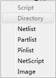

- DIRECTORY 目录
输出当前载入的元件库内容列表（元件、符号和封装）。

- NETLIST 网络表
以 EAGLE 的专用格式输出当前载入的原理图或电路板网络表。
它可以用来检查绘图中的各个连接。
另外也可以通过集中用户语言程序来输出各种格式的网络表。
请访问 CadSoft网站的下载页面：http://www.cadsoftusa.com/download.htm

- NETSCRIPT 网络脚本
以脚本文件的形式输出当前载入的原理图网络表。该网络表可以用 SCRIPT 命令导入到电路板文件。
当原理图和 PCB 设计的网络表之间有差异时，可以使用以下方法。
第一步您需要用 DELETE SIGNALS 命令来删除 PCB 设计中的所有信号连接。请注意这时所有的走线都会删除 ！然后从原理图导出 Netscript 并且再用SCRIPT 命令将其导入到 PCB 设计中。这样原理图和 PCB 设计就能够包含相同的网络表了。

- PARTLIST 元件列表
为原理图或 PCB 设计输出一个元件列表。

- PINLIST 引脚列表
为原理图或电路板输出一个 pin/pad（引脚/焊盘）列表，以便列出所连接的网络。

- SCRIPT 脚本
以脚本文件的形式输出当前载入的元件库。
该脚本文件可以通过某个文本编辑器进行修改，以便生成一个用户定义的元件库，或者将一个元件库中的元件复制到另一个元件库中。
修改后的脚本文件可以通过 SCRIPT 命令导入到一个新元件库中或者某个现有的元件库中。
该脚本文件也可以作为 EAGLE 命令语法的一个不错的实例。
为了保证精确性，脚本文件中的栅格单位都设置为毫米（mm）。

- IMAGE 图像
Image（图像）选项让您可以用不同的图片格式来生成文件。
可以使用的图片格式有：
bmp Windows 位图文件
png 便携式网络图片文件
pbm 便携式位图文件
pgm 便携式灰度位图文件
ppm 便携式像素图文件
tif 标记图像文件
xbm X 位图文件
xpm X 像素图文件
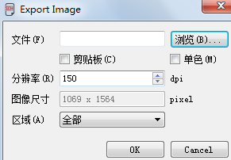
单击 Browse（浏览）按钮，选择输出路径，并输入图片文件名称和后缀名。
文件后缀名决定了图片文件的类型。
如果要输出黑白图片，请选中 Monochrome（单色）选项。
如果要将图片粘贴到系统的剪贴板，请选中 Clipboard（剪贴板）选项。
Resolution（分辨率）选项的设置单位为点每英寸（dpi）。
所输出的 Image Size（图片尺寸）将会显示在下方的文本框中。
Area（范围）选项中可以选择 Full（全屏）或 Window（窗口）。前者将打印整个绘图区域，而后者将只打印编辑窗口中当前可见的绘图区。
其他诸如 HPGL、Postscript（PS）、或者 Encapsulated Postscript（EPS）等图片格式可以通过 CAM 处理程序输出。用户语言程序 dxf.ulp 可生成 Dxf 数据。PRINT 命令支持 PDF 输出。

### EAGLE 用户语言
EAGLE 包含了一个针对类 C 用户语言的解释程序。它可用于访问任何 EAGLE 文件。而且从第四版开始已经能够访问外部数据了。它可以在极少限制的情况下从 EAGLE 导出数据，以及将各种不同的数据导入 EAGLE。
例如，ULP（用户语言程序）通过生成和执行脚本文件对 PCB 设计文件或者元件库进行操作。该脚本文件包含了所有操作所需要的命令用户语言所包含的 exit（）函数使其能够直接执行这些命令，而无需逐条输入。
该程序所附带的实例（*.ulp）能够深入的展示用户语言的功能。这些实例位于您的安装路径下的 ULP 目录。在文件的开头是对于 ULP 工作方式的描述。在控制面板中或者当调用用户语言程序时的使用说明框中也会显示该描述。
用户语言程序必须在不添加任何控制码的文本编辑器中进行编辑。如果所使用的编辑器支持 C 语言语法高亮显示功能则效果更好，这样能够帮助理解 ULP 的结构。
您可以在选项/用户界面菜单中将某个外部文本编辑器定义为您的默认编辑器。
ULP 用过 RUN 启动或者通过将 ULP 从控制面板（Control Panel）中拖拽到编辑器窗口中来启动。要取消执行 ULP 请单击 Stop 图标。如果用户语言程序已经停止，则 EAGLE 会在状态栏中显示提示信息“Run：finished”。
在 EAGLE 帮助页面中的关键字 User Language 下对该语言进行了详细的描述。
ULP 的典型应用有：
创建各种格式的元件列表。请参考第 247 页。
输出图片格式。
为贴片机、在线测试仪等提供数据输出。
链接到外部数据库。
对进行丝印层、阻焊层等进行操作。
导入图片数据文件（例如导入 logo 文件 import-bmp.ulp 或类似的文件）
在 我 们 的 网 站 上 提 供 了 许 多 有 价 值 的 ULP 。 请 访 问
http://www.cadsoftusa.com/download.htm.

### Forward&Back Annotation 正反向标注
原理图文件和相关的电路图文件通过正反向标注功能自动建立逻辑连接。
这可以确保原理图和电路图始终保持一致。

只要 PCB 设计是通过 **BOARD** 命令创建的，则两个文件保持一致。
在原理图上所做所有操作都会同时反应在 PCB 设计中。

例如：
如果您在原理图中放置了一个新的元件，则相应的封装将会出现在 PCB 设计中的电路板边缘上。
如果放置了某个网络，则在 PCB 设计中会同时出现一条信号连线。通常以**鼠线**(鼠线是指电路板上还没有进行布线的电气连接，这些连接以笔直的细线形式表示)的形式来表示。

某些操作，比如放置或删除信号线路，添加元件等操作只能在原理图中进行。PCB 编辑器不允许这些操作，否则会弹出相应的警告提示。重命名元件或者修改它们的属性值在两种文件中都可以实现。

EAGLE 的帮助页面中包含了对技术细节的进一步描述。
作为终端用户，您并不需要过多的关心这一机制。您只需要确保在制作原理图时，与其相关联的 PCB 设计文件处于打开状态即可，反之亦然。也就是说两个文件都处于打开状态。否则它们将无法保持一致，并且正反向标注功能也无法工作。
但是如果您曾经单独编辑过 PCB 设计或者原理图，则当它们载入时电气规则检查（ERC）功能会对它们的一致性进行验证。如果发现不一致的情况，则 ERC会弹出关于原理图和 PCB 设计的相应错误提示信息窗口。这时需要在原理图编辑器中执行 ERC 命令来检查不一致的地方并进行修改。
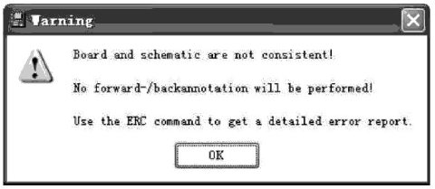
用户手册 第 164 页上的 6.11章节描述了这种情况下的处理方法。


### 程序设置文件 EAGLE.scr
针对所有用户和新项目的基本程序设置保存在 EAGLE.scr 文件中。
当打开某个编辑器或者创建新原理图、PCB 设计或元件库时，将会自动执行脚本文件 EAGLE.scr，如果打开一个已有的项目文件，则不会自动执行该脚本文件。
软件首先在当前的项目文件夹中查找。如果没有找到该文件，则会在菜单选项/目录设置的对话框中 Script 文本框内制定的目录下查找。
该文件包含了编辑器窗口（除了文本编辑器）启动时所执行的所有命令。
文件中的 SCH、BRD 和 LBR 标记表示这些部分只有当启动原理图、PCB 设计或者元件库编辑器窗口时才会执行。
文件中的 DEV，SYM 和 PAC 标记表示这些部分只有当启动 Device（元件）、Symbol（符号）或 Package（封装）编辑器时才会执行。
在第一个标记（通常为 BRD）之前的命令对所有的编辑器窗口都有效。
如果由于项目文件中的配置而使 EAGLE 在启动时自动打开一个或多个编辑器窗口，则需要先关闭这些窗口，然后重新打开以便应用 EAGLE.scr 文件中的设置。或者也可以直接通过 SCRIPT 命令来读取 EAGLE.scr 文件。
脚本文件中也可以加入以# 符号开头的注释。
eagle.scr 文件实例：
```
# This file can be used to configure the editor windows.
Assign A+F3 'Window 4;';
Assign A+F4 'Window 0.25;';
Assign A+F7 'Grid mm;';
Assign A+F8 'Grid inch;';
Menu '[designlink22.png] Search and order {\
General : Run designlink-order.ulp -general; |\
Schematic : Run designlink-order.ulp; \
}';
BRD:
#Menu Add Change Copy Delete Display Grid Group Move \
#Name Quit Rect Route Script Show Signal Split \
#Text Value Via Window ';' Wire Write Edit;
Grid inch 0.05 on;
Grid alt inch 0.01;
Set Pad_names on;
Set Width_menu 0.008 0.01 0.016;
Set Drill_menu 0.024 0.032 0.040;
Set Size_menu 0.05 0.07 0.12;
Set Used_layers 1 16 17 18 19 20 21 22 23 24 25 26 \
27 28 39 40 41 42 43 44 45;
Change width 0.01;
Change drill 0.024;
Change size 0.07;
SCH:
Grid Default;
Change Width 0.006;
#Menu Add Bus Change Copy Delete Display Gateswap \
#Grid Group Invoke Junction Label Move Name Net \
#Pinswap Quit Script Show Split Value Window ';' \
#Wire Write Edit;
LBR:
#Menu Close Export Open Script Write ';' Edit;
DEV:
Grid Default;
#Menu Add Change Copy Connect Delete Display Export \
#Grid Move Name Package Prefix Quit Script Show \
#Value Window ';' Write Edit;
SYM:
Display all;
Grid Default On;
Change Width 0.010;
#Menu Arc Change Copy Delete Display Export \
#Grid Group Move Name Paste Pin Quit Script \
#Show Split Text Value Window ';' Wire Write Edit;
PAC:
Grid Default On;
Grid Alt inch 0.005;
Change Width 0.005;
Change Size 0.050;
Change Smd 0.039 0.039;
#Menu Add Change Copy Delete Display Grid Group \
#Move Name Pad Quit Script Show Smd Split Text \
#Window ';' Wire Write Edit;
```


### 项目配置文件 EAGLE.epf
如果创建一个新的项目（通过右键单击树形浏览框中 Projects 分支中的某一项并且在弹出菜单中选择新建项目），则首先会建立一个以该项目名称命名的目录。在每个项目目录中都会自动创建一个 EAGLE.epf 配置文件。
EAGLE 会记录编辑过程中通过 CHANGE 命令对对象属性的修改以及项目文件中的 Width（宽度）、Diameter（直径）和 Size（尺寸）等内容的改变。该文件还包含了该项目所使用的元件库信息。当退出程序时，其中的活动窗口在关闭时的位置和内容也会保存在该文件中。但是实该能需要激活 Control Panel中选项（ Options ）/备份设置（Backup）菜单内的自动保存项目文件选项。这样下一次启动程序时会恢复到窗口关闭时的状态。

EAGLE 将专门针对某一特定项目的设置保存在 **EAGLE.epf** 项目文件中。EAGLE 为新建项目定义了两个默认路径: `$ EAGLEDIR` 和`$ HOME` 。
例如，某一特定 PCB 设计的参数，包括设计规则、特殊层颜色、重新定义的层或者栅格设置都直接保存在 PCB 设计文件中，以及该项目所使用的元件库信息和编辑器窗口关闭前的位置信息，并且可以通过文本编辑器打开查看其中的内容。如果需要在另一个新项目中采用相同的数据信息，可以直接将前一个项目所在文件夹下的eagle . epf 文件复制到新项目中覆盖同名文件，这样就可以省时省力地应用以前已有的项目设置了。当然原理图和库文件也同样会保存相应的设置。
注意: EAGLE 会自动将项目的设置信息保存在相应的项目配置文件中， 因此不建议手动修改该文件，以免造成数据错误或丢失。

### 用户配置文件 EAGLErc.usr
用户配置文件与项目配置文件不同，它保存的信息是针对整个软件环境，而并非某个特定的项目。在 Windows系统下个人设置文件名为 **EAGLErc.usr** ，而 在 Linux 和Max 系统中则为**~/.EAGLErc**。
其中包含了:
SET 命令设置的所有数据;
ASSIGN 命令分配的所有快捷键;
选择Options - User Intferface 命令打开的对话框中的所有用户界面设置;
当前载入的项目（路径）
上次退出软件时未关闭的项目和最近打开过的项目以及文件。
用户配置文件的保存路径通常由Windows 注册表决定，注册表项如下:
HKEY_ CURRENT_USER\Software\Microsoft \Windows\Current-Version\Explorer\Shell Folders\AppData
字符串值AppData 指定了EAGLErc . usr 文件的存放路径。每次启动EAGLE 时，软件都会查找并执行EAGLErc. usr 文件，并且在每次关闭EAGLE 时会自动保存用户设置，因此不建议手动修改该文件，以免造成数据错误或丢失。
EAGLE 以一定的顺序查找配置文件并且执行这些文件（如果存在的话），其中包括：
```
<prgdir>/EAGLErc （Linux, Mac, Windows）
/etc/EAGLErc （Linux , Mac）
$HOME/.EAGLErc （Linux, Mac）
$HOME/EAGLErc.usr （Windows）
```
请不要对这些文件进行任何修改。
可以使用带参数-U 的命令行来启动 EAGLE，这样就能定义 eaglerc 文件的位置。这对于使用不同版本的 EAGLE 和不同的用户配置文件的情况很有用。
在 EAGLE 中也可以通过各种不同的用户语言程序进行设置。请访问我们的网站：
http://www.cadsoftusa.com/download.htm


### Configuration Commands 配置命令
大部分的选项通常都由 EAGLE 某个编辑器窗口上的 Options 菜单进行设置。
Control Panel 上可以设置 Directories（路径）、Backup（文件备份）以及编辑窗口（User Interface）的样式等。
在用户手册第 37 页 Control Panel 章节中的选项菜单部分对这些选项进行了介绍。
通过 User interface 设置可以选择图标命令菜单或者可配置的文本命令菜单。
**MENU 命令**：可以通过脚本文件将`文本命令菜单`定制为一个命令序列。
在附录中提供了一个实例。
原理图、PCB 和库文件编辑窗口中的 Option 菜单除了包含 User Interface 选项外，还包含了两个选项：Assign（热键）和 Set（设置）。
**ASSIGN热键**：命令可以修改和显示功能键定义。您可以在 81 页中找到相关信息。
**SET设置**： 命令用于设置常用的系统参数。
**CHANGE修改对象属性** 命令用于定义对象属性的各种初始设置。
**GRID栅格**： 命令用于设置栅格尺寸和当前单位。更多信息请参考用户手册第 87 页。

#### Options 菜单下的 SET 选项（SET 命令）
SET 命令中大部分常见的选项都包括在 Options 菜单下的 Set 选项所弹出的Setting 窗口中。该窗口也可以通过输入命令 SET 来打开。
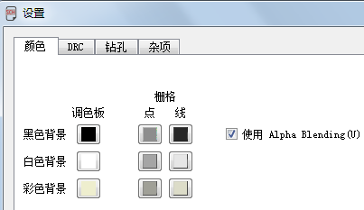

#### SET USED_LAYERS 用户界面中只显示特定的层
DISPLAY 绘图时显示的图层
LAYER  目前正在绘制的图层
在 DISPLAY 或 LAYER 窗口中显示的层数可以通过 Used_Layers 参数来进行设置。
这样就能够隐藏不需要的层，从而使视图更加清晰明了，但是SET Used_Layers 命令并不能隐藏一些特定的图层。
SET USED_LAYERS 1 16 17 18 19 20 21 23 25 27 29 31 44 45 51;
该命令行保存在 EAGLE.scr 中，用于显示指定的层。
SET USED_LAYERS ALL;
输入以上命令后所有层都可见。

Specifies the layers which will be shown in the associated EAGLE menus. 
在相关的 EAGLE 菜单中显示指定的层。
See the example file mylayers.scr.
The layers Pads, Vias, Unrouted, Dimension, Drills and Holes will in any case remain in the menu, as will the schematic layers. 
焊盘，过孔，未布线，外形尺寸，钻头和孔洞层，在任何情况下任然在菜单中，原理图层也如此。
Any used signal layers also remain in the menus. 
任何使用的信号层也任然在菜单中。
SET Used_Layers All activates显示 all layers.
SET Used_Layers All 显示所有层。

#### 右键菜单项
鼠标右键菜单根据所选对象的不同可以添加不同的选项。
这些选项可以是一个简单的命令、或者一连串的命令、或者是您想要运行的某个脚本文件或用户语言程序。通过 SET 命令定义右键菜单的语法如下：
SET CONTEXT objecttype text commands;
objecttype 可以是：属性（attribute）、圆形（circle）、标尺（dimension）、元件（element）、外框（frame）、gate、孔（hole）、实例（instance）、节点
（junction）、标签（label）、焊盘（pad）、引脚（pin），长方形（rectangle）、表贴焊盘（SMD）、文本（text）、过孔（via）、线段（wire）
text 是右键菜单中显示的命令名称
commands 是命令序列，在选中代表该命令序列的菜单项后就会执行
实例：
SET CONTEXT wire Go_bottom 'change layer 16' ;
执行以上命令后，针对 wire（多边形也被视作是 wire 类型的对象）的右键菜单中就会增加一个名称为 Go_bottom 的选项，当选择该选项时，被选中线段会移动到第 16 层上。
如果需要删除右键菜单中针对某一特定对象类型（objecttype）的所有自定义选项，请执行：
SET CONTEXT wire ;
如果要恢复默认的右键菜单，请执行：
SET CONTEXT ;

#### 参数菜单的内容
参数菜单可通过 CHANGE 命令打开，其中包含了 Width（宽度）、Diameter（直径）、Drill（钻孔）、SMD（表面贴装）、Size（尺寸）、Isolate（隔离）和 Spacing（填充线距）、Miter 等选项的参数菜单，这些选项的可用参数值可以通过 SET 命令进行设置。设置时只需要在命令行中列出由空格隔开的各个参数值。
比如设置 Miter 选项：
SET MITER_MENU 0.1 0.2 0.3 0.4 0.5 0.6 1 1.5 2 3 4;
这些参数值的单位由当前编辑器窗口所使用的栅格单位决定。最多可输入 16个参数值。
设置 SMD 选项：
SET SMD_MENU 1.2mm 2.0mm 0.5mm 0.9mm 0.1in 0.14in;

该命令中直接指定了每个参数值的单位。最多可输入 16 个参数值。
菜单中所显示的参数值始终采用当前栅格的单位设置。
在文件 EAGLE.scr 中输入 SET 命令可以为您的项目保存默认设置。
要恢复到 EAGLE 的默认设置，可使用以下类似的命令：
SET WIDTH_MENU ;恢复线宽的的默认设置

#### 自动确认信息提示对话框
某些情况下 EAGLE 会向用户弹出一个警告或者提示信息，以便确认后续操作。这对于像执行某个脚本文件这样的自动进程来说可能并不需要。您可以决定如何对这些提示信息进行确认。例如：
SET CONFIRM YES；
表示用肯定的回答来确认信息（等同于单击 Yes 或 OK）。
如果需要用否定的回答来确认信息（等同于单击 No 按钮、或者确认对话框），请输入：
SET CONFIRM NO；
要关闭自动确认功能，请输入：
请谨慎使用该功能！不推荐将其作为通用设置，比如将其写入脚本文件的开头。这样可能会造成意外的结果！请参考帮助页面中关于 SET 命令的详细信息。