# 0x05_从原理图到电路板
> GitHub@[orca-j35](https://github.com/orca-j35)，所有笔记均托管在 [eagle-notes](https://github.com/orca-j35/eagle-notes) 仓库

From Schematic to Finished Board

>This chapter illustrates说明 the usual route from drawing the schematic diagram to the manually routed layout. 
>One section explains the design of a hierarchical schematic. 
>Particular features of the Schematic or Layout Editor will be explained at various points. 
>The use of the Autorouter, the Follow­me router, and the output of manufacturing data will be described in subsequent chapters.

本章说演示了从绘制电路原理图到手动布线布局的常规套路。
其中一节讲解了层次化的原理图的设计。
将从不同的角度来阐述原理图和 PCB 编辑器的详细的特性。
自动布线、跟随布线和制造数据输出将在随后的章节来讲述。

We recommend to create a project(folder) first.
我们推荐首先应该创建一个项目（目录）
参考 0x01 Control Panel 控制面板 笔记

## 1. Creating the Schematic Diagram
创建原理框图
>The usual procedure is as follows:
>Devices are taken from existing libraries and placed on the drawing area. 
>The connecting points (pins) on the Devices are then joined by nets (electrical connections). 
>Nets can have any name, and can be assigned to various classes. 
>Power supply voltages are generally connected automatically. 
>In order to document all the supply voltages in the schematic diagram it is necessary to place at least one so­called supply symbol for each voltage.

通常流程如下：
Device 从现有的库中被调出，并放置到绘图区域。
然后通过 nets (电气连接)连接 Device 上的连接点 (pins)。
Nets 可以是任何名字，并可以被分配给任何网络族。
电源电压通常自动连接。
为了能表明原理框图中所有的电压，至少要为每一种电压放置一个符号，即所谓的电源符号 Supply Symbol。

>Schematic diagrams can consist of a number of pages (but not in the Light edition). 
>Nets are connected across all the pages if they have the same name.
>It is assumed that libraries containing the required components are available.
>The definition of libraries is described in its own chapter.

原理框图可以包含很多页（简化版本除外）。
所有页面的同名网络将会全部连接在一起。
假设包含了所需元件的库已经存在。
可以在相关章节中找到元件库的定义方法。
>It is possible at any time to create a layout with the BOARD command or with the Board icon. 
>As soon as a layout exists存在, both files must always be loaded at the same time. 
>This is necessary for the association of the schematic diagram and the board to function. 
>There are further instructions about this in the section on Forward&Back Annotation.

随时都可以使用 BOARD 命令或者 Board 图标来创建一个 PCB 文件。
一旦存在了PCB 文件，它总是和原理图一起被同时加载的。原理图和 PCB 图就必须在功能上相互关联。
在 《Forward&Back Annotation 正反向标注》章节中会有更多的用法说明-参考笔记 <0x00 EAGLE 使用规则>

### 1.1 打开原理图
Open the Schematic Diagram
>You first start from the Control Panel. 
>From here you open a new or existing schematic diagram, for instance by means of the File/Open or the File/New menus, or with a double click on a schematic diagram file in the directory tree. 
>The schematic diagram editor appears.

你首先以 control panel 作为起点。
在这里你可以打开一个新或现存的电路原理图，例如： 打开 File/Open 或 the File/New 菜单，或在目录树中双击一个原理图文件。
这时会显示原理图编辑器。

>Create more schematic sheets if needed. 
>For that purpose, open the combo box in the action toolbar with a mouse click, and select the New. 
>A new sheet will be generated (see page 53). 
>Another way to get a second sheet is to type in
>EDIT .S2

>on the command line. 
>If, however, you do not in fact want the page, the entire sheet is deleted with
>REMOVE .S2

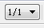
假如需要，可以创建更多的原理图页面。
为了这个目的，打开操作工具栏中的组合框，用鼠标点选 New。
一个新的页面将被创建。
另一种方式是在命令栏中输入：
**EDIT .S2**
如果不需要该页，可以使用下面的命令删除：
REMOVE .S2

>A right mouse click onto the sheet preview opens a context menu. 
>The Description entry allows to write a descriptive text for the schematic sheet which is displayed in the thumbnail preview and in the sheet combo box in the action toolbar.

右击页面视图，打开快捷菜单。
Description 选项允许为原理图页面写入一个描述文本，该文本会显示在缩略视图中，同时也会出现在 action toolbar 的 sheet 组合框中。
>If you would like to have a description of the whole schematic visible in the Control Panel's treeview use the Schematic description entry in the Edit menu or type in the command line:
>DESCRIPTION *

如果您需要为整个原理图添加描述并显示在 Control Panel 的树形浏览区中，可以选择 “ 编辑 （ Edit ） ” 菜单中的 “ 原理图描述 （ Schematicdescription）”选项来实现或者在命令框中运行：
DESCRIPTION *

### 1.2 Set the Grid
Grid 栅格设置
>The grid of schematic diagrams should always be 0.1 inch, i.e. 2.54 mm. 
>Nets and Symbol connection points (pins) must lie on this common grid.
>Otherwise connections will not be created between nets and pins.

原理图中的栅格总是以 0.1ich/2.54mm 为最小单位。
网络线和连接点（引脚）必须位于此栅格之上。
否则，在网络和引脚之间不会创建连接。

### 1.3 Place Symbols
放置 Symbols
>First you have to make available the libraries you want to take elements from with the USE command. 
>Only libraries which are in use will be recognized by the ADD command and its search function. 
>More information concerning the USE command can be found on page 53.

首先，使用 USE 命令把可能会使用到元件的元件库激活。
只有在 USE 命令调用过元件库中的元件才能被 ADD 命令加载并能被搜索到。
更多关于 USE 命令的信息请参阅用户手册第 50 页。

#### 1. Load Drawing Frame
加载原理图外框
>It is helpful first to place a frame. 
>The ADD command is used to select Devices from the libraries.
>When the ADD icon is clicked, the ADD dialog opens.
>It shows all the libraries that are made available with the USE command, first. 
>You can expand the library entries for searching elements manually or you can use the search function.
>A letter format frame is to be used. 
>Enter the search key letter in the Search line at the lower left, and press the Enter key. 
>The search result shows a number of entries from frames.lbr. 
>If you select one of the entries (LETTER_P), a preview is shown on the right, provided the Preview option is active. 
>Disabling the options Pads/Smds/Description excludes parts with Pads/Smds or the part's descriptive texts.

首先放置 frame 是非常有用的。
ADD 命令被用于从库中选择 device。
当 add 图标被点击后，会打开 add 对话框。
对话框中会显示所有使用USE 命令激活的元件库。
你可以展开库条目以手动搜索元素，或使用搜索功能。
这里使用 letter 格式的 frame。
在在对话框左下角的搜索栏中输入关键字 Letter 后按回车键可以搜索到 Letter 格式的框架并使用。
搜索结果会显示 frames.lbr 库的一系列入口。
如果预览选项选中，选择其中一个入口（比如：LETTER_P）会在右边预览所选的元件。
禁用选项 Pads/Smds/Description 搜索结果将会排除 Pads/Smds 部分，或排除部分的描述性文本。

>! In the Schematic Editor you are searching for Device names and terms of the Device description.
>In the Attributes line you are searching for attribute names or values.
>In the Layout Editor you can search for Package names and terms of the Package description!

在原理图编辑器中使用 Device 的名称和 Device 描述术语来搜索。
在 Attributes 行，你可以搜索 attribute 名和值。
在PCB 编辑器中使用 Package 名称和 Package 描述术语来搜索。

>Clicking OK closes the ADD window, and you return to the schematic diagram editor. 
>The frame is now hanging from the mouse, and it can be put down. 
>The bottom left hand corner of the frame is usually at the coordinate origin (0 0).
>Library names, Device names and terms from the Device description can be used as search keys. 
>Wildcards such as * or ? are allowed. 
>A number of search keys, separated by spaces, can be used.

点击 OK 关闭 ADD 窗口，返回原理图编辑器。
fram 现在粘在鼠标上，通过点击鼠标，可将其放下。
fram 的右下角通常被放置在坐标原点 (0 0)。
Library 的名称，Device 名称和专门的描述术语都可以作为关键字来搜索。
还可以使用通配符‘ * ’和‘ ? ’。
使用空格分隔开的几个关键词也可以作为关键字搜索。

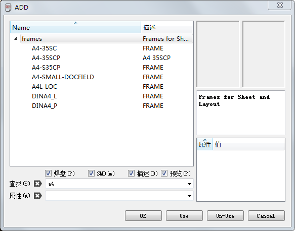
➢ ADD dialog: Results from the search key A4

>The ADD command may also be entered via the command line or in script files. 
>The frame can also be placed using the command: 
>`add letter_p@frames.lbr`
>Wildcards like * and ? may also be used in the command line. 
>The command 
>`add letter*@frames.lbr`
>for example opens the ADD windows and shows various frames in letter format to select.
>The search will only examine libraries that are in use. 
>That means that the library has been loaded by the USE command (Library/Use).

ADD 命令还可以通过命令栏中输入或者放在脚本文件中使用。
框架同样可以使用下面的命令来放置：
`add letter_p@frames.lbr`
通配符‘ * ’和‘ ? ’同样可以在命令栏中输入，比如下面的命令：
`add letter*@frames.lbr`
上面的这个例子会打开 ADD 对话框并显示很多个和 letter 相关的元件。
搜索功能仅仅适用于用 USE 激活的元件库中，这意味着被搜索的库必须先被USE 命令加载（元件库/使用）。

>Drawing frames are defined with the FRAME command.
>This can be done in a library, where the frame can be combined with a document field. 
>EAGLE can also use the FRAME command in the Schematic as well as the Board Editor. 
>Details about defining a drawing frame can be found on page 270.

使用 FRAME 命令绘制和定义 frames。
绘制操作用该在元件库中被完成，frame 可以与文本区域结合使用。
EAGLE 软件同样可以在原理图和 PCB 编辑器中使用 FRAME 命令，如何设计框架请参考本手册第 229 页。

#### 2. Place Circuit Symbols (Gates)
放置电路符号
>All further Devices are found and placed by means of the mechanism described above. 
>You decide a Package variant at this early stage. 
>It can easily be changed later if it should turn out that a different Package form is used in the layout.

>If you have placed a Device with ADD, and then want to return to the ADD dialog in order to choose a new Device, press the Esc key or click the ADD icon again.

>Give the Devices names and values (NAME, VALUE).

>If the text for the name or the value is located awkwardly, separate them from the Device with SMASH, and then move them to whatever position you prefer with MOVE. 
>Clicking with DELETE on a text makes it invisible.
>Use the Shift key with SMASH to get the texts at their original positions. 
>The texts are now no longer separated from the Device (unsmash). 
>Deactivating the Smashed option in the context menu's Properties window is the same. 

>MOVE relocates elements, and DELETE removes them. 
>With INFO or SHOW information about an element is displayed on the screen.

>ROTATE turns gates by 90°. The same can be done with a right mouse click while the MOVE command is active.

>Multiple used parts may be copied with the COPY command. COPY places always a new part even if it consists of several gates and not all of them are already used.

>A group of objects (components, nets...) can be reproduced in the schematic diagram with the aid of the GROUP, COPY and PASTE commands. 
>First make sure that all the layers are made visible (DISPLAY ALL).

使用上面描述的方式可以查找和放置更多的 Device。
在早期放置的一个封装可以很容易的更改成另外不同的封装。
如果已经使用 ADD 命令放置了一个 Device，这时想返回 ADD 对话框去选择另外一个新的 Device，可以按 Esc 键或者再单击 ADD 按钮进入。

使用 NAME、VALUE 命令为 Device 命名和赋值。

如果 Device 的名称和值的位置不协调，可以使用 SMASH 命令把它们从 Device中拆分，然后使用 MOVE 命令移动到任何需要的位置，或者使用 DELETE 命令让文本不再可见。
使用 Shift+SMASH 命令可以把文本恢复到初始位置，Unsmash 命令可以让文本不再从Device 中拆分。
右键弹出菜单的 Properties 属性窗口中的 Smashed 选项同样可以达到此功能。

使用 MOVE 命令可以重新布置元件位置，使用 DELETE 命令可以删除元件。

使用INFO 或者 SHOW 命令可以在屏幕上显示元件的信息。

使用 ROTATE 命令可以 90°旋转元件，当 MOVE 命令有效时单击鼠标右键同样可以实现此功能。

多次使用的元件可以使用 COPY 来复制，使用 COPY 命令放置的元件总是用新的名称命名，即便该元件包含很多 Gate 并且这些 Gate 并没有全部使用完。

通过 GROUP、CUT 和 PASTE 命令的使用，可以在原理图中复制对象组（元件、网络等），但需要首先确保所有的层为可见状态（DISPLAY ALL 命令）。

#### 3. Hidden Supply Gates
>Some Devices are defined in the libraries in such a way that the power supply
>pins are not visible on the schematic diagram. 
>Visibility is not necessary, since all the power pins with the same name are automatically connected, regardless of whether or not they are visible.

>If you want to connect a net directly to one of the hidden pins, fetch the gate into the schematic diagram with the aid of the INVOKE command. 
>Click onto the INVOKE icon, and then on the Device concerned, assuming that it is located on the same sheet of the schematic diagram. 
>If the gate is to be placed on a different schematic diagram sheet, go to that sheet, activate INVOKE, and type the name of the Device on the command line. 
>Select the desired Gate in the INVOKE window, then place it. Then join the supply gate to the desired net.

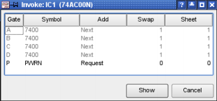
INVOKE: Gate P is to be placed

有些 Device 在建库的时候会要求不在原理图中显示电源引脚。
如果所有的电源引脚使用同一个名称，不管它们是否在原理图中显示，都会自动连接在一起。
如果想单独连接一个网络到一个隐藏的引脚，可以使用 INVOKE 命令把该 Gate 从库中调入，单击 INVOKE 图标后在 Device 上单击就会调出该 Gate，然后放到同一个原理图页面中。
如果这个 Gate 放在不同的页面中，进入该页面，激活 INVOKE 命令，然后在命令栏中输入 Device 名称，在弹出的 INVOKE 窗口中选择需要的 Gate 并把它放到原理图中，然后就可以在该 Gate 上连接需要的网络。

#### 4. Devices with Several Gates
具有多个 gate 的 devices
>Some Devices consist not of one but of several Gates. These can normally be placed onto the schematic diagram one after another with the ADD command.
>To place a certain Gate you can use the Gate name directly.

>Example:
>The Device 74*00 from the 74xx­eu library with Package variant N and in AC technology consists of for NAND gates named A to D and one power gate named P. 
>If you want to place the Gate C first, use the Gate name with the
>ADD command:
>`ADD 'IC1' 'C' 74AC00@74xx-eu.lbr`
>See also help function for the ADD command.

>As soon as one Gate has been placed, the next one is attached to the mouse (Addlevel is Next). Place one Gate after another on the diagram. 
>When all the Gates in one Device have been used, the next Device is brought in.
>If the Gates in one Device are distributed over several sheets, place them first with ADD, change to the other sheet of the schematic diagram, and type, for
>example
>INVOKE IC1
>on the command line. Select the desired Gate from the INVOKE window.

>! If you select one of the already placed Gate entries in the INVOKE window, the OK button changes to Show. 
>Click the Show button, and the selected Gate is shown in the center of the current Schematic Editor window.

一些 Device 包含不止一个 Gate，使用 ADD 命令可以正常的一个接一个放到原理图中，如果想放置特定的 Gate，可以直接使用 Gate 名称放置。
例子：
74xx-eu 库中的 74*00 元件具有不同的封装变量 N，AC 系列工艺包含了 Gate 名称从 A 到 D 和一个电源符号 P，如果想先放置 Gate C，可以使用 ADD 命令 + Gate 名称：
ADD 'IC1' 'C' 74AC00@74xx-eu.lbr
请查询帮助信息以了解 ADD 命令。

一旦一个 Gate 放置到原理图中后，鼠标上会附着下一个 Gate（前提条件：Addlevel 设置为 Next），这样就可以继续放置下一个 Gate。
当一个 Device中的所有 Gate 放置完毕才会放置下一个 Device。
如果一个 Device 中 Gates 需要分布在好几个页面时，首先用 ADD 命令放置一个 Gate，然后切换到另外的页面，在命令栏中输入以下类似命令：
INVOKE IC1
在弹出的 INVOKE 窗口中选择需要的 Gate 来放置。

! 如果在 INVOKE 窗口中选择一个已经放置的 Gate 入口时，OK 按钮会变成显示，单击显示按钮会在当前的原理图编辑窗口中心显示所选在的 Gate。

#### 6. Designlink – Access to Farnell's Online Product Database
Designlink.ulp – 访问 Farnell 公司的在线产品数据库

>With the help of designlink­order.ulp you can do a general product search or a search for all parts of your schematic, check price and availability and order directly at Farnell/Newark.
>Found order codes can be saved as part attributes the schematic. The order list can be exported.

>Click onto the designlink icon to begin. This icon is shown next to the action toolbar. 
>It is part of the text menu which can be switched on or off through the Options/User Interface menu.

>The General option starts a general product search. 
>The ULP shows a window where you can enter a search string. 
>You will be connected to the Farnell/Newark­Server directly, where the ULP searches for the given search string, and finally displays the matches.

>The Schematic option starts a search for all the parts used in your schematic.
>The search term is the value of each component. As a result you will get a parts list with Farnell/Newark order codes.

>Some EAGLE libraries already contain attributes with information about Farnell/Newark order codes. 
>In case there is no order code available in the library, or there is no match at the Farnell/Newark web site, the list will mark the order code as unknown. 
>Double­click onto this entry for starting a manual search. 
>As soon as all the components you would like to put into the Farnell/Newark shopping cart have got an order code, click onto Add to shopping cart.

>The ULP comes with a detailed help which explains functionality and usage.
>As an alternative you can start the ULP with the RUN command.
>RUN designlink-order [-general]|[-sop]

>!In case you are connected to the internet via a Proxy server, you have to set proxy name and used port in the EAGLE Control Panel's Help/Check for Update, Configure menu.

>For updating libraries with Farnell/Newark order codes you can use designlink­lbr.ulp. 
>Start it in a Library Editor window and it loops through all Devices searching for order codes at the Farnell/Newark web site. 
>Finally there will be created three attributes:

>`>MF` for manufacturer, `>MPN` for manufacturer part number, `>OC_FARNELL` or `OC_NEWARK` for the order code.

通过 designlink-order.ulp 程序，您可以进行常规的产品搜索或者针对原理图中使用的所有元件进行搜索，并查看 Farnell/Newark 的报价、库存和直接订货。

搜索到的订货编号可以保存为原理图的元件属性，而且可以导出订货列表。
单击 designlink 图标 启动该程序。
该图标位于操作工具栏右侧，并且是文本菜单的一个部分，能够通过选项/用户界面菜单来开启或关闭。

该图标下拉菜单中的 General 选项可以启动常规的产品搜索。
该程序会显示一个搜索窗口，你可以在该窗口中输入搜索关键字。
然后您将会直接连接到Farnell/Newark 的服务器，程序会对关键字进行搜索并最终显示搜索结果。

Schematic 选项用于搜索您原理图中所使用的元件。
搜索关键字为每个元件的值。
搜索结果会列出元件在 Farnell/Newark 公司的订货编号。
EAGLE 的某些元件库已经在元件属性中包含了 Farnell/Newark 公司的订货编号。
如果在元件库中没有订货编号的信息或者在 Farnell/Newark 网站上没有找到相符的产品，搜索结果将会把该编号标记为 Unknown。
双击该项编号可以进行手动搜索。
当您找到了所有需要的元件，请单击 Add selection...链接来将元件放入 Farnell/Newark 的购物车中。
该 ULP 程序带有详细的帮助文件，对其功能和用法进行解释。
通过 RUN 命令也可以启动该 ULP 程序。
RUN designlink-order [-general]|[-sop]

!如果您通过代理服务器连接互联网，则您需要进入 EAGLE Control Panel 中的帮助/检查更新菜单，并通过设置按钮来设置代理服务器和端口。

你可以使用 designlink-lbr.ulp 程序来将元件库升级为带有 Farnell/Newark 订货编号的库。
在元件编辑器窗口中启动该程序后，软件将会在Farnell/Newark 网站上对所有元件的订货编号进行搜索。
最终将会产生三种
属性：
`>MF` 指生产商，`>MPN` 指生产商制定的产品编号，`>OC_FARNELL` 或 `OC_NEWARK` 指订货编号。

### 1.4 Wiring the Schematic Diagram
#### 1. Draw Nets (NET)
绘制网络
>The NET command defines the connections between the pins. 
>Nets begin and end at the connection points of a pin. 
>This is visible when layer 93, Pins, is displayed (DISPLAY command).

>Nets are always given an automatically generated name. 
>This can be changed by means of the NAME command. Nets with the same name are connected to one another, regardless of whether or not they appear continuous on the drawing. 
>This applies even when they appear on different sheets.

>If a net is taken to another net, a bus, or a pin connecting point, the net line ends there and is connected. 
>If no connection is made when the net is placed, the net line continues to be attached to the mouse. 
>This behavior can be changed through the Options/Set/Misc menu (using the Auto end net and bus option). 
>If this option is deactivated, a double click is needed to end a net.
>Nets are shown on layer 91, Nets.

>Nets must end exactly at a pin connecting point in order to be joined. 
>A net is not joined to the pin if it ends somewhere on the pin line. 

>EAGLE will inform you about the resulting net name or offer a selection of possible names if you are connecting different nets.

>The JUNCTION command is used to mark connections on nets that cross one another. 
>Junctions are placed by default. 
>This option, (Auto set junction), can also be deactivated through the Options/Set/Misc menu.

>Nets must be drawn with the NET command, not with the WIRE command. 

>Do not copy net lines with the COPY command. If you do this, the new net lines won't get new net names. 
>This could result in unwanted connections.

>If the MOVE command is used to move a net over another net, or over a pin, no electrical connection is created. 

>To check this, you can click the net with the SHOW command. 
>All the connected pins and nets will be highlighted. If a Gate is moved, the nets connected to it will be dragged along.

>A simple identifier (without XREF option, see next section about Cross References) can be placed on a net with the LABEL command. 
>Provided you have defined a finer alternative grid, labels can be arranged comfortably in the finer grid with the Alt key pressed.

NET 命令定义了 2 个引脚之间的连接，网络只能从一个引脚开始，到另一个引脚结束，当使用 DISPLAY 命令设置显示第 93 层（Pins 层）时引脚才可见。
网络命令总是自动分配一个网络名，可以使用 NAME 命令修改。
同一网络名表示相互连接在一起，不管它们是否看起来真的连接在一起，即便它们分布在不同的页面也是如此。

如果一个网络放到另一网络、引脚或者引脚连接点上，这个网络就会在这儿终止并连接。
当网络被放置到没有任何连接点地方，网络仍然粘附在鼠标上，这种情况可以通过选项/设置/杂项菜单来设置（使用自动结束网络和总线选项）。
如果取消该选项，双击鼠标左键可以结束一个网络。

网络线在第 91 层（Nets 层）显示。
为了能正确连接，网络线必须在引脚的连接点上结束，如果网络线在引脚的其他地方结束则网络并不能和该引脚连接在一起。
如果连接到了不同的网络，EAGLE 系统会提醒、或者提供一个供选择的网络名选择窗口来选择正确的网络。

JUNCTION 命令用于对需要连接的相互交叉网络作标识，默认情况下会放置 Junction 节点。
自动放置 Junction 节点也可以通过选项/设置/杂项菜单来取消。

必须使用 NET 名来画网络线，不要用 WIRE 命令。

不要使用 COPY 命令来复制网络线，复制的网络线不会分配一个新的网络名，这样会产生一个并不是预期想得到的网络。

如果使用 MOVE 命令来移动网络线到另外一条网络线或者引脚上，同样不会产生一个新的电气连接。
(例如将两条线移动到一起，虽然两条net 开起来是重叠的，实际上这两条线任然相互独立，不会进行合并)

可以使用 SHOW 命令来显示上面这些，所有的网络和连接点引脚都可以通过SHOW 命令来高亮显示。

如果移动一个 Gate 或者其他 Symbol，则网络连接线会跟随一起移动。

在没有选择 XREF 选项的情况下，使用 LABEL 命令可以放置一个简单的标志符（参考下一章节关于 Cross-Reference 的介绍）。

如果在 Grid 菜单中设置了可供选择的更好的栅格尺寸，按下 Alt 键可以把标签移动到一个更好的栅格点上。

#### 2. Defining Cross-References for Nets
为网络线定义 Cross-References 交叉关联
>If you place a LABEL with active XREF option for a net, a cross­reference will be shown automatically. 
>It points to the next sheet where the net occurs again. 
>Depending on the rotation of the label the cross­reference refers to a previous or a following schematic sheet. 
>If the label itself goes towards the right or bottom border of the drawing, the cross­reference shows the next higher page number. 
>If the label points to the left or top border, the previous pages are taken into consideration. 
>In the case that the net is only available on one sheet, this cross reference is shown, independently from the rotation of the label. 

>If the net is only on the current sheet, only the net name and possibly the label's frame around it is shown. 
>This depends on the Xref label format definition which can be done in the menu Options/Set/Misc (can be defined via SET, too). 

>The XREF option can be activated in the parameter toolbar of the LABEL command or after placing the label with CHANGE XREF ON.
>The following placeholders for defining the label format are allowed:
>%F enables drawing a flag border around the label
>%N the name of the net
>%S the next sheet number
>%C the column on the next sheet
>%R the row on the next sheet
>The default format string is %F%N/%S.%C%R. Apart from the defined placeholders you can also use any other ASCII characters. If %C or %R is used and there is no frame on that sheet, they will display a question mark '?'. 
>See also page 270.

>The lower label in the picture points to the right and refers to the net ABC on the next page 3, field 4A, the upper XREF label points to the left (beginning with the origin point) and refers to the previous page 1, field 2D.
>If a XREF label is placed on a net line directly, it will be moved together with the net. 
>More information about cross­references can be found in the help function for the LABEL command.

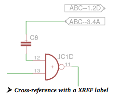

在 XREF 选项有效的情况下使用 LABEL 命令为一个 网络放置标签时会自动产生 Cross-reference，该标签指明了该网络在下一页面的位置。
旋转该标签时 Cross-reference 可以指向上一页面或者下一页面。
如果标签本身靠近绘图区的最右边或者最下边，Cross-reference 会显示更高一点的页面数字。
如果标签本身靠近绘图区的最左边或者最上边，Cross-reference 会显示上一页面。
在这种情况下，网络仅仅在一个页面有效，旋转标签可以独立显示 Cross-reference 值。

如果网络仅仅存在于当前页面，就只能显示网络名称和可能的外框，这需要选项/设置/杂项菜单中的 Xref 标签格式定义来决定（同样可以通过 SET 命令来设置）。

XREF 选项可以通过 LABEL 命令的参数栏来激活，或者放置 Label 后使用 CHANGE XREF ON 命令修改。

下面是允许用来定义标签格式的占位符：
%F 在 Label 的周边画一个标志方框
%N 网络名称
%S 下一页的页数
%C 下一页中的列数
%R 下一页中的行数
默认的字符格式为：%F%N/%S.%C%R，除了定义了的占位符之外还可以使用其他的 ASCII 字符。
如果定义了%C 或者%R 但是那一页并没有网络，则会显示‘？’问号，可以参考第 229 页。

上图中较低的标签指向右边（从起始位置开始，起点指 十字 符号），与下面的第 3 页上范围 4A中的网络 ABC 发生关联，较上面的标签指向左边，与上面的第 1 页上范围 2D中的网络 ABC 发生关联。

如果 XREF 标签放到网络线上，它会和网络线一起移动。
可以参阅帮助功能中的 LABEL 命令来了解更多的交叉关联信息。

#### 3. Cross-References for Contacts
触点交叉关联
>In case you are drawing an Electrical Schematic and using, for example, electro­mechanical relays, EAGLE can display a contact cross­reference. 
>In order to do that, place the text >CONTACT_XREF inside the Schematic's drawing frame. 
>This text is not displayed in the drawing (excepted its origin cross), but its position (the y coordinate) determines from where on the contact cross­reference will be drawn on the current sheet. 
>As soon as this text is placed the contact cross­reference will be displayed.

>The format of the contact cross­re-ferences can be defined ­ as for net crossreferences – in the Options/Set/Misc menu. 
>It uses the same format variables as described in the previous section Defining cross­references for nets. 
>The default setting is: /%S.%C%R, which means /Pagenumber.ColumnRow.

>The variables %C for column and %R for row can only work with a drawing frame that was defined with the FRAME command and comes with a column/row graduation.

>For a proper display of the contact cross­references in the Schematic the elements have to be defined in the Library Editor according to certain rules.
>More information about this can be found in the help function under Contact cross­reference and in the chapter about Libraries and Component Design later in this manual.

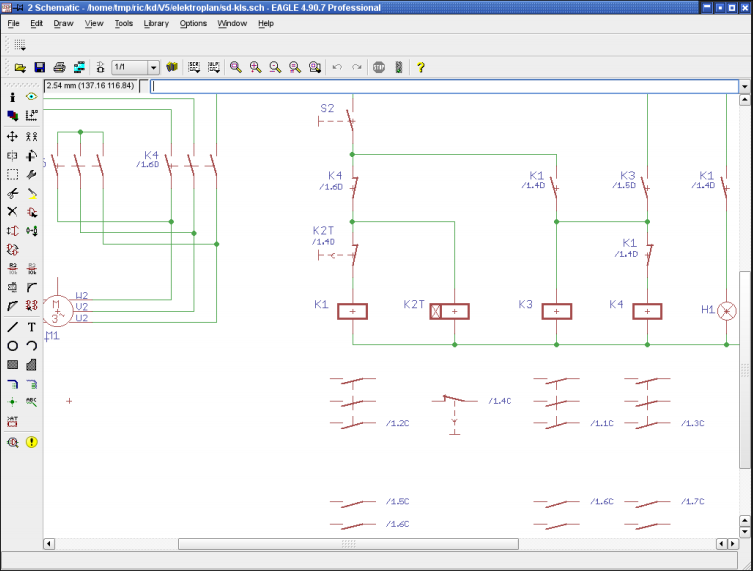

如果在画电气原理图时需要使用比如机械电子式继电器，EAGLE 软件可以显示一个触点的 Cross-reference 。
为了实现此功能，需要放置一个文本 >CONTACT_XREF 到原理图绘图区中。
这个文本在绘图区不会显示出来（除了显示原点外），但是文本的位置（Y 坐标）决定了触点的交叉关联画在当前页面中的位置。(效果上表现为，在线圈附近增加一组触点的图标，并在触点图标上标明交叉关联坐标。)
一旦此文本被放到原理图中，触点的交叉就会显示在线圈附近。
触点的交叉关联使用和网络交叉关联定义的方式来定义，即是通过 Option/Set/Misc 菜单。
它同样适用于之前章节中介绍定义网络交叉关联的格式变量。
默认的设置是：/%S. %C%R，意思是：/页数. 列行。
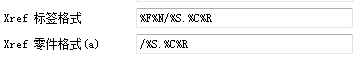
列变量%C 和行变量%R 仅仅只能工作在使用 FRAME 命令定义了原理图边框并且对行和列有标注的绘图区。
为了能在原理图中正确显示触点的交叉关联，在库编辑器中必须按照一定的规则来定义元件。
更多的信息可以在帮助功能的触点交叉关联章节和本手册后面介绍的《库和元件管理》中找到。

#### 4. Specifying Net Classes
定义网络簇Net Classes（即网络分类）
>The CLASS command specifies a net class (Edit/Net classes menu). 
>The net class specifies the minimum track width, the minimum clearance to keep away from other signals and the minimum hole diameter for vias in the layout. 
>Each net primarily belongs to net class 0. By default all values are set to 0 for this net class, which means that the values given in the Design Rules are valid. 
>You can use up to 16 net classes. Creating a net class can be cancelled with the UNDO command.
>
>The image shows three additional net classes defined:
>All nets that belong to class 0, default, will be checked by the settings of the Design Rules.

>Net class number 1, for example, has got the name Power and defines a minimum track width of 40 mil.

>The minimum drill diameter for vias of this class is set to 24 mil.

>The clearance between tracks of net class 1 and tracks that belong to other net classes is also set to 24 mil.

>The left column Nr pre­defines the net class of the next net that is drawn with the NET command. 
>This selection can be made in the parameter toolbar of the NET command, as well.

>If you would like to define special clearance values between certain net classes, click the button marked with >>. 
>The Clearance Matrix opens. Enter your values here.

>To return to the simple view, click the << button. This is only possible, however, if there are no values defined in the matrix. 
>The net classes can be changed later by means of the CHANGE command (the Class option) in the Schematic and in the Layout Editor.
>Net class definition can be done in the Layout Editor, as well.
>A net class can be assigned to a single net/signal (left mouse click) or to a number of nets/signals (Ctrl + right mouse click) that have been selected with the GROUP command before.

定义网络簇Net Classes（即网络分类）
CLASS 命令用于定义一个网络簇（编辑/网络分类菜单）。
网络簇规定了最小走线宽度，最小间距来与其他信号保持一定距离，以及在 PCB 布板中的 VIA 最小孔径。
最初的每条网络都属于 Class 0。
网络簇默认值都设为 0，这意味着这些值在设计规则中有效。
最多可以使用 16 个网络簇。
已经创建的网络簇可以通过 UNDO 命令来删除。(直接删除网络族的名字，也可删除网络族)

上图显示了有 3 个网络簇被定义：
默认情况下，所有的网络属于 Class 0，该簇由设计规则的设置来检查。
Net Class 1 命名为 Power，定义了最小走线宽度为 40mil。
Net Class 1 中 VIA 的最小钻孔直径设置为 24mil。
Net Class 1 内部走线间距和该簇与其他网络簇之间的间距同样设为 24mil。
左边列中的 Nr 为下一个网络簇。
这些选择可以使用 NET 命令的参数栏生成。
如果想对某些网络簇定义一些特殊的间距值，可以单击 ‘ >> ’按钮来打开Clearance Matrix 并填入想要的值。
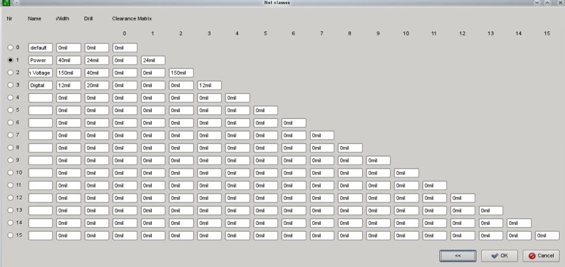

如果不需要在间距矩阵中设置特殊的值，可以单击‘ << ’按钮返回到简单的浏览界面。
在原理图和 PCB 编辑器中使用 CHANGE 命令（Class 选项）来改变网路簇。
网络簇的定义同样可以在 PCB 编辑器中完成。

#### 5. Drawing a bus (BUS)
绘制总线（BUS）
>Buses receive names which determine which signals they include. 
>A bus is a drawing object. It does not create any electrical connections. 
>These are always created by means of the nets and their names. 
>The associated menu function is a special feature of a bus. 
>A menu opens if you click onto the bus with NET. 
>The contents of the menu are determined by the bus name.
>The bus in the diagram is named Bus1:A[0..12],D[0..7],Clock.
>Clicking on the bus line while the NET command is active, opens the menu as illustrated above. 
>The name of the net that is to be placed is selected from here.
>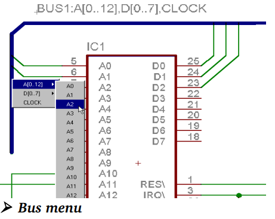

>The index of a partial bus name may run from 0 to 511.
>The help function gives further information about the BUS command.

总线名称的定义最好可以很直观的看到有什么样的网络信号被总线包含。
总线是一种绘图对象，不需要创建任何电气连接，总线的名称意味着其包含的网络
和网络名称。
相关联的菜单是总线的一个特殊功能，在使用 NET 命令后，鼠标左键单击总线会弹出一个下拉菜单，下拉菜单显示的内容由总线的名称决定（见下图）。
下图中的总线名称是：Bus1:A[0..12],D[0..7],Clock
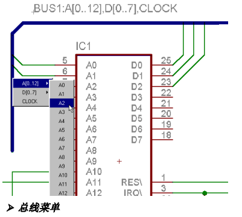

如上图所示，在 NET 命令下单击总线会弹出一个下拉菜单，被包含在总线中的
网络可以从这里选择。
局部总线命名中的标号可以从 0 到 511。
帮助中的 BUS 命令可以提供更多的信息。

### 1.5 Pinswap and Gateswap
>Pins or Gates that have the same Swaplevel can be exchanged with one another. 
>These properties are specified either when the Symbol is defined (Pinswap) or when the Device is created (Gateswap). 
>Provided the Swaplevel of two pins is the same, they can be exchanged for one another. 
>Display layer 93, Pins, in order to make the Swaplevel of the pins visible.
>Pins or Gates may not be swapped if the Swaplevel = 0.
>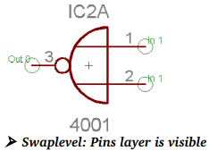
>Input pins 1 and 2 have Swaplevel 1, so they can be exchanged with one another. 
>The output pin, 3, which has Swaplevel 0, cannot be exchanged.
>You can find the Swaplevel of a Gate by means of the INFO command, for example, type in the command line INFO IC2A. 
>Alternatively via the context menu, Properties entry.

具有相同 Swaplevel 级别的 Pin 和 Gate 可以相互交换。
这些属性需要在创建 Symbol（Pinswap）或者创建 Device（Gateswap）的时候定义。
满足 Swaplevel 条件的 2 个引脚必须具备相同的属性便于相互交换，为了能让设置 Swaplevel 属性的引脚可见，需要显示第 93 层（Pins 层）。
如果 Swaplevel = 0，则 Pin 或 Gate 是不能互换的。
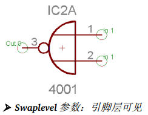

输入引脚 1 和 2 的 Swaplevel 为 1，因此它们能相互交换；输出引脚 3 的 Swaplevel 为 0，不能交换。
可以使用 INFO 命令来得到 Gate 的 Swaplevel 值，比如：在命令栏中输入 INFO IC2A，或者使用弹出菜单的属性选项。

### 1.6 Power Supply
>Pins defined as having the direction Pwr are automatically wired up. 
>This is true, even if the associated power gate has not explicitly been fetched into the schematic. 
>The name of the Pwr pin determines the name of the voltage line. 
>This is already fixed by the definition of the Symbols in the library.
>If nets are connected to a Device's Pwr pins, then these pins are not automatically wired. 
>They are joined instead to the connected net.
>For every Pwr­pin there must be at least one pin with the same name but the direction Sup (a supply pin). 
>There must be one on every sheet. 
>These Sup pins are fetched into the schematic in the form of power supply symbols, and are defined as Devices in a library (see supply*.lbr). 
>These Devices do not have a Package, since they do not represent components. 
>They are used to represent the supply voltages in the schematic diagram, as is required by the Electrical Rule Check (ERC) for the purposes of its logical checks. 
>Various supply voltages, such as 0 V or GND, which are to have the same potential (GND, let's say), can be connected by adding the corresponding supply symbols and connecting them with a net. 
>This net is then given the name of that potential (e.g. GND).

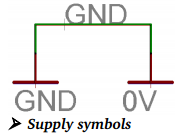

>If you place a supply pin (direction Sup) onto a net (with ADD or MOVE), you will be asked for a new net name. Should it be the name of the supply pin or should the net name remain unchanged?

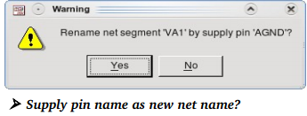

>Click Yes (default) for renaming the net with the name of the supply pin (in the image above: AGND). Click No to preserve the current net name (VA1). 
>If the net has an automatically generated name, like N$1, you may suppress this warning message. 
>Use the SET command in the command line: 
>SET Warning.SupplyPinAutoOverwriteGeneratedNetName 1;

>If the last supply pin of a net is deleted, the net will get an automatically generated name, like N$1.

>! If there is no supply pin in the supply libraries that fits to your voltage in the schematic, you have to define a new supply pin! 
>Renaming an already existing supply pin is the wrong way and can lead to unexpected results!

所有 Direction 属性定义为 Pwr 的引脚会自动连接在一起，就算相关的 PowerGate 并没有放入原理图中也会连接。
Pwr 引脚的名称决定了和什么电压值的电源线连接。
这个在元件库中定义 Symbol 时就已经固定了。
如果一个网络连接到 Device 的 Pwr 引脚上，那么这些引脚就不会自动连接到
一起。
这样就会用新的连接来代替已有的连接。

对于每个 Pwr-pin 来说，必须至少需要一个具有相同的名称，引脚 direction 设为 Sup 的例外（比如电源符号），每页原理图必须有一个该符号。
这些 SupPin 以电源符号的形式被放到电路图中，在元件库中被定义为 Device（参考库文件：supply*.lbr），这些 Device 不需要封装，因为它们并不是表示一个真实的元件，仅仅为原理图提供电源来满足电气规则检查（ ERC）中逻辑检查的需求。

不同供电电压的电源符号，比如具有相同的电势 0 V 或者 GND 可以通过添加一个相对应的电源符号并使用 NET 来连接，该 Net 的名称会沿用这个电势名称（比如 GND），参考下图：
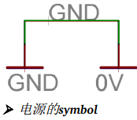

如果使用 ADD 或者 MOVE 命令放置一个电源 Pin（方向属性为 Sup）到一个网络上时，会弹出一个对话框来提示是否要改变当前网络名称为电源名称还是保持原来网络名称不用改变？
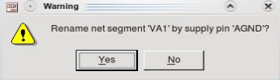

单击 Yes（默认设置）可以把网络名称改为 Supply 引脚的名称（上图中为 AGND），单击 No 保持当前的名称（VA1）。
如果该网络是自动产生的名称，比如 N$1 这种网络名称，可以在命令栏中输入下面 SET 命令来阻止警告对话框弹出。
SET Warning.SupplyPinAutoOverwriteGeneratedNetName 1;
如果加到一个网络上的 Supply Pin 被删除，网络名称会自动重新生成，比如：N$1

`!如果在电源元件库中找不到适合您原理图所需电压的 supply pin，则需要定义一个新的 supply pin！重新命名已经存在的 supply pin 是错误的做法并且可能导致意外的结果！`

### 1.7 Define Attributes 定义属性
#### 1. Global Attributes 全局属性
>It is possible to define Global Attributes in the Schematic, for example, for the author or a project identification number, that can be placed anywhere in the schematic, often used in the docfield of the drawing frame.
>Open the dialog through the Edit/Global Attributes... menu. 
>Click the button New to define a new Global Attribute. 
>It consists of the attribute's name and its value.

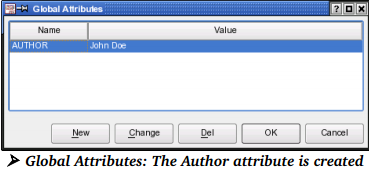

>If you want to make a global attribute visible in the schematic, write a placeholder with the TEXT command. For the AUTHOR attribute, write the text >author.
>It does not matter, if it is written in lower or upper case letters. 
>The > character in front of the text indicates that this is special text.
>It is possible to define the placeholder text already in the Library, for example, in a Symbol of a drawing frame. 
>In this case the global attribute will be shown on each schematic sheet containing this frame.

>!Global Attributes can be defined in the Schematic and Layout separately.

>More information on this can be found in the ATTRIBUTE command's help.

全局属性
在原理图中定义全局属性是可行的，比如：作者、项目编号等，这些属性可以放到原理图的任何位置，一般情况下会放到绘图框中的文本区域。
通过编辑/全局属性 …菜单打开对话框，单击 New（新建）按钮定义一个全局属性，该属性由属性名称和值组成。
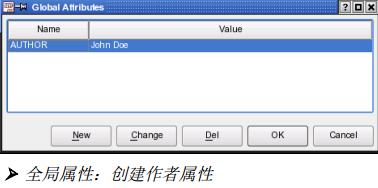
如果想让全局属性在原理图中可见，可以在 TEXT 命令中输入占位符，比如：
对于 AUTHOR 属性，可以输入>author
不用担心是否一定要输入大小写字符，字符‘ > ’表示它后面的文本是特殊文本。

定义一个已经存在于元件库中的占位符是可行的，比如：绘图框符号，在这种
情况下，全局属性会显示在所有包含该绘图框的所有页面中。

! 全局属性可以单独在原理图和 PCB 图中定义。

更多的信息可以查阅 ATTRIBUTE 命令的帮助信息。

#### 2. Attributes for Elements 元件属性
>The ATTRIBUTE command allows you to define attributes for Devices. 
>An attribute consists of the attribute name and its value that may provide any information. 
>If there already exists an attribute that has been defined in the library, you may alter the value in the schematic.
>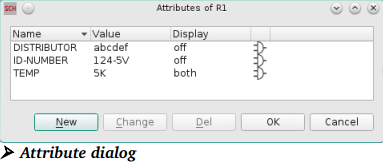

>Clicking the ATTRIBUTE icon and then onto a Device opens a dialog window. 
>It lists the part's attributes already defined in the schematic or in the library.
>The image above shows the attributes DISTRIBUTOR, ID­NUMBER, and TEMP for part R1. 
>The icons on the right indicate where the attribute comes form:

globally in the Schematic

globally in the Layout

in the Library's Device Editor

for the element in the Schematic

for the Package in the Layout

>Attributes that are defined in the Layout Editor are not shown in the Schematic Editor. 
>A newly defined attribute in the Schematic adopts the value of an already existing attribute in the Layout.

ATTRIBUTE 命令允许为 Device 定义属性，属性包含属性名称和可以提供任何信息的属性值。
如果在元件库中已经定义好了属性，同样可以在原理图中修改属性值。
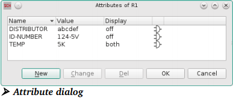

在 Device 上单击 ATTRIBUTE 属性图标 就会显示在原理图或者元件库中定义好了的元件属性。
上图显示了元件 R1 的属性：DISTRIBUTOR、ID-NUMBER 和 TEMP，图中右边的图标显示了该属性的来源：

globally in the Schematic 原理图中的全局属性

globally in the Layout 布局编辑器中的全局属性

in the Library's Device Editor 元件库编辑器中的全局属性

for the element in the Schematic 原理图编辑器中的元件属性

for the Package in the Layout 布局编辑器中的封装属性

在 PCB 编辑器中定义的属性不会在原理图编辑器中显示。
在原理图中新定义的属性可以采用 PCB 编辑器中已存在的属性的属性值。

#### 3. Defining a New Attribute 
定义新属性
>Click onto the New button to define a new attribute in the schematic. 
>In the following dialog you can define Name, Value, and the Display mode.
>In this image the attribute's name is TOLERANCE, its value is 1%.

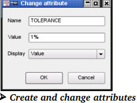

>With the Display option you manage the way the attribute is displayed in the drawing. 

>There are four options available:
>Off: The attribute is not visible
>Value: Only the attribute's value is visible (1%)
>Name: Only the attribute's name is visible (TOLERANCE)
>Both: Name and value are visible (TOLERANCE = 1%)

>If the Display option is not set Off, the respective text will be displayed at the Device's or Gate's origin. 
>The layer which is preset in the Schematic, for example with CHANGE LAYER before creating the attribute, determines the text's layer. 
>Location and layer can be changed any time.
>If there is an already defined placeholder text for an element in the library, the text shows up at the given location. 
>It is possible to unfix such texts with the SMASH command. 
>Now you can move it, change its layer, the font, its size and so on.

在原理图中的属性对话框中单击 New（新建）可以定义新的属性，在下面的对话框中可以定义 Name、Value 和 Display 模式。
下面这张图显示的是：属性名称：TOLERANCE，属性值：1 %
使用 Display 选项可以管理属性在绘图区中的显示方式，有下面 4 中选项可供选择：
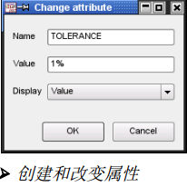

Off：属性不可见
Value：仅仅属性值可见（比如 1 %）
Name：仅仅属性名称可见（比如 TOLERANCE）
Both：名称和属性值均可见（比如：TOLERANCE = 1 %）

如果 Display 选项不设置为 Off，各自的文本都显示在 Device 或者 Gate 的原点位置，在创建属性之前使用 CHANGE LAYER 命令改变层可以决定不同的文本显示在不同的层，任何时候都可以改变文本所在的层和位置。
如果在元件库中已经对一个元件定义了占位符，该文本会显示到一个指定的位置，可以使用 SMASH 命令来解除文本和 Device 之间的固定关系，并可以自由的改变层、字体、尺寸等等。

#### 4. Changing an Attribute's Value
>Values of attributes that are already defined in the library can be changed in the Schematic Editor. 
>After changing an attribute's value, the attributes dialog displays special icons that indicate the attribute's status.
>The icons have the following meaning:

>the yellow icon indicates that the attribute initially was defined with a variable value and that the value has been changed.

>the red icon indicates that the value of the attribute which was initially defined as constant has been changed after a confirmation prompt.

>the plain brown icon indicates that a global attribute was overwritten by a part attribute. 
>The value, however, remained unchanged.

>the brown icon with the unequal sign indicates that a global attribute was overwritten by a part attribute and the value has been changed.

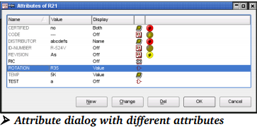

>Grayed text in the Attributes' dialog indicates that it can't be changed or rather the element's attribute value was defined as constant in the library.
>The icons inform you about the attribute's origin and its current status. 
>Move the mouse cursor onto one of the icons to let EAGLE display tool tip texts to explain its meaning, provided the Bubble help in Options/User interface is active.

>More details on defining attributes can be found in the library chapter beginning with page 261.

改变属性值：
在元件库中定义好的属性值可以在原理图编辑器中改变。
改变属性值后，属性对话框会显示特殊的图标来标注属性状态，这些图标具有下面的意思：

黄色图标指示属性最初被定义成变量值，并且已经被改变

红色图标指示属性值最初定义成常量，并且已经被确认命令改变

纯褐色图标指示全局属性被局部属性覆盖，但是值保持不变

带有‘≠’的褐色图标指示全局属性被局部属性覆盖，并且值也被改变
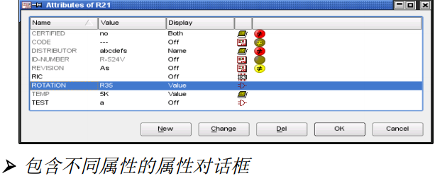

属性对话框变灰的文本表示该文本不能被修改，或者元件的属性值在元件库中被定义为常量。
其中的图标表示对应属性的来源和当前状态。
将鼠标的光标停留在某一个图标上时，如果通过选项/用户界面菜单启用了帮助气泡功能，则 EAGLE 会显示提示文本来对其表示的意义进行解释。
更多定义属性的信息可以在元件库章节中找到，从第 222 页开始。

### 1.8 ERC – Check and Correct Schematic
ERC - 检查、纠正原理图
>A schematic diagram must be checked with the aid of the Electrical Rule Check (ERC), when the design of the schematic diagram has been completed, if not before. 
>It is actually a good idea to run the (ERC) many times during your design process to catch errors immediately. 
>To start the Electrical Rule Check click onto the ERC icon in the command menu or the entry Erc... in the Tools menu. 
>All the errors and warnings are listed in the ERC Error window. 
>Errors are marked with a red icon, warnings with a yellow icon.
>In the case of a corresponding board file, the ERC also checks the consistency between schematic and board. 
>If there are no differences, ERC reports Board and schematic are consistent. 
>Otherwise the ERC Errors window contains a branch with Consistency errors. 
>For further information on this see page 193. 
>It is possible to sort the errors and warnings, ascending or descending, by error types or sheet numbers. 
>click onto the column headers Type or Sheet therefore.

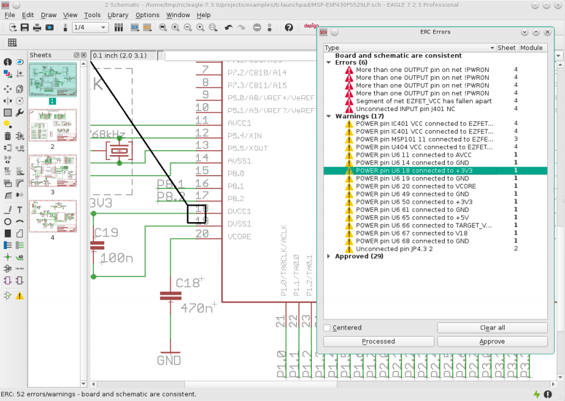

>If you select an entry in the Errors or Warnings branch, a line points to the corresponding location in the schematic diagram. 
>In case you zoomed into the drawing, you can click the option Centered. 
>The currently selected error is shown in the middle of the drawing window now. 
>Please check each error and every warning.
>In some situations it may be the case that you want to tolerate an error or a warning. 
>Use the Approve button for this. 
>The error/warning entry will be removed from the Errors or Warnings branch and appears in the Approved branch.
>If you want to have the capability of displaying an approved error/warning occurrence in the Errors or Warnings branch, expand the Approved branch, select the error entry and click the Disapprove button. 
>Now it is treated as a normal error/warning and is marked in the schematic. 
>An approved error/warning retains its approved status as long as you do not disapprove it by clicking the Disapprove button. 
>Even a new ERC won't change this status.
>If the Errors window lists approved errors or warnings only, it won't open automatically after running the Electrical Rule Check again. 
>The status line of the Schematic Editor, however, will show the following hint:
>ERC: 2 approved errors/warnings
>Moving an entry from one branch into the other, marks the schematic file as changed and not saved.
>While correcting the error on the board, the ERC Errors window may remain open. 
>After correcting one error or warning you can mark the entry as Processed in the error list by clicking onto the Processed button. 
>The error/warning icon turns gray now. Entries marked as processed will be remembered as long as you don't start ERC again. 
>Re­opening the ERC Errors window with the ERRORS command, shows the same status as you left it at last.
>If you click onto the Clear all button, the Errors and Warnings branches will be cleared. Approved errors and warnings, however, will remain in the Approved branch. 
>The message List was cleared by user is shown then. 
>If you did not run an ERC before, the ERRORS command will start it automatically before opening the errors window.

>! The ERC checks the schematic diagram according to a rigid set of rules. 
>It can sometimes happen that an error message or warning can be tolerated.
>If necessary, make an output of net and pin lists with the EXPORT command.
>SHOW allows nets to be traced in the schematic diagram.

当原理图设计完成后（而不是之前）必须要使用 Electrical Rule Check (ERC)来检查。
在设计的过程中多次运行 ERC 来及时排错是一个已证明了的非常好的主意。
在命令栏单击 ERC 图标 或者在 Tools 菜单中均可以运行 ERC。

错误和警告会在 ERC Error 窗口中列出来，错误用红色图标标注，警告用黄色图标标注。
使用 ERC 功能同样可以检查相关联的 PCB 图文件以及原理图和 PCB图之间的一致性关联。
如果 2 个文件没有区别，ERC 会报告原理图和 PCB 图一致，否则，ERC Errors 窗口会报告一系列一致性错误的分支。
更多信息请参考第 164 页。

ERC 错误信息窗口

单击列表按照升序或者降序的顺序对错误的类型和页面进行错误和警告的排序是可行的。

如果选择了一个错误或者警告分支入口，一条黑线就会指向原理图中相关的位置，选中窗口中的 Centered 显示在中心选项可以平移绘图区域，当前被选择的错误会显示在绘图区的中间。
请一定要检查每一个错误和警告。
在某种情况下可能会容忍或者忽略一些警告和错误，此时可以使用 Approve 认可按钮把这些错误/警告从 Errors 或者 Warnings 分支移到 Approved 认可分支下，这样，这些错误/警告就会被当作正常的错误/警告并且在原理图中标记。

已经被认可的错误/警告仍然保留被认可的状态以便可以单击 Disapprove 按钮来不被认可，即使一个新的 ERC 命令也不会改变这种状态。
如果 Errors 窗口中只有被认可了的错误/警告列表，它不会在再一次执行 ERC检查时弹出，但是会在原理图编辑窗口的状态栏中显示下面的提示：
ERC: 2 approved errors/warnings
把错误/警告条目从一个分支移到另一个分支会把原理图文件标识为已改动状态，但不会保存。
当要在 PCB 编辑器中修改错误时，ERC Errors 窗口会保持打开状态，修改完一个错误/警告后可以单击 Processed 已处理按钮来标识该错误/警告已经处理，错误/警告图标也会变灰。
标识为已经处理的条目会被记录直到不再执行 ERC。
单击 ERRORS 图标打开 Errors 窗口仍然会显示上次离开时的状态。
如果单击 Clear all 按钮，错误/警告分支会被全部清空。
但是已经认可的错误和警告仍然保留在 Approved 分支里面，然后会显示一个信息提示：List was cleared by user
如果之前没有执行 ERC 检查，在打开 Errors 窗口前会自动执行 ERRORS 命令。

！ERC 命令根据一个严格的规则来检查原理图，这样有时候会产生一些可以被容忍或接受的错误和警告。
在必要的时候可以使用 EXPORT 命令输出一个网络和引脚列表。
SHOW 允许原理图中的网络被高亮显示出来。

### 1.9 Organize Schematic Sheets
组织原理图页面
>If your schematic is a bit more complex or you want to use more than one sheet, for example, for better readability, you can add (and also remove) sheets with the help of the sheet thumbnails' context menu. 
>Click with the right mouse button onto one of the thumbnails that are located on the left side of the Schematic Editor window. 
>A new sheet is always added as the last one.
>The schematic sheets can be sorted by dragging and dropping the thumbnails.
>Therefore click with the left mouse button on a thumbnail and drag it to its new position.
>Alternatively you can sort the sheets with the EDIT command in the command line:
>EDIT .s5 .s2
>moves sheet number 5 at the position before sheet number 2. 
>Further information about this can be found in the EDIT command's help function.
>Go to the Options/User interface menu in order to switch on/off the sheet preview.

>!When switching between schematic sheets, the current zoom level of each sheet will be maintained.

如果原理图比较复杂或者使用超过一页以便于更好的阅读，可以使用操作工具栏中的 Sheet 下拉列表来添加（或者移除）页面，也可以右键单击原理图编辑窗口左边的页面预览区域来添加页面。
新的页面总是添加到最后一页。
原理图页面可以使用拖拽预览页的方式来排序，因此可以使用鼠标左键在预览区把页面拖到一个新的位置。
同样，也可以使用在命令行内输入下面的 EDIT 命令来对 页面排序：
EDIT .S5 .S2
上面的命令表示把第 5 页移到第二页的前面。
更多关于这些的信息请参阅帮助功能中的 EDIT 命令。
选项/用户界面菜单可以打开/关闭页面预览缩略图。
当在原理图的不同页面之间切换时，当前窗口的缩放比例会在每页中保存。

### 1.20 Points to Note for the Schematic Editor
原理图中需要注意的要点
#### 1. Superimposed Pins
引脚重叠
>Pins will be connected if the connection point of an unconnected pin is placed onto the connection point of another pin. 
>Pins will not be connected if you place a pin that is already connected to a net line onto another pin.

如果一个没有连接的引脚的连接点放到了另外一个引脚的连接点上，这 2 个引脚会产生连接。
如果一个已经和一条网络线连接了的引脚放到了另外一个引脚上，这 2 个引脚不会产生连接。
#### 2. Open Pins when MOVEing
执行移动操作的未连接引脚
>If a Gate is moved then its open pins will be connected to any nets or other pins which may be present at its new location. 
>Use UNDO if this has happened unintentionally.

移动一个 Gate 时它的开放的引脚会和新位置的任何一条网络或者其他的引脚产生连接。
如果无意中出现这样的情况，请使用 UNDO 命令。

### 1.21 Duplicating a Section of the Schematic
复制部分原理图
>If you want to use a certain section of your schematic several times, you can use GROUP and COPY commands in order to put this part into the clipboard, and then use PASTE to place the group on the same or on a different sheet of your schematic.
>The duplicated components will get new names. Nets connected to a supply pin or marked with a LABEL will keep their original name, provided the supply pin and the label is part of the selected group. 
>All other nets will get new names.

如果您需要重复使用原理图的某一个部分，可以通过 GROUP 和 COPY 命令来将该部分复制到剪贴板中，然后通过 PASTE 命令将其放置到同一原理图页面或者其他原理图页面中。
被复制的元件会得到一个新名称。
与电源引脚相连接的网络或者由 LABEL 命令进行了标记的网络将保持原有名称，但前提是电源引脚和标签都包含在选中的这一部分对象组中，否则网络也会自动重新命令。

#### 1. With Consistent Layout
确保 PCB 设计的一致性
>In case you already created a board from your schematic, the pasted components in the layout will be placed left of the board's origin. 
>As usual the components have to be arranged and the airwires routed then.

如果之前您已经从原理图生成了 PCB 设计，那么后来在原理图中粘贴的元件将会摆放在 PCB 设计中电路板原点的左方。
与平常一样，这些元件同样需要进一步的放置并布线。

### 1.22 Merge Different Schematic Files
合并不同的原理图文件
>It is possible to paste a whole schematic file into the current drawing. 
>This can be done in the menu File/Import/EAGLE drawing.... 
>The new sheet(s) will be appended to the current one(s), depending on the number of sheets of the source schematic. 
>You can re­order the sheets by drag&drop afterwards.

可以粘贴整个原理图文件到当前会图中。
在菜单 File/Import/EAGLE drawing.... 下，可以完成该操作。
新页面原理图页面将会添加到当前原理图的最后一个页面下，依赖于源原理图页面的数量。
你也可以通过拖放来调整页面的顺序。

>While inserting a group EAGLE checks the objects' names and compares them with those already existing in the current schematic. 
>EAGLE will show a window where you get information about the net names. 
>The table shows a list with the original names of the schematic you want to paste, in the column Old name, and the net names, in the column New name, EAGLE suggests for this schematic after pasting it into the current drawing. 
>By clicking onto an entry you can influence the net names and decide about them by yourself.

在插入对象组时 EAGLE 会检查对象的名称并与当前原理图中已有的对象名称进行比较。
然后 EAGLE 将会显示一个包含了网络名称信息的窗口。
窗口在旧名称（Old name）一栏中列出了被复制的原理图中的原始名称，以及在新名称（New name）一栏中列出了 EAGLE 建议的粘贴之后使用的网络名称。
单击某一项就可以根据您自己的需要确定网络名称。
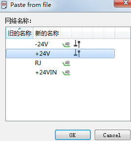
>Names of nets that have a label or are connected to a supply pin, will remain unchanged by default. 
>In the Paste... list such nets are marked with icons that want to tell you what's the reason for leaving this net name unchanged. 
>Of course you are allowed to change such a net name as well.
>It is not allowed to change the names of nets that are member of a bus or that are connected to an implicit power here.

带有标签的网络名称或者与电源引脚连接的网络名称默认情况下保持不变。
在网络名称信息窗口中这一类网络会用图标标记出来，以便告诉您保持网络名不变的原因。
当然您也可以对这类网络的名称进行修改。
不允许被改变的名称的网络，如隶属于总线的网络，或被连接到内含电源。

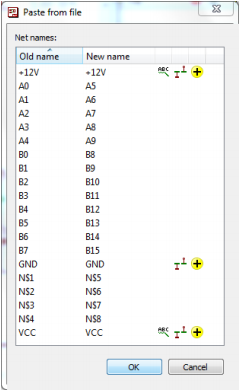
➢ Netnames before and after pasting the schematic

>It's possible to pre­define an offset for the enumeration of the components, if you use the PASTE command in the command line:
>PASTE 200 channel1.sch
>adds the schematic with name channel1.sch into the drawing and increments  the components' names with an offset of 200. 
>R1 of channel1.sch will be named R201 in the current drawing then.
>This function is also available through the File/Import... menu.

通过执行以下 PASTE 命令，元件的编号就会根据预定义的基数来排序：
该命令行将名称为 channel1.sch 的原理图添加到当前绘图中，并基于 200 的基数对元件名称进行编号。
例如 channel1.sch 中的 R1 将在当前绘图中更名为
R201。
该功能也可以通过“文件（File）/ 导入（Import）”菜单实现。

#### 1. With Consistent Layout
确保 PCB 设计的一致性
>In case you are working with a consistent pair of schematic and board files, and you want to import another consistent schematic/board pair into your current project via the File/Import/EAGLE drawing... menu, the schematic will be placed on a new sheet (or several sheets) and the board will be placed left of the already existing layout. 
>It can be moved with GROUP and MOVE afterwards.
>As an alternative to the File/Import menu and the PASTE command which can be used in the command line, you are allowed to drag&drop a schematic or a layout from the tree-view's projects branch of the Control Panel into your currently opened Schematic or Layout Editor window.

如果您同时打开了相互关联的原理图和 PCB 文件，则与被复制的原理图对应的 PCB 图将会被粘贴到当前项目的 PCB 文件中。
新加入的 PCB 图放置在原有PCB 图的左方。
通过 GROUP 和 MOVE 命令可以对其进行移动。
除了使用“ File/Import”菜单以及在命令框中运行PASTE 命令外，也可以将 Control Panel 树形浏览区中 projects 分支下的原理图或 PCB 图拖放到当前打开的编辑器窗口中。

#### 2. Multi-Channel Devices
多通道设计
>This functionality can be used to easily create multi­channel devices:
>Finish the schematic of one channel and create the board of it. 
>Then arrange the components and route your layout. 
>When this is done use Paste from.... and copy the schematic/layout pair as often as needed into on common schematic/board file pair.
>If you start File/Import/EAGLE drawing... in the Layout Editor, the layout will be attached to the mouse cursor and you can place it where you would like to have it. 
>The schematic part will be added on a new page in the current schematic. 
>If you are using the command line in the Layout Editor you can use coordinates for an exact placement.
>PASTE TEST.BRD (10 30)
>for example, places the board from test.brd with an offset of (10 30) in grid units compared to the original position.
>In case you start the import from the Schematic Editor, the referring layout will be placed automatically left of the already existing design in the layout editor.

该功能可以轻松的创建具备多通道的原理图和 PCB 图：
在完成一个通道的原理图设计并将其生成 PCB 图，
完成元件的布局和布线后，
就可以使用“粘贴自（Paste from）”菜单将这个设计好的单通道原理图和PCB 图复制到一个共同的原理图和 PCB 图中，从而形成多通道的设计。
如果你在布局编辑器中启动 File/Import/EAGLE drawing... ，导入后的布局将会粘在光标上，你可以放置该布局到任何你喜欢的地方。
原理图则会增加一个新的页面。
如果您是通过 PCB 编辑器的命令框输入命令来实现该功能，那么还可以使用坐标来确定放置的位置。
PASTE TEST.BRD (10 30)
比如以上实例中，将电路板 test.brd 放置到相对于其原始坐标位置的（10 30）栅格位置上。
如果您在原理图编辑器中执行导入，则相对应的PCB 图会自动放置到当前 PCB 编辑器中已有的 PCB 图左方。

## 2. The Hierarchical Schematic 层次化的原理图
该笔记在  0x02 Schematic Editor原理图编辑器 中

## 3. 创建 PCB 板之前的注意事项
Considerations Prior to Creating a Board 

### 3.1 检查元件库
Checking the Component Libraries
>The EAGLE component libraries are developed by practising engineers, and correspond closely to present­day standards. 
>The variety of components available is, however, so wide that it is impossible to supply libraries which are suitable for every user without modification.

>There are even different Packages which are supplied by various manufacturers using the same identification! 
>Manufacturers recommend very different sizes for SMD pads, and these depend again on the soldering procedure being applied.

>In short: You cannot get away without checking the components, in particular the Package definitions, being used when laying out.

EAGLE 软件的所有元件库都是由具有实践经验的工程师创建，十分接近现在的标准。元件的各种种类都被考虑到，可以支持很广泛的元件库，因此不需要更改就可以适合每一个用户。
但是同一个元件因为不同的制造商会有不同的封装，制造商推荐为不同的 SMD 焊盘使用不同的尺寸，而这些尺寸又会依赖于不同的焊接流程。
简而言之：在设计 PCB 图时使用的封装还是需要检查。

>In the case of SMD components, please take particular care to ensure that the Package from the library agrees with the specifications of your component. 
>Housings from different manufacturers with the same name but different dimensions are often found.

比如使用 SMD 元件，请仔细检查以确保从元件库中调入的封装和您的元件的规格一致。经常会发现来自不同制造商的同一元件名称的外形尺寸会有所差异。

### 3.2 和制板厂商达成一致
Agreement with the Board Manufacturer
>If you plan to have your PCB professionally manufactured, now is the time to inquire at your board manufacturer whether they stipulate any particular values for the following parameters:
> track width
> shape of solder lands
> diameter of solder lands
> dimensions of SMD pads
> text size and thickness
> drill hole diameters
> number of signal layers
> in case of multilayer boards: manufacturing directions for Blind and Buried vias and composition of the board (see page 172)
> clearance values between different potentials
> parameters concerning solder stop mask and cream frame
>You will save yourself time and money if you take these stipulations into account in good time. 
>You will find more details on this in the section on the Preparing of Manufacturing Data (Chapter 9).

如果想让您的 PCB 板得到专业的制作，现在就必须要向 PCB 制板厂商询问他们是否能满足下列参数的特定值：
- 走线宽度
- 焊接层外形
- 焊接层直径
- SMD 焊盘的尺寸
- 丝印文本的尺寸大小和宽度
- 钻孔尺寸
- 信号层数量
- 多层电路板中：盲孔和埋孔的制作方向，电路板材料成分（参考用户手册第 145页）- 
- 信号之间的间距
- 阻焊层和焊膏层的参数
更详细关于本段的说明请参考用于手册第 9 章《 准备制造数据》。

### 3.3 定义设计规则
Specifying the Design Rules
参看 《0x03 Layout Editor PCB 编辑器》 中关于设计规则的笔记。

### 3.4 多层电路板的注意事项
在 EAGLE 中多层电路板是指包含Top 层(顶层人Bottom 层(底层)和内部层(第2 至15 层，通常内部层的数量为偶数 ) 的电路板，这些层上都可以对信号进行布线操作。

#### 1. 与PCB 制造商沟通
由于不同的PCB 制造商所具备的制造能力和工艺都不尽相同，因此多层板的设计在确定需要的层数以后，应该首先与PCB 制造商沟通，针对PCB 设计的层叠结构以及过孔、盲孔、埋孔或微型过孔等方面的情况，与制造商协商，以便确定多层电路板的层叠结构，取得较高的性价比。这样才能避免闭门造车，不至于最后对设计进行大量修改，甚至重新开始的情况出现。

#### 2. 添加PCB 的内部层
EAGLE 默认情况下仅有 Top 层和Bottom 层。增加内部层需要在DRC 命令弹出的设计规则窗口中的Layers 标签下进行设置。当然，各层的层叠方式同样需要首先与PCB 制造商沟通以后再进行设置。

#### 3. 只包含一个信号网络的电源层
~~如果多层板的设计中电源层上只需要包含一个信号网络，则可以通过第2~15 层的某一层进行简单的设置来实现。例如某个4 层板的设计中，需要将第2 层作为电源层时，先运行 DISPLAY 命令，在弹出窗口中双击第2 层，将名称修改为VCC ，然后启用Supply Layer 选项即可将第2 层设置为电源层。这时在 DISPLAY 命令的弹出窗口中第2 层的名称会变成 $VCC 即表示该层为电源层。~~
~~通过命令行也可以将某个内部层定义为电源层，例如在PCB 编辑器中运行命令：LAYER 2 $ VCC，这样第2 层即被作为电源层。~~
~~注意: 这里所定义的仅包含一个信号网络的电源层是以负片的形式显示和输出数据的，因此在这种电源层上不能绘制其他信号线路或者多边形敷铜区，否则会造成电路板无法使用的情况。~~

最后请注意：
EAGLE和所有其他电子设计软件一样，是用负片产生电源层和地层Gerber数据，因此您在设计环境中看到的和真正的Gerber产生的数据相反。

和其他的EDA软件类似，如果要使用负片产生电源层和地层数据，需要在电源层和地层的PCB边缘使用大约50mil的非电气连接线画一个封闭的形状，这样做的目的是使电源层和地层产生的敷铜区不会到达PCB的边缘，在PCB切割时不会产生铜屑造成短路，并且避免信号在电路板边缘产生射频干扰。

在 7.5 版本中没有该功能选项。在 change 窗口下无 supply layer 复选框。
[旧版本中如何设置电源层参考链接](https://www.element14.com/community/docs/DOC-26870/l/how-to-set-a-4-layers-pcb-in-eagle)
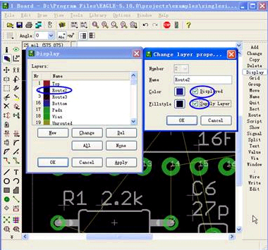
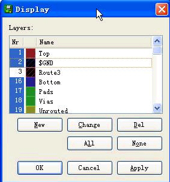

#### 4. 包含多个电源信号的电源层
通常较为复杂的多层板都需要多个电源信号，这时就需要在电源层上添加多个信号网络来为不同的电路供电。
但是如果采用上面介绍的单一信号网络电源层的处理方法，则 EAGLE 无法实现同一电源层上存在多个信号网络的情况。因此需要用 POLYGON 命令在某一层上为不同的电源信号绘制不同的多边形，以此来实现多个电源信号，并存在同一电源层上。
~~这时电源层的名称就不能添加符号" $ "来表示了，即不启用DISPLAY 命令弹出窗口中双击该层后所显示的Supply Layer 复选框，以免造成错误。~~
在 7.5 版本中，无此设置项。
另外，这种方式所创建的电源层是以正片的形式显示和输出数据，因此可能数据量要大于负片输出的情况。

### 3.5 合并多个电路板
当同一时间内有多个电路板需要制造时，可以将这些电路板的 PCB 设计通过复制和粘贴保存到一个单独的电路板文件中，然后统一提交给电路板制造商，同时制造多快电路板，以便节约制造成本。

合并电路板的工作主要使用3 个命令，即GROUP 、CUT 和PASTE 命令。也可直接对着需要复制的文件右键，选择复制，然后在弹出的对话框中挑选适合的存储位置。

需要注意的是在执行PASTE 命令粘贴电路板时有可能会让某些元件的名称自动修改，也就是说丝印层上的信息有可能会自动发生改变。如果需要确保丝印层信息不被改动，可以使用 EAGLE 中自带的名称为 Panelize. ulp 的用户语言程序来实现。

Panelize. ulp 程序能够将第25 层(tNames) 和第26 层(bNames) 上的文本信息复制到新建的125 和126 层上。当粘贴电路板时， 25 层和26 层上的信息虽然可能发生改变，但125 和126 层上保存的备份信息不会有任何修改。在将制造数据提交给电路板制造商时，只需要告知对方采用 125 和 126 层上的信息作为丝印层的信息，而不是第25 层和26 层即可。

以下是合并电路板的步骤:
· 打开需要合并的电路板文件。
· 通过 DRC 命令导出原 PCB 的设计规则。
· 运行 Panelize. ulp 来保存元件名称。
· 使用 DISPLAY 命令按钮显示所有的层。
· 使用 GROUP 命令按钮来选择所有需要复制的对象；复制整个PCB 设计时，可以使用
GROUP ALL 命令。
· 单击 CUT 命令按钮后，再单击绘图区。
· 新建一个PCB 设计。
· 使用PASTE 命令按钮将复制的电路板放置到新建的PCB 设计中。
· 确认新建的PCB 设计与原PCB 设计所使用的设计规则相同；如果不同，则可以在新
PCB 设计时，在 DRC 命令弹出的设置窗口中，单击其File 选项卡中的Load 按钮，导
入之前保存的设计规则文件。
如果合并后的电路板中存在有多个电源层，则需要对电源信号的名称和线路进行检查。
例如合并电路板后各个GND 信号可能会被重命名为GND1、GND2 、GND3 等名称，并且与电源层 $GND 的连接也同时消失了，这时需要将这些电源信号重新命名为之前的名称，即GND 。

## 4. Create Board 创建电路板
>After you have created the schematic, click the Board icon.
>An empty board is generated, next to the components that are to be placed, joined together by airwires. 
>Supply pins are connected by those signals which correspond to their name, unless another net is explicitly joined to them.

当您创建好原理图后，请单击 Board 图标。
将会生成一个空电路板，旁边是需要放置的元件，这些元件由鼠线相互连接。
电源引脚与具有相同名称的信号网络相连，除非这些电源引脚专门与另一个网络连接。
>The placement grid for components is set to 50 mil (1.27 mm) by default.
>If you prefer a different placement grid, you are allowed to specify it optionally with the BOARD command in the Schematic Editor's command line.

默认情况下放置元件的栅格宽度设置为 50mil（1.27mm）。
如果您想要使用不同的栅格，您可以在原理图编辑器的命令框中使用 BOARD 命令来指定。
>To have the components placed, for example, in a 1 mm grid, type:
>BOARD 1mm
>The unit has to be specified in the command line directly.
>The board is linked to the schematic by the Forward&Back Annotation engine provided that both files are always loaded. 
>If both loaded during editing they are guaranteed to remain consistent. 
>Alterations made in one file are automatically carried out in the other.

例如，要在宽度为 1mm 的栅格中放置元件，请输入：
BOARD 1mm
宽度单位必须在命令行中直接指定。
在原理图和电路板文件都载入的情况下，电路板与原理图通过 Forward&Back Annotation 正反向标注引擎实现关联。
如果在编辑过程中两个文件都被载入 ，则它们能够始终保持一致。
在一个文件中所作的修改会在另一个文件中自动反映出来。

>If you already generated a board from your schematic and continue placing components in the schematic, the referring packages in the board are placed in the current grid setting of the Layout Editor.

如果您已经从您的原理图中生成了一个电路板设计图并且继续在原理图中放置元件，则电路板上的参考封装会被放置在 PCB 编辑器当前设置的栅格中。
>! If, for example, the Schematic is loaded and edited without the Layout, consistency can be lost. 
>The Forward&Back Annotation Engine no longer functions.
>Differences must then be rectified manually with the aid of the error messages provided by the ERC (see page 193).

例如，如果在没有加载 PCB 设计图的情况下载入并编辑了原理图，则会造成两个文件不一致的情况。
Forward&Back Annotation 正反向标注引擎也不会工作。
文件差异需要在 ERC 提供的错误信息的帮助下进行手动纠正（请参考第 164 页）
>If you would like to see a descriptive text for your board file in the Control Panel's treeview Projects branch, you can define it by the Layout Editor's Edit/Description menu.
>You are allowed to use HTML tags for formatting the text.

如果您希望在 Control Panel 的树形浏览区内 Projects 分支下显示电路板文件的描述信息，可以通过 PCB 编辑器的“编辑（Edit）/描述（Description）”菜单来添加。
描述信息的文本可以使用 HTML 标记。

### 4.1 没有原理图编辑器的情况
Without the Schematic Editor
>If you work without a Schematic Editor, you must generate a new board file, place the Packages with the ADD command and define the connections with the SIGNAL command.

如果您在没有原理图编辑器的情况下进行电路板设计，则您需要创建一个新的电路板文件，通过 ADD 命令来放置 Package 并通过 SIGNAL 命令来定义连接。
>To understand this process, please read the section on Placing Components on page 116, and the section on Specifying Net Classes on page 123. 
>These two points apply to the Layout Editor as well as to the Schematic Editor.

为了理解该过程，请阅读第 104 页的放置元件章节，以及第 110 页上的定义网络簇章节。
这两点同时适用于 PCB 编辑器和原理图编辑器。
>You are also allowed to define attributes in the Layout Editor. 
>Please read the chapter about defining Attributes beginning with page 128.

您在 PCB 编辑器中也可以定义属性。
请阅读第 114 页上的关于定义属性的章节。
>The remaining procedures are identical for users with and without the Schematic Editor.

余下的步骤对于使用和不使用原理图编辑器的用户来说都完全相同。

### 4.2  指定电路板外框
Specify the Board Outline
>A board that has just been generated from a schematic diagram initially appears as in the following diagram:

从某个原理图生成的电路板一开始以下图的形式显示出来：
>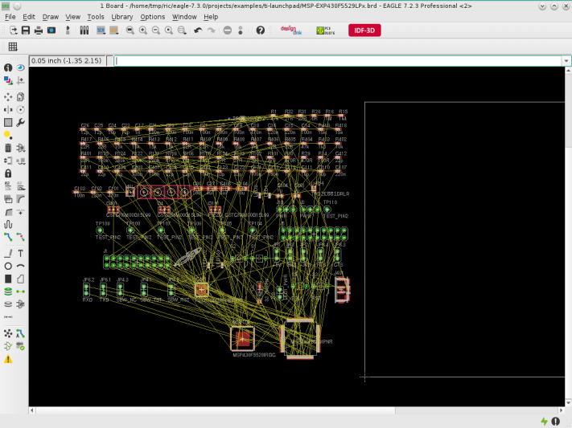
>➢ Board command: Create the layout from the schematic

>The Devices are automatically placed at the left of the board. 

>The board outline can be drawn as a simple narrow line in layer 20, Dimension with the WIRE command.

>It's easily possible to draw round outlines, too. Therefore use the CIRCLE command with a small width near 0.
>You can also place a board contour from a library (such as 19inch.lbr) with ADD.

元件会自动的放置在电路板的左方。
电路板外框可以通过 WIRE 命令在第 20 层（Dimension 层）上用简单的细线条进行绘制。
要绘制圆形的外框也可以非常轻松地实现，这时请使用 CIRCLE 命令并将线宽设置为接近 0 的值。
您也可以通过ADD命令从元件库中选择一个电路板外框（比如 19inch.lbr）。

>A script file can, alternatively, be read by the SCRIPT command. 
>The euro.scr file, for instance, can be used. 
>Simply type 
>SCRIPT EURO 
>on the command line.
>The board outline serves simultaneously as a boundary for the autorouter or Follow­me router (if present).
>If your board has additional cut­outs, you should draw the necessary milling contours in a separate layer, for example in 46, Milling. 
>Use the WIRE command with wire width = 0 to define your lines.

另外，可以通过 SCRIPT 命令读取脚本文件。
例如读取 euro.scr 文件，只需要在命令框中输入。
SCRIPT EURO
电路板外框同时也作为 Autorouter 或者 Follow-me router（如果有该功能）的界限。
如果您的电路板还有其他的外框，则您需要在一个单独的层上绘制用于铣加工的轮廓，比如在第 46 层（Milling 层）上。
请用 WIRE 命令并将线宽设置为 0 来进行绘制。

### 4.3 元件布局
Arrange Components
>Drag the various components to the desired positions. 
>Use the MOVE command for this purpose. 
>Devices can be clicked on directly, or addressed by name.
>If you type, for example,
>MOVE R14
>in the command line, the Device named R14 will be attached to the mouse cursor, and can be placed.
>Precise positioning results from input such as:
>MOVE R14 (0.25 2.50)
>R14's locating point is now located at these coordinates.

请使用 MOVE 命令将不同的元件拖放到需要的位置。
为此 使用 MOVE 命令
在输入命令后可以直接选择元件，或者通过元件名称来指定。
例如，您可以在命令框中输入
MOVE R14
名称为 R14 的元件将会粘附到鼠标光标上，以便您进行放置。
通过输入以下命令可以进行精确的定位：
MOVE R14 （0.25 2.50）
这样 R14 的原点会放置到该坐标上。

>! Keep the Ctrl key pressed while selecting a component in order to let its origin jump at the mouse cursor and move it onto the currently used grid.

在选择元件时按住 Ctrl 键以便让元件的原点跳跃到鼠标的光标上，然后在当前的栅格上移动。

>A group of Devices can be transposed by combining the GROUP and MOVE commands. 
>Click onto the GROUP icon and then draw a frame around the desired elements, click MOVE, and then click within the group with the right mouse button in order to select it. 
>With a click of the left mouse button you can place the group at the desired location.

通过 GROUP 和 MOVE 命令的组合可以移动一组元件。
单击 GROUP 图标然后在待选元件的周围绘制一个方框，单击 MOVE 图标，接着再用鼠标右键 + ctrl 单击该元件组以便选中。
最后通过单击鼠标左键来将元件组放到需要的位置。

>ROTATE, or a click with the right mouse button while the MOVE command is active turns a Device through 90 degrees. 
>This also applies to groups. 
>In order to place a component in any angle you may specify the rotation directly with the ADD command or later with ROTATE or MOVE in the parameter toolbar.

通过 ROTATE 命令或者在使用 MOVE 命令期间单击鼠标右键可以将元件旋转 90 度。
该方法也使用于元件组。
要让元件以任何角度放置，您可以直接通过 ADD 命令指定旋转角度或者在放置元件后在 ROTATE 或 MOVE 命令的参数栏中进行设置。

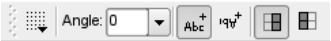
➢ Parameter toolbar for ROTATE, MOVE, ADD, COPY

>Next to the Angle box are the buttons for the Spin and Mirror flag.
>The left­-hand Spin icon is selected , if the spin flag is not set (default).
>This means that texts are displayed always readable from the right or from the bottom side of the drawing.
>If the spin flag is activae – the right­hand Spinned icon is marked – the texts can be displayed in any rotation, also upside down.

在 Angle 下拉菜单旁是 Spin 和 Mirror 的按钮
如果没有指定，则默认设置为左边的 Spin 按钮 。
意味着文本以从左到右或者从下到上的方向显示。
如果激活了 Spin 选项，并且选中了右方的 Spinned 图标 ，则文本可以旋转到任意角度来显示，甚至可以上下颠倒。
>The Mirror icons used with components determine where a component is placed: on the top side (default) or on the bottom side of the board. 
>If a component is placed on top, the left­hand icon is active. 
>If you want to place it on the bottom side, click onto the right­hand Mirrored icon.

针对元件使用 Mirror 图标可以决定元件放置的层：可放置在顶层（默认）或者底层。
如果元件放置在顶层，则使用左边的图标。
如果您想将其放置在底层，请单击右边的 Mirrored 图标。

>As an alternative you can work with the command line:
>ROTATE R45 'IC1' ;
>adds a rotation of 45° to the current position of part IC1. 
>Assumed you tried, for example, to rotate the component with the ROTATE command and pressed mouse button, and you decided that it is not possible to obtain the exact rotation angle this way (because of a too coarse grid) type in the command line:
>ROTATE =R45 'IC1' ;
>The rotation of IC1 is now exactly 45°. 
>The = sign stands for absolute values.
>The initial position does not matter.

另外您还可以使用命令行：
ROTATE R45 'IC1' ;
将元件 IC1 在当前位置上旋转 45°。
假设您通过 ROTATE 命令和单击鼠标无法实现您想要的实际旋转角度，请输入
ROTATE =R45 'IC1' ;
这时 IC1 的旋转角度即为绝对的 45°。
符号“=”表示绝对值。
元件的初始角度不会产生影响。

>If, for example, a SMD should be placed on the bottom side of the board you may add the Mirror flag, as in:
>ROTATE =MR45 'IC1' ;
>An additional Spin flag causes texts to be written upside down (by a rotation of 180°), that means they can be read from the top view:
>ROTATE =SMR180 'IC1' ;
>The Spin flag is alternating, i. e. using it again causes the text to be displayed 'normal' again.

如果要将某个 SMD 元件放置在电路板的底层上，您可以通过以下命令使用 Mirror 参数：
ROTATE =MR45 'IC1' ;
另外再加上 Spin 参数可以让文本翻转（旋转 180°），即实现俯视图效果：
ROTATE =SMR180 'IC1' ;
Spin 参数可以重复使用，即再一次使用后文本将恢复“正常”显示形式。

>Check frequently whether the placement is optimal. 
>To do this, use the RATSNEST command. 
>This calculates the shortest connections of the airwires between two pints.
>In boards that contain a huge number of signals it may be useful to hide some of the airwires or display only a few of them. 
>If you want to hide, for example, the signals VCC and GND, type in the command line
>RATSNEST ! VCC GND
>if want to see them all again, type:
>RATSNEST *
>More information about this can be found in the EAGLE help section.

请经常检查元件是否放置在最佳位置。
该检查可以使用 RATSNEST 命令来实现。
该命令能够计算两点之间鼠线的最短连接。
在包含了大量信号线路的电路板中隐藏部分鼠线或者只显示少量鼠线有益于设计工作。以隐藏信号线路 VCC 和 GND 为例，请输入命令行
RATSNEST ! VCC GND
如果您想再次显示它们，请输入：
RATSNEST *
关于该功能的更多信息请参考 EAGLE 的帮助页面

>The position of particular Devices can be displayed by typing the Device name onto the command line or by clicking directly on an object while the SHOW command is active.

要高亮显示某个特定元件的位置(并不是直接显示坐标位置，指示对封装高亮，以便观察元件所在位置)，可以在 SHOW 命令激活的状态下，直接在命令框中输入该元件的名字，或是直接单击该对象。

>INFO shows detailed information about the selected object. 
>Depending on the object you clicked on, some of its properties can be altered in the dialog.

INFO 命令可以显示被选对象的详细信息。
根据对象的不同，其某些属性可以在对话框中修改。
>The LOCK command allows you to fix components on the board. 
>They can't be moved any more then. 
>Shift+LOCK releases the component again. 
>LOCK can be used with groups as well.

LOCK 命令可以将元件固定在电路板上。
固定后将无法再移动。
Shift 键与 LOCK 命令的组合可以解除元件的固定状态。
LOCK 命令也可用于组。

>If the text for the name or the value is located awkwardly尴尬的, separate them from the Device with SMASH and move them to whatever position you prefer with MOVE. 
>At the same time EAGLE shows a line from the text's origin to the belonging object. 
>Clicking with DELETE on either of the texts makes it invisible. 
>Activate the SMASH command, hold down the Shift key, and click onto the component to have the texts displayed at their original positions again. 
>They are no longer editable and unsmashed, again. 
>Another way to archive this is to deactivate the option Smashed in the context menu's Properties entry.

如果名称或元件值的文本位置不正确，可以通过 SMASH 命令将它们从元件上拆分出来并用 MOVE 命令移动到您希望的位置上。
同时 EAGLE 还会在文本与所属对象之间显示一条连线。
然后在使用 DELETE 命令后通过单击文本可以使其不可见。

要在初始位置再次显示文本，请先使用 SMASH 命令，然后按住 Shift 键，最后左键单击该元件。
这时这些文本无法再次编辑并且进入非拆分状态。
实现该功能的另一个方法是进入右键弹出菜单中的属性选项来取消 Smashed 多选框的勾选状态。

>! Please keep in mind that the CAM Processor always uses vector font for generating manufacturing data.
>We recommend to write texts in the layout always in vector font (at least in the signal layers). 
>If you do so the shown text meets exactly reality. 
>Further information can be found on pages 47 and 171.

请记住 CAM 处理程序始终采用矢量字体来生成制造数据。
我们推荐在 PCB 设计图中（至少在信号层中）始终采用矢量字体来编写文本。
这样做能够让文本满足实际的要求。
更多信息请参考第 44 页和第 143 页。

### 4.4 元件属性和全局属性
Attributes for Components and Global Attributes
>If you want to assign any further information than name and value to a component in the Board, you can do this with the ATTRIBUTE command.
>In case a component does not have library­-defined attributes you can create attributes for a component the Schematic, as well as in the board file. 
>If Back&Forward Annotation is active, any attribute change in the schematic will affect the board.
>However, attribute changes made in the Layout editor won't be backannotated into the schematic. 
>They are kind of independent. It is also possible to delete them in the board. 
>Consitency between schematic and board remains unchanged nevertheless.
>Global attributes are not valid for single components but for the whole board.
>They can be defined in Board and Schematic separately.
>You will find more information about this in the Creating the Schematic chapter on page 128.

如果您想为电路板中的某个元件分配除了名称和元件值之外的信息，可以通过ATTRIBUTE 命令来实现。
假使一个元件没有元件库级定义的属性，你可以在原理图中为元件创建属性，同样也可以在电路板文件中为元件创建属性。
如果启用了 Back&Forward Annotation 正反向标注，则任何在原理图中的修改都会影响电路板。
但是在 PCB 编辑器中对属性的修改不会反映在原理图中。
这些属性具有独立性，在电路板中也可以删除，而原理图与电路板的一致性不受影响。
全局属性并非针对单个元件，而是针对整个电路板生效。
该属性可以分别在电路板和原理图中进行定义。
在第 114 页的原理图章节中可以获得更多的有关信息。

### 4.5 电路板双面放置元件
Boards with Components on Both Sides
>If the board is also going to have components on the Bottom layer, the MIRROR command is used. 
>It causes Devices on the underside to be inverted. 
>SMD pads, the silk screen and the layers for the solder stop and solder cream masks are automatically given the correct treatment here.
>While ADD, COPY, MOVE, or PASTE is active it is possible to mirror an object or a selected group with the middle mouse button.
>! Define components in the Package Editor always on the top side!

如果要在电路板的底层放置元件，则可以使用 MIRROR 命令。
该命令可以将元件翻转并放到底层上。
SMD 焊盘，丝印层以及阻焊层和焊膏层都会自动实现该命令的效果。
当使用了 ADD、COPY、MOVE 或 PASTE 命令后，可以通过鼠标中键来实现对某个对象或对象组的 MIRROR 功能。

！请始终在 Package 编辑器中的顶层上定义元件！

### 4.6 替换封装
Exchanging Packages
>If, as the layout is developed, you want to replace the selected Package variant with a different one, then you can use either the PACKAGE or the REPLACE command, depending on the situation.

如果在 PCB 设计完成后您需要将选中的 Package 替换为另一个 Package，那么您可以根据情况选择使用 PACKAGE 或者 REPLACE 命令。

#### 1. PACKAGE Command
>It is assumed that the layout and the schematic diagram are consistent and the Device has been defined with more than one Package variant.
>Type in the command line PACKAGE and click onto the Package to be replaced or alternatively click onto the Package with the right mouse button and select the Package entry from the context menu. 
>A third variant would be to click onto the CHANGE icon and select the Package option.
>Now you select the desired Package, and confirm it with OK, in the dialog that then appears.

假设 PCB 图与原理图一致并且元件带有一个以上的 Package 变量。
请输入 PACKAGE 命令并左键单击要替换的 Package 或者右键单击后从弹出菜单选择 Package 选项，以便选择需要的 Package。
另外一种方法是先左键单击CHANGE 按钮，然后选择 Package 选项，接下来再左键单击要替换的 Package。
现在您就可以在弹出的对话框中选择需要的Package，并单击 OK 来确认。

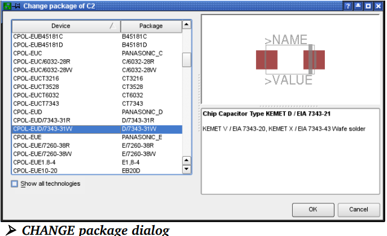

>If the Show all technologies option is active, the Package versions for all the technologies available for this Device are displayed. 
>If this option is not active you will only see Packages that are defined in the selected technology.
>The Package can also be exchanged from within the schematic diagram.
>Devices that don't have alternative Package variants defined, can be modified in the Library Editor. 
>Add further Package variants as needed and update your drawing with the new library definition. 
>See page 252 Choosing the Package Variants for further information.

如果选中了 Show all technologies 选项 ，则会显示该元件所有可用的制造工艺的Package 版本。
如果没有选中，则您只会看到当前所选工艺的 Package。
在原理图中也可以对 Package 进行替换。
只有一个 Package 变量的元件可以在元件库编辑器中对其进行修改。
根据需要来添加额外的 Package 变量并使用新的元件库定义来更新您的图库。
请参考第214 页《选择 Package 变量》章节以获得更多信息。

>If you change the Package variant of a Device which you gave a new value with the help of the VALUE command, although it has been defined with VALUE Off, the value will remain unchanged. See also page 83.
>If you would like to change the Package variant for several identical parts, you can do this in the command line.
>Define a GROUP with all parts that shall get a new Package variant, first.
>Now type in the command line
>CHANGE PACKAGE 'new-device-name'
>and click with Ctrl + right mouse button into the drawing.
>The name of the new Package variant has to be enclosed in inverted commas.

如果您在对某个元件的 Package 变量进行替换前用 VALUE 命令为该 Package 定义了一个值，则无论 VALUE 设置为 Off 还是 On，该值都保持不变。
请参考第74 页。
如果您想要修改多个相同元件的 Package 变量，您可以通过命令行来实现该功能。
首先定义一个包含了所有需要修改 Package 变量的元件的对象组。
请在命令框中输入
CHANGE PACKAGE 'new-device-name'
执行命令后再按住 Ctrl 键在对象组上单击鼠标右键。
新的 Package 变量名称应该使用引号。

#### 2. REPLACE command
##### 2.1 原理图和 pcb 设计保持一致
Consistent Schematic/Layout Pair

>The REPLACE command allows you to substitute one component with another. 
>The well­known ADD dialog window opens where you can select the new part. 
>Now click onto the part you want to have replaced in the Schematic or Layout. 
>The old and new Device must be compatible, which means that their used Gates and connected pins/pads must match, either by their names or their coordinates. 
>Otherwise the substitution is not possible.

REPLACE 命令可以让您用一个元件替换另一个元件。
执行命令后您就可以在与ADD 窗口相似的 REPLACE 对话框中选择新的元件。
确定后在原理图或者 PCB 设计图中左键单击您要替换的元件。
新旧元件必须兼容，即它们的 Gate 和引脚/焊盘必须相符，并且它们的名称或坐标也必须相同，否则替换无法完成。

##### 2.2 Layout without Schematic 
没有原理图只有 PCB 设计图的情况
>If you have a layout without an associated schematic diagram, you exchange the Package with the aid of the REPLACE command. REPLACE opens the window that is familiar from the ADD dialog, in which it is possible to search for Devices. 
>When the Package has been chosen you click on the part that is to be replaced in the layout.
>The REPLACE command operates in the Layout Editor in two ways, chosen with the SET command:
>SET REPLACE_SAME NAMES; (default)
>SET REPLACE_SAME COORDS;

>The first mode permits Packages whose pad or SMD names are identical to be exchanged. 
>The connecting areas can have any position.
>In the second case (replace_same coords) the pads or SMDs in the new Package must be located at the same coordinates (relative to the origin). 
>The names may differ.
>The text for the name and value of a Device is only exchanged if they have not been separated from the Device with SMASH.
>The new Package can come from a different library, and can contain additional pads and SMDs. 
>Connections on the old Package that were connected to signals must exist correspondingly in the new Package. 
>The new Package can even have fewer connections, provided that this condition is satisfied.

如果您只有一个 PCB 设计图而没有相应的原理图，您也可以通过 REPLACE 命令来替换 Package。
REPLACE 命令会打开一个与 ADD 命令相似的窗口，在其中您可以搜索元件。
当选定 Package 并确定后，您就可以在 PCB 设计图中左键单击需要替换的元件。
在 PCB 编辑器中 REPLACE 命令以两种方式工作，可通过 SET 命令进行选择：
SET REPLACE_SAME NAMES; （default）
SET REPLACE_SAME COORDS;

第一种方式允许替换 Pad 或 SMD 名称相同的 Package。
连接区域可以在任何位置。
第二种方式中采用新 Package 的 Pad 或 SMD 必须位于相同的坐标上（相对于原点）。
而其名称可以不同。
元件名称和值的文本只能在它们没有通过 SMASH 命令拆分出来的情况下才能替换。
新的 Package 可以来自于不同的元件库，并且可以包含额外的 Pad 和 SMD。
新 Package 必须和旧 Package 上与信号线路相连的连接兼容。
在情况允许时，也可以减少新 Package 上的连接数。

### 4.7 修改工艺
Changing the Technology
>It is possible to change the technology of a Device in the layout at any time , provided there are various technologies defined in the library. 
>Use the CHANGE command with the Technology option or the Technology command of the context menu (available by clicking onto the Package with the right mouse button). 
>This procedure is identical to the one described before in which Package forms are exchanged using PACKAGE.

如果在元件库中定义了多个 technology，则可以随时在 PCB 设计图中修改元件的 technology 参数。
可使用 CHANGE 命令并选择 Technology 选项或者在右键 弹 出 菜 单 中 选 择 Technology 命 令 来 实 现 该 操 作 （ 鼠 标 右 键 单 击 Package）。
该操作与之前描述的选择右键菜单中的 PACKAGE 选项过程相同。

### 4.8 定义禁止区域
Define Forbidden Areas
>Areas in the form of rectangles, polygons or circles in layers 41, tRestrict, and 42, bRestrict, are forbidden for the Autorouter/Follow­me router. 
>No copper objects may be drawn in the top or bottom layers inside these areas. 
>These regions are tested by the Design Rule Check and taken into consideration by the Autorouter/Follow­me router.
>Layer 43, vRestrict, is for drawing restricted areas where the Autorouter or the Follow­me router may not set vias. 
>Manually placed vias in such a vRestrict region are not examined by the DRC and therefore not reported as an error.

在第 41 层（tRestrict 层）和第 42 层（bRestrict 层）上的长方形、多边形或圆形区域禁止使用 Autorouter/Follow-me router 功能。
在这些区域中的顶层或底层上都不能绘制任何铜线。
这些区域由 DRC 功能进行检查，并且 Autorouter/Follow-me router 功能会将该区域考虑在内。
第 43 层（vRestrict 层）用于定义绘图限制区域，在这些区域中 Autorouter 或 Follow-me router 功能都不能放置过孔。
DRC 不会检查在限制区域内手动放置的过孔，因而不会报错。

### 4.9 手动布线
Routing – Placing Tracks Manually
>The ROUTE command allows the airwires to be converted into tracks. 
>A click on the middle mouse button while a track is being laid allows a change of layer.
>A via is placed automatically then. 
>Clicking with the right mouse button changes the way in which the track is attached to the mouse and how it is laid (SET command, Wire_Bend parameter). 
>Among them are modes which allow to use a wire as 90­-degree or as free­-definable arc.

ROUTE 命令可以将鼠线转换为铜线。
在放置铜线时单击鼠标中键可以改变层。
然后自动放置一个过孔。
单击右键可以改变走线的形状（SET 命令的 Wire_Bend 选项）。
其中包含 90 度的布线形状或者自定义的弯曲度。
>If your EAGLE license provides the Autorouter Module, two additional wire bends (Wire_Bend 8 and 9) are available that cause the ROUTE command to work as Follow-­me router. 
>The Follow­me router can route a selected airwire automatically. 
>The position of the mouse cursor determines the trace of the connection. 
>The settings of the Design Rules and the relevant Autorouter settings are taken into consideration.
>Please check the Autorouter chapter for more information about function and usage of the Follow­me router.

如果您的 EAGLE 版本提供了 Autorouter 功能，则可以使用额外的两种走线形状（Wire_Bend 8 和 9），这两种走线能够让 ROUTE 命令在 Follow-me router
模式下工作。
Follow-me router 模式可以对选中的鼠线进行自动布线。
由鼠标的位置来决定连接线路。
这时会将设计规则的设置和相关的 Autorouter 设置考虑在内。
请参考《Autorouter 自动布线器》章节以获得关于 Follow-me router 的功能和用法的更多信息。

>The signal's name and net class will be displayed in the status bar. 
>When a signal line has been completely laid, EAGLE confirms that there is a correct connection with a short beep as it is placed.
>The signal name can be used in the command line directly, for example ROUTE VCC. 
>EAGLE starts the wire at a signal's connection point which is nearest to the current mouse position.
>If you want to have the wire started at a via, press the Ctrl key and click onto the via.
>If there is no longer enough room for routing a signal, other tracks can be relocated with MOVE and SPLIT, or the properties of tracks (width, layer) can be modified with CHANGE.
>SPLIT can be used to re­route already existing tracks, if necessary, arrange segment for segment of the wire anew and remove the present track with the commands Ctrl + DELETE and/or RIPUP.

信号线路的名称和网络簇会显示在状态栏中。
当某个信号线路完成连接时，EAGLE 会发出短暂的鸣叫声来提示连接正确。
信号线路的名称可以直接在命令行中指定，例如 ROUTE VCC。
EAGLE 会从离当前鼠标位置最近的信号连接点开始布线。
如果您想让布线从某个过孔via开始，请在route 命令下按住 Ctrl 键并左键单击该过孔。
如果没有布线空间，可以通过 MOVE 和 SPLIT 命令转移其他线路的位置，或者通过CHANGE 命令修改线路的属性（线宽、层数）。
SPLIT 命令可用于重新布置已经布线的线路，在必要的情况下可以对线路的某一段重新布线并且用 Ctrl + DELETE 命令和/或 RIPUP 命令来删除当前的线路。

>If a plated­through hole (a via) is to be placed at a certain point, this can be done with the VIA command. 
>Use the NAME command to assign the via with the signal it should be connected to.

如果要将某个金属镀孔（过孔）放置在某一点上，则可以通过 VIA 命令实现。
然后使用 NAME 命令来将 VIA 分配给需要连接的线路 ( 改名后，该 via 会自动通过鼠线与相应的信号线进行连接。)。
>If you want to begin a wire of a partially routed signal at another position than the start or end point of an airwire (for example, at a farther position on a wire that belongs to the same signal), press the Ctrl key and and click the left mouse button at the position where the wire should begin. 
>EAGLE generates a new airwire from this position then (see also help function for ROUTE).

如果您想要在一条已布线信号线路上的鼠线开始或结束点以外的点上绘制一条线路（例如，在属于相同信号线路的某条线路上的某一位置点上），请按住Ctrl 键并在您希望线路开始的地方单击鼠标左键。
EAGLE 将会从该位置上生成一条新的鼠线。(see also help function for ROUTE).

>Airwires with length of 0 (for example, from Top to Bottom layer) are drawn as a cross in layer 19, Unrouted.

长度为 0（例如从顶层到底层的垂直鼠线）的鼠线在第 19 层（Untrouted 层
）上表示为一个交叉线。

>Ending a wire at the same position where another wire of the same signal but in another layer already exists and pressing the Shift key at the same time causes EAGLE to place a via. 
>Otherwise it won't. 

在相同信号线路上布线的终止点同时属于两条不同层的线路时并且按下 Shift 键的情况下，EAGLE 会放置一个过孔。
否则将不会产生过孔。

>If you intend to design a multilayer board and use Blind and Buried or Micro vias, please note the details (also for the VIA command) in the section about Multilayer Boards beginning at page 172.

如果您要设计一个多层电路板并使用盲孔和埋孔或者微型过孔，请参考第 145 页上的多层电路板章节中的详细信息（同时涵盖了 VIA 命令）。
>While laying out wires EAGLE calculates the shortest connection to the closest point of the current signal automatically. 
>This connection is represented by an airwire.

在布线时 EAGLE 自动计算离当前信号线路最近连接点的最短连接。
该连接用鼠线表示。(布线过程中，会自动计算到连接点的最短剩余鼠线)
>Pads and SMDs that belong to the currently routed signal have the so­called magnetic­pads function:
>Within a certain radius around the pad the wire will be snapped to the pad's center automatically. 
>That is to say as soon as the length of the automatically calculated airwire is shorter than the given value for snap length, the wire jumps into the pad's or SMD's center point. 
>It doesn't matter whether the pad or SMD is exactly loacted at the currently used grid. 
>The snap point is always the center point.
>As soon as you move the mouse cursor away from this pad beyond the limits, the airwire will be shown and the wire to be routed follows the mouse again.
>The snap length can be defined in the menu Options/Set/Misc. 
>Default value is 20 mil.

属于当前已布线信号线路的 Pad 和 SMD 具有磁性焊盘的功能：
处于 Pad 特定半径之内的线路会自动吸附到该 Pad 的中心位置。
也就是说只要自动计算的鼠线长度小于 snap length（吸附范围）的给定值，则线路会吸附到 Pad 或 SMD 的中心点。
Pad 或 SMD 是否真正位于当前栅格并不会影响该功能。
吸附点始终是其中心点。
当您移动鼠标并且超出该 Pad 的距离限制时，
将会再次显示鼠线并且布线线路会再次吸附到鼠标上。
Snap length 捕获长度 可以在选项/设置/杂项菜单中进行设置。
默认为 20mil。

>As the routing proceeds it is helpful to run the RATSNEST command frequently, in order to recalculate all the airwires.

在布线过程中为了重新计算所有的鼠线而经常执行 RATSNEST 命令对设计工作很有帮助。
>For more complex boards it may be useful to adjust the Snap Length in the Options/Set/Misc menu as described on page 111.

对于更为复杂的电路板来说，根据第 99 页上的描述对选项/设置/杂项菜单中的 Snap Length 进行调整能够对设计提供帮助。
>Use RIPUP if you want to convert the whole or part of a track or a via that has been laid back to a signal line. 
>By clicking on a track it is decomposed between the nearest bends. 
>If you click on this location again (on the airwire), the whole signal branch back to the nearest pads is decomposed. 
>If you want to undo the whole of the signal, click RIPUP and enter the name of the signal on the command line. 
>More than one may be entered at the same time.
>The command
>RIPUP GND VCC +5V
>converts the three signals GND, VCC and +5V back to airwires.
>RIPUP ! GND VCC
>on the other hand converts all signals apart from GND and VCC to airwires.
>RIPUP ;
>converts all signals (that are visible in the editor) into airwires. 
>To truly include every track, all the layers in which tracks have been drawn must be visible (DISPLAY).

如果您想要修改已经布线的线路整体或其中一部分或者某个过孔，请使用RIPUP 命令。
在执行该命令后左键单击某段线路可以取消最近转折点之间的线路。
如果您再次单击相同的位置（单击鼠线），则会取消最近两个 Pad 之间的布线。
如果您想要取消整个信号线路的布线，请单击 RIPUP 命令图标并在命令框中输入线路名称。
可同时输入多个名称。
命令格式如下：
RIPUP GND VCC +5V
将 GND，VCC 和+5V 三条信号线路恢复为鼠线。
RIPUP ! GND VCC
该命令将除了 GND 和 VCC 以外的所有信号线路恢复为鼠线。
RIPUP ;
该命令将所有信号线路（在编辑器中的可见线路）恢复为鼠线。
如果要完全包含所有的线路，则需要显示所有层上绘制的线路（DISPLAY 命令）。
>If you want to use wires as arcs or try to smooth the wire bends see the hints concerning the MITER command in the help function. 
>The miter radius determines how the wire joints are mitered. 
>A positive value generates a rounding, a negative one a straight line. 
>The miter radius influences some bend modi (0, 1, 3, 4; see SET command) and is shown additionally in the parameter toolbar of the commands SPLIT, ROUTE, WIRE, and POLYGON.
>While WIRE or ROUTE is active it is possible to click through the previously mentioned wire bends (bend modes) with the right mouse button. 
>EAGLE knows ten different modes (0..9) which are shown as icons in the parameter toolbar. 
>Mode 8 and 9 are special modes for the Follow­me router. 
>They are not available, if your license doesn't support the Autorouter module.
>Holding down the Shift key while clicking the right mouse button reverses the direction of selection.
>Holding down the Ctrl key allows to toggle between complementary wire bends.
>If you want to have only some wire bends available for the right mouse button, you can define this, for example, in the eagle.scr file.
>Supposed you want to work with wire bends number 2, 5, 6, and 7 use the following syntax:
>SET WIRE_BEND @ 2 5 6 7 ;
>However, if you want to use another bend mode you can always chose it from the parameter toolbar.

如果您要使用弧形线或者使线路转角平滑，请参考帮助页面中有关 MITER 命令的提示信息。
转角半径决定了线路接点的平滑程度。
正值表示圆弧，负值则表示斜线转角。
转角半径会影响线路弯折的方式（0，1，3，4；参考 SET 命令）并且会显示在 SPLIT，ROUTE，WIRE 和 POLYGON 命令相应的参数栏中。
在执行了 WIRE 或者 ROUTE 后可以通过单击鼠标右键来在之前提到的线路转角方式之间进行切换（转角模式）。
EAGLE 包含了 10 种不同的模式（0 到 9），以图表的形式显示在参数栏中。
第 8 和第 9 种模式是针对 Follow-me router功能的特殊模式。
如果您的软件版本不支持 Autorouter 功能，则无法使用这两种模式。
按住 Shift 键的同时单击鼠标右键可以改变模式切换的方向。
按住 Ctrl 键的同时单击鼠标右键可以在两个相反的转角之间切换。
如果您希望鼠标右键只支持部分线路转角功能，您可以在 EAGLE.scr 文件中进行定义。
比如您只需要使用第 2，5，6 和 7 号转角功能，可以在文件中加入以下命令：
SET WIRE_BEND @ 2 5 6 7 ;
但在您需要使用其他的转角模式的时候，也可以从参数栏中进行选择。

>! It is also possible to leave the track laying to the Autorouter which has its own chapter in this manual.
>Laying tracks with the Follow­me router is explained in a subsection of the Autorouter chapter.

也可以将布线工作交给 Autorouter 功能来完成，在本手册中有专门介绍。
使用 Follow-me router 功能来布线的方法位于 Autorouter 章节中。

### 4.10 BGA扇出布线
针对 BGA 元件的扇出布线有一个非常方便的 ULP 程序 route-bga.ulp。
该程序可以用线路连接所有的 BGA 信号（或每个触点）并扇出到 BGA 区域外。
这样您就可以继续进行手动布线或者通过自动布线器来完成余下的布线工作。
该 ULP 程序提供了一种 bone 技术将过孔位置定位在 BGA 焊盘之间，或者您也可以选择 stacked micro vias 模式，即将过孔与 BGA 焊盘重合在一起。
在执行该 ULP 程序前您需要指定 BGA 元件的名称，因此需要在 PCB 编辑器的命令框中进行指定，例如：
RUN route-bga IC5

### 4.11 POLYGON 定义敷铜层
Defining a Copper Plane with POLYGON
>EAGLE can fill regions of a board with copper. 
>Simply draw the borders of the area with the POLYGON command. 
>The polygon is displayed as a dotted line in the outline mode. 
>You give the polygon a signal name, using NAME followed by a click onto the border of the polygon. 
>Then all the objects that carry this signal are connected to the polygon. 
>Both pads and, optionally, vias (as specified in the Design Rules) are joined to the copper plane through Thermal symbols. 
>Elements not carrying this signal are kept at a specified distance.

EAGLE 可以对电路板上的区域进行敷铜。
该区域只需要用 POLYGON 命令绘制出其轮廓即可。
所绘制的多边形以点状线的形式显示出一个外框。
您可以使用 NAME 命令并左键单击多边形的轮廓来定义一个信号名称，这样所有包含该信号的对象都会与该多边形发生关联。
所有 Pad 或可选过孔（由设计规则规定）都通过 Thermal 符号连接到该敷铜层上。
与该信号无关的对象则与其保持特定的距离。
>RATSNEST calculates and displays the surface area of all polygons in the layout. 
>If you call RATSNEST with a signalname, for example
>RATSNEST GND ;
>only the GND polygon(s) will be calculated. 
>All other polygons in the layout will remain unchanged in the outline mode.

RATSNEST 负责计算和显示 PCB 电路板中所有多边形的表层区域。
如果您对某个信号名称执行 RATSNEST 命令，例如
RATSNEST GND ;
则只有 GND 多边形会进行计算。
PCB 电路板中的其他多边形将保持外框轮廓的形式不变。
>RIPUP, followed by a click on the polygon border, makes the content invisible again. 
>If there are several polygons in your layout, and you want to have them displayed in the outline mode again, type in the command line:
>RIPUP @ ;
>To have all polygons of a particular signal switched to outline mode, specify the signal name, like
>RIPUP @ GND ;
>More information about the syntax can be found in the help about RIPUP.

执行 RIPUP 命令后左键单击多边形的轮廓将会清除敷铜。
如果在 PCB 设计图中有多个多边形，并且您希望它们都以外框轮廓形式显示，请输入命令行：
RIPUP @ ;
要将某个特定信号的所有多边形转换为外框轮廓形式，请指定信号名称，比如
RIPUP @ GND ;
在帮助页面中可以找到关于 RIPUP 命令语法的更多信息。
>The content of the polygon is not saved in the board file. 
>When you first load the file, you will only see the dotted outline of the polygon. It is only calculated and displayed again by RATSNEST.
>Various options can be changed via the parameter toolbar, either as the polygon is being drawn or, with CHANGE, at a later stage.

多边形中的内容不会保存在电路板文件中。
当您第一次载入文件时，您将只能看到点状线形成的多边形。
需要通过 RATSNEST 命令才能再次计算并显示出来。
您可以在绘制多边形时通过参数工具栏来修改各种选项，也可以在绘制完成后通过CHANGE 命令来修改各个参数。
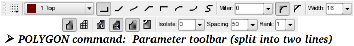

#### 1. Width 线宽:
>Line thickness厚度 with which the polygon is drawn. 
>Select the largest possible width. 
>That avoids避开 unnecessary quantities量 of data when the board is sent for manufacture. 
>If the wire width is lower than the resolution分辨率 of the output driver in the CAM Processor, a warning is issued.
>A finer line width permits the polygon to have a more complex shape.

多边形敷铜区的线宽。
请选择尽可能粗的线宽，
这样能够避免 PCB 设计产生用于生产时的不必要的数据量。
如果线宽小于 CAM 处理程序输出驱动的分辨率，则会弹出警告信息。
线宽越细则可以实现越复杂的多边形敷铜区。

#### 2. Pour 敷铜:
>Specifies the filling type: the whole area (Solid) or a grid (Hatch).
>The special type Cutout can be used to define polygons that get subtracted from all other signal polygons within the same layer. 
>Suitable for cut­outs (restricted areas) in polygons in inner signal layers.

指定敷铜类型：即实心填充（Solid）或者栅格填充（Hatch）。
Cutout 这种特殊的填充类型用于定义一种特殊多边形敷铜区域。
这种填充类型能够对同一层中的其他信号多边形进行裁剪。
适用于内部信号层中对多边形的裁剪（即留出限制区域）。

#### 3. Rank 等级:
>Overlapping polygons must not create any short­circuits. 
>Rank can therefore be used to determine which polygons are to be subtracted from others. 
>A polygon with rank = 1 has the highest priority in the Layout Editor, no other polygon drawn in the layout is ever subtracted from it, while one with rank = 6 has the lowest priority. 
>As soon as there is an overlap with a higher rank, the appropriate area is cut out from the polygon with rank = 6.
>Polygons with the same rank are compared by the DRC. 
>The rank property works only for polygons with different signals. For overlapping polygons with the same signal name it is without effect. 
>They will be drawn one over the other.
>Polygons that are created in the Package Editor and not assigned to a signal, will be subtracted from all other polygons. 
>There is no rank parameter available.

多边形敷铜区重叠不能产生任何短路。
而 Rank 则能够用于判断需要根据其他多边形敷铜区而进行裁剪。
等级为 1 的多边形敷铜区在 PCB 编辑器中具有最高的优先级，即 PCB 设计图中其他多边形敷铜区不会对该多边敷铜区形造成任何覆盖。
而等级为 6 的多边形具有最低的优先级，当等级较高的多边形与其发生重叠时，等级为 6 的多边形敷铜区的相应区域则会被覆盖掉。
具有相同等级的多边形敷铜区则由 DRC 进行比较。
等级属性只有在不同信号的多边形敷铜区域之间才有效。
具有相同信号名称的多边形敷铜区重叠时等级属性无效，它们将会相互融合在一起。
在封装编辑器中定义的未分配信号名称的多边形会对所有其他多边形进行裁剪。
在这里不存在等级属性的问题。

#### 4. Spacing 间距:
>If the option Hatch is chosen for Pour, this value determines the spacing of the grid lines.

如果敷铜类型选择为 Hatch，则该值决定了栅格线的间距。

#### 5. Isolate 隔离:
>Defines the value that the polygon must maintain with respect to all other copper objects not part of its signal and objects in Dimension, tRestrict or bRestrict layer. 
>If higher values are defined for special signals in the Design Rules or net classes, the higher values apply.
>In the case of polygons with different Ranks, Isolate always refers to the drawn contour which is shown in the outline mode of the polygon, even if the calculated polygon has got another contour, for example, due to a wire that supersedes the polygon. 
>The actual clearance can become greater than the given Isolate value.

定义多边形敷铜区与所有其他不同信号的对象之间需要保持的距离。
如果在设计规则或网络簇中对特殊的对象规定了较高的值，则会在需要时采用该值。
在多边形敷铜区具有不同等级的情况下，Isolate 始终针对的是以外框轮廓形式显示的多边形敷铜区，即使所计算出的多边形敷铜区具有另一个不同的轮廓，例如由于线路超出多边形敷铜区而产生的轮廓。
实际的间距可能比规定的 Isolate 值更大。
#### 6. Thermals 热焊盘:
>Determines whether pads in the polygon are connected via Thermal symbols, or are completely connected to the copper plane. 
>This also applies to vias, assuming that the option has been activated in the Design Rules.
>The width of the thermal connectors is calculated as the half of the pad's drill diameter. 
>The width has to be in the limits of a minimum of the wire width and a maximum of twice the wire width of the polygon.
>The length of the thermal connectors is defined by the Thermal isolation value in the Design Rules' Supply tab.

用于决定多边形敷铜区中的 Pad 通过 Thermal 符号进行连接还是完全连接到敷铜层上。
如果该选项包含在设计规则中，则其也用于过孔 via 上。
热焊盘连接线的宽度是 Pad 孔直径的一半。
该宽度最小为多边形敷铜区线宽，最大为多边形敷铜区线宽的两倍。
通过设计规则窗口中的 Supply 标签下的 Thermal 项 Isolate 值可以对热焊盘连接线的长度进行定义。

>! Don't choose the polygon's width too fine, otherwise the thermal connectors won't handle the current load.
>This is also true for bottlenecks in the board! 
>The polygon's wire width determines the smallest possible width of the copper area.

请不要选择过细的多边形敷铜区线宽，否则 Thermal 连线无法承受电流负载。
在电路板中，这是真正的瓶颈！
因为多边形敷铜区的线宽决定了敷铜区的最小可能宽度。

#### 7. Orphans 孤岛:
>Determines if a polygon may contain areas (islands) which are not electrically connected to the polygon's signal.
>If Orphans is set Off such un­connected areas won't be drawn.

用于决定某个多边形敷铜区是否包含与该多边形敷铜区信号层没有任何电气连接的区域（孤岛）。
如果 Orphan 设置为 Off，则不会绘制该区域。
>! When drawing a polygon, please take care to ensure that the outline is not drawn more than once (overlapping) anywhere, and that the polygon outline does not cross over itself. 
>It is not possible for EAGLE to compute the contents of the area in this case.
>An error message 'Signalname contains an invalid polygon!' is issued,and the RATSNEST command is aborted.
>If this message appears, the outline of the polygon must be corrected.
>Otherwise, manufacturing data cannot be created by the CAM Processor.
>The CAM Processor automatically computes the polygons in the layout before generating its output.
>If the polygon stays in the outline mode after calculating it with RATSNEST, you should check the parameters for width, isolate, and orphans and the polygon's name. 
>Probably the polygon's filling is not able to reach one of the objects that should be connected with its signal.
>Renaming a polygon with the NAME command, connects it with another signal!

在绘制多边形敷铜区时，请确保外框在任何位置上都没有重复绘制的情况（重叠），并且多边形外框自身没有交叉的情况。
因为在这种情 况下EAGLE 无法对多边形敷铜区内部进行计算。
如果 存 在 上 述 情 况 则会弹 出 错 误 信 息“ Signalname contains an invalid polygon！”，并且 RATSNEST 命令会终止执行。
如果出现该提示信息，则需要修改多边形敷铜区的外框。
否则就无法通过 CAM 处理程序生成制造数据。
CAM 处理程序会在输出数据前自动对 PCB 设计图中的多边形敷铜区进行计算。

如果在 RATSNEST 命令计算后该多边形敷铜区仍然保持外框轮廓的形式 ，则您需要检查线宽、隔离、以及孤岛和多边形名称等参数。
有可能多边形敷铜无法对应该连接到其信号线路的其中一个对象进行。

通过 NAME 命令重新命名多边形敷铜区，并将其与另一个信号线路连接！

## 5. DRC – 检查 PCB 设计并纠正错误
DRC – Checking the Layout and Correcting Errors

>The Design Rule Check (DRC) is carried out at the end of the board design, if not before. 
>If you have not yet specified any Design Rules for the layout, this is your last opportunity. 
>See the section on Specifying the Design Rules from page 144. 
>To start the Design Rule Check click onto the DRC icon in the command toolbar or the entry DRC... in the menu Tools.

如果没有在 PCB 设计完成前进行设计规则检查（DRC），则需要在完成后进行检查。
如果您还没有为 PCB 设计指定任何设计规则，那么现在您可以开始定义了。
请参考第 121 页的设计规则检查章节。
要启动设计规则检查请左键单击命令工具栏中的 DRC 图标或者选择工具菜单中的 DRC 选项。
>! Usually one sets the common Design Rules with the Edit/Design Rules.. menu first and starts the Design Rule Check when required with the DRC command. 
>But it is also possible to adjust the Design Rules if you use the DRC command. 
>Some settings, like those for Restring, affect the layout directly.

通常是首先通过编辑/设计规则..菜单对一般的设计规则进行设置，然后在需要时使用 DRC 命令来启动设计规则检查功能。
但也可以用 DRC 命令来调整设计规则。
诸如针对 Restring 的某些设定会直接影响 PCB 设计图。
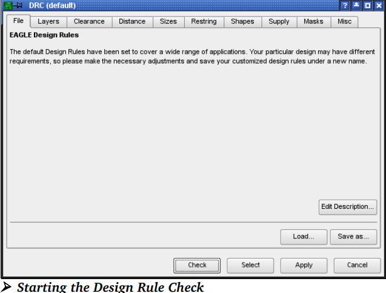
启动设计规则检查

>When you have finished the adjustments, start the error check by clicking Check.
>At the same time the Design Rules are stored in the board file itself. 
>By clicking Select you specify the region of the layout that is to be examined.
>Simply drag a rectangle over the desired region with the mouse. 
>The error check will then star automatically.
>Clicking on Apply transfers the settings to the board file. 
>This means that the values that have so far been chosen are not lost if you do not immediately start the error check and if you want to leave the DRC dialog via the Cancel button.

当您完成规则调整后，请单击 Check 按钮来启动错误检查。
同时设计规则保存在该电路板文件中。
通过左键单击 Select 您可以指定 PCB 设计图需要检查的区域。
这时只需要在需要检查的区域上用鼠标拉出一个长方形即可。
然后错误检查将自动运行。
单击 Apply 应用按钮来将设定保存在电路板文件中。
这样即便您没有立即启动错误检查并且您用 Cancel 按钮退出了 DRC 对话框，所配置的值也不会丢失。
>!All signal layers are always examined by the Design Rule Check, no matter if visible or not (DISPLAY command).

所有的信号层不论是否可见（DISPLAY 命令），都会由设计规则进行检查。

### 5.1 The DRC Errors Window
DRC 错误提示窗口
>If the Design Rule Check finds errors, an error window opens automatically.
>It lists all the errors found. 
>The window can be opened at any time by means of the ERRORS command.

如果涉及规则检查功能发现错误，则会自动弹出错误提示窗口。
它会列出所发现的所有错误。
该窗口可以在任何时候通过 ERRORS 命令打开。
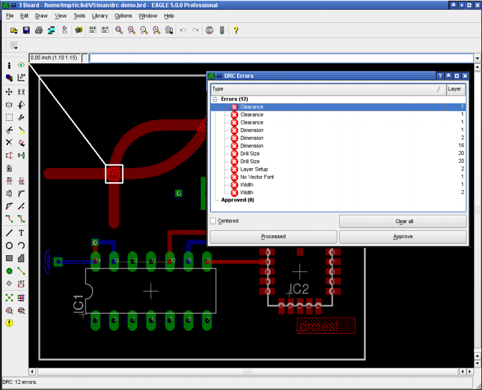
➢ DRC Errors list in the Layout Editor
PCB 编辑器中的 DRC 错误提示列表

>Each error is marked with an error polygon. Its size tells you, for example in the case of a clearance error, about how much the limit is exceeded. 
>The error polygons are visible in the Layout Editor, only. 
>They won't be printed nor exported with the CAM Processor. It's not possible to erase them with the DELETE command. 
>Click the Clear all button to delete them. 
>Or type in the command line:
>ERRORS CLEAR
>Errors are marked with a red icon in the errors window. If an error in the list is selected, a line points to the corresponding location in the board.
>It is possible to have the error list sorted, ascending or descending, by error types or layer numbers. therefore click onto the column headers Type or Layer.

每个错误都通过一个错误标记框进行标注，例如在间隙错误中，该标记框的尺寸会告诉您超过规定的数量。
错误编辑框只出现在 PCB 编辑器中。
它们不会被 CAM 处理程序打印或输出。
用 DELETE 命令无法删除标记框，而是左键单击 clear all 按钮来删除。
或者可以在命令框中输入：
ERRORS CLEAR
错误提示窗口中的每个错误都用一个红色图标标记出来。
如果选中错误列表中的某个错误，在 PCB 设计图中将会出现一条直线指向相应的位置。
通过左键单击错误提示窗口顶部的 Type类型 或 Layer层，可以按照错误类型或者层数将错误列表顺序或倒序排列。
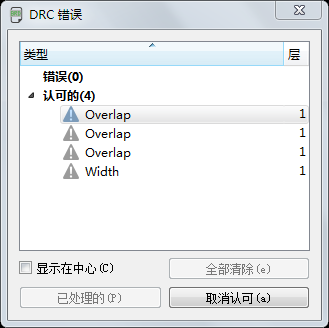

>!The errors dialog shows only errors that occur in the currently displayed layers.
>错误提示窗口仅显示当前可见层中的错误。

>In case you zoomed into the drawing and there is only a partial view of the board, you can click the option Centered. 
>The currently selected error is shown in the middle of the drawing window now. 
>If you prefer to have the Centered option deactivated for browsing the error list, you are nevertheless able to center an error in the middle of the drawing area by pressing the Enter key.
>While correcting the error on the board, the DRC Errors window may remain opened. 
>After correcting one error you can mark it as Processed in the error list by clicking onto the Processed button. 
>The red error icon turns gray now. 

如果您放大了绘图并且只能看到电路板的一部分，您可以左键单击错误提示窗口中的 Centered 显示在中心选项，则当前选中的错误会显示在绘图窗口的中央位置。
如果您没有选中 Centered 选项，也可以通过按下 Enter 键来实现在中央显示错误标记。(选中错误标记后，接着按下 enter)
当在电路板上纠正错误时可以暂时不关闭 DRC 错误提示窗口。
在纠正某个错误后您可以通过左键单击错误提示窗口上的 Processed 按钮来将该错误在错误列表中标记为 Processed。
这时红色错误图标变为灰色。(但仍然显示在错误列表中，下次执行 DRC 检查时，若错误任然存在，则图标保持红色 )
>In some situations it may be the case that you want to tolerate an error. 
>Use the Approve button for this. 
>The error entry will be removed from the Errors branch and appear in the Approved branch and the error polygon is no longer shown in the Layout Editor.
>If you want to treat an already approved error as a quite normal error, select it in the Approved branch, and click onto the Disapprove button. 
>Now it is a member of the Errors branch again.
>Clicking the Clear all button does not delete approved errors. 
>They remain in the Approved branch.
>Moving an entry from one branch into the other, marks the board file as changed and not saved.
>In some cases it might be useful to approve all errors that are shown. 
>To do so, select the superior Errors entry in the errors list. 
>Now the Approve button will be named Approve all. 
>Click it in order to have all errors moved into the Approved list. 
>This is also feasible the other way round for disapproving all errors.

在某些情况下您可能要忽略某个错误，这时可以单击 Approve 认可按钮来实现。
该错误项将从 Errors 目录中删除并显示在 Approved 目录中，并且在 PCB 编辑器中不会再显示该错误的标记框。
如果您想将某个被忽略的错误重新标记为错误项，请在 Approved 目录中选中它，然后左键单击 Disapprove 按钮，这样该错误项会再次显示在 Errors 目录中。
单击 Clear all 按钮不会删除被忽略的错误。
它们仍然会显示在 Approved 目录中。
将一个错误信息框中某一分支下一项移动到另一分支中时，电路板文件被标记为已修改但并未保存。
在某些情况下可能需要对所有的错误进行认可。
这时可以选中错误列表的树形标题 Errors，下方的认可（Approve）按钮会变成“全部认可”。
单击该按钮就可以将所有错误移动到已认可（Approved）列表中。
对于将所有错误恢复不认可状态，也可以通过相似的操作来实现。

### 5.2 错误信息及含义
Error Messages and their Meaning

#### 1. Angle:角度
>Tracks are not laid in an angle of 0, 45, 90 or 135°. 
>This check can be switched on or off in the Design Rules (Misc tab).
>Default: off.

线路夹角不符合 0，45，90 或 135 度。
在设计规则（Misc 标签）中可以开启或关闭该检查项目。
默认：关闭。

#### 2. Blind Via Ratio: 盲孔比率
>The limit of the ratio of via length (depth) to drill diameter is exceeded超过. 
>In this case you have to adjust the via's drill diameter (Design Rules, Sizes tab) or the layer thickness of your board (Design Rules, Layers tab).

超出了孔长度（深度）与孔直径的比率限制。
这时您需要调整孔直径（设计规则/Sizes 标签）或者电路板的层厚度（设计规则/Layers 标签）。
#### 3. Clearance:间距
>Clearance violation between copper objects. 
>The settings of the Design Rules' Clearance tab and the value for Clearance of a given net class are taken into consideration. 
>Of these two values the higher one is taken for checking.
>In addition the Isolate value will be taken into consideration for polygons with the same rank and polygons which are defined as a part of a Package.
>To deactivate the clearance check between objects that belong to the same signal, use the value 0 for Same signals in the Clearance tab.
>Micro Vias are treated like wires. 
>The clearance value for wire to wire applies in this case. 

在铜质对象之间存在间距错误。
设计规则中 Clearance 标签中的设置和针对某个特定网络簇的间距的值都可以用于检查。两个值中较大的值会得到采用作为检查依据。
另外 Isolate 隔离值也应用于具有相同等级的多边形敷铜区以及作为某个 Package 一部分而定义的多边形敷铜区上。
要禁止对相同信号线路上的对象进行间距检查，请在 Clearance 标签下将 Same signals 的值设置为 0.
对于线路与线路之间的间距值设置也适用于（Micro Via）微型过孔。

#### 4. Dimension: 轮廓
>Distance violation between SMDs, pads, and connected copper objects and a dimension line (drawn in Layer 20, Dimension), like the board's outlines.
>Defined through the value for Copper/Dimension in the Design Rules' Distance tab.
>Setting the value Copper/Dimension to 0 deactivates this check.
>In this case polygons do not keep a minimum distance to objects in layer 20, Dimension, and holes! 
>The DRC will not check if holes are placed on tracks then!

表示轮廓线，即电路板外框，与 SMD、Pad 以及相互连接的铜质对象之间存在距离错误。
可以在设计规则窗口 Distance 标签下的 Copper/Dimension 项中设置。
将 Copper/Dimension 项设置为 0 表示关闭该检查功能。
这时多边形敷铜区与第 20 层（Dimension 层）中的对象以及孔之间不受到最短距离的限制！
如果孔被放置在外框线上，DRC 也不会进行检查！

#### 5. Drill Distance:钻孔间距
>Distance violation between holes. 
>Defined by the value Drill/Hole in the Design Rules (Distance tab).

在孔与孔之间存在距离错误。
可以在设计规则窗口（Distance 标签）下的 Drill/Hole 项中设置。

#### 6. Drill Size: 孔尺寸
>Drill diameter violation in pads, vias, and holes. This value is defined in the Design Rules' Sizes tab, Minimum Drill.
>It is also possible to define a special drill diameter for vias in a given net class (CLASS command, Drills). 
>In this case the higher one is used for the check.

在焊盘，金属镀孔和安装孔上存在孔直径错误。
该值可以在设计规则窗口Size 标签中的 Minimum Drill 项中进行设置。
在特定的网络簇中也可以为过孔定义一个特殊的孔直径（执行 CLASS 命令后设置 Drills 项）。
这时较大的值会作为检查依据。

#### 7. Invalid Polygon: 无效多边形
>Reason is a not properly drawn polygon contour. 
>As soon as the contour lines are overlapping or even crossing, the polygon can't be calculated correctly. 
>Change the polygon's contour in the Layout Editor or in the Library, if it is part of a Package.
>The RATSNEST command shows this error message, as well.

造成该错误信息的原因是没有正确绘制多边形轮廓。
如果轮廓线相互重叠或者交叉，将无法对多边形进行正确的计算。
请在 PCB 编辑器中修改多边形的外框，或者如果该多边形是某个 Package 的一部分，请在元件库中对其进行修改。
执行 RATSNEST 命令后也会显示该错误信息。

#### 8. Keepout: 隔离区
>Restricted areas for components drawn in layer 39, tKeepout, or 40, bKeepout, lie one upon another. 
>This check is executed only if layers 39 and 40 are displayed and if the keepout areas are already defined in the Package Editor of the library.

在第 39 层（tKeepout 层）或第 40 层（bKeepout 层）上禁止元件重叠的限制区域。
只有当显示了第 39 层和第 40 层并且已经在 Package 编辑器中对限制区域进行定义后才能执行该检查功能。
#### 9. Layer Abuse: 滥用层
>Layer 17, Pads, or 18, Vias, contain objects which are not automatically generated by EAGLE. 
>Probably you drew something manually in these layers, although they are reserved for pads and vias. 
>Better move such objects into another layer.

该信息是指第 17 层（Pads 层），或者第 18 层（Vias 层）中包含了不是EAGLE 自动生成的对象，因为尽管这两层是焊盘和过孔专用层，但您可能还是在这些层上手动绘制了某些对象。
建议将手动绘制的对象移动到另一层上。

#### 10. Layer Setup: 层设置
>This error is shown if an object in a layer is found that is not defined by the Layer setup. 
>The same for vias that do not follow the settings of the Layer setup, for example, if a via has an illegal length (Blind/Buried vias).

如果发现在某层上的某个对象不符合层设置的定义则会显示该错误信息。
对于不符合层设置的过孔也同样有效，例如某个过孔（盲孔/埋孔）的长度不符合要求的情况。
#### 11. Micro Via Size: 微型过孔尺寸
>The drill diameter of the micro via is smaller than the value given for Min. Micro Via in the Sizes tab.

微型过孔的直径小于 Sizes 标签下 Min.Micro Via 设置值限制.

#### 12. No Vector Font: 非矢量字体：
>The font check (Design Rules, Misc tab) recognizes text in a signal layer which is not written in EAGLE's internal vector font.
>If you want to generate manufacturing data with the help of the CAM Processor the texts, at least in the signal layers, ought to be written in vector font. 
>This is the only font the CAM Processor can work with. 
>Otherwise the board will not look the same as it is shown. 
>Change the font with the help of the command CHANGE FONT or use the option Always vector font in the Layout Editor's Options/User Interface menu:
>If activated, the Layout Editor shows all texts in vector font. 
>This is the way the manufactured board will look like.
>Activating the sub­option Persistent in this drawing saves the setting in the drawing file. 
>If you send the layout file, for example, to the board house you can be sure that the vector font will be displayed also at his system.

字体检查功能（设计规则窗口 Misc 标签）在信号层中发现不是用 EAGLE 内嵌的矢量字体输入的文本。
如果您想通过 CAM 处理程序输出制造数据，则至少信号层中的文本应该使用矢量字体。
这是 CAM 处理程序唯一能够支持的字体。
否则电路板将与显示的效果有所差异。
可通过 CHANGE FONT 命令或者在 PCB 编辑器的选项/用户界面菜单中选中始终使用矢量字体选项来修改字体。
如果选中了始终“使用矢量字体”选项，则 PCB 编辑器中所有的文本都使用矢量字体。
这时电路板与显示效果就不会存在差异。
如果选中“在本图中一直使用”子选项，则设置会保存在绘图文件中。
这样当您将 PCB 设计文件发送给电路板工厂时就能够确保在工厂中也能用矢量字体进
行显示。
#### 13. No real vector font:非法矢量字体
>The font check (Design Rules, Misc tab) recognizes text in a signal layer which is not written in EAGLE's internal vector font although it is displayed as vector font in the Layout Editor window. 
>This situation arises if the option Always vector font in the menu Options/User Interface is active. 
>See error message No vector font for further details.

字体检查功能（设计规则窗口 Misc 标签）在信号层中发现不是用 EAGLE 内嵌的矢量字体输入的文本，尽管该文本在 PCB 编辑器中显示为矢量字体。
在选项/用户界面菜单中的始终使用矢量字体选项被选中时才有可能显示该错误信息。
请参考 No vector font(非矢量字体）错误信息的解释以获得更多信息。

#### 14. Off Grid: 偏离栅格
>The object does not fit onto the currently chosen grid.
>This check can be switched on or off in the Design Rules' Misc tab. 
>The default setting is off, because as soon as trough­hole and surface­mount parts are used together it's not easily possible to find a reasonable common grid. 
>The check is set off by default.

对象没有按照当前栅格放置放置。
该检查功能可以在设计规则窗口中的 Misc 标签下启用或禁用。
由于在过孔和表面贴装元件同时使用的情况下不容易实现公用栅格，因此该检查功能默认为禁用。
#### 15. Overlap: 重叠
>DRC reports this error as soon as two copper elements with different signals touch each other.

当两个属于不同信号线路的铜质对象相互接触时 DRC 会显示该错误信息。
#### 16. Restrict: 违反限制
>A wire drawn in layer 1, Top, or 16, Bottom, or a via lies in a restricted area which is defined in layer 41 or 42, t/bRestrict.
>If restricted areas and copper objects are defined in a common Package, the DRC does not check them!

在第 1 层（Top 层）上或第 16 层（Bottom 层）上绘制的某条线路或者某个过孔处于第 41 或 42 层，t/bRestrict 中的限制区域中。
如果限制区域和铜质对象定义于同一个 Package 中，则 DRC 不对其进行检查！
#### 17. Stop Mask:阻焊层错误
>If there are silkscreen objects drawn in layers 21, 25, 27 for components on the Top layer, and 22, 26, and 28 for components on the Bottom layer overlapping the area of a solder stop symbol generated in layer 29 and 30, the DRC reports a Stopmask error.
>You have to display the corresponding layers to activate this check!
>Please keep in mind that this check always takes the vector font as basis for the calculation of the required space. 
>This is the font type the CAM Processor uses for manufacturing data generation.

如果在 21、25、27 层上针对顶层元件的丝印层对象，以及 22、26、28 层上针对底层元件的丝印层对象与第 29 和 30 层上生成的阻焊符号区域重叠，则 DRC 会显示阻焊层错误。
您需要显示相应的层才能激活该检查功能！
请记住该检查功能始终将矢量字体作为被检查区域计算的基础。
CAM 处理程序使用该字体来生成制造数据。
#### 18. Width:线宽错误
>Minimum width violation of a copper object. 
>Defined by Minimum Width in the Design Rules (Sizes tab) or, if defined, by the track parameter Width of a referring net class. 
>The higher one of the given values will be taken for this check.
>Also the line width of vector font texts in signal layers will be checked.

某个铜质对象存在线宽错误。
可通过设计规则窗口（Sizes 标签）下的 Minimum Width 进行设置，或者如果已经在设计规则中进行了设置，则可以对相关网络簇的 Width 线宽参数进行设置。
较大的值将作为检查依据。
信号层中矢量字体文本的线宽也会受到检查。

#### 19. Wire Style:线路类型错误：
>The DRC treats a line (wire) whose Style is LongDash, ShortDash or DashDot in the same way as a continuous line. 
>If a wire drawn with one of these styles is laid as a signal, the DRC reports a Wire Style error.

DRC 将线条（线路）的三种类型 LongDash、ShortDash、和 DashDot 都看作一条连续的线。
如果其中一种类型的线路被放置为信号线路，则 DRC 会显示 Wire Style 错误信息。

>!For further investigations, net, part and pin lists can be output by means of the EXPORT command or by various User Language programs.

为了进一步进行分析，可以通过 EXPORT 命令或者通过各种不同的用户语言程序来输出 net、part 和 pin 列表。

## 6. 多层电路板
Multilayer Boards 
>You can develop开发 multilayer boards with EAGLE. 
>To do this, you use one or more inner layers (Route2 to Route15) as well as the layers Top and Bottom for the top and undersides. 
>You display these layers when routing.

>Before starting the routing of the layout you should be aware of the number of signal layers to use, if vias should go through all layers, or if you have, due to the complexity of the layout, to work with Blind, Buried or Micro vias. 
>In this case you really ought to contact your board manufacturer to inform you about the possible structure of the board and the costs to be expected.

您可以通过 EAGLE 来设计多层电路板，
使用一层或多层内部层（Route2 到Route15）并且将 Top 和 Bottom 层作为顶层和底层。
在布线时您需要将这些层设置为 display 状态。

在 PCB 设计中的布线开始之前，如果过孔要穿过所有的层，或者由于 PCB 设计的复杂度，您不得不使用盲孔、埋孔或微型过孔，那么您应该先了解需要使用的信号层的数量。
这时您应该与您的电路板制造商联系以便了解电路板的可能结构以及成本。

### 6.1 内部层
Inner Layer
>Inner layers are used the same way as the outer layers Top and Bottom. 
>They can be filled with copper areas (polygons) as well.
>Before using inner layers you must define them in the Design Rules, LayersTab. 
>More details can be found in the following sections and on page 145.

内部层与外部的 Top 和 Bottom 层的应用完全相同。
在它们之上也可以绘制敷铜区（多边形）。
在使用内部层之前，您需要在设计规则窗口的 Layers 标签下对它们进行定义。
在以下章节和 123 页中包含了更多详细信息。
#### 1. Supply Layers with Polygons and More than One Signal
>Areas of the board can be filled with a particular signal (e.g. ground) using the POLYGON command. 
>The associated pads are then automatically connected using Thermal symbols. 
>The isolate value for the Thermal symbols is specified in the Design Rules (DRC command, Supply tab). 
>The width of the connecting bridge depends on the line thickness with which the polygon is drawn (see page 165). 
>You can also specify whether or not vias are to be connected through Thermals. 
>The minimum clearances from objects carrying other signals specified in the Design Rules are maintained (Clearance and Distance tabs). 
>Changes are shown in the layout when the polygon is next computed (RATSNEST command).

电路板中的区域可以通过 POLYGON 命令来绘制特定的信号线路（例如接地信号）。
然后相应的焊盘会自动通过 Thermal 符号进行连接。
Thermal 符号的隔离值可以在设计规则窗口中（执行 DRC 命令，进入 Supply 标签）进行设置。
连接桥的宽度取决于绘制多边形敷铜区的线宽（请参考第 138 页）。
您也可以规定过孔是否需要通过 Thermal 符号进行连接。
设计规则窗口中（Clearance 和 Distance 标签）设置的不同信号线路之间的最小间距保持不变。
当对多边形敷铜区再次进行计算后（RATSNEST 命令）所作的修改将会显示在 PCB 设计图中。
>This way you can create layers in which several areas are filled with different signals. 
>You can assign different ranks (priorities) for the polygons. 
>The rank property determines which polygon is subtracted from others if they overlap.
>Rank = 1 signifies the highest priority in the layout: nothing will be subtracted from such a polygon. 
>Rank = 6 signifies the lowest priority.
>Polygons with the same rank are compared by the DRC.
>Please read the notes regarding polygons in the section on Defining a Copper Plane on page 163.

通过这种方法您也可以创建包含多个不同信号区域的多个层。
这时您可以为多边形敷铜区分配不同的等级（优先级）。
等级属性决定了在多边形敷铜区重叠时被删除重叠部分的多边形敷铜区。
等级 1 在 PCB 设计图中具有最高优先级；
该多边形敷铜区不会被任何其他多边形的裁剪：任何东西都不会从这种类型的多边形中被裁减。
等级6 具有最低的优先级。
等级相同的多边形敷铜区会由 DRC 进行比较。
请阅读第 138 页上用 POLYGON 命令定义敷铜层章节中关于多边形的描述。
>! Do not choose the wire width for polygons too fine! 
>This can lead to huge amounts of plot data and problems for the manufacturing process.

请不要设置过细的多边形线宽！
因为这样可能会导致大量的绘图数据并为制造过程带来一些问题。
#### 2. 多边形限制区域
Resticted Areas For Polygons
>For creating non­copper areas for polygons in inner layers, you can use a socalled cutout polygon. Such a polygon, with the special fill style cutout, defines an area which is subtracted from all other signal polygons in this layer. 
>A cutout polygon may be draw with any wire width, even 0. 
>Compared to signal polygons a cutout polygon does not cause huge data when creating manufacturing data.

您可以使用名称为 cutout 的多边形来为内部层上的多边形添加非敷铜区。
这种填充类型为 cutout 的多边形能够在同一层上的其他多边形中定义一个裁剪区域。cutout 多边形可以用任意线宽的线段进行绘制，包括 0 线宽。
与信号多边形相比，cutout 多边形不会在输出 PCB 制造数据时产生大量的数据。
>Signal polygons respect the wire width of the cutout polygon. 
>The dotted line of the contour is always visible, however does not occur in the manufacturing data.

信号多边形会根据 cutout 多边形的外框线宽进行裁剪。
点状线的 cutout 多边形外框始终处于显示状态，但是不会包含在 PCB 制造数据中。

~~电源层和 Autorouter~~
~~Autorouter 功能对所有的内部层都有效，因此可以为多层板提供完整的布线 。~~
~~它使用 Via 过孔来将 SMD 焊盘连接到内部层上。~~
~~假设只使用过孔来为所有的层提供连接（从第 1 层到 16 层），则电源层在 Autorouter 中的首选方向必须设置为 N/A（即该层不允许布线）。~~
~~该设置只能对不包含任何线路的层有效。~~
~~如果除了过孔外还使用了盲孔、埋孔或者微型过孔，则 Autorouter 不能支持电源层。~~
~~这时您需要通过绘制多边形敷铜区来将电源层改变为一个内部层：~~
~~即在 DISPLAY 列表的 Change 窗口中取消 Supply layer 项的勾选，并在该层上绘制一个多边形敷铜区。~~
~~该多边形敷铜区的名称必须是电源信号名称。~~

### 6.2 具有通孔的多层板
Multilayer Boards with Through Vias
>This type should be preferred if possible. 
>Vias go through all signal layers and will be drilled at the end of the production process. 
>The production costs are relatively moderate.

在可能的情况下该类型的电路板是首选。
通孔会穿过所有的信号层并且可以在生产的最后阶段钻孔。
这种生产成本相对适中。
#### 1. 层设置
Layer Setup
>The settings concerning layer composition and number of signal layers are made in the Design Rules, Layers tab, Setup. 
>See page 145.
>For through vias the setup is very simple. 
>No considerations about thickness of copper and isolation layers are necessary.
>Simply join two layers by an asterisk (like `1*2 or 15*16`) to one core and combine several cores. 
>This is symbolized by a plus character (like in `1*2+15*16`). 
>The isolation layer between two copper layers is called prepreg.
>To express the possibility to have vias through all layers the whole expression is set into parenthesis.
>Examples:
>4 layers: `(1*2+15*16)`
>6 layers: `(1*2+3*14+15*16)`
>8 layers: `(1*2+3*4+13*14+15*16)`
>Here vias always have the length 1­-16. 
>They are reachable from all layers (see also the help function for VIA).

在设计规则窗口的 Layer 标签下的 Setup 项中可以对层的组成以及信号层的数量进行设置。
请参考第 123 页。
对于通孔的设置非常简单。
不需要考虑铜的厚度，但需要隔离层。
例如：在该设置中只需要将用星号隔开的两层组合为一个 core (比如：`1*2 or 15*16`)并将多个 core结合在一起。
该结合过程可通过加号来实现（比如 `1*2+1*3`）。
两个敷铜层之间的隔离层成是 prepreg。
为了让通孔通过所有的层，整个语句都需要包含在圆括号中。
例如：
4 层板：`（1*2+3*16）`
6 层板：`（1*2+3*4+5*16）`
8 层板：`（1*2+3*4+5*6+7*16）`
这里通孔长度始终穿透 1 到 16 层，即每一层都能与它们连接（请参考 VIA 命 令的帮助页面）。

### 6.3 带有盲孔和埋孔的多层板
Multilayer with Blind and Buried Vias
>In high density boards it is often necessary to use Blind and Buried vias.
>These kinds of vias don't connect all layers, but are only reachable from a certain number of layers. 
>How these layers are connected depends on the manufacturing process of the board which has to be determined in the Layer setup in the Design Rules.

>! Please contact your board house before starting your work! 
>Check which Layer Setup is suitable for your purpose and what the manufacturing costs are.

在高密度电路板中有必要使用埋孔和盲孔。
这种孔并不连接所有的层，而是只连通一定数量的层。
这些层的连接依靠的是设计规则中对 Layer 的设置以便指导电路板的制造工艺。

请在您开始设计前联系您的电路板制造商！
以便了解适合您的层设置以及生产成本。

#### 1. 名称解疑
Disambiguation

##### 1.1 Core:基板
>The non-­flexible kernel which is coated with copper on one or on both sides.
>Is represented by a * in the Layer Setup. 
>For example 5*12: Layer 5 and 12 are the board's core.

在某一面或两面都具有敷铜层的固化核心层，在层设置中用 * 符号表示。
例如 5*12 中，第 5 层和第 12 层都是电路板的 Core。

##### 1.2 Prepreg:隔离层
>Flexible glueing or isolating layer which is used in the manufacturing process of a multilayer board to press inner and outer layers onto each other.
>Is represented by a + in the Layer Setup. 1+2 tells us that layer 1 is a prepreg and combined with layer 2.

在多层电路板生产过程中使用的软性粘合剂或隔离层，用于将内部层和外部层压合在一起。
在层设置中用 + 符号表示。
例如 1+2 表示第 1 层为 Prepreg 并且与第 2 层结合。

##### 1.3 Layer Stack:层叠
>A pack of any number of layers consisting of cores and prepregs which are handled together in the current step of production.

由 Core 和 Prepreg 组成的任意数量的层的堆叠，将在当前生产步骤中集中处理。

##### 1.4 Buried Via:埋孔
>The production process of this via does not differ from a through (normal) via. 
>The current layer stack will be drilled through completely. 
>In the following production steps the already drilled vias can be covered (buried) by pressing further cores and prepregs on the current layer stack. 
>If the via is not visible on the completed board we call it a buried via.
>This is represented by parenthesis, for example in 1+(2*15)+16 where the Buried Via goes from layer 2 to 15.

这种孔的制作工艺与通孔（普通孔）相同。
当前的层叠将会完全钻通。
在下一步的制作中已经钻好的孔会通过将其他 Core 和 Prepreg 压合到当前层叠上而被覆盖（掩埋）。
如果该孔在电路板成品上不可见，则我们称其为埋孔。
这种孔需要用括号表示，例如 1+（2*15）+16 表示埋孔从第 2 层穿透到第 15层。

##### 1.5 Blind Via:盲孔
>A Blind via connects an outer layer with any inner layer but doesn't go through all copper layers. 
>The speciality of a Blind via lies in the production process. 
>The current layer stack is not drilled all through. 
>The drill hole has a certain depth depending on the number of layers that should be allowed to be connected with each other. Blind vias have to follow a given ratio of depth to drill diameter. 
>Please contact your board house to get information about this. 
>This ratio has to be defined in the Sizes tab as Min. Blind Via Ratio.
>This is represented by brackets and the target layer marked by a colon before or after the bracket. 
>The example [3:1+2+3*14+15+16] allows Blind vias from layer 1 to 3.
>Blind vias may be shorter than defined. In this example you are allowed to use vias from layer 1 to 2. 
>The Autorouter is also allowed to use shorter Blind vias.

盲孔将外部层与任意内部层相连，但是并不穿透所有的铜层。
盲孔的特殊性存在于制造工艺中。
当前层叠并不会完全钻穿。
钻孔的深度根据需要相互连接的层的数量而定。
盲孔必须符合一定的深度与孔直径的比例。
请联系您的电路板制造商以便获得这方面的信息。
该比例需要在设计规则窗口 Size 标签下的 Min.Blind Via Ratio 项中进行设置。
这种孔通过方括号表示，并且钻孔目标层位于前一个方括号后并在后面加冒号表 示 ，或者位于后一个方括号前并在前面加冒号表示。
例如 [3:1+2+3*14+15+16] 允许盲孔在 1 到 3 层之间存在。
盲孔可能会比定义的长度短。
在该实例中定义了一个从第 1 层到第 2 层的孔。
Autorouter 功能也可以使用较短的盲孔。

##### 1.6 Micro Via:微型过孔
>The micro via is a special case of a Blind via. 
>It has a maximum depth of one layer and a very small drill diameter. 
>See page 181.

微型过孔是一种特殊的盲孔。
它的单层深度有最大值限制并且钻孔直径非常小。
请参考第 154 页。

#### 2. 显示过孔
Displaying Vias 
>It makes sense to set the layer color of layer 18, Vias, to the background color (DISPLAY menu, Change, Color) if you are working with vias that have different lengths and shapes. 
>In doing so it is possible to recognize layer affiliation.

如果您使用了具有不同深度和形状的过孔，则将第 18 层（Vias 层）设置为与背景相同的颜色是很有必要的（DISPLAY 菜单、Change 按钮、Color 按钮）。
这样做可以了解层与层的关系。
（孔会和所在层显示相同的颜色，这样便于观察孔和层的关系）

#### 3. 层设置
Layer Setup
>Combining cores and prepregs allows many variants. 
>In the following section some examples show the function of the Layer setup.
>Please read this paragraph entirely. 
>Even if you intend to design a four layer board, for example, it is most advisable to read also all the other examples for a better understanding.

将 Core 和 Prepreg 进行结合时有很多变量。
在以下章节中的一些实例展示了层设置的功能。
请完整阅读本章节。
即便您需要设计的是一块 4 层板，但是了解其他的实例对于更好的理解将会更有帮助。

##### 3.1 4 层电路板
4 - Layer Board
>Example 1:
>Layers 1, 2, 15 and 16 are used.
>Board structure: One core inside, outside prepregs.
>Connections: 1­2 (blind vias), 2­15 (buried vias) and 1­16 (through vias)
>The setup expression looks like this:

[2:(1+(2*15)+16)]
使用了第 1、2、3 和 16 层。
电路板结构：一个内部 Core，外部使用 Prepreg。
连接：1-2（盲孔），2-3（埋孔）以及 1-16（通孔）
表达式为：
[2:（1+（2*3）+16）]

>Explanation:解释
>2*3
>Layers 2 and 3 form the core.
>(2*3)
>Parenthesis allow buried vias from 2 to 3.
>(1+(2*3)+16)
>On both sides of the core copper layers are pressed on with prepregs.
>The outer parenthesis define continuous vias from 1­16.
>[2:(1+(2*3)+16)]
>In square brackets and separated by a colon blind vias are defined.
>Here from layer 1 to 2.
>The following image shows the related setup expression in the Layers tab of the Design Rules.

2*3
第 2 层和第 3 层组成 Core。
（2*3）
圆括号表示从第 2 层到第 3 层的埋孔。
（1+（2*3）+16）
Core 两个面的铜层都与 Prepreg 压合。
外部的括号表示从第 1 层到第 16 层的一个通孔。
[2:（1+（2*3）+16）]
在方括号中用冒号将层与层隔开以便定义盲孔。
这里是从第 1 层到第 2 层的盲孔。
下图展示了设计规则窗口中 Layers 标签下的相关设置的表达式。
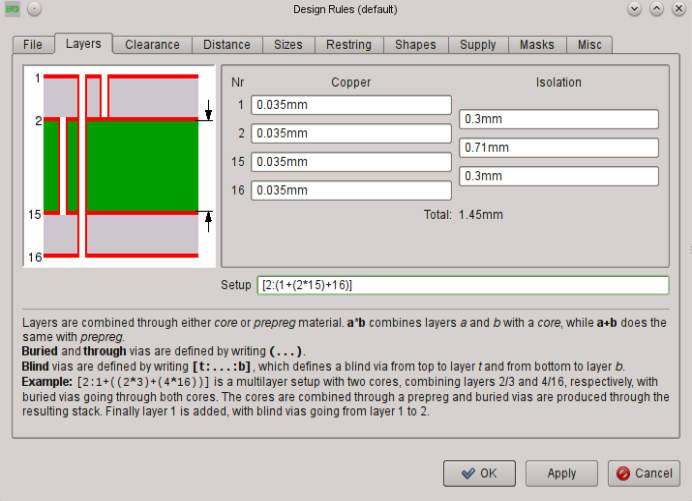
➢ Example 1: Layer Setup for a 4 layer Board

>Blind vias have to keep a certain ratio of via depth to drill diameter. 
>For this reason it is necessary to specify values for the layer thickness.
>These values are given by your board house! You are supposed to contact it in either case before starting the layout!
>Type in the values in the Copper (thickness of copper layer) and Isolation (thickness of isolation layer) fields as shown in the image. 
>The total thickness of the board is shown below the Copper and Isolation fields.

盲孔必须保持孔深度与孔直径之间的一定比例。
因此有必要对层厚度进行设置。
这些数值由您的电路板制造商提供！
您应该在开始 PCB 设计前与生产商联系！
在该窗口中分别输入 Copper（铜层厚度）和 Isolation（隔离层厚度）的值。
电路板的总厚度会显示在 Copper 和 Isolation 设置框下方。

>Example 2:
>Layers 1, 2, 15, and 16 are used.
>Board structure: One core inside, outside prepregs.
>Connections: 1­-2, 15­-16 (blind vias), 1-­16 (through vias)
>Setup expression:
>[2:(1+2*15+16):15]
>Explanation:
>2*15
>Layers 2 and 3 form the core.
>1+2*15+16
>On both sides of the core copper layers are pressed on with prepregs.
>(1+2*15+16)
>The outer parenthesis define through vias from 1­16.
>[2:(1+2*15+16):15]
>In square brackets and separated by a colon blind vias are defined.
>Here from layer 1 to 2 and 16 to 15.

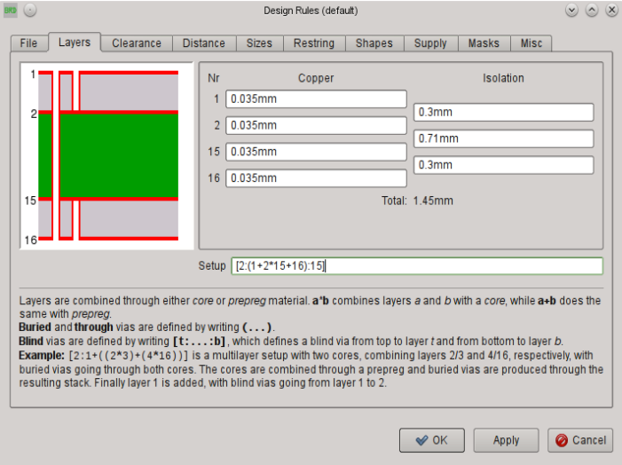
➢ Example 2: Layer Setup for a 4 layer Board

实例 2：
使用了第 1、2、15 和 16 层。
电路板结构：一个内部 Core，外部使用 Prepreg。
连接: 1-2, 15-16 （盲孔）, 1-16 （通孔）
表达式：
[2:（1+2*15+16）:3]
解释：
2*3
第 2 层与第 3 层组成 Core。
1+2*15+16
Core 两个面的铜层都与 Prepreg 压合。
（1+2*3+16）
外部的括号表示从第 1 层到第 16 层的一个通孔。
[2:（1+2*3+16）:3]
在方括号中用冒号将层与层隔开以便定义盲孔。
盲孔分别为从第 1 层到第 2 层以及从第 16 层到第 3 层。

##### 3.2 6 层电路板
6-Layer Board
>Example 3:
>Layers 1, 2, 3, 14, 15, and 16 are used.
>Board structure: Two cores, prepregs outside.
>Connections: 2-­3, 14-­15 (buried vias), 1­-16 (through vias)
>Setup expression:
>`(1+(2*3)+(14*15)+16)`
>Explanation:
>`(2*3)+(14*15)`
>Two cores with buried vias are pressed together.
>`1+(2*3)+(14*15)+16`
>This layer stack is covered with outer layers 1 and 16 which are isolated with prepregs.
>`(1+(2*3)+(14*15)+16)`
>The whole expression in parenthesis defines through vias from 1­16.

实例 3：
使用了第 1、2、3、14、15 和 16 层。
电路板结构：两个 Core，外部使用 Prepreg。
连接：2-3，14-15（埋孔），1-16（通孔）
表达式：
`（1+（2*3）+（14*15）+16）`
解释
`（2*3）+（4*5）`
两个带有埋孔的 Core 压合在一起。
`1+（2*3）+（4*5）+16`
该层叠外部使用第 1 和第 16 层覆盖，并用 Prepreg 隔离。
`（1+（2*3）+（4*5）+16）`
外部圆括号中的整个表达式表示从第 1 层到第 16 层的通孔。
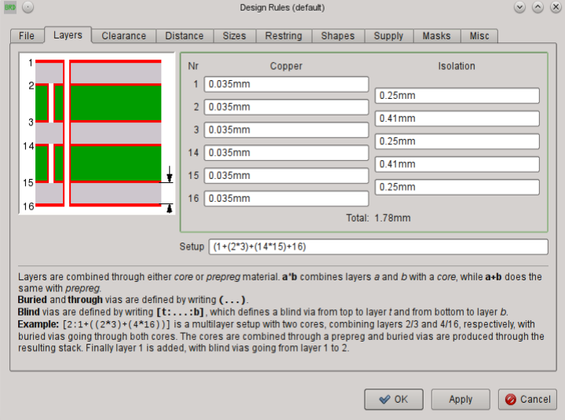
➢ Example 3: Layer Setup for a 6 layer Board
>The values for layer thickness for copper and isolation used in these examples are fictive. 
>Please contact your board house to get the allowed values.

这些实例中所使用的铜层厚度与隔离厚度为虚构数字。
请联系您的电路板制造商以便获取正确数据。

>Example 4:
>Layers 1, 2, 3, 14, 15, and 16 are used.
>Board structure: One core, on each side two prepregs.
>Connections: 3-­14 (buried vias), 2-­14 (blind vias in inner layer stack), 1-­16 (through vias)
>Setup expression:
>(1+[14:2+(3*14)+15]+16)
>Explanation:
>2+(3*14)+15
>The core with buried vias. One prepreg on each side.
>[14:2+(3*14)+15]
>Blind vias from layer 2 to 4.
>1+[14:2+(3*14)+15]+16
>On this layer stack a prepreg on each side is pressed on.
>(1+[14:2+(3*14)+15]+16)
>Parenthesis allow through vias from 1 to 16.

实例 4：
使用了第 1、2、3、14、15 和 16 层。
电路板结构：一个 Core，在两个面上分别使用两个 Prepreg。
连接：3-14（埋孔），2-14（在内部层叠中的盲孔），1-16（通孔）
表达式：
（1+[14:2+（3*14）+15]+16）
解释：
2+（3*14）+15
在其两个面上分别覆盖一个 Prepreg。
[14:2+（3*14）+15]
从第 2 层到第 4 层的盲孔。
1+[14:2+（3*14）+15]+16
在该层叠的两个面上分别覆盖了一个 Prepreg。
（1+[14:2+（3*14）+15]+16）
外部的圆括号表示从第 1 层到第 16 层的通孔。

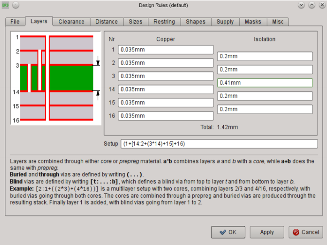
➢ Example 4: Blind Vias in the inner layer stack

##### 3.3 8层板
8-Layer Board
>Example 5:
>Layers 1, 2, 3, 4, 13, 14, 15, and 16 are used.
>Board structure: Three cores, prepregs outside.
>Connections: 1­3, 14-­16 (blind vias), 2-­3, 4-­13, 14-­15 (buried vias), 1­-16 (through vias).
>Setup expression:
>`[3:(1+(2*3)+(4*13)+(14*15)+16):14]`
>Explanation:
>`(2*3)+(4*13)+(14*15)`
>Three cores, each with buried vias, are pressed together and isolated with prepregs.
>`1+(2*3)+(4*13)+(14*15)+16`
>Outer copper layers 1 and 16 which are isolated through prepregs are pressed onto this layer stack.
>`(1+(2*3)+(4*13)+(14*15)+16)`
>Parenthesis allow through vias from 1­-16.
>`[3:(1+(2*3)+(4*13)+(14*15)+16):14]`
>Blind vias from 1­3 and 16-­14.

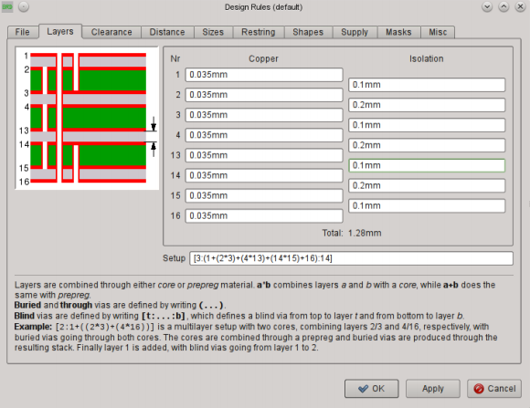
➢ Example 5: Layer Setup for an 8 layer board

使用了第 1、2、3、4、5、6、7 和 16 层。
电路板结构：三个 Core，外部使用 Prepreg。
连接：1-3，6-16（盲孔），2-3，4-5，6-7（埋孔），1-16（通孔）。
表达式：
`[3:（1+（2*3）+（4*5）+（6*7）+16）:6]`
解释：
`（2*3）+（4*5）+（6*7）`
三个 Core，每一个包含一个埋孔，通过 Prepreg 进行压合和隔离。
`1+（2*3）+（4*5）+（6*7）+16`
在该层叠的外部用第 1 层和第 16 层进行压合，并用 Prepreg 隔离。
`（1+（2*3）+（4*5）+（6*7）+16）`
外部的圆括号表示从第 1 层到第 16 层的通孔。
`[3:（1+（2*3）+（4*5）+（6*7）+16）:6]`
从第 1 层到第 3 层以及层第 16 层到第 6 层的通盲孔。

#### 4. 盲孔/埋孔/微型过孔的提示
Hints For Working With Blind, Buried, and Micro Vias

##### 4.1 VIA 命令
>Depending on the Layer setup vias can have different lengths. 
>The parameter toolbar of the VIA command shows all available lengths in the Layer box.
>When routing manually (ROUTE command) EAGLE takes the shortest possible via length in order to change layers. 
>It is also possible that vias at the same position are elongated.
>The via length can be changed with the CHANGE VIA command. 
>Select the value from the according menu and click the via with the left mouse button.
>Alternatively use the command line:
>CHANGE VIA 2-15
>and a click onto the via changes the length from layer 2 to 15.
>If the given via length is not defined in the Layer setup it will be elongated to the next possible length or, if this is not possible, an error message will be generated.
>VIA 'GND' 1-4 (1.05 2)
>places a via that belongs to the signal GND and reaches from layer 1 to 4 at position (1.05 2).

根据不同的层设置可以产生不同孔深度。
VIA 命令的参数栏在 Layer 下拉菜单中提供了所有可用的深度。
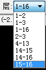

在手动布线时（ROUTE 命令）EAGLE 会为针对换层走线计算出可能的最小孔深度。
也可以通过深度加长来处理处于相同位置的孔。
孔深度可以通过 CHANGE VIA 命令来修改。
在输入命令后从弹出菜单中选择数值并用鼠标左键单击要修改的孔。
或者使用命令行：
CHANGE VIA 2-7
然后单击要修改的孔来将深度修改为从第 2 层到第 7 层。
如果给定的孔深度没有在层设置中定义，则会延伸到下一个可能的深度，或者如果无法延伸，则会弹出错误信息。
VIA 'GND' 1-4 （1.05 2）
该命令在坐标（1.05 2）上放置一个属于 GND 信号线路的孔，孔深度为从第 1 层到第 4 层。

##### 4.2 ROUTE 命令
>If you want to change the layer while laying-­out the board, EAGLE always takes the shortest possible via (CHANGE LAYER command; also in Follow­me mode). 
>It is also possible that a via at the same position is elongated automatically.

如果您在进行 PCB 设计时需要改变到另一层，则 EAGLE 会使用可能的最短孔深度（CHANGE LAYER 命令；也可以在 Follow-me 模式下）。
相同位置的孔也会自动进行延长。
>! If Micro vias are enabled in the Design Rules by setting a minimum value for the drill diameter (Sizes tab, Min. Micro Via) and defining a proper Layer setup, EAGLE sets a Micro via when routing from a SMD and immediately changing to the next inner layer.
>In Follow­me mode, however, EAGLE can't place Micro vias. 
>The Followme router is powered by the Autorouter engine and therefore it has to follow its properties and restrictions.

如果在设计规则窗口中对微型过孔的孔直径最小值进行了设置（ Sizes标签，Min. Micro Via 项）并且定义了正确的层设置，则当您从 SMD型焊盘布线到下一内部层上时，EAGLE 会设置一个微型过孔。
但是在 Follow-me 模式下，EAGLE 无法放置微型过孔。
Follow-me router 功能是由 Autorouter 引擎驱动的，因此它必须符合其属性和限制。

### 6.4 微型过孔-特殊形式的盲孔
Micro Via − A Special Case of Blind Via
> In contrast to Blind vias that can reach several layers deep into the board the Micro via connects an outer layer with the next inner layer. 
> The drill diameter of a micro via is relatively small. Presently the usual values are about 0.1 to 0.05 mm.

> For manufacturing reasons Micro vias, as Blind vias, have to follow a certain Aspect ratio of depth to drill diameter. 
> This ratio defines the maximum via depth for a certain drill diameter.

> The proper value can be learned from your board house.
> Set this value in the Design Rules, Sizes tab, Min. Blind Via Ratio.
> Assumed the board house demands the ratio as 1:0.5 you have to enter 0.5 for Min. Blind Via Ratio.

> Additionally the Design Rule Check verifies the minimum drill diameter for Micro vias given in Min. MicroVia. 
> If this value is higher than the value for Minimum Drill (default), micro vias won't be checked.

>The diameter of micro vias is set in the Restring tab of the Design Rules.
>If you change the layer from an outer to the next inner one while you are routing a track out of a SMD, EAGLE automatically places a Micro via, provided the Design Rules allow it.

>! The Autorouter can't set Micro vias!

与能够连接电路板内多层的盲孔不同，微型过孔只连接外部层与相邻的内部层。
微型过孔的直径相对较小。
现在通常的直径宽度约为 0.05mm 到 0.1mm。
由于制造工艺的原因，微型过孔与盲孔一样需要保证一定的深度与直径的比例。
该比例决定了特定孔直径所对应的最大孔深度。
从您的电路板制造商可以获得正确的数值。
在设计规则窗口中 Sizes 标签的 Min. Blind Via Ratio 项中可以对该值进行设置。
假设电路板制造商要求比例为 1：0.5，则您需要在 Min. Blind Via Ratio 项中输入 0.5。
另外设计规则检查功能会针对 Min. Micro Via 项中设置的微型过孔进行最小钻孔直径比较。
如果该项中的值大于 Minimum Drill（默认）项中的值，则不会对微型过孔进行检查。
微型过孔的直径可以在设计规则窗口的 Restring 标签下进行设置。
如果您对 SMD 焊盘走线时，从外部层切换到相邻的内部层，在设计规则允许的情况下 EAGLE 会自动放置一个微型过孔。

## 7. 编辑和更新元件
Editing and Updating Components

### 7.1 Open Device/Symbol/Package
>Depending on the Editor window you are currently working wit the context menu of a component offers the entries Open Device/Symbol/Package. 
>If you select one of them, EAGLE tries to open the referring library file in the corresponding editing mode. 
>Now you can easily check all the objects the Device/Symbol/Package consists of. 
>And it is even possible to modify the library definition.

根据你目前工作的编辑器窗口智能显示元件的快捷菜单，智能提供 Device/Symbol/Package 选项。
 如果你选择其中之一，EAGLE 试图打开引用的库文件中的相应的编辑模式。
 现在你可以轻松的检查 Device/Symbol/Package 包含的所有对象。
 甚至可以直接修改库定义。
>In order to update your project with the modified library definition you have to start a library update (menu Library/Update...)in schematic/board (see next section)

为了对你修改后的库定义对象进行更新，你需要在schematic/board启动库更新(menu Library/Update...)(看下一节)
>! Please be aware that changes in the libraries can affect a number of different devices in the library file and therefore your future projects, as well. 
>Please act accordingly carefully!

请注意，库文件中的改变会影响库文件中许多的 devices ，并且也会影响你以后的项目。
请请谨慎行事 ！
>In case EAGLE doesn't find the original library file, EAGLE prompts a warning and cancels this action.
>In this case there is a possibility of extracting the library definitions used in your current project. 
>File/Export/Libraries... starts the User Language Program exp­lbrs.ulp that creates library files accordingly.

如果 EAGLE 没有找到原来的库文件，EAGLE 会提示警告，并取消这次操作。
在这种情况下，可以提取你当前对象的库定义。
File/Export/Libraries...启动 ULP exp­lbrs.ulp 创建一个相应的库文件。

### 7.2 更新对象(元件库更新)
Updating Project (Library Update)
>The UPDATE command allows components in a schematic diagram or a layout to be replaced by components defined in accordance with the current libraries. 
>This function is of particular interest for existing projects. 
>If, in the course of development, the definitions of Packages, Symbols or Devices in the libraries are changed, the existing project can be adapted to them.

UPDATE 命令可以用基于当前元件库定义的元件来替换原理图或 PCB 设计中的元件。
该功能对于已经存在的项目特别有用。
如果在开发过程中，元件库中的 Package，Symbol 或者 Device 定义发生变化，那么现有的项目就可以随之进行调整。
>The menu item Library/Update causes all the components in a project to be compared with the definitions in the current libraries. 
>If EAGLE finds differences, the components are exchanged. 

菜单项元件库/更新可以让项目中所有的元件与当前使用的元件库中的各种定义进行比较。
如果 EAGLE 发现不一致的情况，则会对元件进行替换。
>Those libraries on the path specified for Libraries in the Control Panel under Options/Directories will be examined.

在 Control Panel 的选项/目录设置菜单打开的窗口中元件库项指定路径下的元件库都会用于比较。
>It is also possible to update components from one particular library. 
>Type the UPDATE command on the command line, stating the library, for instance as: 
>UPDATE linear
>or
>UPDATE /home/mydir/eagle/library/linear.lbr
>or select the library in the File dialog of the Library/Update... menu item.
>In the case you want to replace parts from one library with parts from another library you can use the command
>UPDATE old-lbr-name = new-lbr.name

也可以基于某个特定的元件库进行元件更新。
例如在命令框中输入 UPDATE 命令并指定该元件库：
UPDATE linear
或者
UPDATE /home/mydir/EAGLE/library/linear.lbr
或者在元件库/更新...菜单打开的文件选择对话框中选择元件库。
如果您想用一个元件库中的元件来替换另一个元件库中的元件，可以使用命令：
UPDATE old-lbr-name = new-lbr.name

>Old-­lbr-­name represents the name of the library as shown by the INFO command in the layout or schematic. New­lbr­name stands for the library from which you want to take elements. 
>You may add paths as well. 
>Please see the help function for more information.

Old-lbr-name 表示 PCB 设计或原理图中用 INFO 命令显示的元件库名称。
New-lbr-name 则表示您需要使用元件的元件库。
您也可以在命令中加入元件库路径。
请参考帮助页面以便获取更多信息。
>In many cases you will be asked whether Gates, pins or pads should be replaced according to name or according to position. 
>This always happens if library objects are renamed, or if their position (sequence) is changed.

在很多情况下系统会询问您是否需要根据名称或位置对 Gate，pin 或 pad 进行替换。
如果元件库对象被重命名或者位置（顺序）发生改变，就会弹出询问提示。
>If too many changes are made in the library at one time (e.g. pin names and pin positions are changed) it is not possible to carry out an automatic adaptation. 
>In such a case it is possible either to carry out the modifications to the library in two steps (e.g. first the pin names and then the pin positions), or the library element can be given a new name, so that it is not exchanged.

如果一次性对元件库作出了许多修改（例如修改了 pin 名称和位置），则无法实现自动更新功能。
这种情况下可以通过两个步骤来修改元件库（例如先修改pin 名称然后再修改 pin 位置），或者为元件库的对象提供一个新的名称，这样就不会进行替换了。
>! Changing a Device's prefix in the library does not update the part names of already placed elements in your drawing.

修改元件库中 Device 的前缀不能实现对您绘图中已经放置的元件名称的更新。
>If Forward&Back Annotation is active, the components are replaced in the schematic diagram and in the layout at the same time.
>You will find further information on the program's help pages.

如果启用了 Forward&Back Annotation 正反向标注功能，则在原理图和 PCB 设计图中会同时替换元件。
您可以在该软件的帮助页面中获取更多信息。
>! After any library update, please carry out both an ERC on the schematic and a DRC on the layout!

在对任意元件库进行更新后，请在原理图中执行 ERC 并在 PCB 设计图中执行 DRC！
>Individual components can, for instance, be updated with the aid of the ADD command. 
>If you use ADD to fetch a modified component from a library, you will be asked whether all the older definitions of this type should be updated. 
>After the update you can delete the component that you just fetched. 
>Again here it is wise to carry out an ERC and a DRC after the update!

单个元件可以通过 ADD 命令进行更新。
如果您用 ADD 命令从某个元件库中选择了一个经过修改的元件，则软件会询问您是否需要对该元件所有以前的定义进行更新。
在更新完成后您可以删除您刚才选择的元件。
同样建议在更新后执行 ERC 和 DRC！

## 8. 差分线对和蛇形线
Differential Pairs And Meanders
### 8.1 差分线对布线
Routing Differential Pairs
>A Differential Pair consists of two signals that have the same name, but different name extensions. 
>One of the signals must have the extension `_P`, the other `one _N`, as for example in `CLOCK_P` and `CLOCK_N`. 
>The two signals must belong to the same net class.

差分线由两条名称相同的信号线路组成，但是它们的扩展名不同。
其中一条信号 线 路 的 后 缀 名 必 须 是` _P` ， 而 另 一 条 则 必 须 是 `_N `， 例 如 `CLOCK_P` 和`CLOCK_N`。
两条信号线路必须属于同一个网络簇。

>The following particularities apply:
>As soon as you select an airwire of a Differential Pair with the ROUTE command, both signals are routed in parallel. 
>The distance between the two signals and the wire and via sizes are always determined by the signals' net class.

以下是差分线的特点：
当您执行 ROUTE 并选中一对差分线中的一条鼠线时，两条信号线路会平行布线。
它们之间的间距以及线宽和过孔直径由信号线路所属的网络簇决定。
>The option Auto set route width and drill in the menu Options/Set/Misc does not affect differential pairs.
>If you don't want to route both signals for the whole distance, you can drop the second airwire with the Escape key.

“选项/设置/杂项（Options / Set / Misc)”菜单中的“自动设置布线宽度及钻孔”对于差分线对无效。
如果您要单独对其中一条信号进行布线，可以通过键盘上的 Escape 键来取消对另一条信号的布线。
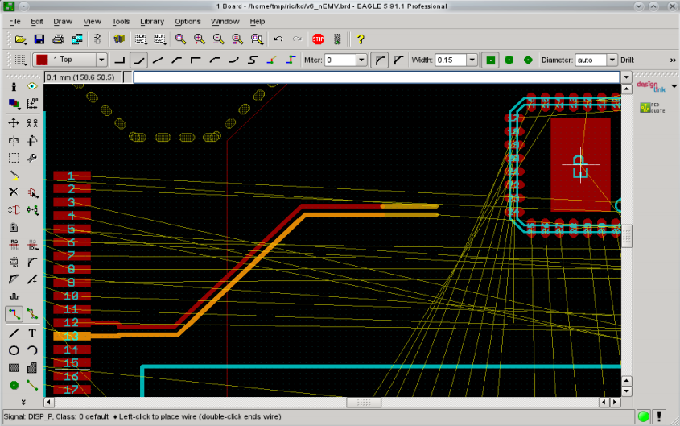
➢ Differential Pair follows the mouse cursor

>The first mouse click with the active ROUTE command onto one of the airwires of the differential pair decides about the starting point of the parallel routing. 
>Usually the pads or SMDs the airwires start from don't have the necessary distance for parallel routing, so EAGLE draws traces from the starting points to the current mouse cursor position, according to the current wire bend style. 
>Note that there may be cases where these wires overlap, so please make sure you choose a proper point from where to start the actual parallel routing. 
>It can be wise to run a Design Rule Check in this area.

激活 ROUTE 命令后在差分线对上第一次单击鼠标时就确定了并行布线的起始点。
通常对于并行布线来说，并没有规定鼠标与鼠线起始端的直插焊盘或 SMD 焊盘之间的距离，因此 EAGLE 会从鼠线起始端开始到鼠标光标的位置为止，根据当前线路弯折类型来绘制线路。
请注意有可能会出现线路重叠的情况，所以请确保您选择了正确的鼠标位置来进行实际的并行布线。
推荐对该布线区域进行设计规则检查。

>The distance between the target pads/SMDs will also be probably more than the Differential Pair is routed with, so you should start the routing from this side as well and define the ending point of the parallel routing, as you did before at the starting point. 
>If you route towards the wire end points of a Differential Pair in a different layer, and the wires are fully aligned, the proper vias will be generated automatically.

目标直插焊盘/SMD 焊盘之间的距离有可能与差分线起始焊盘之间的距离不同，因此您应该从目标焊盘这一端接着进行与之前相同的操作来确定布线结束点。
如果差分布线的终点处于另一层上，将会自动在合适的位置生成过孔。

>! Differential Pairs can only be routed manually. 
>The Follow­me router and the Autorouter treat them like regular signals.

差分线对只能通过手动布线。
跟随布线器和自动布线器只会将差分线作为普通信号线路进行布线。
>The special functions Shift + left click that places a via at the end point and Ctrl + left click for defining an arc radius don't work in Differential Pair mode. 
>When you start routing at any point of a signal (with Ctrl + left click) you will route the selected signal only, and not the Differential Pair the signal might be part of.

>Coordinates given in the command line while routing a Differential Pair form a center line along which the actual signal wires are placed left and right with the proper distance.

在差分线对布线时，Shift+鼠标左键放置过孔以及 Ctrl+鼠标左键定义弧形半径的功能无效。
如果通过 Ctrl+鼠标左键单击差分线对，则软件只会对选中的信号进行布线，而不是对两条差分线同时布线。
在差分布线时命令行中所输入的坐标会在两条布线线路中间的位置生成一条中心线。

### 8.2 蛇形线
Meanders
参看: 0x03 Layout Editor PCB 编辑器

## 9.  组装变体
Assembly Variants 装配变量
参看：0x02 Schematic Editor原理图编辑器

## 10. 打印输出原理图和布局图
Print Out Schematic and Layout
>Schematic diagrams, boards and also library elements can be printed out with the PRINT command.
>Using DISPLAY you should first select the layers that you want to print.

通过 PRINT 命令可以打印原理图、PCB 设计图以及元件库中的元件。
您首先应该使用 DISPLAY 命令来选择您需要打印的层。
>! The basic rule is: If you can see it in the editor, you will see it on the print.

基本规则是：您能够在编辑器中看到的内容就是能够打印出来的内容。
>Exceptions to the rule above are:
- Origin crosses for texts
- Grid lines or grid dots
- Polygons that can't be calculated by RATSNEST and therefore only show their contours in the Layout Editor
- Error polygons of the Design Rule Check 

无法打印的有：
- 文本的原点十字标记
- 栅格线条或点状线
- 无法通过 RATSNEST 命令计算从而只能在 PCB 编辑器中显示轮廓的多边形敷铜区
- 由设计规则检查认定有错误的多边形敷铜区

### 10.1 设置打印对话框
Settings of the Print Dialog 
>When the printer icon on the action toolbar is clicked, the PRINT dialog opens.
>The currently selected printer is shown at the top of the window in the Printer line. 
>The small button on the right, at the end of the line, can be used to select another printer or activate one of the print­to­file options. 
>If a printer is selected, the button with the three dots ... leads you to the printer properties.
>In case you selected a print­-to­-file option the Output file line shows the path to the output file. 
>If you want to change it, click onto the … button. 

当左键单击操作工具栏上的 打印图标后，将会弹出打印对话框。
在该窗口顶部的 Printer 栏中显示的是当前选择的打印机。
通过该栏的下拉菜单可以选择另一台打印机或者选择“打印到文件”选项。
如果选中了某台打印机，则可以通过带有...符号的按钮来查看打印机属性。
如果您选择了“打印到文件”选项，则 Output file 文本框会显示文件输出的路径。
如果您要修改该路径，请单击…按钮。
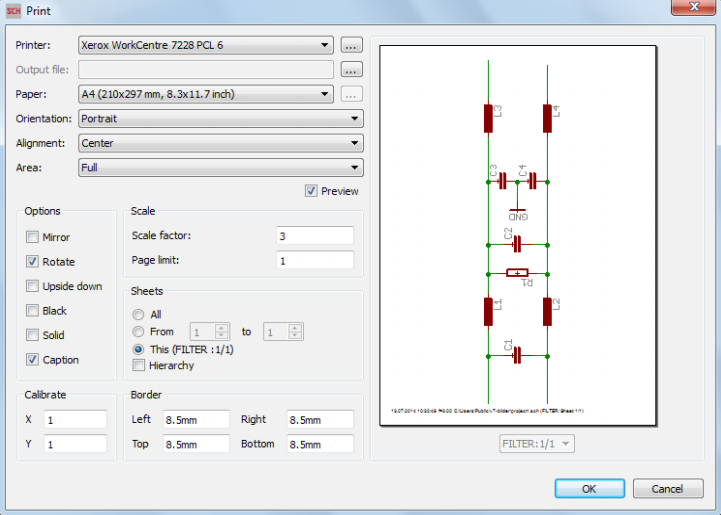
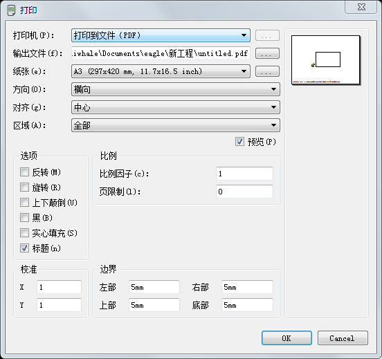

>Below these two lines you will find settings about Paper format, Orientation and Alignment of your print. 
>The … button in the Paper line allows you to define a user­specific format, provided the selected printer supports this.
>Alignment defines the location of the print­out on the paper. 
>Changing this will directly result in a modified Preview, if active.

>In the Area line, you determine what to print: Window prints the drawing window which is currently visible in the Editor window. 
>Full on the other hand, prints the whole drawing. 
>In this case all drawing objects (displayed or not) are relevant for the calculation of the resulting printing area.

在这两栏下方您可以看到打印机的 Paper 纸张、Orientation 方向和 Alignment 对齐设置项。
Papaer 纸张栏右方的…按钮可以让您自定义一个所选打印机支持的格式。
Alignment 对齐项定义纸张上的打印位置。
如果选中了 Preview 预览选项，则修改该项后的效果会显示在右方的预览框中。
在 Area 区域栏中，您可以指定打印的范围：Window 项打印编辑器中当前可见的绘图窗口。
Full 项则打印全部绘图。
这时所有的绘图对象（显示或未显示的）都与实际计算中的打印区域相对应。

#### 1.  打印选项
Printing Options
>Mirror inverts the drawing from left to right about the Y axis, Rotate turns it 90 degrees counter­clockwise, and Upside down turns it through 180 degrees. 
>If both are activated, a rotation of 270 degrees is the result.

Mirror 翻转项能够将绘图沿 Y 轴从左向右翻转，Rotate 旋转项则以反时针方向将绘图旋转 90 度，而 Upside down 上下颠倒则将绘图作 180 度旋转。
如果 Rotate 与 Upside down 项都被选中，则绘图旋转 270 度。
>If the Black option is chosen, a black­and­white printout is made. 
>Otherwise the print will be either in color or gray scale, depending on the printer. 
>Solid causes each object to be entirely filled. If you want to see the different filling patterns of the individual layers, then deactivate this option.

如果选中了 Black 黑选项，则会以黑白打印的方式输出。
否则根据不同的打印机，打印效果会显示为彩色或者灰度打印。
Solid 实心填充项可以让每个对象完全填充。
如果您希望在单独的层上实现不同的填充方式，请取消选中该选项。

>The Caption option switches the appearance of the title, printing date, file name and the scale of the print on or off.
>In the Scale section of the window the Scale factor specifies the scale of the drawing. 
>It may be in the range of 0.001 and 1000. 
>If Page limit is set to 0, the printer will use whatever number of pages is needed to print the output at the selected scale. If a different value is selected, EAGLE will adjust the scale of the drawing to fit it onto the stated number of pages. 
>This can mean that, under unfavourable circumstances, the selected scale cannot be maintained.
>Otherwise you have the possibility to select Page Limit 1, and a Scale factor that would request more than one page for printing to get a maximum filling of the page.

Caption 标题项可以指定显示或不显示标题、打印日期、文件名称和放大倍数。
在该窗口的 Scale 比例部分中的 Scale factor 比例因子项指定绘图的放大倍数。
放大范围为 0.001 到 1000 倍。
如果 Page limit 页限制项设置为 0，则打印机会在指定放大倍数的基础上使用所需要的页数进行打印。
如果该项指定了不同的值，则 EAGLE 对绘图的放大倍数进行调整，以便适应指定的页数。
即就是说在某些情况下，不能维持不恰当的指定倍数。
否则您有可能将 Page Limit 项指定为 1 页，但是 Scale factor 项却是需要 1 页以上的页面进行打印的放大倍数。

>It is possible to select which sheets from a schematic diagram are printed using the Sheets box. 
>This only appears in the Schematic Editor. 
>This selection also determines which sheet is shown in the preview.

在该窗口的 Sheet 图纸部分可以选择需要打印的原理图页面。
该部分只对原理图编辑器有效。
该选项也决定了在预览中所显示的页面。
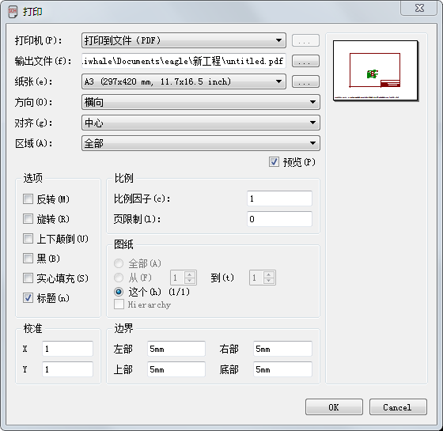

>If you activate the option Hierarchy, all the module sheets for each module instance used in the schematic will be printed with the corresponding part names, net names and assembly variants.

如果你激活 Hierarchy 层次化选项，在原理图中的每个模块实例使用的所有模块页面，将被打印，并包含相应部分的名称，网络名和装配变量。
>The edges of the print can be defined with the aid of the four entry boxes under Border. 
>The values may be entered in mm or in inches. 
>If you have changed the values and want to use the printer driver's standard settings again, simply enter a 0.

打印边缘可以通过 Border 边界部分中的 4 个设置框来进行定义。
可以输入的单位为毫米或者英寸。
如果您在修改该值后需要再次使用打印机驱动器的标准设置，则需要在其中输入 0。
>Calibrate allows correction factors for the aspect ratio of the printout. 
>This allows linear errors in the dimensional accuracy of the print to be corrected.
>The values can be specified in the range of 0.1...2.

Calibrate 校准项允许对打印输出的比例进行纠正。
该项能够纠正打印中尺寸精度的线性误差。
其值可以在 0.1 到 2 之间选择。
>! Note concerning colored printing:
>EAGLE always takes the white palette as basis for colored printouts. 
>If you are working with a black or colored background and using selfdefined colors, it is recommended to define these colors also for the white palette. 
>So the printer can use your colors, too.

关于彩色打印请注意：
EAGLE 始终将白色调色板作为彩色打印的背景。
如果您使用黑色或彩色背景并且采用了自定义颜色，推荐将这些颜色以白色调色板为背景进行设置。
这样打印机才能使用您的颜色设置。
>If, when a layout is printed, the drill holes in the pads and vias are not to be visible, select the No Drills option for the Display mode by way of the menu item Options/Set/Misc.

如果在打印 PCB 设计图时，不需要打印焊盘和过孔对应的孔，请通过选项/设置/杂项菜单取消显示模式区域中的 No 钻孔项的选中状态。

#### 2. 生成 PDF 文件
Generating PDF files
>If you want to generate a PDF file (resolution 1200dpi) from your drawing, click onto the small selection button in the Printer line and choose the option Print to file (PDF). 
>Go to the Output file line then and specify path and name of the PDF output file.
>All texts that are not written in EAGLE vector font are searchable in the PDF file by means of your PDF viewer.

假如你想将你的绘图生成 PDF 文件 (分辨率 1200dpi)，在打印机行中点击小的选择按钮，并选择打印到 PDF 。
转至输出文件行，然后并指定PDF输出文件的路径和名称。
所有以非 EAGLE 矢量字体输入的文本都可以用 PDF 查看器在该 PDF 文件中进行搜索。

#### 3. 可视性和印刷层的顺序
Visibility and Sequence of Printed Layers
>EAGLE prints its layers in a certain sequence, one over the other. 
>If you are using, for example, self­-defined layers that are hidden by other layers in the print­out, you can use a SET command option – SET Option.
>LayerSequence – for bringing them into the foreground, or in general, for defining the layer printing sequence. 
>This affects printing into a PDF file, as well.
>Details about this can be found in the help function of the SET command, Help/Editor commands/SET.
>The PRINT command can also be given directly on the command line, or can be run by a script file. 
>Information about the selection of options is available on the help pages for PRINT.

EAGLE 以特定的顺序打印其中的层，一层在另一层之上。
如果你正在使用，例如，通过在打印输出中的其它层隐藏自定义层，你可以使用 set 命令选项 - set 选项。
LayerSequence - 层顺序将把它们带到前台，在通常情况下，用于定义层打印顺序。
这也会影响到 PDF 文件。
详细细节参考 SET 命令的帮助功能，或通过脚本文件运行。
关于选项选择的信息，可以在 PRINT 帮助页面获得。

## 11. 合并多个小电路板到一块整体的面板上
Combining Small Circuit Boards on a Common Panel

>In order to save costs, it may be worth supplying, for example, a smaller board to the board manufacturer in the form of a multiple board. 
>So you can have several boards made in one step.

为了节约成本，可以将较小的电路板合并到一块电路板上提供给电路板制造商。
这样您就可以一次制作几块电路板。
>You can reproduce the layout or combine different layouts to create a multiple board with the GROUP, COPY and PASTE commands. 
>Please note that this will change the board's silk screen, since elements receive new names, if a certain designator is already used in the board when pasting from the buffer. 
>If you don't need the silkscreen this does not matter. 
>Otherwise a User Language program can help. 
>Panelize.ulp copies the texts written in the layers 25 and 26 (t/bNames) into two new layers 125 and 126. 
>When combining the boards the names of the parts will change anyway, the copied texts in those new layers however will remain unchanged.

您可以通过 GROUP、COPY 和 PASTE 命令来重新制作 PCB 设计图或者将不同的 PCB 设计图合并创建多个电路板。
请注意如果在使用 PASTE 命令前电路板中的元件已经有特定的名称，由于在合并时元件名称会自动修改，所以这种方式会改变电路板的丝印层。
如果您并不需要丝印层，则这种情况不会产生影响。
否则可以借助用户语言程序来避免。
Panelize.ulp 程序能够将第 25 层和 26 层（t/bNames）上的文本复制到新建的第 125 和 126 层上。
在合并电路板时，元件名称也会改变，但新建层上复制的文本会保持不变。
>Tell the board manufacturer that they have to take layers 125 and 126 instead of the original layers 25 and 26 to generate the silkscreen from.

请告诉电路板制造商使用第 125 层和 126 层来生成丝印而不是用第 25 和 26 层。
>Procedure:
- Load the board file.
- Run panelize.ulp to copy name texts.
- DISPLAY all layers.
- Use GROUP to select all objects to be copied. To select the whole layout you could also use GROUP ALL.
- Click the COPY icon in order to put the group into the clipboard
- Edit a new board file with File/New .
- Use PASTE and place the layout as often as wanted. If necessary, it is possible to specify an orientation for the group before fixing it.
- Please make sure that the new board has the same set of Design Rules as the original board file has. It is possible to export Design Rules into a file (*.dru) and then import it into another board file (Edit/Design rules menu, File tab).
- Save the new board file.
- Tell your board house that they have to use layers 125/126 instead of 25/26.

操作步骤：
- 载入电路板文件。
- 运行 panelize.ulp 来复制名称等文本。
- 用 DISPLAY 命令来显示所有的层。
- 用 GROUP 命令来选择需要复制的所有对象。
要选择整个 PCB 设计图，您可以使用 GROUP ALL 命令。
- 执行 COPY 命令将对象组复制到剪贴板中。
- 通过文件/新建菜单新建一个电路板文件。
- 使用 PASTE 命令来粘贴 PCB 设计图。
在需要的情况下可以在固定之前指定对象组的方向。
- 请确保新电路板的设计规则设置与原电路板文件相同。
可以将设计规则导出为一个文件（*.dru）然后再导入到另一个电路板文件中（菜单编辑/设计规则/文件标签）。
- 保存新建的电路板文件。
- 请告知您的电路板制造商使用第 125 和 126 层而不是第 25 和 26 层。
通过这种方法您还可以合并来自不同项目的电路板。

## 12. 原理图与 PCB 设计图之间未保持一致性
Consistency Lost between Schematic and Layout
>It is very important during the design that the content of the schematic and the layout exactly correspond to allow for design congruency. 
>Eagle uses a Forward&Back annotation to perform this task. 
>General information about this can be found in the chapter about Forward&Back Annotation beginning with page 104.

在进行设计时保持原理图与 PCB 设计图完全一致是非常重要的。
EAGLE 使用 Forward&Back Annotation 正反向标注功能来保证这种一致性。
在第 94 页中的正反向标注章节中可以找到关于该功能的概要信息。
>The interconnection between Schematic Editor and Layout Editor ensures that both are in lock­step from a design standpoint automatically, provided both files are always loaded at the same time. 
>If you close one of them, either the schematic or layout file, and continue your work in the remaining opened file the consistency will be lost. 
>EAGLE will not be able to transfer the modifications into the other file. 
>So differences will arise between Schematic and Layout.

在原理图编辑器与 PCB 编辑器都载入的情况下，它们之间的相互联系保证了设计上自动保持一致性。
如果您关闭其中一个编辑器，比如关闭原理图或者 PCB文件，然后在另一个文件中继续进行操作，则无法保证一致性。
这时 EAGLE 不能将所作的修改转移到另一个文件中。
因此原理图和 PCB 设计图会产生差异。
>In case you close one of the two editor windows EAGLE prompts an eyecatching yellow and black warning on top of the drawing area which tells you that Forward&Back Annotation has been severed. 
>Please reload the file again.

如果您关闭了其中一个编辑器窗口，EAGLE 会在另一个窗口上方显示一个黄色和黑色条纹组成的警告信息，提示您正反向标注被切断。
请重新载入文件。
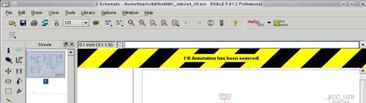
➢ Forward&Back Annotation severed!
正反向标注被切断

>In case you severed F&B Annotation intentionally, you can hide this warning by clicking into the message area.
>EAGLE will prompt a similar warning as soon as you try to load a pair of schematic/board files or a project which is not consistent.

如果您想隐藏警告信息，可以单击该信息来实现。
当您载入的一对原理图和 PCB 文件或者载入的某个设计项目中存在文件相互不一致的情况时，EAGLE 同样会弹出类似的警告信息。

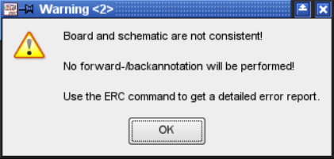
➢ Consistency loss between Schematic and Layout
➢ 原理图和 PCB 设计图未保持一致性

>Start the Electrical Rule Check (ERC) immediately. 
>It compares both files and reports differences in the ERC Errors window's Consistency Errors branch. 
>If you click onto one of these entries, EAGLE marks the affected object in Schematic and Board, if possible.

这时请立即执行电气规则检查（ERC）。
它会对两个文件进行比较并在 ERC Errors 窗口的 Errors 项下显示差别报告。
如果您单击错误项中的任意一个错误，在可能的情况下 EAGLE 就在原理图和电路板中会对相应的对象进行标注。
>Process each message and resolve the difference in the Schematic or in the Layout Editor window, according to requirements. 
>Finally you can mark the entry in the list as done with the Processed button.

在原理图或 PCB 编辑器中根据需要对差异进行处理后，您可以在错误列表中通过 Processed 按钮来标记错误项。
>For establishing consistency again it can be helpful to use UNDO.

使用 UNDO 命令有助于重新建立一致性。
>Launch the ERC every time a change has been made for design verification and to get an overview of progress. 
>All differences are cleared, if ERC reports consistency. 
>Now the Annotation will work again and the board and schematic are again in lock­step with each other.

在每次修改后请执行 ERC 以便对设计进行验证并且了解设计的进程。
如果 ERC得出一致性报告，则表示所有差别都已经清除。
这时将再次进行 Forward&Back Annotation 正反向标注并且电路板与原理图再次恢复一致。
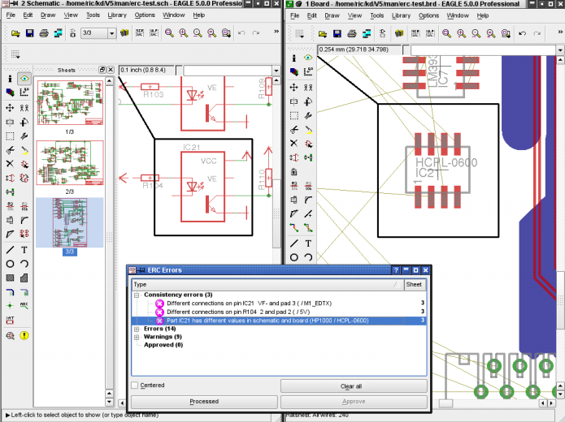
➢ The differences are marked in both editor windows
➢ 在两个编辑器窗口中同时标注出了差异
>Don't forget to save the files now and remember to leave both files loaded simultaneously all the time.
>请不要忘记保存文件并且随时保证两个文件都处于载入状态。

### 12.1 标准的一致性
Criteria For Consistency
>There are some rules that have to be fulfilled in order to have consistency between schematic and layout and the Forward&Back Annotation working. 
>In the following list there are mentioned the most important items:

这里有一些规则必须被满足，为了保持原理图和布局，和保证 Forward&Back Annotation 的工作。
下面的列表中有提到最重要的项目：

>- Each component in the schematic has to have a corresponding package in the layout and vice versa. 
>Exceptions are supply symbols, elements without contacts, and components with an attribute with the name `_EXTERNAL_` (for example for simulation symbols).
>☞ Use ADD/DELETE/NAME commands for placing/deleting/naming components

电路图中的每个元件在布局编辑器中有适当的封装，反之也一样。
不包括电源 symbol，无触点元件，和属性名为`_EXTERNAL_`(外部)的元件(例如，用于仿真的符号)
☞ 使用 ADD/DELETE/NAME 以放置/删除/命名元件。
>- Corresponding components have to have the same values.
>☞ Use the VALUE command in order to adjust the values.

相应元件必须具有相同的值。
使用 VALUE 命令，为了调整值。
>- For each connection of net and pin in the schematic there has to be a corresponding connection with the same name of signal and referring pad in the layout.
>☞ Add the missing net with the NET command, missing signals in the layout with the SIGNAL command, if necessary use NAME to adjust signal/net names or DELETE for deleting connections.

对原理图中的每一个网络连接和引脚，必须在布局编辑器中有相应的同名信号和相关 pad 与之连接。
☞ 使用 NET 命令添加确实的网络，在布局编辑器中缺失的信号使用 SIGNAL 添加；如果有必要可使用 name 命令调整 signal/net 名，或使用 DELETE 命令删除连接。
>- Nets in the schematic and signals in the layout have to belong to identical netclasses.
>☞ CHANGE CLASS or use the properties dialog of the net/signal in order to adjust the net classes and their values for width, clearance and drill.

原理图中的 net 和布局编辑器中的 signal 必须属于相同的网络族。
☞ 使用 CHANGE CLASS 或使用 net/signal 的属性对话框，以便调整网络族和网络的宽度、间隙和钻孔。
>- Assembly variants in schematic and board have to be identical;
>There must be the same number of variants and identic variant names. 
>Additionally the population options of the components have to be the same.
>☞ Use the VARIANT command for adjusting this

原理图和电路板中的装配变量必须相同。
必须有相同数量的变量和完全相同的变量名。
此外组件的选项数量必须相同。
☞ 使用 VARIANT  命令以进行调整。
>- If there are attributes defined for components, the attribute name and the attribute value have to be the same in schematic and board.
>It is allowed to have additional attributes defined in the layout editor which are not available in the schematic, but not vice versa.
>☞ Check the ATTRIBUTE command
>If there are attributes that are defined in the library, it might be helpful to use the REPLACE command in order to replace such components and update the attribute information.

如果某处有元件的属性，在原理图和电路板中属性名和属性值必须相同。
允许附加属性在布局编辑器中的定义在原理图中不可用，反之不行。
☞ 点击 ATTRIBUTE 命令，假如属性在库中被定义，这有助于使用 PEPLACE 命令以便替换此类组件和更新属性信息。

>- The definition of the package in schematic and board has to be exactly the same. 
>There are different options in order to eliminate such discrepancies:
>☞ Use the REPLACE command in the layout editor in order to exchange the package with a definition that matches the package used in the schematic.
>☞ Exchange of a whole device in the schematic editor with the REPLACE command or replacement of the components with a package definition used in the layout editor. 
>Please take care on attributes, as well (see above).
>☞ Change the package variant , if any, with CHANGE PACKAGE in the schematic editor.

在原理图和电路板中的封装的定义必须完全相同。
这里提供一些不同的选项，以消除这些差异。
☞ 在布局编辑器中使用 REPLACE 命令，以便改变封装的定义，以匹配原理图中使用的封装。
☞ 在原理图编辑器中改变整个 device ，使用REPLACE 命令，或在布局编辑器中替换元件的封装定义。
请注意元件的属性(见上文)
如果存在的话，在原理图编辑器中使用 CHANGE PACKAGE 改变封装变体。
>If the libraries that contained the components originally used in your schematic and layout are not available, it might be helpful to export the library definitions from your drawing files (File/Export menu). 
>Now it is possible to modify the libraries, if necessary, and use the REPLACE command.

如果最初在你的原理图和布局编辑器中使用的库所包含的元件不可用，从你的绘图文件中导出库定义可能对你很有帮助 (File/Export menu)。
现在可以修改库，如果有必要使用 REPLACE 命令。

#### 12.2 一致性指标
Consistency Indicator
>In the bottom right corner of the editor window you can see an indicator that gives, depending on its color, information about consistency.

在编辑器窗口右下角您可以看到一个状态指示灯，根据不同的一致性状态，该指示灯会显示不同的颜色。
>Gray F&B Annotation not possible Only one file loaded
>Yellow F&B Annotation not available SCH and BRD have different names
>Pink F&B Annotation not active SCH and BRD are not consistent
>Green F&B Annotation is active SCH and BRD are consistent

灰色 无法开启正反向标注功能仅载入了一个文件
黄色 无法开启正反向标注功能原理图和 PCB 文件不同名
粉色 正反向标注未激活原理图和 PCB 文件不一致
绿色 正反向标注已激活原理图和 PCB 文件一致

➢ Consistency indicator

>The exclamation mark right of the consistency indicator remembers you that the drawing is currently not saved.

一致性指示灯右方的感叹号表示当前绘图还未保存。