# 0x07_在元件库中创建实例
> GitHub@[orca-j35](https://github.com/orca-j35)，所有笔记均托管在 [eagle-notes](https://github.com/orca-j35/eagle-notes) 仓库


当我们使用 EAGLE 软件来设计电路图时，元件会从库里面取出并放到原理图编辑器中或者放到 PCB 编辑器中。
元件的所有信息随后也保存在原理图或者 PCB 图中，这时则不再需要从元件库中获取数据信息。因此，如果想把原理图交由第三方做 PCB 设计，可以不提供元件库，库文件的更换也不会对原理图或者PCB 图产生影响。
第一次尝试编辑 Packages、Symbols 或者 Devices 时会出现删除多余库单元的情况，此时应该使用 REMOVE 名来来删除


## 进入library
通过Control Panel 新建 library，新建一个库并进入该元件库编辑器。
也可在原理图或PC吧编辑器运行 open 命令，在弹出的文件对话框中输入库的名称，然后就会打开元件库编辑窗口。


## 创建电阻元件
### 创建电阻的 Symbol
1. **新建symbol** 点击 symbol 按钮，输入新建 symbol 的名称，例如 RESISTOR (只能大写)，确定后进入 symbol 编辑器。该符号名词仅仅是用于程序内部，并不会在原理图中显示。注意：
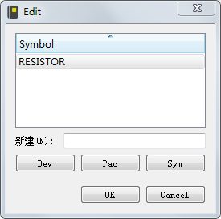

2.  **grid 设置** 为 0.1 inch 或 100 mil。按照 EAGLE 软件的要求，原理图符号的引脚都必须放置到该栅格尺寸上。

3. **wire** ，设置好参数后，在94 Symbol 层绘制电阻轮廓

**注意**：绘制元件轮廓时，所绘制的图形应该尽量靠近绘图区的圆点，甚至将圆点包含在图形中，避免图形离圆点距离太远。因为当通过ADD 命令放置元件时，元件会附着到鼠标指针上，而附着点则是以这个圆点为准，如果距离太远，在放置图形时，就会离鼠标指针较远，不利于准确地实现元件放置操作。

4. **pin**，direction方向设置为 Pas无源 ，swaplevel交换等级设置为 1，电阻的两个引脚可互换，因此该值设为大于0 的数值。
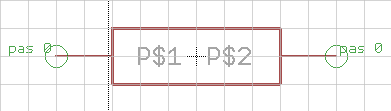
5. 运行 name，修改系统默认添加的引脚名称 `P$1` 和 `P$2`，设置为 A/B。
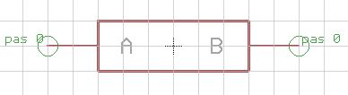
6. 运行 TEXT，添加文本变量 >NAME 和 >VALUE。
文本变量 >NAME：，当该元件添加到原理图中时，软件会自动在该变量的位置上采用 Device 界面中的 Prefix 按钮 (为元件或者元件的gate 添加前缀字符)所定义的字符作为元件名称的前缀，并在后面加上数字序号来显示名称。如果Prefix 定义为 R ，则第一个放置在在原理图中的该电阻的名称显示为R1 ，第二个则为R2 ，依此类推。
文本变量 >VALUE：显示 Device 名称(可能会按照固定格式统一显示封装和工艺)。
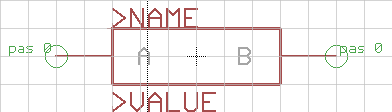

### 创建电阻的 Package
1. **新建**：点击 Package，输入新建封装名称，如 R1，点击OK 进入Package 编辑界面。
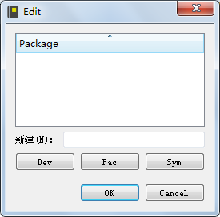

2. **GRID**，通常具有金属引脚的通孔标准元件通常使用 50 mil 的栅格尺寸来创建封装。
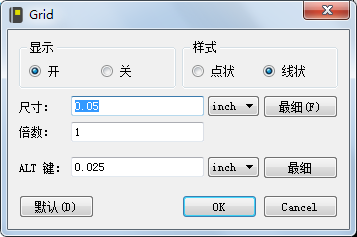

3. **焊盘**：运行 Pad 或 Smd，根据需要的封装选择直插式焊盘或表面贴装焊盘，然后在参数工具栏中对参数项进行适当的调整。
选取 Pad 时，缺省默认的焊盘直径设为 auto（即设置为 0），这个值属于保留值，具体的值由 PCB 编辑器中的设计规则来分配。
按照实际封装的焊盘间隔放置在绘图区中，并通过 WIRE 、RECT 等命令绘制封装外形和引脚。
绘图区的原点会和所选择的元件作为一体，因此，原点最好是在所放的 Package 的中心。
在第 17 层（Pads 层）和第 18 层（Vias）层不能放任何东西，因为它们不会被识别，在 PCB 设计中既不会被 DRC 检查，也不会被多边形敷铜检查，并且可能会导致电路短路。
17 Pads (through-hole)
18 Vias (through-hole)
选取SMD，先选择顶层放置焊盘，即便该元件后面会放到电路板的底层也应如此。SMD 的元件必须用 MIRROR 命令来放到另外一层，这样才能确保把所有的 top 开头的层移到相对应的 bottom 开始的层。
INFO 命令或右键弹出菜单中的 Properties 入口提供了当前 SMD 或 Pad 的属性快速浏览。
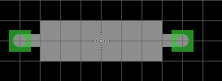

4. 运行 Name，然后分别单击两个焊盘来定义新的名称，如1 和2 。

5. 运行 Text，添加文本变量 >NAME 和 >VALUE。
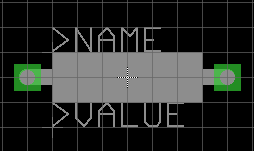
文本变量 >NAME：，当该元件添加到 PCB 图中时，软件会自动在该变量的位置上采用 Device 界面中的 Prefix 按钮 (为元件或者元件的gate 添加前缀字符)所定义的字符作为元件名称的前缀，并在后面加上数字序号来显示名称。如果Prefix 定义为 R ，则第一个放置在在原理图中的该电阻的名称显示为R1 ，第二个则为R2 ，依此类推。
文本变量 >VALUE：显示 Device 名称(可能会按照固定格式统一显示封装和工艺)。

### 创建电阻的 Device
1. 点击 Device，输入Device 名称，如 RESISTOR DEVICE，该名称将自动作为原理图中元件符号的值，确定后进入Device 编辑界面。
2. 运行 ADD，添加原理图符号，此处为RESISTOR。
3. 点击 新建 ，在弹出对话框中选中需要的封装，此处R1 ，并在下方为该封装定义一个变量名，以便在该元件具有多种封装时进行区别，确定后封装会显示在右方的上班部分窗口内，并在下半部分窗口内显示封装名称和变量名。
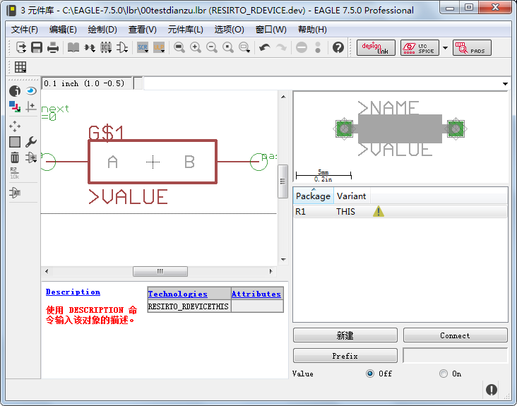
4. 运行 Connect 或双击该封装，，在弹出窗口中分别选中相互对应的引脚和焊盘，然后单击该窗口中的Connect 按钮将它们关联起来。
5. 运行 Prefix ，为该元件在原理图中所显示的名称输入前缀，例如R。

6. 最后单击操作工具栏中的保存按钮，将该元件保存为 lbr 文件，例如Simple _Resistor. lbr ，建议保存在EAGLE 安装目录的lbr 目录下，以方便以后使用。

注意，这里的 Simple _Resistor 文件名将在 Control Panel 的 Library 树形分支中作为元件库的名称。给Symbol 定义名称只是为了方便将其添加到 device 中。

## 创建多 gate 元件库
本节将使用一个标准逻辑 TTL 元件(541032) 为例来介绍如何定义一个具有两种不同封装( 直插和贴片)的元件库。541032 由4 个逻辑"或"门组成，其原理图符号需要 4 个逻辑门的gate 和一个电源gate 。可以把单个的或门放到原理图中使用，电源引脚开始可以在原理图中不可见，但是需要的时候可以从库中调入。

创建元件库之前必须先参考元件的数据手册。541032 的所有数据信息均是从T1 公司公开发布的芯片手册中提取出来的。通过下面的 6 个步骤就可以实现多个gate 元件库的创建:

新建一个元件库;
定义原理图符号;
定义电源符号;
定义一个双列直插封装(D1L - 14) ;
定义一个SMD 封装(LCC - 20) ;
定义元件的 Device Set 。

### 创建 Library
在 EAGLE 软件的 Control Panel 中单击文件/新建/元件库菜单可以打开元件库编辑窗口，默认包含一个 untitled.lbr 的库文件，需要的时候可以修改文件名。
当然，也可以打开一个已经存在的库文件，使用文件/打开/元件库可以打开一个您想打开的库文件，或者鼠标右键单击Control Panel 中树型浏览区的库列表，在弹出菜单中选择打开选项来打开元件库编辑窗口。

### 定义元件 symbol 符号
1. **新建原理图符号**：新建名为`2-input_positive_or`的 symbol 进入原理图编辑器。

2. **grid** ，创建任何原理图符号的默认栅格尺寸均为0.1inch (100mil)，请尽量使用此默认尺寸，至少在放引脚的时候需要如此。原理图符号的引脚和网络线放到同一栅格尺寸下是最基本的要求，否则，在原理图编辑器中可能不会产生任何的电气连接。

3. **pin**，使用 PIN 命令放置 3 个引脚，将引脚的Direction 属性设置为in 、in 和Out ，当 PIN 还粘附在鼠标右键时可以在参数栏中修改 PIN 的属性，如果 PIN 已经放置，可以在后续阶段使用 CHANGE 命令修改属性，使用 Ctrl 键配合 GROUP 和 CHANGE 命令可以改变很多个引脚，参数Orientation、Function、Length、Visible、Direction 和 Swaplevel 在如何设计一个电阻库时候做过详细的描述（参考第 191 页）。坐标原点最好位于原理图符号的中间，可能的情况下，最好不要位于引脚连接处的下面，这样在原理图编辑器中很容易选中该对象。

4. **PIN NAME**：可以使用 NAME 命令为引脚命名，在本例中，2 个输入引脚命名为 A 和 B，输出引脚命名为 Y。

5. **绘制 symbol** : 使用WIRE 命令在第94 Symbols 层绘制原理图符号的外框，原理图符号编辑器的缺省线宽为10mil，也可以选择其他宽度。原理图符号的外框原则上可以绘制成任意图形，但是为了便于阅读和作为PCB 设计参考，在绘原理图符号时通常需要遵循习惯，原理图中的引脚排列顺序一般不是引脚图中的次序。

6. NAME 和 VALUE
第95 层(Names 层)为原理图符号放一个名称变量: > NAME; 
在第96 层(Values 层)为原理图符号放一个值的变量: > VALUE 。
把这两个文本变量放到图中合适的位置。文本变量与纯文本都可以在原理图编辑器中通过 SMASH 命令与元件符号拆分开来并进行移动。
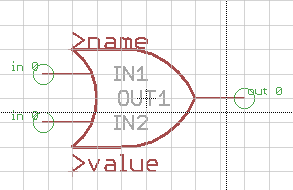

8. Description 描述
单击 Description 项可以为原理图符号添加描述信息。您可以用在信息格式中使用 HTML 标记。请参见帮助功能页面中关于 HTML text 的更多信息。
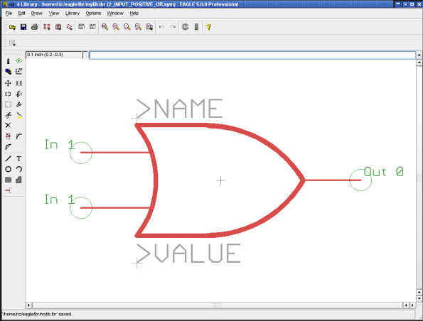

### 定义电源符号
元件的电源符号需单独绘制，并且在原理图中不能通过 ADD 命令添加，而只能通过 INVOKE 命令来添加。此处的逻辑元件541032 需要使用 2 个引脚来定义电源符号。

定义元件电源引脚的信号流向为 Pwr，这意味着该引脚是该元件的电源引脚。信号流向为 Pwr 的所有引脚会自动相互连接起来（即便没有网络线连接也是如此），无论该引脚在原理图中是可见、或者隐藏均是同样的结果。

单击symbol，在弹出对话框的New 文本框中输入新建电源符号的名称(比如: VCC-GND) 后确认，进入电源符号的编辑界面，然后依次执行以下操作:
1. **grid**: 同样设置栅格大小为100mil 。

2. **pin**: 使用PIN 命令放置 2 个引脚，坐标原点最好放在图形中间附近，将 2 个引脚的 Direction 属性设置为 Pwr ， Swaplevel设置为0 ，只显示 pad 焊盘，然后放置在以坐标原点为对称点的位置。如果第 93 层（Pins 层）设置为可见，则可以看到标签显示为 Pwr 0

3. **pin name**：通过 NAME 命令分别修改引脚名称为Vcc和GND。出于显示效果考虑，我们会把关键的 Visible 属性设置为 Pad，并使用 TEXT命令把引脚标签放到第 95 层（Names 层）在引线侧边添加VCC和GND；

4. **>NAME 和 >VALUE** 文本变量: 在第95 层(Names 层)使用TEXT 命令写人下面的名称变量: > NAME ，并把它放到合适的位置，电源符号没有VALUE 文本变量，因此不需要进行定义。
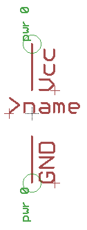

#### 不可见的电源 Pins
通常，我们并不希望在原理图中画逻辑元件或者运放的电源，如果需要这样，则必须定义特定的原理图符号和电源连接，下面以一个实例 TTL 电平的 7400 元件来作为示例：
首先，需要定义一个名为 7400 的 Gate，确认原理图符号编辑器中的属性是否如下：
2 个输入 Pin 分别叫 I0 和 I1，并且信号流向为 In，Swaplevel 为 1，visible 可见性 设为 Pin可见pad不可见，function 引脚功能 设为 None。
输 出 引 脚 定 义 为 O ， 信号流向为 Out ， Swaplevel 为 0 ， visible 设 为Pin，function 设为 Dot。（见下图）
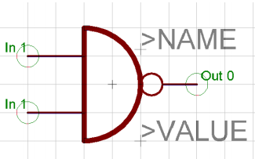
与非门原理图符号 7400（欧标表示法）
然后定义电源 Gate，名称为 PWRN，属性如下：
2 个引脚分别命为 GND 和 VCC，信号流向为 Pwr，Swaplevel 为 0，visible 设为 Pad，function 设为 None。（见下图）
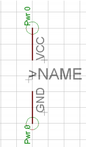
电源 Gate
现在，我们到 Device 编辑器中定义 7400 Device：
使用 PACKAGE 按钮指定一个封装（该封装必须在库中存在），使用 PREFIX 按
钮指定前缀为 IC。
使 用 ADD 命 令 分 别 4 次 载 入 原 理 图 符 号 7400 ， 并 且 设 置 Addlevel 为Next，Swaplevel 为 1，使用 NAME 命令分别命名为 A、B、C 和 D。Addlevel 为 Next 意味着这 4 个 Gates 是按照一定的顺序依照 Device 中的次序放到原理图中。
最后放 PWRN 电源符号，并设置 Addlevel 为 Request，Swaplevel 为 0，名称为 P。
Addlevel 为 Request 指明了两件事情：
- 该电源 Gate 只是在需要的时候才会被放到原理图中（比如：使用 INVOKE 命令），ADD 命令仅仅只能放置与非门 Gate。
- 原理图分配元件名称时并不包含电源 Gate，即便该 IC 包含 2 个 Next属性的 Gate 比如：IC1A，IC1B。一个 Next 属性的 Gate 和一个Request 属性的 Gate 会被原理图编辑器识别为一个 IC，即 IC1。

最后，使用 CONNECT 命令来为电源引脚分配封装焊盘。

#### 同一名称的电源 Pins
如果想为同一元件中的几个电源引脚分配同一名名称，比如：有 3 个引脚都为GND，按照下面的步骤实现：
- 为每一个电源引脚的信号流向设为 Pwr
- 命名这 3 个引脚分别为：GND@1，GND@2，和 GND@3 仅仅只有@之前的字符会在原理图中显示，这样看起来好像它们 3 个的名称都是 GND 一样，在电路板中，相关的焊盘会自动用鼠线连接在一起。
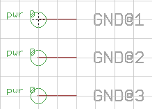

### 定义 Package 符号

#### 定义直插封装
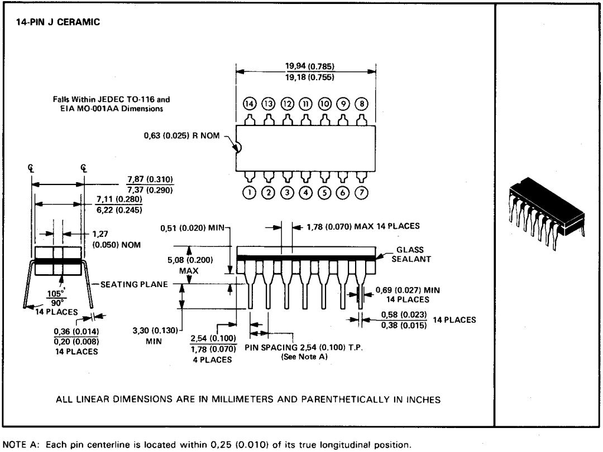

定义一个双列直插封装，541032 的 DIP14( EAGLE 称为DIL-14 ) 封装引脚间距为2.54mm(0.1inch) ， 外框宽度为7.62mm(0.3 inch) 。如果其他库文件中有适合的封装，可以复制到当前的库中，这样就不必定义一个新的封装。

1. **点击 Package** ，新建封装名称，如DIL-14。

2. **Gride** : 使用GRID 命令或按钮设置合适的栅格尺寸(比如50mil) ，并让栅格线可见。使用功能键 F6 可以很容易地显示和隐藏栅格。

3. **Pad** : 使用Pad 命令或按钮放置通孔焊盘。焊盘应该放到靠近坐标原点的位置， 一般情况下建议将第一个焊盘放置到原点上，或者将原点作为整个封装的中心点。第一个焊盘放置完成后通过 NAME 命令将该焊盘的名称修改为 1 ，设置焊盘外形为 Long 长形，焊盘直径使用常用标准值Auto( respectively 0 ) 。

4. 绘制丝印：绘制丝印: 使用WIRE ， ARC , CIRCLE , RECT 和POLYGON 按钮或者命令在第21 层（tPlace 层）绘制需要在电路板上看得见的丝印符号。
标准线宽(使用CHANGE WIDTH 命令可以修改线宽)通常为8mil 或4mil ，具体的宽度取决于元件的尺寸。
有时候需要在第51 层( tDocu 层)创建额外的看起来更好看的丝印，这些丝印可以覆盖焊接区域，但实际上并不会在制造数据中输出，也就是说不会影响后期的焊接。
**注意**：请确认丝印未覆盖焊接区域，否则当电路板焊接时会出现问题，必要的时候使用 GRID 命令来设置一个更合适的栅格尺寸或使用 Alt 键来选择更小栅格。
5. 添加名称和值的文本变量: 使用TEXT 命令在第25 层(tNames 层)上放置名称的文本变量: > NAME; 然后在第27 层(tValucs 层)上放置值的文本变量: > VALUE 。
如果想放一个和封装方向呈180°颠倒的字体，必须激活参数工具栏中的Spin 旋转参数; 放置好的文本可以在元件放置到PCB 编辑器中后使用SMASH 和 MOVE 命令重新调整。建议将文本变量设置为向量字体，这样可以确保文字在PCB 编辑器中和电路板上看起来一致，text命中设置。
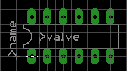
6. 绘制Areas Forbidden 元件禁止区域: 可以在第39 层（ tKeepout 层）使用 RECT 命令绘制一个覆盖整个元件的禁止区域，或者使用 WIRE 命令绕着封装绘制一个外框，这样在PCB 中可以确保让 DRC 检查是否有元件靠得太近或者重叠。
7. 定义Description 描述: 在编辑器的下方描述区域单击Description 可以打开十个描述窗口，输入描述文字或者EAGLE 允许的HTML 格式的文本，比如下面格式:
```
<b> OIL-14</b>
<p>
14 - Pin Oual lnli ne Plastic Package. Standard Width 300 mi l
```
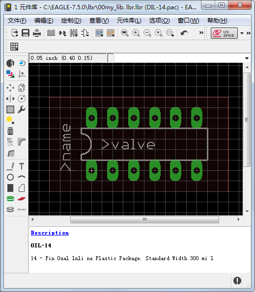

#### 定义 SMD 封装
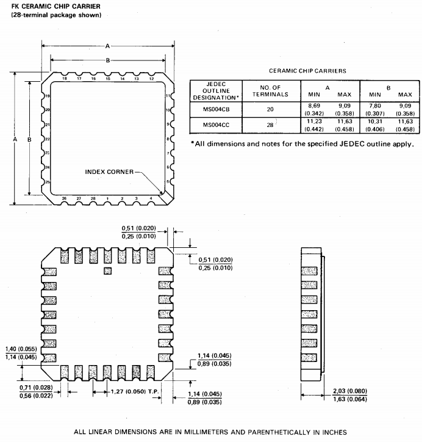
贴片封装外形尺寸图，FK 版本


该元件的另外一种封装LCC- 20 为SMD 表面贴装封装。
LCC封装，Leadless Chip Carriers 无引线芯片封装。
贴片引脚的尺寸为0.8mm x 2.0mm ，第一个引脚为0.8mm x 3. 4 mm ，要稍微大一点。

1. **新建封装**：点击package 新建封装，如 LCC-20。

2. **grid**: 调整栅格尺寸为0. 635mm (25 mil)并让栅格线可见，建议在设计这种封装时设置一个更小的备用(即栅格设置窗口中的 Alt 项)栅格尺寸(例如 0.05 mm) 。

3. **SMD**：沿水平方向靠近坐标原点的上下区域内放置两行焊盘， 每行5 个焊盘，相互间的距离为 1.27mm 。
因为焊盘尺寸0. 8mm X 2. 0mm 并不在SMD 的菜单列表中，因此必须在开始放置 SMD 焊盘前在命令栏中运行下面的命令参数:
0.8 2
使用同样的方法在原点的左右区域放置两列 SMD 焊盘，放置的时候使用鼠标右键菜单命令旋转90°
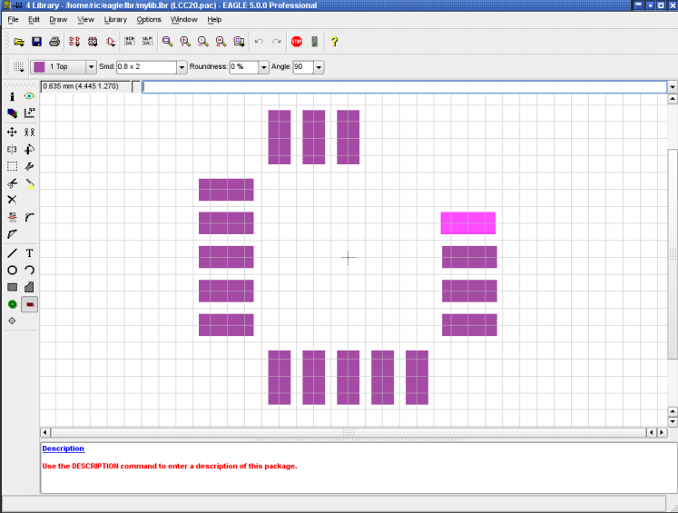

使用 GROUP 和 MOVE 命令将这所有 SMD 焊盘移至合适的位置，必要的时候可以按住 Alt 键使用备用的 0.05mm 栅格。最上方第 3 个SMD 焊盘( 此封装数据手册中规定的第一个焊盘 )需要使用 CHANGE SMD 命令来修改尺寸，在命令栏运行如下命令：
CHANGE SMD 0.8 3.4
然后单击该SMD 焊盘，再使用MOVE 命令拖曳其到一个正确的位置。
若需要检查和修改焊盘的位置和属性， INFO 命令是首先的选择。
最后通过NAME 命令将SMD 焊盘按照数据手册中的顺序重新命名。

绘制丝印、添加 >NAME 和 >VALUE 文本变量、禁止区域等和前面创建 DIL14 封装时类似，此处不再重复。唯一不同的是在描述对话框内输入的描述文本:
```
<b> LCC - 20</b>
<P>
FK ceramic chip carrier package from Texas Instruments.
```
通过搜索描述中的关键字可以很容易在ADD 命令的弹出对话框中搜索到该封装。

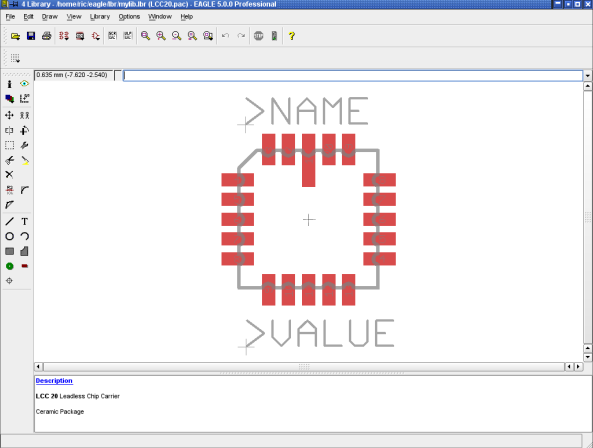


### 定义 Device set
Device Set 是把 Symbols 和 Packages 联合起来组成一个实际元件的连接关系。
一个 Device set 由数个 Devices 组成，这些 Devices 在电路原理图中使用相同的电路符号，但是  technologies 和 Package 变体不同。
定义Device 或者Device Set 通常包含以下步骤:

- 添加 Symbol ，并命名和定义属性。
- 添加 Package ，并制定封装变量。
- 使用 CONNECT 命令将原理图符号中的引脚和封装中的焊盘进行关联。
- 定义 Technologies (如果需要的话)
- 定义前缀和配置 Value 单选项
- 定义器件描述

___

1. **新建Device**，单击Device ，命名如54*1032A?。
**通配符：**
“ * ”显示该元件所包含的 Technologies
“ ? ”显示封装变量，如果不添加“?”号，则封装变量会自动放在Device 名称的末尾。

2. **add symbol** ：运行ADD，把属于该 device 的原理图符号调入编辑器中，如：在打开的窗口中选择2 - in put _ positive _ or 符号并放人编辑器中，总共需要放置4 个符号，也就是 4 个gate 。然后再次单击ADD 命令按钮，选择"Vcc - GND"符号并将其放在4 个gate 的附近。

3. **gate 命名**: 在 Device 中的原理图符号被称为 gate ，在放人 gate 的时候系统会向动命名为`G$1` 、`G$2`. . . 等等，这些名称不会在原理图中显示出来。因此单个gate 的元件通常不需要修改gate 名称，但是当元件中包含很多个gate 时，最好通过 NAME 命令来修改各个 gate 的名称，例如分别修改为A 、B 、C 和D ，电源 gate 命名为P 。

4. **Addlevel** : Addlevel 用来指定当使用 ADD 命令时， gate 放置到原理图中的顺序或属性。在当前的窗口中可以看到每一个gate 的 Addlevel 值。该值位于 93 pins 层。
使用 CHANGE 命令为 gate A 到D 分配Addlevel 值为Next ，为电源gate 分配Addlevel
值为 Request。
这样做的目的是， 一旦第一个gate 被放到原理图编辑器中， 下一个gate 就会自动粘附在鼠标右键上，因此所有的这 4 个gate 可以依次被放置到原理图中。电源 gate 不会自动放到原理图中，必要的时候可以使用 INVOKE 命令来放电源 gate。

5. **Swaplevel** : Swaplevel 参数决定了放到原理图中的Device 的 gate 是否可以互换，该参数和 Addlevel 参数的设置方式几乎一致，默认值为0 ，意味着该gate 不能互换， Swaplevel 的取值范围为0 ~255 ，大于0 并且数值相同的gate 可以互换。
本例中的 4 个gate 均可以互换，因此要使用 CHANGE 命令将 Swaplevel 值全部修改为1 。设置方法和Addlevel 一致。

6. **封装变量 package variants** : 单击 Device 编辑器窗口右下方的 New 按钮，弹出一个已经在元件库中定义了封装的窗口，选择 DIL - 14 封装并指定版本名称为 J，单击OK 按钮。重复前面的步骤，选择 LCC-20 ，指定版本名称为FK 。
封装变量入口如果有一个带“ ! ”感叹号的三角形标注，这意味着 Symbol 的引脚还没有完全和 Package 的引脚建立对应关系。
可以使用其它库中的Package，使用package命令将其他库中package 复制到当前变量中，并且命名一个新的变量。
PACKAGE DIL14@d:\EAGLE\lbr\ref-packages.lbr J
从 ref-packages.lbr 库中复制 DIL14 封装到当前的库中，同时为该封装产生一个变量 J
这时在Device 编辑器右边的列表中可以看到所选封装变量， 上面会显示封装的简单图示。
右击某个封装后在弹出菜单中可以添加新封装、删除选中的封装、改变封装变量名、定义封装的Technologies 、编辑选中的封装、以及对选中封装的焊盘和原理图符号的引脚进行关联。
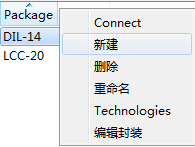

7. **connect pin and pad**关联引脚和焊盘 : 这是定义元件库中最重要的内容，可以将原理图符号的每一个引脚分配给 PCB 封装的某个焊盘或多个焊盘，这样的定义是为了把原理图中的网络转变成 PCB 图中的信号线。引脚上的每一个网络会都会在焊盘上创建一条信号线， 541032 的引脚分配图在数据手册中已经定义， 需要仔细检查它们之间的对应关系，此处的一个微小错误会导致整个电路板报废。
在封装列表中选择封装变量名为 J 的封装，然后单击Connect 按钮或在编辑器命令框中输入CONNECT 命令。
窗口分为三部分，原理图符号的引脚列表位于左边部分， PCB 封装的引脚列表位于中间部分。首先单击选中其中一个引脚，然后选择相对应的焊盘，然后单击Connect 按钮，将它们关联起来，其他引脚和焊盘采用相同的操作，关联完成后，单击OK 按钮完成分配。
使用上面同样的方式对另一个封装进行关联操作。
请注意，第二个封装关联完成后会多出 6 个没有连接的焊盘，这种焊盘数量大于引脚数量的情况是允许的，单击OK 按钮完成关联即可。
关联完成后，在编辑器右方列出的封装变量旁边就会出现绿色的勾，这意味着所有引脚都已经关联到了相应的焊盘上。

注意：要个说来，一个pin必须且只能和一个pad关联，不允许几个引脚同时关联到一个焊盘上！可以几个焊盘同时关联到一个pin上。device中封装焊盘的数量可以大于原理图符号引脚的数量，但引脚不能大于pad的数量，可以存在未与pin关联的焊盘，但不能存在未与焊盘关联的引脚！信号流向为NC（不连接）的引脚也必须和焊盘相关联！

8. **定义 Technologies** : 前面介绍过，541032 使明2 种不同的 Technologics : AS 和ALS。在第一阶段使用"*"占位符定义过 device 的名称，当在原理图中添加元件时， ADD 窗口中就能看到所定义的Technologies 代替"头"出现在元件名称中。541032 的数据手册中显示了每种封装中的 2 种不同的Technologies 。
在Device 编辑器的右边选中封装变量名为J 的封装，然后单击编辑器下方的Technologles，进入定义窗口。
在窗口中的 New 文本框内中输入Technologies 的名称后单击 OK 按钮即可添加Technology ，同样的流程可以定义FK 封装，最后再次单击OK 按钮关闭窗口，完成定义工作。如果需要删除某个封装的某个Technology ，可以在上图中取消其左方多选框内的选中状态，然后单击OK 按钮即可。
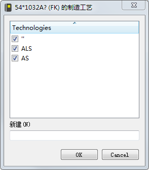

9. **Prefix 前缀**: 单击Prefix 按钮可以简单定义封装的前缀，比如本例中可以定义
为 IC 。

10. **Value Off or On**: Value 项的设置决定了在原理图和PCB 编辑器中元件的
VALUE 文本变量的内容是否由软件自动生成。
**On** : 选择为On 时，元件在原理图和PCB 编辑器中不会自动由软件来定义VALUE 文本变量的内容，需要通过VALUE 命令手动添加。
**Off** : 选择为Off 时，元件在原理图和PCB 编辑器中的VALUE 文本变量内容由软件自动将Device 的名称加上Technologies 和封装变量生成(比如74LSOON) 。如果通过VALUE 命令进行修改，软件会弹出警告对话框要求确认。如果您改变了初始值，并准备在后面阶段使用另外的 Technologies 或者封装变量（使用 CHANGE PACKAGE 或 CHANGE TECHNOLOGIES 修改），用户自定义值不会改变。

11. **Description 描述**:单击编辑器下方的Description 可以打开一个描述对话框，在其中输入便于进行关键字搜索的描述文本，在原理图中使用 ADD 命令加载时，该文本可以用于搜索元件。比如:
```
<b> S41032A<jb>
<p>
Quadruple 2 - Input Positive - OR Buffersj Dr ivers from TI.
```

12. **Save 保存**：Device Set 的定义到此为止全部结束，如果还没有保存文件，请记得一定要保存！


### 创建新的 package variants变体
多数的元件具有多种不同的封装，如果您在库中没有发现已确定 Device 的适合的 Package，可以很方便的定义一个新的 Package。
利用 Device 541032A 的例子来很清晰的描述该流程。
此处的第三个 Package 变量仅仅作为一个例子来讲述，它和供应商的数据手册并不一致！

#### 复制其它库中的 Package
参考本笔记关于 package 的复制
1. **Package Variant 定义封装变量**
新的变量命名为 Test，该封装必须包含 14 个焊盘，因为所有的 Gates 的引脚加在一起有 14 个，比如：我们可以从 smd-ipc.lbr 库中调入 SO14 封装。
将 Control Panel 界面和库编辑器界面并列显示，选择 SO14 封装然后拖到 device 编辑窗口中，释放鼠标后会弹出一个需要输入新封装变量名称，输入名称，单击确认后，新的变量就会出现在封装列表中。
也可以在 Device 编辑窗口中使用 PACKAGE 命令来定义封装变量。
在命令栏中输入如下命令：
`PACKAGE SO14@smd-ipc.lbr TEST`
或者包含路径的命令（必要的时候）
`PAC SO14@d:\EAGLE\lbr\smd-ipc.lbr TEST`
如果路径中包含空格，则需要在路径的前后使用单引号‘’，比如：
`PAC 'SO14@\With Spaces\smd-ipc.lbr' TEST`
在 SO14 变量的右边会出现一个中间是黑色感叹号的黄色三角形，这表示当前的SO14 封装还没有和原理图符号中的引脚相匹配。
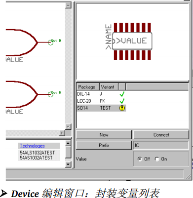

PACKAGE 命令复制一个完整的封装到当前库中，并能使该 Device 的给定封装变量可用。
如果想去掉前面定义的新封装变量，可以使用 UNDO 来实现（as far as possible），或者右键单击新建变量，在弹出的菜单中进行删除。

2. **Connect 命令**
单击 Connect 按钮会弹出 Connect 菜单，单击具有关联性的引脚和焊盘进行关联。
另外还可以根据一个已经存在的封装变量来改变引脚/焊盘之间的关联。
本例中，DIL14 封装的引脚分配和 SO14 封装的引脚分配一样，因此，在 Connect 菜单中的 Copy  组合框中选择 DIL14 进行复制引脚分配关系。单击 OK，完成 CONNECT 命令。

3. **定义 Technologies**
目前，54*1032A 有 2 中可用的 Technologies（ALS 和 AS），这些同样可以设置到新的封装变量中。
在 Device 编辑器的右下角的列表中选择 Test 封装变量，单击描述区域中的Technologies 文本打开 Technologies 窗口，按照以前设置 Technologies 的方式为新的封装变量 Test 设置 ALS 和 AS 两种 Technologies。

4. **Save 保存**
到此为止，已经完成了封装变量定义，最好保存该元件库。

#### 从另外一个库中使用一个已经修改的 Package
如果在其他库中不能找到适合的封装，可以选择一个相似的封装，并把它复制到当前的库中，修改后作为 Device 的一个新的封装。

1. **复制 Package**
我们想使用 smd-ipc.lbr 库中一个名称为 SOP14 的封装，这个封装在 my_lib.lbr 中的名称为 MYSOP14。
2. **使用 COPY 命令** 
在库编辑器的命令输入栏中输入如下命令（其实并不在意在哪一种编辑器下）：
`COPY SOP14@smd-ipc.lbr MYSOP14`
或者包含整个路径的命令：
`COPY SOP14@d:\EAGLE\lbr\smd-ipc.lbr MYSOP14`
如果路径中包含空格，则必须使用单引号‘’将其包含，比如：
`COPY 'SOP14@\P A T H \smd-ipc.lbr' MYSOP14`
一旦执行上述命令，就会打开一个 Package 编辑窗口，在必要的时候可以修改封装。

3. **在 Control Panel 中**
首先，使用 File/Open/Library 菜单打开库编辑器，没有必要选择特定的编辑模式。现在，切换到 Control Panel 界面（使用Window 菜单），打开元件库的树形浏览区，找到我们需要的封装然后选中，在 Control Panel 的右边会显示所选中封装的信息。如果我们在电脑屏幕上同时显示 Control Panel 和库编辑器，可以使用鼠标将该封装从 Control Panel 移到库编辑器中，释放鼠标后，库编辑器会进入Package 编辑模式，并且显示所移动的封装。
另外一种方式是首先开启需要编辑库文件，然后鼠标右键单击树状目录下的封装入口，在弹出的窗口中选择复制。现在可以编辑所复制的封装，当前封装名称仍然保留以前的名称，使用RENAME 命令可以修改封装的名称，完成之后，请别忘记保存文件。

#### Variant 定义变量
如果想为前面的例子定义更多的变量，可以使用 元件库/Device 菜单切换到 Device 编辑模式中并打开编辑窗口，选择 54*1032A，单击 OK 打开 Device 编辑窗口。
使用右边的新建按钮来定义一个新的封装变量，比如变量名：TEST2，单击 OK
确认后就会在封装列表中看到一个名称为 TEST2 的变量。
然后使用 CONNECT 命令来关联原理图符号引脚和封装焊盘，并定义不同的Technologies（可以参考前面的章节），到此为止完成了一个封装变量的定义。

## 特殊元件库
在电路设计中， 经常会碰到一些特殊的元件封装，这些封装很多时候需要设计者自己创建，比如焊盘形状不规则、焊盘相对位置采用极坐标方式、有些原理图符号没有封装等等情况。
本节仅介绍部分特殊元件库创建时需要考虑到的事项，希望能够在设计者创建其他特殊元件库时作为的一种参考。
如果适合的封装已经在当前的库中存在，请参考本笔记之前的操作。

### Supply Symbols 电源符号
电源库文件中包含的电源符号( 如GND 、AGND 、Vcc、Vcc3 等)是原理图设计中经常使用的符号。这种元件库是一种没有 PCB 封装的元件库。也就是说电源元件库文件中只包含Device 和 Symbol ，而没有Package。在自动放置网络时需要它。

1. **引脚方向 Sup**：以GND 电源为例， 其 Symbol 上引脚的 Direction 属性应该设置为Sup ， Name 定义为 GND ，这就意味着该 Device 会自动把所有 GND 信号连接在一起。只有使用sup，才能建立没有 package 的元件

2. **>VALUE 值设置**：值变量（>VALUE）用于标注信号，该 Device 的名称同样为 GND。由于EAGLE 默认情况下会使用 Device 的名称作为它的值，因此应该使 Device 的名称和引脚名称保持一致，均为GND ，这样电源符号的值，变量 ( >VALUE ) 在原理图中会显示为GND 。
使用标签来显示pin名称非常重要，否则用户根本不知道哪些信号自动连接在一起。
引脚参数 Visible 应该设置为 Off，否则对引脚名称的放置、方向或尺寸的操作将无法进行。（需要用samash命令，分离电源符号后才能进行这些设置）这里也可以直接使用文本 GND 来标注。根据所选的不同设置，该符号可以用于不同的 Device 中（比如：DGND 等等）。

3. **Addlevel**：next

4. **Value**：如果把Device 编辑界面中的 Value 命令设为Off ，则软件会自动将 Device 名称作为 VALUE 文本变量在原理图中所显示的内容，相反，则不会自动定义 VALUE 的值，而需要通过 VALUE 命令手动添加，因此建议在定义Device 时将Value 命令设置为Off。如果把值设为 on，就可以获得更大的灵活性。如果您使用了第二种地电平，则您可以对该值进行修改，然后为第二个地电平建立单独的网络。

下面是快速定义一个电源符号的步骤:
· 在库中创建一个新的符号。
· 放置引脚，设置Direction 属性设置为Sup 。
· 命名引脚名称和信号名称相同。
· 添加VALUE 文本变量。
· 创建一个新的Device ，并将Device 的名称命名为信号名称。
· 添加之前创建的电源符号并进行相应的设置。
· 保存电源元件库。

### 原理图外框文件 Drawing Frames 
笔记《Library Editor 元件库编辑》中，含有对命令Frame的讲解。

原理图的绘图外框并不是一个元件，但是它们可以被定义成既无封装，也元引脚的 Device。这类Device 可以放在 EAGLE 的 frames 库中，该库中所有的符号仅仅由一些不同尺寸的外框和文档记录区（document field）组成，并且文档记录区也可以定义成一个符号。
通过 FRAME 命令绘制框架，该命令一般用于建立外框库文件，可以在 Draw/Frame 菜单中找到。

外框的档案记录区，包含文本变量 `>DRAWING_NAME`、`>LAST_DATA_TIME`、`>SHEET` 等，还有一些固定的文本。在添加了这些文本变量后，设计文件的文件名、最后修改日期和时间、实际文办页面好（如：2/3 = sheet 2 of 3）会在原理图的档案记录区显示出来。
文本变量 `>PLOT_DATE_TIME` 可以使用来记录最近打印输出的日期和时间。所有的这些文本变量都可以放到原理图和PCB 图(>SHEET 变量除外) 中。

**Addlevel** 外框符号为Next ，档案记录区的Addlevel 值为Must 。意思是如果外框存在，则不能单独删除档案记录区。

另外还可以定义外框封装来单独放置到PCB 设计中。
由于外框没有任何引脚和焊盘，所以即使在原理图和相应的PCB 设置同时打开的情况下，也可以直接在PCB 设计中放置外框封装，而不会受到正反向标注功能的影响。

### 继电器元件库
Relay 继电器：继电器的 Coil 线圈和第一对触点 Gate 必须被放到原理图中
继电器元件库是一种具有很多 gate 的元件库，不同的是继电器线圈和第一对触点gate必须同时被放到原理图中。一个继电器一般包含3对触点，但常见的应用中仅仅使用第一对触点。
在Device 编辑器中，分配线圈 gate 和第一对触点 gate 的 Addlevel 值为Must ，其他的触点 gate 为 Can 。

如果使用 ADD 命令将该继电器符号放置到原理图中，线圈gate 和第一对触点 gate 首先会进行放置，其他触点 gate 可以使用 INVOKE 命令来添加。线圈 gate 本身不允许删除，当所有的触点 gate 被删除后，该线罔gate 会消失( 从Addlevel 值为 Can 的 gate 开始删除)。
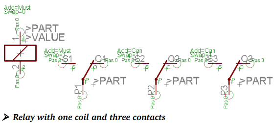

### 元件交叉参考链接 Cross-References
如果想为电气原理图定义一个包含线圈 Gate 和几对触点 Gates 的 元件，比如机电继电器，可以定义一个为元件产生 Cross-References 的带占位符的触点符号，这对触点会在原理图中显示 Cross-References。

在原理图设计时，多数情况下触点和线圈并不会紧挨在一起，有时候甚至会出现在不同的原理图界面中，为了让触点和其线圈产生明显的交叉关联(Cross - References ) ，很有必要为触点符号添加交叉关联信息。

为了能在原理图中正确显示 Cross - References ，请参照下面的规则来定义原理图符号symbol、package、device。

#### 定义symbol
定义一个机电继电器需要使用一个线圈symbol 和一个或多个触点symbol。
1. 参照如下规则定义触点symbol：
· 触点 symbol 的中心位置应该为(0,0) ;
· 引脚应该垂直放置，即朝上或者朝下;
· 为了能让触点符号自动产生 Cross - References ，使用TEXT 命令在第 95 层(Names层)放一个占位符文本`>XREF`和`>NAME` 、`>VALUE` 一样 ;

2. 线圈符号的定义不需要特殊的规则，也不需要`>XREF`占位符文本变量。
`>part` 显示前缀+自动生成的序号。
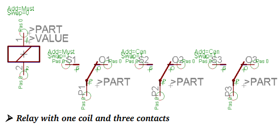

#### 定义 package
因为EAGLE 库架构原因，和为了避免产生错误信息，最好还是定义一个封装。可以定义一个虚假的封装，并且其焊盘数量和 Device 中的引脚数量相同。

#### 定义 Device
此处定义的机电继电器包含好几个 Gates：一个线圈 Gate，几个触点 Gates。在 Device 编辑器中放入 Gates 时需要遵循下面的规则，否则原理图中的 Cross-References 将不会被最佳显示。

1. 第一对触点 gate (指触点) 的坐标必须在 X 轴为0 的位置上。gate 上较低的引脚需要全部放在正坐标范围， Y 轴通常为0.1inch 。

2. 每一个后面的 gate 需要放在第一个的右边， 并且Y 轴坐标相等(即高度相同)。在 Device 编辑器中触点 gate 之间的距离最终决定了原理图中 Cross - Refercnces 的表现方法，触点 gate 需要旋转90°，并且按照垂直方向一个接一个排列。

3. 线圈 gate 可以放到Device 编辑器绘图区中的任何位置，其Addlevel 值为Must 。

触点 Cross - References 的表示方法显示了具有 >XREF 文本的所有 gates 。如果在原理因页面中使用FRAME 命令定义了绘图外框，包含原理图界面数和行列坐标的 Cross - References 信息会显示在 gate 的右边。在原理图符号中定义的其他文本不会在 Cross - References 中显示。

在 Device 编辑器中选择 New 按钮选择刚建好的 Package，然后使用 CONNECT命令分配引脚和焊盘之间的匹配关系。
更多关于电气原理图的信息，请参考 Cadsoft 的官方网站

### 特殊板载连接器
Connector 连接器：一些连接器的引脚会被忽略
正常情况下，板载连接器所有的连接区域都会设计成可见，但在某些情况下可能需要忽略掉其中一些连接区域。
创建一个具有 10  个SMDs 焊盘的板载连接器封装并依次命名1 to 10。


然后再创建只有一个引脚的原理图符号。
将设置 Visible 可见参数设置为Pad ，这样就可以把 Package 中的1 ~ 10 的焊盘在原理图中表示出来。
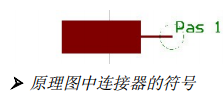

然后在一个新建Device 编辑器中放入10 个原理图符号，为每一个符号的 Addlevel 值设置为Always ，使用 CONNECT 命令或者按钮来对引脚和SMD 焊盘进行关联。
完成关联后， 在原理图编辑器中调入刚建好的Device ，所有的连接都会出现在原理图中，可以使用 DELETE 命令单独删除不需要的连接。
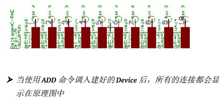


### 带有 Fixing Hole 定位孔和 Restricted Area 限制区域的连接器
在焊接侧(底层)上定义了安装孔的连接器会让自动布线器自动预留一定距离来禁止布线。
具体实现方式是在Package 编辑器中使用 HOLE 命令放置一定直径的钻孔，钻孔直径也可以在后面使用 CHANGE DRILL 命令修改内径。
使用 CIRCLE 圆形命令在第42 bRestrict(限制层)为自动布线器/ 跟随布线器画一个禁止布线区，为了便于清楚的显示该区域，需要使用一个非零的线宽来绘制，线宽大于0。如果线宽设置为 0，则便是时一个实心区域。但这两种情况对于自动布线器没有任何效果，因为在任何情况下自动布线器都不会在圆环内布线。当然，在第16层(底层)使用多边形敷铜时也会考虑禁止区域。
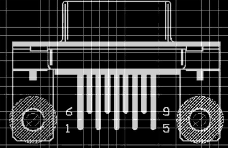

### Oblong Holes 长圆形钻孔的元件
如果电路板制造商通过铣加工工艺来制造长圆形孔，您还需要在一个单独的层绘制一个铣加工的轮廓，通常使用的 46 层（Milling 层）。
制造长圆形孔的轮廓线可以在 Package 编辑器中使用 WIRE 命令（也可能会使用ARC 命令）来绘制，线宽设置为最小或者为 0。
在轮廓线里面放一个具有钻孔直径的焊盘(即焊盘边缘处于轮廓线内)或者在顶层或者底层放置SMD焊盘来作为长圆形孔的基点。
在多层电路板中，应该在所使用到内部层长形孔位置手动画一条覆盖长圆形孔的轮廓线，以便在开口处产生 Restring 设置的值。
请告知制版厂商应当注意该处的 Milling 层上长圆形数据信息，并且告知该长圆形孔是否需要电镀。
任何其它需要在电路板中切割的地方均按照同一方式处理：使用单独的层，通常选择 46 Milling 层来绘制铣加工的轮廓线，并需要告知PCB 制板厂商特别注意此处信息并做特殊标识。

## 元件库的管理
### 复制元件库元素
#### 在一个元件库中复制元素
>The easiest way is to do this in the Table of Contents of the library.

最简单的方法是在元件库内容表中完成这一操作。
>Each object has a context menu that offers a Duplicate entry. 

每个对象都有一个上下文菜单提供一个 Duplicate 副本入口。
>You will be asked for a new name for the new Device/Symbol/Package then.

你将被要求为新的 device/symbol/package 提供一个新名字。

**Alternatives:替代方案**
If you want to use a Symbol or a Package which already已经 exists存在 in a related 相关manner方式 for a Device definition you can copy it within the library with the commands GROUP, COPY, and PASTE. 

假如你想使用的symbol 或package 已经存在于一个 device 定义的相关方式中，你可以使用命令 GROUP, COPY, and PASTE 在库内拷贝该元素
Afterwards it can be modified as requested.

此后，它可根据要求进行修改。
The following sections部分 explain解释 every single step with the help of an example Package taken from linear.lbr.

下面章节将会以 linear.lbr 库中的一个 Package 来讲述复制元件库的每一步。

1. **打开 Library**
在 Control Panel 中使用菜单文件/打开/元件库来打开 linear.lbr，或者右键单击树形浏览区下的 linear.lbr 条目，在弹出菜单中选择“Open”。

2. **编辑经已存在的 Element**
使用菜单元件库/Package，选择 DIL08 封装，然后单击 OK 会打开封装编辑窗口。
使用 DISPLAY 命令显示所有的层。
画一个外框，该框包括 所有需要使用 GROUP 或者 GROUP ALL 命令复制对象。
接下来单击 COPY 按钮，右击界面空白区域并选择 copy : GROUP 。

3. **定 一个新的 义 Element**
再次单击操作工具栏中的 Symbol 或Package 按钮，并在New 文本框中输入符号的新名称，最后单击OK 按钮进入新符号编辑界面。
该处在弹出的编辑窗口中输入名称 DIL08-TEST，单击 OK 确认。
单击 PASTE 图标后，前面复制的 DIL08 封装就会出现在鼠标上，在一个合适的位置单击鼠标左键放入复制的封装。
通过在 COPY 和 PASTE 命令后输入坐标可以将对象组复制到特定的位置。这种方式对于起初创建时栅格有误的 element 非常有用。
COPY (0 0);
PASTE （10 0）;
对象组将会被放置到坐标为（10 0）的位置。
给定的坐标值主要用于 CUT 和 PASTE 命令来移动封装到一个合适的坐标位置上。这样可以避免封装被放到一个不合适的栅格位置上。

同样的操作流程可以适用于原理图 Symbols 的编辑！
在同一库中，Device 不能被复制！

提示：symbol 必须通过创建 device 将pin 与pad 相互关联，才能在控制面板的 library 中通过 device 显示出来，从而在原理图编辑器中使用该 symbol，因此修改后 symbol 还需要对相应的device进行定义，而package在修改和保存后无需定义 device就可以早library分支中显示出来，因此可以直接用于PCB 编辑器中。

#### 在不同元件库中复制元素
有时候需要将某个元件库中的某些Symbol 、Package 和Device 复制到正在使用的元件库中， 以方便使用。
##### 复制 Devices
如果有一个合适的 Device 或者 Device set 想应用到当前的库中，可以使用下面的 2 种方法来实现：
1. **在Control Panel 中进行复制**
使用拖拽的方式从树形浏览区中移动需要的 Device Set 到已经打开的库中。具有 Symbol（s）和 Package（s） 的完整的 Device Set 就会被复制过来并重新定义。
可以使用另外一种方式来实现，在 Control Panel 的树形浏览区中选中需要复制的 Device，鼠标右键单击该 Device，在弹出菜单中选择复制到库即可实现。
2. **使用 copy 命令复制**
例如输入下面命令
`COPY 75130@751xx.lbr`
或者使用完整路径：
`COPY 75130@d:\EAGLE\lbr\751xx.lbr`
使用上述命令后，库 751xx.lbr 中的 Device 75130 会复制到当前打开的库中。
如果路径中包含空格，比如下面的例子，就必须使用单引号‘’将路径包含起来：
`COPY '75130@d:\P A T H\751xx.lbr'`
如果 Device 需要以一个另外的名称来保存，使用下面的命令：
`COPY 75130@751xx.lbr 75130NEW`

##### 复制 Symbol
>Symbols can be copied similar类似 to Devices. 

Symbols 被复制的方式类似于 Device
>Either by Drag&Drop from the Control Panel into the open Library Editor window or with the help of the contex menu entry Copy to Library.

无论是通过从 control panel 拖拽到打开的库编辑器窗口，或是借助于上下文菜单入口复制到目标库中。
>You can also use the COPY command, for example:

你同样可以使用 COPY 命令，例如：
>COPY `diode.sym@npn.lbr diode-new`

##### 复制 Package
复制 Packages 的流程和复制 Devices 的流程很类似。
使用拖拽的方式从树形浏览区中移动需要的 Package 到已经打开的库中。完整的 Package 就会被复制过来并重新定义。
可以使用另外一种方式来实现，在 Control Panel 的树形浏览区中选中需要复制的 Package，鼠标右键单击该 Package，在弹出菜单中选择复制到库即可实现。

或者在命令栏中输入下面的复制命令：
`COPY DIL16@751xx.lbr`
库 751xx.lbr 中的 Package DIL16 就会复制到当前打开的编辑器中，如果库不在当前的工作路径中，需要输入完整的路径名称，比如：
`COPY DIL16@\EAGLE\mylbr\751xx.lbr`
如果路径中包含空格，必须使用单引号‘’来将路径包含起来，如下所示：
`COPY 'DIL16@D:\P A T H \mylbr\751xx.lbr'`
如果需要为复制的 Package 取名，请使用下面的命令：
`COPY DIL16@\EAGLE\mylbr\751xx.lbr DIL16NEW`

这样，Package 就会使用名称 DIL16NEW 来保存。
如果需要复制的 Package 的名称和已经存在于当前库中的 Package 重名，则会覆盖掉以前的 Package.
如果需要复制的 Package 已经被一个 Device 使用，并且 Pads/SMDs 焊盘的位置和名称发生了改变，EAGLE 会提示一个信息告知被改变的 Pads/SMDs 焊盘，复制操作会取消，原 Package 保持不变。
如果 Package 的焊盘数目和位置没有改变，但是改变了顺序，EAGLE 会提示是否需要更新。Device 的 Pin/Pad 关联关系可以依靠您的选择进行改变（参考CONNECT 命令）。
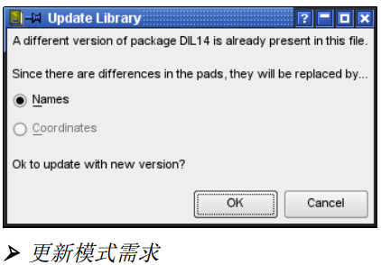

### 组件自己的元件库
之前提到的复制库的方式可以很容易地组成自己需要的元件库。
如果 Control Panel 和库编辑窗口使用同样的方式排列并能同时在屏幕上显示，则可以很容易的在 Control Panel 中通过浏览库的形式来创建用户自定义库，简单的可以通过拖拽的方式、或者通过鼠标右键单击后的弹出菜单选择复制到库来实现。

### 重命名和删除库元素
>The easiest way to remove or rename library objects is in the Table of Contents view in the Library Editor. 

删除和重命名库对象最简单的方式是在库编辑器内容列表视图中。
>Simply right­click onto the object to be removed or renamed and select the appropriate entry in the context menu.

只需在对象上点击右键，并在上下文菜单中选择相应的条目进行删除或重命名。

>Devices, Symbols, and Packages can be removed from a library with the REMOVE command. 

Devices, Symbols, and Packages 可使用 remove 命令从库中移除。
>Defining a new library element can't be cancelled by UNDO.

定义一个新的库元素后不能通过 UNDO 命令取消。

在编辑器的菜单栏中选择Library→ Remove 命令，或者在命令框中运行REMOVE 命令，
可以对任意元件库进行删除，或者删除当前打开的元件库中的Symbol 、Package 和Device。需要注意的是在输入删除对象的名称时应该加上扩展名，即lbr（元件库后缀名）sym ， pac 和dev 。或使用 remove 命令。
Packages 和 Symbols 仅仅只有在它们没有被 Devices 调用时才会被移除，否则，系统会弹出信息框“Package is in use! or Symbol is in use!”，可以通过先移除相应的 Device (Set)，或者删除 Device（Set）中的 Packages或 Symbols 来实现。

在元件库编辑器的菜单栏中选择Library → Rename 命令，或者在命令框中运行RENAME命令，可以对当前打开的元件库中的Symbol 、Package 和Device 的名称进行修改。
请注意在主界面命令框中输入被修改的名称时必须添加后缀名，即sym ， pac 和d ev ，分别表示Symbol 、Package 和Devicc ，而新的名称则不需要添加扩展名。

###更新元件库中相同类型的Package
在不同的元件库中时常会存在许多相同类型的Package ，例如DIL08 和 DIL16 等。
为了使这些Package 保持一致，可以通过UPDATE 命令来对元件库中的Package 进行更新。

首先打开需要更新的目标元件库，然后通过编辑器菜单栏选择Library-Update 命令并在弹出对话框中选择作为更新源的元件库，确定后更新源中的Package 会覆盖目标元件库中相同类型的Package 。
当然也可以通过命令行实现，例如运行UPDATE 41xx. lbr 表示以41xx.lbr 元件库为更新源，对当前编辑器打开的元件库巾的Package 进行更新。

更新完成后，EAGLE 会在状态栏中显示一个报告：
Update: finished - library modified!
如果没有 Package 被更新，则会显示：
Update: finished - nothing to do!

也可以通过命令栏输入命令来实现：
比如，如果您想使用 ref-packages.lbr 中的 Packages 来更新当前的库，输
入下面命令：
UPDATE ref-packages.lbr
如果需要从几个不同的库中更新，则可以挨着输入：
UPDATE ref-packages.lbr rcl.lbr smd-special.lbr
如果仅仅需要更新一个 Package，则输入 Package 的名称则可：
UPDATE SO14@ref-packages
不用使用.lbr 后缀，也可以使用带有全部路径的命令（参考用户手册第 237 页及以后的描述）。