# 0x08_利用CAM准备造数据
> GitHub@[orca-j35](https://github.com/orca-j35)，所有笔记均托管在 [eagle-notes](https://github.com/orca-j35/eagle-notes) 仓库

Preparing Manufacturing Data 准备制造数据

> <Schematic Editor原理图编辑器> 中含有 <CAM Processor（CAM 处理程序）> 笔记

**aperture 光孔径**
In reference to RS-274X files, an aperture is a brush shape used to draw things. 
参考 RS-274X 文档，aperture 是一个用于绘制的刷子状的东西。
Originally, the aperture was a physical hole of a specific shape and size through which light exposed a photographic film.
原本，aperture 是一个具有特殊形状和尺寸的物理空洞，通过这些空洞，灯会对胶片进行曝光。
RS-274X ：A file format used originally by photo-plotters, but now used by any machine used to fabricate circuit boards. 
一种文件格式，最初被用于照片绘图仪，但是现在被任何机器用于制造电路板。

http://www.artwork.com/gerber/appl2.htm

___

>Data output for board manufacturing is made with the help of the CAM Processor. 
>PCB manufacturer usually work with drill data in Excellon format and plot data in Gerber format. 
>How to generate such data and which data you have to pass on to your PCB manufacturer will be explained说明 in this chapter.

用于电路板制板的数据由 CAM 处理程序产生。
PCB 制板厂商通常使用 Excellon 格式的文件来处理钻孔数据和使用 Gerber 格式的文件来处理绘图数据。
如何产生这些数据以及哪些数据是您希望提供给 PCB 制板厂商的，都将会在本章中详细描述。
>A lot of PCB manufacturers generate these data with EAGLE by themselves.
>In such a case you have to pass on the board file only and you need not care about data generation. 
>You will find links to such firms公司 on our Internet pages. 

多数的 PCB 制板厂商会使用 EAGLE 软件本身来产生这些数据。
这意味着您必须提供原始的 PCB 文件并且您不用关心数据如何产生。
在我们的官方网站上会看到这些厂商的信息。
>With the help of pcb­service.ulp you will be directed to element14.com and may have an offer of partners from Farnell/Newark for manufacturing your printed circuit board. >Based on your layout and the Design Rules, key parameters for manufacturing, like board size, minimum drill size, and so on are determined.

通过 pcb-service.ulp 程序您将会链接到 element14.com 并且有机会从 Farnell/Newark 找到制作电路板的合作伙伴。
基于您的PCB布局和设计规则，就可以确定关键的制造参数，比如电路板大小、最小钻孔尺寸等等。
(或者直接登录www.elcment14.com 的Ecosystem 系统中的一项服务PCB Services，用户有机会从element14 论坛找到制作电路板的合作伙伴。对方会基于电路板的PCB 布局和设计规则.免费提供关键的制造参数， 比如电路板大小、最小钻孔尺寸以及电路板打样和批量报价，实现PCB 制板的一站式服务。)
>Your design should be complete and have passed a DRC successfully. 
>By clicking onto the link in the ULP dialog window you will be directed to the quote site of element14, where these parameters will be transferred, as well (login necessary). 
>With a few steps you get a quote for manufacturing your board.

您的设计应该完整并且能够成功通过 DRC 检查。
这样通过单击 ULP 对话框中的链接，您就可以打开element14 的报价网站，在该网站上这些制造参数将会被发送出去（需要登录）。
经过几个步骤您就可以得到制造电路板的报价了。
>If, however, your board maker is not set up to process EAGLE board files directly, you will have to supply them with a set of files. 
>What will be required will be discussed in the following sections.

然而，如果制板厂商并没有相关的资料来直接处理 EAGLE 的 PCB 文件，那么您就需要提供一整套文件。
所需要提供的文件将会在下面的章节讲述。
>Additional useful User Language Programs (ULPs) are available on CadSoft's Internet pages. 
>They can be used, for example, for the generation of glue mask data, for the calculation of milling contours, or for data regarding automatic mounting and testing equipment.

另外，一些有用的用户语言程序（ULPs）在 CadSoft 的官方网站上可以下载使用。
比如：产生用于表面贴装的点胶层数据（Glue Mask），用于铣加工轮廓线（Milling Contours）的计算，或者用于自动装配和测试的相关数据。

## 1. Which Data do we Need for Board Manufacture? 
什么样的数据会提供给 PCB 制板厂商？

>The PCB manufacturer requires specific information pertaining有关 to each step in the manufacturing process of your board. 
>This special information is  described in a file containing plot and / or drilling information.

PCB 制板厂商需要一些用于描述制作电路板流程的特殊信息。
这些特殊的信息（包含光绘/钻孔信息）会在一个文件中描述。
>For example, one file for each signal layer, for the silkscreen, for the solder stop mask, the cream frame, for a gold application, for a glue mask (for SMT devices), or for milling data regarding cut­outs in the board.

比如：信号层、丝印层、阻焊层、焊膏层、镀金层、点胶层（对 SMT 元件）或者用于电路板铣加工的 Milling 数据等需要每层一个文件。
>Double­sided boards with parts on top and bottom side require a silkscreen on both sides, or in case of SMT devices, a cream frame or a glue mask for each side.

双面板中顶层和底层都有元件的时候需要顶层和底层丝印，如果有 SMT 元件，则顶层和底层都需要焊膏层和点胶层。
>Additionally the board manufacturer needs drilling data in a separate file.

另外，PCB 制板厂商还需要一个单独的钻孔数据文件。
>If you want a milled prototype board, milling contours have to be calculated first, and generated in a specific data format for fabrication milling machines.

如果您想要一个铣床切割的原型板，用于切割的轮廓线必须首先计算，然后产生一个特殊格式的数据用于铣床的切割。
>If you want to have the parts automatically mounted安装, you need additional files in appropriate data format that depict centroid and rotational angular information.

如果您想自动装配电路板上的元件，您还需要具有描述重心和旋转角度信息的适当格式的数据。
>A bill of materials or a legend for the drill symbols can be helpful, too.

材料清单或钻孔符号图例也是非常有帮助的。

### 1.1 Gerber Plot Data 光绘数据
Gerber绘图仪数据
>All PCB manufacturers use Gerber format. 
>There are two options of Gerber format available, Extended Gerber format, also known as Gerber RS­274X (in short RS­274X), which is the most commonly used today in industry.
>The CAM Processor offers this device option as GERBER_RS274X.

所有 PCB 制板厂商都使用 Geber 格式的光绘文件。
这里可以使用 2 种选项的 Gerber 格式，Extended Gerber 格式，即： Gerber RS-274X （简称 RS-274X），这是到目前为止业内最通用的格式。
EAGLE 的 CAM 处理程序提供这种驱动选项，称为GERBER_RS274X。
>It may be the case that the PCB manufacturer works with the second option RS­274D. 
>This will require the generation of data with the devices GERBERAUTO and GERBER of the CAM Processor.

PCB 制板厂商还会采用第二种 Gerber 格式：RS-274D。
这需要 CAM 处理程序同时具有 GERBER 和 GERBERAUTO 两种驱动，用来产生数据。
>Gerber data (RS­274D) basically consist of two parts:
>The so­-called Aperture file or Wheel file, a special tool table, and the plot data that contain coordinates and plotting information for the Gerber plotter.

Geber 数据（RS-274D）基本上由两部分组成：
我们常说的光圈孔径文件（Aperture file）或孔径轮文件（Wheel file），是一种特殊的工具表格；绘图数据包含坐标和用于 Gerber 绘图仪的绘图信息。

~~一个是特殊的工具表格即光圈孔径文件(Aperture file) ;另外一个是包含坐标和用于Gerber 绘图仪使用的绘图信息的孔径轮文件(Wheel file) 。~~

`Please inquire which format your PCB manufacturer prefers. The more convenient to use is Extended Gerber, RS­274X. 请最好询问 PCB 制板厂商确认他们更喜欢哪一种格式。更好用的是 Extended Gerber, RS-274X。`

#### 1.GERBER_RS274X
>This device generates files in Extended Gerber format (RS­274X) where the aperture table is integrated in the output file. 
>Simply generate Gerber files with the GERBER_RS274X device and pass them on to your board manufacturer. 
>This is the most efficient and easiest way to generate Gerber data.

在 Extended Gerber(RS­274X)  格式下的驱动输出文件中，Aperture 光圈孔径表格被集成到该输出文件中。
GERBER_RS274X 驱动仅生成 Gerber 文件，传递这些给你的电路板制造商。
这是最有效和简单的方式来生成 Gerber 数据。
>The Extended Gerber device GERBER_RS­274X has a resolution of 1/100,000 of an Inch (data format: 2.5, inch).
>Alternatives:
>GERBER_RS274X_24 1/10.000 inch, data format 2.4, inch
>GERBER_RS274X_26 1/1.000.000 inch, data format 2.6, inch
>GERBER_RS274X_33MM 1/1000 mm, data format 3.3, mm

Extended Gerber 驱动 GERBER_RS­274X 具有 1/100,000 英寸的分辨率。(数据格式：2.5 英寸)
还可以选择：
GERBER_RS274X_24 1/10.000 inch, data format 2.4, inch
GERBER_RS274X_26 1/1.000.000 inch, data format 2.6, inch
GERBER_RS274X_33MM 1/1000 mm, data format 3.3, mm
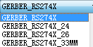

#### 2. GERBERAUTO and GERBER
>The prior先前 RS­274D format works with a separate独立的 aperture file which is necessary必须的 to generate all Gerber files you will need for board manufacturing.

前面介绍过，RS-274D 格式会产生一个单独的 Aperture 文件，这个文件是生产所有 Gerber 文件所必须的。这些 Gerber 文件是您需要向 PCB 制板厂商提供的。
>First you have to generate the aperture table (wheel file) with GERBERAUTO.
>This file is a tool table which defines the shape and the size of the Gerber plotter's apertures (tools). 
>This table must contain the whole aperture definition, we need for generating all Gerber files that describe the board.
>For generating the Gerber files with the GERBER device, we refer to the previously generated aperture file, made with GERBERAUTO.

首先，您必须要使用 GEBERAUTO 产生 Aperture 表格（Wheel 孔径轮文件）。
这个文件是一个工具表格，用于定义 Gerber绘图仪的光圈孔径(工具)的外形和尺寸。
这个表格必须包含完整的 aperture 光圈孔径的定义，我们需要用于生成所有 Gerber 文件，这些文件用于描述电路板。
使用 GERBER 驱动来产生 Gerber 文件，我们推荐前面所述的 GERBERAUTO 来产生 Aperture 文件。

GERBERAUTO 来产生 Aperture 文件和 Wheel 文件，其余的描述电路板的 Gerber 文件则由 GERBER 驱动来产生。
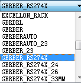

>GERBER and GERBERAUTO have a resolution of 1/10.000 of an Inch.
>Exceptions are the devices GERBERAUTO_23 and GERBER_23. 
>They have a lower resolution of 1/1,000 of an Inch (data format 2.3, inch).

GERBER 和 GERBERAUTO 具有 1/10,000 英寸的分辨率（数据格式：2.4 英寸）。
但 `GERBERAUTO_23` 和 `GERBER_23` 驱动例外。它们的分辨率较低，为 1/1,000 英寸（数据格式：2.3，英寸）。

### 1.2 Drill Data
>The generation of drill data is very similar类似 to the generation of plot data.
>Typical formats格式 used in industry are Excellon or Sieb&Meyer 1000 or 3000.
>They are supported支持 by the CAM Processor. 
>The most common常见的 one is Excellon.

产生钻孔数据和产生光绘数据很相似。
业内使用的典型格式是 Excellon 或 Sieb&Meyer 1000 或 Sieb&Meyer 3000。
它们都可以通过 CAM 处理程序来产生。
最常用的是 Excellon 格式。
>The simplest case is to generate one common共有的 drill data file for all drill holes.

最简单的方式是为所有的钻孔产生一个共同的钻孔数据。
>If you have to distinguish区分 plated电镀 from non­plated drill holes, two drill data files must be generated. 
>EAGLE differentiates between plated drills of Pads and Vias in layer 44, Drills, and non­plated holes in layer 45, Holes, which are placed by the HOLE command.

如果您想区分非电镀孔和电镀孔，必须产生 2 个钻孔数据。
EAGLE 软件会区分电镀孔和非电镀孔，电镀孔 Pads 和 Vias 在第44 层（Drills），非电镀孔在第 45 层（Holes），非电镀孔使用 HOLE 命令放置。
>If you have to generate drill data for a multilayer board that uses Blind and Buried vias with different via lengths that result in different drilling depths, the CAM Processor takes care on this automatically. 
>For each via length it generates a separate drill data file.

如果你需要为多层板生产钻孔数据，使用具有不同 via 深度的盲孔和埋孔，其结果在不同的钻孔深度中，CAM 处理程序会自动识别。
针对不同的 via 深度产生单独的钻孔数据文件。
>Further information about this can be found in chapter 9.5 from page 301 on.

更多的信息可以在本章的第 9.5 章节找到，从257cn/301en 页开始。本笔记会详细总结

#### 1. EXCELLON
>Using this device the CAM Processor generates a drill file that contains the drill table and the drill coordinates. 
>This file format格式 is the most common in the industry and will be recognized by most board manufacturers.
>The default resolution分辨率 of the EXCELLON device is 1/100,000 of an Inch, no leading zeros (data format: 2.5, Inch).

使用 EXCELLON 驱动， CAM 处理器会生成钻孔文件，该文件包含钻孔表格和钻孔坐标。
该文件格式在行业中是最通用的，并且被大多数 PCB 制板厂商所公认。
EXCELLON 驱动的默认分辨率是 1/100,000每英寸，没有前导零(数据格式：2.5, Inch)。
Alternatives 可选:
EXCELLON_24 1/10.000 inch, data format: 2.4, inch
EXCELLON_26 1/1.000.000 inch, data format: 2.6, inch
EXCELLON_33MM 1/1.000 mm, data format: 3.3, mm

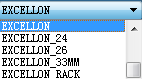

#### 2. EXCELLON_RACK
>This device can be used, if your board manufacturer insists坚持 on two separate files. 
>A drill table (rack file) and the drill data file. 
>This was default in prior EAGLE versions. Default data format is 2.4, Inch.

如果您的 PCB 制板厂商一定要坚持 2 个单独的文件，可以使用 EXCELLON_RACK 驱动，
会生成一个钻孔表格 (rack file) 和钻孔数据文件。
>In the first step one has to generate the drill table in the Layout Editor with the help of the User Language program drillcfg.ulp, and refers to this drill table when generating drill data with the CAM Processor. 
>The board manufacturer gets two files then, drill data and drill table.

首先是要在 Layout 编辑器中用用户语言程序（ULPs）drillcfg.ulp 来产生钻孔表格，当使用 CAM 处理程序生成钻孔数据时会引用该钻孔表格。
然后把这 2 个文件（Drill Data 和 Drill Table）交给 PCB 制板厂商。
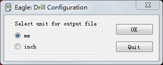

>If you have to distinguish区分 between plated and non­plated drillings you have to supply one drill table and two drill data files (one for layer Drills, one for layer Holes).

如果您想区分电镀孔和非电镀钻孔，您必须提供一个钻孔表格文件和两个钻孔数据文件（一个在 Drills 层，一个在 Holes 层）。

#### 3. SM1000 and SM3000
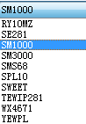

>These devices generate drill data in Sieb&Meyer 1000 or in Sieb&Meyer 3000 format. 
>SM1000 has a resolution of 1/100 mm, SM3000 1/1000 mm.

这种驱动是在 Sieb&Meyer 1000 或 Sieb&Meyer 3000 格式中产生钻孔数据文件
SM1000 的分辨率为 1/100mm，SM3000 的分辨率为1/1000mm。
>Data output is exactly完全 the same as it is with EXCELLON_RACK. 
>First you have to generate the drill table with drillcfg.ulp, then use the CAM Processor to generate drill data.

该驱动模式下数据输出方式和 EXCELLON_RACK 完全相同。
首先是要在 Layout 编辑器中用用户语言程序（ULPs）drillcfg.ulp 来产生钻孔表格，然后在 CAM 处理程序中引用这个表格来产生钻孔数据文件。

#### 4. Further Drill Data Devices 更多钻孔数据驱动
>The CAM Processor supports two further devices for drill data generation.
>GERBDRL generates Gerber drill code. 
>Here we need a separate drill table (RUN drillcfg.ulp), as it is with EXCELLON_RACK.
>SMS68 is a further drill data device that generates a HPGL code.

CAM 处理程序还支持 2 种驱动来产生钻孔数据。
GERBDRL 产生 Gerber Drill 代码。
这里，我们需要一个单独的钻孔表格（运行 drillcfg.ulp），这其实和 EXCELLON_RACK 相同。
另外一个是 SMS68 驱动，该驱动会产生 HPGL 代码类型的钻孔数据。

### 1.3 Prototype Manufacture With a Milling Machine 使用铣床加工原型板
>With the help of various User Language programs you can generate outline data for milling a prototype board.

在不同用户语言程序（ULPs）的帮助下，可以产生用于原型板铣加工的轮廓线数据。

#### 1. outlines.ulp 
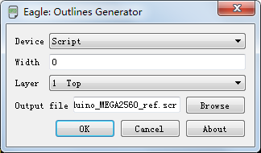

>A simple example for contour data calculation is outlines.ulp. 
>Start it with the RUN command. 
>Select the layer for which outline data shall be generated, define the diameter of the milling tool (Width), and select the output file format (Script or HPGL) in the ULP's dialog window.

outlines.ulp 是计算轮廓线数据的简单例子。
使用 RUN 命令运行该程序。
在 ULP 的对话框中定义以下参数：选中需要产生轮廓线数据的层；定义铣刀直径（宽度）；在 ULP 对话框中选择文件输出格式（Script 或者 HPGL）。
>The Script file containing the outline data can be imported into EAGLE with the SCRIPT command. 
>Thus it's possible to visualize the calculated contours in the Layout Editor. 
>You can even modify them, if necessary. 

Script 脚本文件包含轮廓数据，可以使用 SCRIPT 导入到 EAGLE 中。
因此在 Layout 编辑器中，计算后的轮廓线可以实现可视化。
必要的时候，你甚至可以修改。
>Finally, the milling data output is made with the CAM Processor. 
>Select the layer where the contours are to be drawn in and use, for example, the HPGL, the PS (Postscript) or one of the Gerber devices for the output.

最后，铣加工数据由 CAM 处理程序产生。
选择绘制铣加工外形轮廓线的层，使用 HPGL、PS（Postscript）或者 某种 Gerber 驱动来输出数据。
>Further information can be found in the help function, Outline data.

更多的信息可以查看帮助功能中关于 Outline data 的说明。

#### 2. mill-outlines.ulp
>Another User Language program that calculates outline and drill data is milloutlines.ulp. 
>It offers various configuration parameters. 
>Simply start it with the RUN command in the Layout Editor. 
>Consult the ULPs integrated help function for details.

另外一个关于计算铣加工外形轮廓和钻孔数据的用户语言程序（ULPs）是 mill-outlines.ulp 脚本。
它提供各种配置参数。
可以在 Layout 编辑器中使用 RUN 命令运行，
详情可以查看 ULPs 的帮助信息。
>This ULP exports HPGL formatted data (further formats are planned) or generates a Script file which can be imported into the layout again. 
>The milling contours can be viewed, or even modified, if required. 
>Generate the milling data with the CAM Processor and one of its devices, like Gerber, HPGL or PS then.

该 ULPs 可以输出HPGL格式的数据（计划中可以有更多的格式）或者产生一个可以导入到Layout编辑器中的 Script 脚本文件。
产生的铣加工外形轮廓可被查看，必要的时候甚至可以修改。
使用 CAM 处理程序中的一个驱动，比如 Gerber，HPGL或PS（Postscript）以生成铣加工数据。

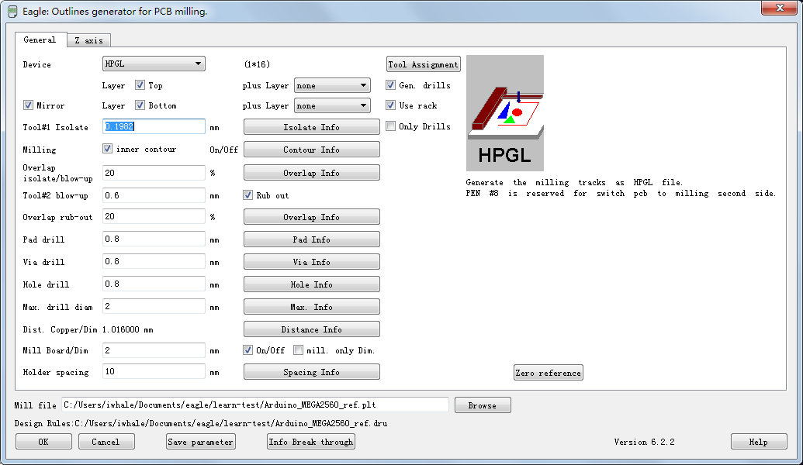

### 1.4 Film Generation Using PostScript Files
使用 PostScript 文件产生胶片 Film

PostScript是一种编程语言，最适用于列印图像和文字（无论是在纸、胶片或非物质的CRT都可）。用现今的行话讲，它是页面描述语言。它既可以像程序代码一样具有可读性，又能表示出可任意放大和缩小的矢量图。

#### PS（Postscript）device
>A high­-quality alternative to Gerber is the data generation for PostScript raster光栅 image recorders记录仪. 
>The exposed曝光 film serves as master for board manufacturing.

一种替代 Gerber 的高质量方案，通过 PostScript 的光栅图像记录仪来产生数据。
曝光的胶片作为 PCB 板制作的母片。
>With the PS driver, the CAM Processor generates files in PostScript format.
>These files can be processed directly by appropriate service companies (most of which operate经营 in the print industry). 

CAM 处理程序使用 PS（Postscript）驱动来产生 PostScript 格式的数据。
这些数据能直接被合适的服务公司（这样的公司多数处于出版行业）处理。
>For PostScript recorders the Width and Height parameters should be set to very high values (e.g. 100 x 100 inches), so that the drawing is not spread分布 over several pages.

Postscript 文件记录的宽度（Width）和高度（Height）参数可以设置为很高的值（比如：100 x 100inches），这样设计图纸就不会延伸到很多张纸上。
>For generating Postscript files you have to select the proper适当的 layers, the same way it is performed执行 for Gerber data generation. 
>Use these files for the generation of your artwork at your particular特定的 PCB subcontractor 承包商.

在使用 Postscript 文件产生数据的时候需要选择合适的层，这和 Gerber 数据产生的方式类似。
使用这些文件您就可以在特定的 PCB 承包商处产生完美的艺术品。
>Films that relate涉及 to the bottom side are usually output in mirrored form (Mirror option in the CAM Processor). 
>In doing so the coating覆盖 of the foil铜箔 rests依据 directly on the copper敷铜 layer of the board which is to be exposed.

和底层相关的胶片通常会以镜像的方式（需要在 CAM 处理程序中选中 Mirror选项）输出，
这样做的目的是希望被曝光的铜箔覆层能直接保留在电路板的敷铜层上。(这样做的目的是，使铜箔的覆盖直接依据电路板的敷铜层，并让这一层被曝光。)

#### EPS device
>The EPS driver generates Encapsulated封装 PostScript files. 
>They can be processed with Desktop Publishing programs.

EPS 驱动能产生压缩的 PostScript 文件，
这些文件能被台式印刷系统处理。
### 1.5 Printing on a Film 在胶片上印刷
>For boards of limited complexity, one can use a laser or ink jet printer and print on a transparent foil with the PRINT command. 
>This method is used, for example, by hobbyists and results in a shorter fabrication制造 time and a less expensive昂贵 board fabrication制造 process工艺.

对于一定程度内的复杂电路板，可以使用 PRINT 命令，用激光或喷墨印刷机在透明的薄膜上打印。
这种方法可被用于，如，业余爱好者，或结果的制作时间很短，并且这种电路板的制作工艺也不昂贵。
>The layers that are displayed in the Layout Editor while printing will appear on the film. 
>Check the options Black and Solid in the print dialog. 

在印刷的时候显示在 Layout 编辑器中的层会显示在胶片上。
在 Print 对话框中请注意检查 Black黑 和 Solid实心填充 选项是否选中。
>The drills of pads and vias are visible可见的 on the printout. 
>This will allow an easy visual indication标示 of where you have to drill manually on the board.
>Experience shows that the opening of a pad or a via should not be too big to allow for a good centering of the drill bit. 
>This issue问题 can be solved解决 with the help of an User Language program, named drill­aid.ulp. 
>Start it before printing, and let it draw a ring inside each pad and via in a separate单独的 layer.
>The inner diameter of this ring can be defined and is usually set to 0.3mm. 
>Of course, you have to display this additional layer for printing on the film.

Vias 和 Pads 的钻孔会在打印输出中可见。
这是一种简单的指示，表明电路板在该处需要手动钻孔。
经验表明，Vias 和 Pads 的空隙口不要太大，以便于钻头的中心很好地定位。
这些问题可以使用名叫 drill-aid.ulp 的用户语言程序（ULPs）来解决。
在打印之前运行，让它在一个单独的层上画一个包含每个
Pad 和 Via 的圆环，
圆环的内径可以被定义，一般设置为 0.3mm。
当然，在打印到胶片上的时候需要显示该附加层。

### 1.6 Data for Pick-and-place Machines and In-circuit Testers
贴片机 Pick-and-place Machines 和在线测试仪 In-circuit
Testers 数据

>EAGLE includes some ULPs which create data for various automatic placement machines and in­-circuit testers that are typically used by PCB manufacturers.

EAGLE 软件包含一些 ULPs 用来产生各种自动贴装机和在线测试仪数据，这些设备经常被 PCB 制板厂商使用。
>The description of an ULP can be viewed in the User Language Programs branch分支 of the tree view of the Control Panel by selecting one of the ULP entries with the mouse. 
>The describing text appears on the right side of the Control Panel window. 
>It's also possible to edit the ULP file with a text editor. 
>The description usually is written in the file header.

在 Control Panel 的 ULP 树形浏览区处单击鼠标可以看到 ULP 的描述。
这些描述文本出现在 Control Panel 窗口的右边。
使用文本编辑器可以编辑 ULP 文件。
描述通常写在文件标题中。

>ULPs for pick­-and­-place data (selection):
>产生贴片机数据的 ULPs（选项）：
>mount.ulp：Generates one file with coordinates坐标 of the centered part origins. **产生元件原点坐标文件**
>mountsmd.ulp：Centered origins for SMT devices; one file for top and one file for bottom side. **SMD 元件的中心原点，顶层和底层各一个文件**

=
>ULPs for circuit tester (selection):
>产生电路测试的 ULP（选项）：
>dif40.ulp：DIF­4.0 format from Digitaltest. **来自数字测试的 DIF-4.0 格式**
>fabmaster.ulp：Fabmaster format FATF REV 11.1. **Fabmaster 格式 FATF REV 11.1**
>gencad.ulp：GenCAD format for Teradyne/GenRad in circuit tester. **Teradyne/GenRad 在线测试仪的 GenCAD 格式**
>unidat.ulp：UNIDAT format. **UNIDAT 格式**

=
>Execute执行 the RUN command in the Layout Editor window to start the particular特定 ULP.

在 Layout 编辑器中输入 RUN 命令来执行特定的 ULP。
>Note also the wide range of programs that are made available on the CadSoft web server http://www.cadsoftusa.com/download.htm, ULP directory.

在 CadSoft 网站服务器上能找到各种各样可用的 ULP 程序，地址 ：http://www.cadsoftusa.com/download.htm 的 ULP 目录

### 1.7 Documentation 文档
>Many documentation items项目 can be generated with the aid借助 of User Language programs. 
>Note also the wide range of programs that are made available on our web server. 
>The bom.ulp, the program for generating a bill of materials材料, has been used as a basis for lots of user-­contributed ULPs.

许多文档项目可以借助用户语言程序生成。
在 CadSoft 网站服务器上能找到各种各样可用的 ULP 程序，它们有着非常广泛的应用范围。
地址：http://www.cadsoftusa.com/download.htm。
bom.ulp 程序用来产生材料清单，这是用户使用次数最多的 ULP 程序。
#### 1. Parts List 元件列表
>The parts list can be created by bom.ulp. 
>Start it from the Schematic Editor, using the RUN command. 
>The Bill Of Material window with the parts summary摘要 opens first.

bom.ulp 用于生成元件列表，
该 ULP 可以在原理图编辑器中，使用 RUN 命令运行，
首先会打开一个包含元件汇总的材料清单（BOM）窗口。

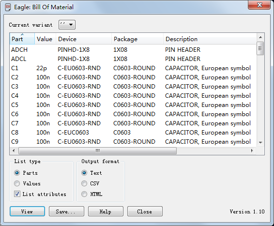
 bom.ulp: Dialog window

>It is possible to import additional information from a database file into the parts list (Load), or to create a new database with its own properties such as manufacturer, stores number, material number or price (New).

可以从一个数据库文件中输入附加信息到元件列表中（使用 Load 按钮），或者创建一个新的（New）具有诸如制造商、库存号、材料号或者单价等属性的数据库。

>You can obtain获得 further进一步 details细节 about the current version of the ULP by clicking the help button.

单击帮助按钮可以得到更多关于当前版本的 ULP 程序详细信息。
`A simple parts list can also be created from a board or schematic by means of the EXPORT command (Partlist option).简单的元件列表同样可以使用 EXPORT 命令（选择 Partlist 选项）从PCB 图或者原理图中输出。`

#### 2. Drill Plan 钻孔平面图
>Printing a drill plan enables使得 you to check the drill holes and their diameters.
>It shows an individual symbol for each diameter of hole, via, and pad used in your design. 
>EAGLE uses 19 different symbols: 18 of them are assigned to a certain diameter; one (∅) appears, if no symbol has been defined for the diameter of this hole. 
>The symbols appear in layer 44, Drills, at the positions where pads or vias are placed, and in layer 45, Holes, at the positions where holes are placed.

打印钻孔平面图以便您能检查钻孔和直径。
在设计中使用到的 Hole、Via 和Pad 的每一个直径都显示为单独的符号。
EAGLE 软件使用 19 种不同的符号来表示：其中 18 种用于特定的直径，如果 hole 的直径的符号没有被定义，那么使用（∅）符号表示。
放置 pads 或 vias 的位置，用符号显示在第 44 层（Drills 层）；放置 Holes 的位置，用符号显示在 第 45 层（Holes 层）。
>The relation关系 between diameters and symbols is defined through the Layout Editor's Options/Set/Drill dialog.

直径和符号之间的关系可以通过 Layout 编辑器的Options/Set/Drill 对话框定义。
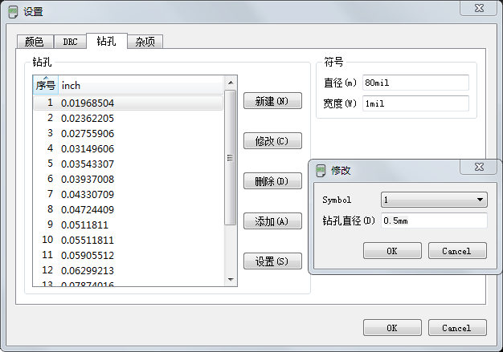

>The buttons New, Change, Delete and Add can be used to create a new table, to modify certain entries, delete them or to add new ones.

按钮：New，Change，Delete 和 Add 用于创建新的表格，或修改某些条目，或删除条目，或添加新的关系。

>The Set button extracts all the hole diameters from the layout and automatically assigns them to a drill symbol number. 
>The values of Diameter and Width determine the diameter and line thickness of the drill symbol on the screen and the printout.

Set 按钮可以从 Layout 编辑器中提取所有 hole 直径，并自动为这些直径分配一个钻孔符号编号。
Diameter 和 Width 的值决定了钻孔符号显示在屏幕上和输出的直径大小和线宽。

>The image above shows that drill symbol 1 is assigned to a drill diameter of 0.01 inch. 
>In the following image you can see how the related相关 symbol drawn in layer 44, Drills, or 45, Holes, looks like. 
>The symbol number 1 looks like a plus character (+).

上图显示的钻孔符号 1 分配给 0.01inch 的钻孔。
从下图可以看到画在第 44 层（Drills 层）或第 45 层（Holes 层）上钻孔符号的显示方式，
钻孔符号 1 看起来是个加号（+）。

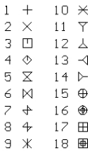
➢ Assignment of the drill symbols 分配钻孔符号

>The dill symbol assignment is stored in the user­-specific file eaglerc.usr (.eaglerc for Linux and Mac).

钻孔符号分配保存在用户定义文件 EAGLErc.usr 中（.EAGLErc 用于 Linux 和 Mac 操作系统中）。

#### 3. Drill Legend 钻孔图
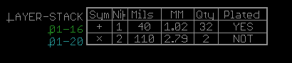

>Documenting the drill symbol assignment is quite simple with the help of a handy方便 User Language program named drill­-legend.ulp.

在一个很方便的用户语言程序 drill-legend.ulp 帮助下，存档钻孔符号分配图看起来很简单。
>In the first step we let EAGLE generate the drill symbol assignment for the current layout with the Set button in the Options/Set/Drill Symbols menu.

首先，单击 PCB 编辑器中 Options/Set/Drill 菜单打开钻孔符号菜单，选中 Set 按钮产生当前PCB 布局的钻孔符号分配表。
>Now we start drill-­legend.ulp. 
>It draws a table with the proper适当 drill symbol assignment and the drill symbols at their positions in the board in the newly generated layer 144. 
>For printing, it can be helpful to display layer 20,Dimensions, additionally.

现在，执行drill-legend.ulp脚本。
该脚本会绘制一个表，该标包含适当钻孔符号的分配，还包含钻孔符号在电路板上的所在位置，该表在新生成的第 144 层上。
另外显示出第20层（Dimensions层）的电路板尺寸，便于打印显示。
>If you want to delete this all, simply use GROUP and DELETE in layer 144.

如果想了解更多的信息，可以在第 144 层使用 GROUP 和 DELETE 命令。

### 1.8 Assembly Variants 装配变量
>The CAM Processor basically generates data for the assembly variant, the board is saved with. 
>The status bar of the CAM Processors shows the assembly variant as soon as the board file is loaded.

CAM 处理程序主要用于为装配变量生成数据，板卡随该数据被保存。
一旦电路板文件被加载，CAM 处理程序的状态栏将显示装配变量。(添加变体后，需要对文件进行保存，才能使用 CAM 处理)
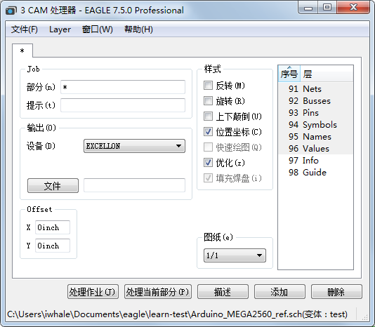

>If you have to create data for another assembly variant, we recommend to select this variant in the schematic editor and save schematic and board in this variant. 
>Now start the CAM Processor again.

如果您需要为其他装配变量输出制造数据，我们建议在原理图编辑器中选择该变体，并在该变体种保存原理图和板卡。
然后再启动 CAM 处理器。

可以通过命令提示符窗口或者终端
窗口启动 CAM 程序，并且在命令行中加上参数 -A。

请参见第 273 页中附录部
分对参数的介绍。
>If you prefer to the CAM Processor from a Command Prompt window or a Terminal window (eagle ­-X) you have to specify the command line option ­-A in order to select the assembly variant. 
>Information about these options can be found in the Appendix beginning with page 315.

假如你比较喜欢从 命令提示符窗口 或 终端窗口(eagle ­-X)运行 CAM 处理器。为了选择相应装配变量，你可以指定命令行选项 -A 。
请参见第 273/315 页中附录部分对命令行参数的介绍。

## 2. CAM 输出前的注意事项
Rules that Save Time and Money  节约时间和成本原则
在打开CAM 处理程序，开始进行 Gerber 设置和输出之前，下列各项需要认真检查，以便电路板能及时并尽快制作，避免因不必要的失误而造成时间和金钱损失。

>- Each layer should without fail be uniquely唯一 identified标识 (e.g. CS for Component Side, BS for Bottom Side).

每层不应该有特殊标识的错误（比如：元件层的 CS 错误，底层的 BS 错误）。

>- It may be wise明智的 to use fiducial基准 or crop剪切 marks which can be defined in layer 49, Reference. 
>This will allow easy alignment校准 of PCB generated films for both inspection检查 and fabrication制造. 
>When generating manufacturing data, this layer has to be active additionally with all signal layers. 
>Please contact you board manufacturer concerning this matter. 
>Fiducials can be found in marks.lbr. 
>A minimum of three fiducials or crop marks (three corners) is required for proper film alignment reference.

在第 49 层（Reference 层）定义基准标志和剪切标志是很明智的。
这些标识将方便 PCB 生成胶片时的检查和制作工作的对准。
当生成制造数据时，必须将此层和所有的信号层一起激活，
关于这些问题，您可以联系您的 PCB 制板厂商解决。
基准标志可以在 marks.lbr 文件中找到，
合理的胶片对准参考点，最少需要使用 3 个基准标志或剪切标志（电路板的 3 个角）。

>- For cost reasons you should, if at all possible, avoid tracks that narrow窄 to below 8 mil.

考虑到成本因素，如果可能的话，避免使用宽度小于 8mil 的走线。
>- Usually the contour轮廓 of the board is drawn in layer 20, Dimension. 
>But it is also possible to draw angles at the corners角 to delimit the board in each signal layer. 
>Please contact your board manufacturer what they prefer.

通常，电路板的轮廓线会画在第 20 层（Dimension 层），
但是也可以在电路板的角上画一个角度来限定电路板边界（每个信号层都需要画），
请了解 PCB 制板厂商更喜欢用哪一种方法。
>- If your board has milled edges, please contact your board manufacturer to clarify明确 in which layer these contours轮廓 have to be drawn. See also page 300.

如果您希望电路板的边缘是用铣床切割，请联系 PCB 制板厂商确认电路板的外廓需要画在哪一个层上，可以参考第 254/300 页。
>- You should always leave at least 2 mm (about 80 mil) around the edge of the board free of copper. 
>This is especially尤其 important for multilayer boards to avoid internal shorts between these layers.
>In the case of supply layers on multilayer boards, which are plotted绘制 inverse负, you do this by drawing a wire around the edge of the board.
>This will act as a copper keep-­out in this area.

电路板边缘周围，最好总预留至少 2mm（大约 80mil）宽度的无铜区，禁止走线和敷铜。
这对多层板尤其重要，因为这样可以防止内部层间短路。

至于多层电路板中的电源层和地层，这些层被绘制为负片，您可以围绕电路板的边缘画线。
这些线会作为禁止敷铜区。
>- Please take care of the wire width for polygons. 
>It should not be set too fine or even 0. 
>These reduced减少 wire widths result in huge file sizes and can lead to problems for board manufacturing, as well.

请留意多边形敷铜区的线宽。(线宽指网格的线宽)
不能设置太小或者为 0。
减少走线宽度，会造成文件过大，继而给 PCB 制板厂商造成问题。
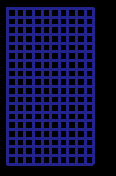

>-As already mentioned提到 in the section of the TEXT command, texts in copper layers ought 应当 to be written in vector font. 
>So you can really be sure that the text on your board looks the same as it does in the Layout Editor window. 
>To play safe, you could activate the options Always vector font and Persistent in this drawing in the Options/User Interface menu before passing on your board file to the board manufacturer.

前面部分已提到的 TEXT 命令，如果文本被放到敷铜层中，应该使用矢量字体。
这样这些字体在电路板上看起来和在 Layout 编辑器中相同。
保险的做法是，在把电路板文件送到 PCB 制板厂商之前，应该在选项/用户界面菜单中选中使用“始终使用矢量字体”和“在本图中一直使用”选项。
>- For the sake为了 of completeness we want to point out here again that all questions concerning layer setup, layer thickness厚度, and drill diameter for multilayer boards with Blind, Buried, or Micro vias have to be pre-examined.

出于完备性的缘故，
我们想在这里再一次强调所有问题，关于层设置、层厚度设置和多层板中盲孔、埋孔微型过孔的直径都必须预先检查。
>- Supply an informational text file to your PCB manufacturer that contains information about specific features in the board. 
>For example, information about used layers, milling contours, and so on.
>This saves time and avoids trouble.

提供一个电路板特殊特性信息的文本文件给 PCB 制板厂商。比如：使用层数、铣加工外形轮廓等等，
这样会节省时间并且避免出现问题。

## 3. Quick Guide for Data Output 数据输出快速指南

>The CAM Processor provides an automated job mechanism aiding in the creation of the output data for a board. 
>It is possible to generate all data by a single mouse click.

CAM 处理程序提供一个自动工作机制来辅助产生电路板制造数据。
通过简单的鼠标点击，就可以完成整个数据的输出。
>The Control Panel's tree view (CAM Jobs branch) lists all jobs and shows a brief description.

在 Control Panel 的树形浏览区（CAM Jobs 分支处）列出了所有的 Jobs，并有一个简短的介绍。
>If you are not yet familiar熟悉 with the use of the CAM Processor, please scroll back to the chapter about The CAM Processor on page 84. 
>There you will learn about the basic operation of the CAM Processor.

如果您仍然不熟悉 CAM 处理程序的用法，请参考第 75cn/84en 页开始的《CAM 处理程序》章节。
在那里可以学到 CAM 处理程序的一些基础操作。

`The pre­defined jobs gerb274x.cam and gerber.cam are designed for a two layer board which has components on the top side only. 预先定义作业 gerb274x.cam 和 gerber.cam 是为两层电路板设计的，并且元件仅仅放在顶层。
They will generate files for the signal layers, the silk screen for the component side, and the solder stop mask for top and bottom. 这 2 个作业可以产生信号层，元件层的丝印层，和顶层和底层的阻焊层。`

EAGLE 的CA M 处理程序提供一种工作机制(Job) 来完成Gerber 文件的输出， EAGLE 预先定义一些常规的 Job 用于不同驱动输出以及不同的文件(如原理图、2 层电路板、4 层电路板等)输出，可以通过Control Panel 的 CAM Job 区查看。

不同的 Job 文件均有特定的使用环境，如果想用于向定义的电路板中，则必须进行修改。比如:gerb274x . cam 和 gerber. cam 是为两层电路板设计的，并且元件仅仅放在顶层，这两个 Job 可以产生信号层、元件层的丝印层、以及顶层和底层的阻焊层。下面分别加以介绍:

### 3.1 Job gerb274x.cam
>This job can be used to generate manufacturing data in Extended Gerber format.

Gerb274x.cam 能生成 Extended Gerber 格式的文件，用以产生制造数据。Extended Gerber 既是 Gerber RS-274X
>Proceed as follows: 

操作流程如下
>- Start the CAM Processor, for example, with the CAM Processor icon in the Layout Editor or with the File/CAM Processor menu.

启动 CAM 处理程序程序，在 Layout 编辑器中单击 CAM 处理程序图标或者打开文件/CAM 处理器菜单均可。
>- Load the board into the CAM Processor (File/Open/Board) if it was not loaded automatically during the start sequence顺序.

如果打开 CAM 处理程序程序时没有自动加载电路板文件，请使用文件/打开/印制板来加载。
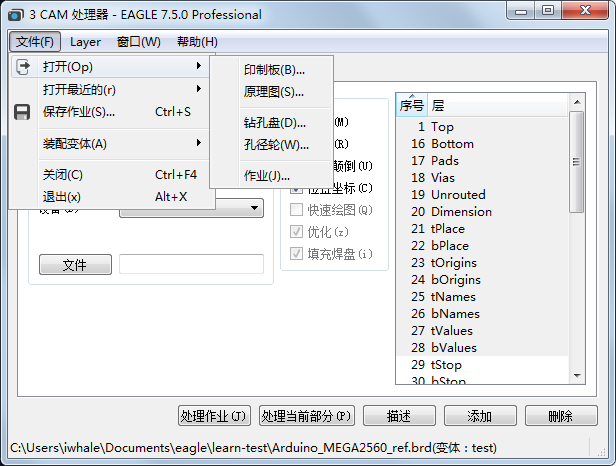

>- Load the pre-­defined job gerb274x.cam with the File/Open/Job menu.

使用菜单文件/打开/作业来加载预先定义的 gerb274x.cam。
>- Now click Process Job. 
>EAGLE generates five files, one by one, automatically which you have to pass on to the board manufacturer.
>Each Gerber file contains the aperture table and the respective plot data.

现在，单击 Process Job 按钮。
EAGLE 会依次自动产生 5 个文件，这就是您需要交给 PCB 制板厂商文件。
每个 Gerber 文件都包括光圈孔径表格和各自的绘图数据。

>The following files will be generated:
>将会生成下面这些文件：
>%N.cmp：Component side 元件层(顶层)
>%N.sol：Solder side 焊接层(底层)
>%N.plc：Silk screen component side 顶层丝印层
>%N.stc：Solder stop mask component side 顶层阻焊层
>%N.sts：Solder stop mask solder side 底层阻焊层
>%N.gpi：Info file, not needed here 信息文件，这里不需要

`%N is the placeholder占位符 for the board file name without its extension.%N 是电路板文件名的占位符，不需要扩展名`

>If other layers are also to be generated, e.g. silkscreen for the bottom side, or a solder cream mask, the Gerber job can be extended扩展 with modifications更改 as required. 
>Extending the job is discussed讨论 later in this chapter.

如果其他层需要生成，比如：底层丝印层或者焊膏层，Gerber job 可以在需要的时候扩展并可以修改。
本章后面会探讨如何扩展 Job。

### 3.2 Job excellon.cam
>The easiest way to generate drill data is to use the pre­defined CAM job excellon.cam, used with the CAM Processor a file that contains drill data and the respective drill table will be generated automatically. 
>This job does not distinguish between the layers Drills and Holes. 
>Both will be output into a common file. 
>Usually all drillings will be plated-­through then.

最简单的产生钻孔数据的方法是使用预定义的 CAM Job excellon.cam；在 CAM 处理程序程序中使用该文件可以自动产生包含钻孔数据和相关钻孔表格的文件。
使用这个文件不用区别是 Drills 层还是 Holes 层，
这 2 层都会输入到一个共同的文件中，
正常情况下所有的钻孔都是电镀孔。

Proceed as follows:
操作流程如下：

>- Start the CAM Processor (for example File/CAM Processor menu) in the Layout Editor.

在 Layout 编辑器中打开 CAM 处理程序程序（比如使用：文件/CAM 处理器菜单）。
>- Load the board into the CAM Processor (File/Open/Board), if it has not been loaded automatically during the start sequence.

如果打开 CAM 处理程序程序时没有自动加载电路板文件，请使用文件/打开/印制板来加载。
>- Load the pre-­defined job excellon.cam, e.g. with File/Open/Job.

使用文件/打开/作业打开 excellon.cam 文件。
>- Execute执行 the job with a mouse click on Process Job. 
>Drill data outputstarts now.

单击处理作业按钮执行，就可以输出钻孔数据。
`Excellon.cam does not distinguish between plated-­through drills and non-plated-through holes! Excellon.cam 不区分电镀孔和非电镀孔!`

>The following files will be generated:
>会产生下面这些文件：
>%N.drd Drill data 钻孔数据
>%N.dri Info file, for board manufacturer, if required 
>必要时交给 PCB 制板厂商的信息文件

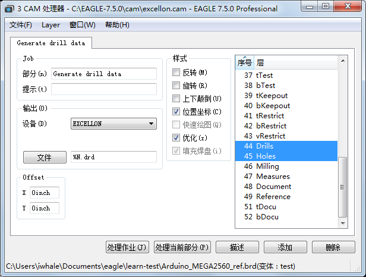
CAM Processor: Generate drill data with the excellon.cam job

>The default unit for the drill table is inch. 
>If the drill table would be preferred in Millimetres the device definition定义 can be changed in the file eagle.def. 
>More details concerning this can be found in the section Units for aperture and drill tables, beginning with page 311.

钻孔表格默认单位是英寸，
如果钻孔表格用毫米作为首选单位，则 Device 的定义应该在 EAGLE.def 中修改。
更多关于此处的详细信息可以在《光圈孔径和钻孔表格单位》中查看 311en。
>Excellon.cam can be used for multilayer boards, as well as for those with Blind, Buried or Micro vias. 
>In this case several drill data files will be generated.
>See chapter 9.5 for details.

Excellon.cam 可以用在多层板的盲孔、埋孔和微型过孔中。
这种情况下会产生几个钻孔数据文件。
参考本笔记第 5 章节了解详细信息。

### 3.3 Job gerber.cam
>If your board manufacturer can not handle处理 Extended Gerber format and expects期望 Gerber data with a separate aperture file, use the job gerber.cam.
>These files can be created with the devices GERBERAUTO and GERBER and generates data in RS­274D format.

如果 PCB 制板厂商不能处理 Extended Gerber 格式数据，并且希望处理具有单独 Aperture 文件的 Gerber 数据，可以使用 gerber.cam 来实现。
这些文件可以使用 GERBERAUTO 和 GERBER 驱动来创建并产生 RS-274D 格式的数据。

>How to proceed:
>如何实现？

>- Start the CAM Processor, for example, with the CAM Processor icon in the Layout Editor or with the File/CAM Processor menu.

启动 CAM 处理程序，在 Layout 编辑器中单击 CAM 处理程序图标或者打开文件/CAM 处理器菜单均可。
>- Load the board into the CAM Processor (File/Open/Board) if it was not loaded automatically during the start sequence.

如果打开 CAM 处理程序程序时没有自动加载电路板文件，请使用文件/打开/印制板来加载。
>-  Load the pre­defined job gerber.cam with the File/Open/Job menu.

使用菜单文件/打开/作业来加载预先定义的 gerber.cam。
>- Now click Process Job. 
>EAGLE automatically generates six files which you have to pass on to the board manufacturer. 
>Five Gerber plot files and one common aperture table.

现在，单击处理作业按钮。
EAGLE 会自动产生 6 个文件，这就是您需要交给 PCB 制板厂商文件，包括 5 个光绘图形文件和一个共同的 Aperture 表格。
>-  In the first step an aperture table %N.whl is generated. 
>Two messages appear, which you confirm确认 with OK.

第一步是产生 Aperture 表格数据：%N.whl。
会弹出 2 个信息框，单击OK 确认。

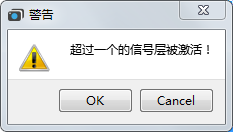

gerber.cam 的信息框

>The left message is generated by the entry in the Prompt提示 field, and reminds you to delete the temporary file %N.$$$ created when generating the aperture table after the job is done.

左边的信息框首先弹出，提醒您在该 Job 完成之后删除在生成 Aperture 表格时产生的临时文件`%N.$$$`。

>The message on the right advises提醒 you that more than one signal layer are active at the same time. 
>Normally only one signal layer is active while output is generated.
>However, when generating the wheel, all the layers need to be active at the same time to form a common aperture table for the Gerber output.

右边的信息框提醒您同时有超过 1 个信号层被激活。
正常情况下，在产生输出时应该只有 1 个信号层激活，
但是，在产生 Wheel 文件时，所有的信号层应该被同时激活来为 Gerber 输出产生共同的 Aperture 表格。

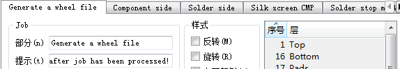

>The following files will be subsequently output:
>下面的文件会连续生成：
>%N.whl Aperture file (Wheel) 光绘文件 （Wheel）
>%N.cmp Component side 元件层（顶层）
>%N.sol Solder side 焊接层(底层)
>%N.plc Silk screen component side 顶层丝
>印层
>%N.stc Solder stop mask component side 顶层阻
>焊层
>%N.sts Solder stop mask solder side 底层阻
>焊层

%N.$$$ Temporary file, please delete it 临时文件，请删除
%N.gpi Info file, not needed here 信息文件，这里没有必要使用

## 4. 电路板所需文件
Which Files do I Need for my Board?

>The previous part of this chapter told you a lot about the basics of data generation and how to use pre­-defined job files for default two layer boards.
>In this section you will find a summary of files usually generated for board manufacturing.

本章的前面部分告诉了您一些基础的数据生成方法，和如何使用预定义的工作文件来生成默认的两层电路板制造数据。本节您会找到一个经常用于生成电路板制造数据的概述。

### 4.1 Files List 文件列表
>The output files of the CAM jobs differ in their file extensions扩展名. 
>You are, of course, free to use unequivocal明确 names of your own.

使用 CAM 工作生成的输出文件和它们的扩展名不同，
当然，您可以使用您自己的很明确的名字来命名。
>The CAM Processor allows the use of some placeholders占位符 for the generation of output file names.
>Usually the output file name consists组成 of the name of the board file plus a special file extension扩展. 
>For the board file name without extension we use the placeholder %N. 
>Write, for example, in the Output File field: %N.cmp. 
>This will be expanded扩展 with the name of the layout file that is loaded plus the extension (here: boardname.cmp).

CAM 处理程序允许使用一些占位符来表示生成的文件。
通常会使用电路板的名称加上一个特殊的后缀名。
比如，我们使用%N 表示电路板文件名的占位符，不含扩展名
如果输出文件类型为%N.cmp
那么就会使用 boardname.cmp 表示。

> In the following table %N also stands for the name of the currently loaded board file that is used to generate manufacturing data from.

下面表格中的 %N 表示当前被加载用来产生 PCB 制造数据的电路板文件名。

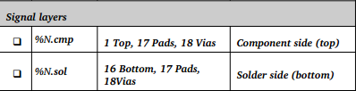
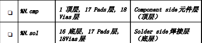
___
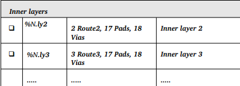

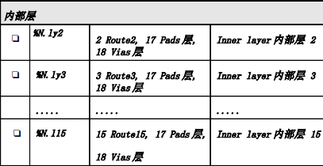
___
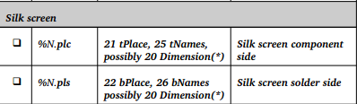
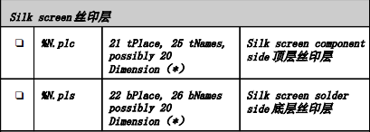
___
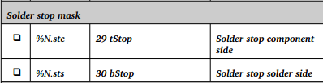
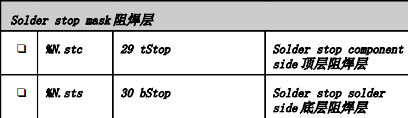

___
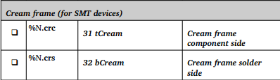
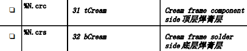

___
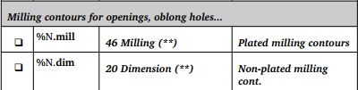
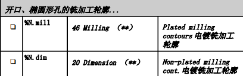

___
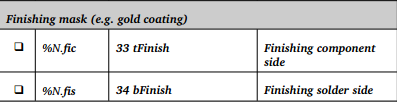
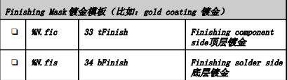
___

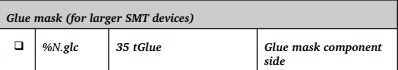
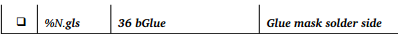
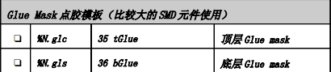

___
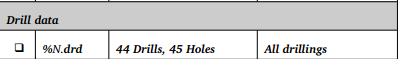
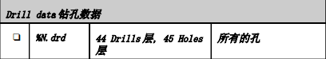
___
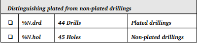
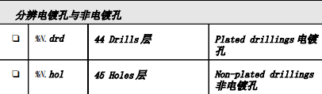
___

>(*) Please check with your board manufacturer whether you have to output the board contour in layer 20 in a separate file or you are allowed to combine it with those layers.
>(**) If there are additional milled edges in the board, you should contact your board manufacturer and ask them which layers they prefer for milling contours.

（*） 请您与电路板制造商联系以便确认您是否需要将第 20 层上的电路板外框单独输出到一个文件中或者与其他层一起输出。
（**） 如果在电路板中有其他需要铣切割的边缘，您应该与电路板制造商联系以便了解生产商希望切割轮廓线放置在哪一层上。

#### 1. 文件名占位符
Placeholders for Output File Name Generation
输出文件名称的占位符

1. %D{xxx} 
xxx stands for a string that is inserted插入 only into the data file name. 
xxx 表示仅输入到数据文件名称中的字符串

2. %E 
file extension of the loaded file, without the '.'
被载入文件的扩展名，未输入“.”符号

3. %H 
home directory of the user
用户的安装目录

4. %I{xxx} 
xxx stands for a string that is inserted only into the Info file name
xxx 表示仅输入到 Info 文件名称中的字符串

5. %L 
layer range for blind&buried vias
盲孔和埋孔的层范围

6. %N 
name of the loaded file without path and extension
未知路径和扩展名的被载入文件的名称

7. %P 
directory path of the loaded Board or Schematic file
载入的电路板或原理图文件的目录路径

8. %% 
the character '%'
字符“%”

`These placeholders must be written in upper case letters!这些占位符必须以大写字符输入！`

#### 2. Hints Concerning File Extensions:
关于文件扩展名的说明：
>cmp stands for component side, the upper side of the board, sol for the solder (bottom) side. 
>It makes sense to choose the first two letters according the active layers. 
>The third one can be c or s for belonging to component or solder side.
>Of course you are free in naming your files in any manner you wish!

cmp 表示元件安装面，即电路板的表面。sol 表示焊接面（反面）。
为了便于理解请根据活动状态的层来确定前两个字母。
第三个字母根据元件安装面或者
焊接面来确定采用字母 c 或者字母 s。
当然您也可以用您自己的方式来进行命名！

`Please ensure when defining a job that the extensions of the output files are unique and therefore因此 distinguishable区别.请确保在定义 job 时输出文件的扩展名是唯一的以便进行区分。`

## 5. 多层电路板的特性
Peculiarities of Multilayer Boards
多层板的特性

>In case of boards with inner layers one has to know how these layers are defined in order to generate proper适当的 manufacturing data. 
>Is it an inner layer that contains tracks and polygons, as it is in Top or Bottom layer? 
>Or is it a supply layer that can be identified辨认 by the $ character in front of the layer name?

对于包含内部层的电路板必须了解其层的定义，以便生成正确的制造数据。
其内部层是否与顶层或底层一样包含了走线和多边形？
或者其电路层是否可以通过层名称前的 $ 符号来进行辨别？

### 5.1 Inner Layers 内部层
>Inner layers are treated the same as the outer signal layers. 
>Together with the signal layer, the layers Pads and Vias have to be actived.
>If the Layer Setup allows Blind and Buried vias, the combination结合 of one signal layer and the Vias layer outputs only those vias that belong属于 to this signal layer.

对内部层的处理方式与外部信号层相同。
Pads 层和 Vias 层与信号层一样都需要处于活动状态。
如果层设置中允许了盲孔和埋孔，则信号层与 Vias 层结合后仅输出属于该信号层的过孔。

`If there is only the Vias layer active (no signal layer), the CAM Processor will output all vias of the board! 如果只有 Vias 层处于活动状态（没有信号层），则 CAM 处理程序会输出电路板上所有的过孔！`

### 5.2 Drill Data for Multilayer Boards With Blind and Buried Vias

带Blind Vias 和 Buried Vias 的多层电路板的 Drill Data

>The CAM Processor generates one drill data file for each via length for a layout that uses Blind and Buried vias.

对于带有盲孔和埋孔的 PCB 设计图，CAM 处理程序为每一种过孔长度生成一个钻孔数据文件。
>The drill data file extension .drd is expanded by the via length specification 规格. 
>If there are, for example, vias from layer 1 to 2, the output file extension will be .drd.0102.

钻孔文件扩展名 .drd 之后会加上过孔长度规格。
比如从第 1 层到第 2 层的过孔，输出文件的扩展名为：`drd.0102`。
>The layer specification can be moved to another position with the help of the wildcard %L. 
>Writing, for example, in the File box of the CAM Processor %N.%L.drd results in an output file named boardname.0102.drd.

过孔长度的层规格可以通过通配符 %L 来移动到另一个位置。
比如在 CAM 处理程序的 File 栏中输入 : `%N.%L.drd`，则输出文件名会变成: `boardname.0102.drd`。
>Pads and trough-­hole vias will be written into an output file with extension .drd.0116. 
>If you placed holes (HOLE command) in the layout and the Holes layer is active for output, the CAM Processor writes this data also into the file with extension .drd.0116.

焊盘和通孔会写入扩展名为`.drd.0116` 的文件中。
如果您在 PCB 设计图中放置了非电镀孔（HOLE 命令）并且 Holes 层处于输出活动状态，则 CAM 处理程序也会将该数据写入到扩展名为`.drd.0116` 的文件中。
>Pass on all these files to your board manufacturer.
>Provided如果 you did not use the EXCELLON device which combines drill table and drill coordinates坐标 in a common file, your board house additionally needs the rack file name.drl which is generated by drillcfg.ulp.

请将所有这些文件转交给您的电路板制造商。
如果您没有使用 EXCELLON 驱动，即没有将所有的钻孔表和钻孔坐标写入一个共同的文件中，则电路板制造商还需要您提供由 drillcfg.ulp 程序生成的 rack file `name.drl` 文件。

### 5.3 内层设置为 Supply Layer 电源层
当为电源层生成制造数据时，应该将Pads 层和Vias 层设置为非活动状态。
隔离环(也称为 Annulus 符号)以及散热符号(Thermal) 会在电源层中自动生成，它们与普通信号层的焊盘或过孔完全不同。电源层以反面的方式显示和输出。
注意: 电源层不能与Pads 和Vias 一同输出!

## 6 设置输出参数
Set Output Parameters

>This section describes the setting of the parameters in the CAM Processor for the output of a board or a schematic.
>Load the schematic or board file from the CAM Processor's File/Open menu, and set the parameters.

本章节介绍了 CAM 处理程序中针对电路板图或原理图输出的参数设置。
请从 CAM 处理程序的文件/打开菜单载入原理图或电路板文件，并设置参数。
>The CAM Processor window is divided分离 into sections (Output, Job, Style, Layer, Offset and so on). 
>Some sections, like Emulate, Tolerance, Pen or Page, are used by and therefore displayed with certain某一 devices only.

CAM 处理程序窗口可分为几个部分（Output、Job、Style，、Layer、Offset 等）。
某些部分比如 Emulate、Tolerance、Pen 或 Page 仅应用于特定的驱动，因此只针对特定的驱动才显示。
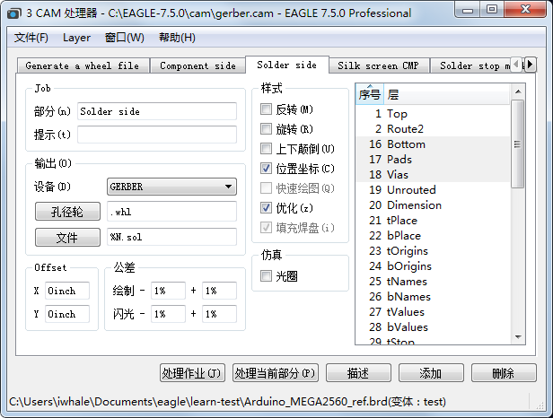
CAM 处理程序： gerber.cam Job 的 Solder side 标签项

### 6.1 Output: 输出
>- Select the driver for the desired output device or output format in the Device combo box.

在 Device 下来菜单中选择所需输出设备的驱动程序或者输出格式。
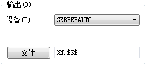
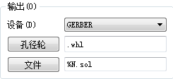

>- Enter the output path and file name in the File field or simply click onto the File button and use its dialog.
>If you want to output a file on a particular特定 drive, place the drive identifier标识符 or, if appropriate适当, the path in front of the file name ending.
>For instance, under Windows, d:\%N.cmp would place the file boardname.cmp in the root directory of drive D. 
>This also applies to the Linux version, so that, for example, /dev/hdc2/%N.cmp, would place the file on drive hdc2. 
>%H can be used as wildcard for the Home directory, %P for the loaded file's directory path.
>If output is to go directly to a plotter, enter the name of the print queue that is connected to the corresponding相应 computer interface in UNC notation, e.g. \\Servername\Plottername.

在 File 栏中输入文件输出路径与文件名或者单击 File 按钮在弹出的对话框中选择文件。
如果您想在某个特定的分区上输出文件，请将驱动器标识符，或者在可以的情况下将路径放在文件名的前方。
比如，在 Windows 系统中 d:\%N.cmp 表示将 boardname.cmp 文件保存在 D 盘的根目录下。
该设置也使用于 Linux 系统，例如/dev/hdc2/%N.cmp 表示将文件保存在 hdc2 分区上。
%H 是表示安装目录的通配符，%P 是所载入文件的目录路径的通配符。
如果输出的数据需要直接提供给绘图仪，打印队列的名称，该队列连接到相应计算的 UNC 规则接口，如\\Servername\Plottername

>- Depending on the chosen device it may be asked for Wheel (aperture table) or Rack (drill table). 
>Select path and file by clicking the button.

根据所选驱动的不同，可能会提示输入 Wheel（孔径表）或者 Rack（钻头表）。
请通过单击按钮来选择路径和文件。

### 6.2 Layer selection: 层选择
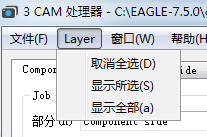

>- Select the layers that should be output into a common共有 file by clicking the appropriate恰当的 layer number.
>Click the menu Layer/Deselect all to uncheck all the layers first.
>Layer/show selected displays only the currently selected layers.

通过单击相应的层标号来选择需要输入到相同文件中的层。
首先单击 Layer/Deselect all 菜单来取消选择所有的层。Layer/show selected 菜单则显示当前选中的层。
>- Some devices (like HPGL or certain plotter devices) allow you to select a color or pen number in an additional column.

某些驱动（比如 HPGL 或特定的绘图设备）允许您在一个附加的栏中选择颜色或绘图笔编号。

### 6.3 Style: 输出样式
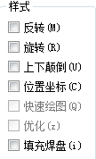

>- **Mirror**: Mirrors the output.
>It can be useful to mirror all outputs that refer适用 to the bottom side of the board.

反转：以镜像输出。
可用于以镜像的方式提供所有与电路板背面相关的输出。
>- **Rotate**: Rotates the output by 90 degrees.

旋转：将输出以 90 度旋转。
>- **Upside down**: Rotates the output by 180 degrees.
>When combined with Rotate, the drawing is rotated by a total of 270 degrees.

上下颠倒：将输出以 180 度旋转。
当与 Rotate 一起使用时，绘图总共旋转 270 度。
>- **Pos. Coords**.: Avoids negative coordinate values for the output. 
>The drawing will be moved near the coordinate's axis轴, even if it is already in the positive coordinates range.
>Negative values can lead to errors with a lot of devices! 
>This option should be set on always by default.
>Switching it off, transfers the coordinate values from the Layout Editor unchanged.

坐标位置：避免输出负坐标值。
即使绘图已经在正坐标范围内也会被移动到靠近坐标轴
的位置。
负值会在很多设备上造成错误！
该选项默认情况下为启用。
如果禁用该选项则 PCB 编辑器中输出的坐标值不变。
>- **Quickplot**: Draft output which shows only the outlines of objects.
>This option is available for certain devices, like HPGL and various plotters.

快速绘图：输出草图，只显示元件的外形。
该选项对于特定的驱动有效，比如 HPGL 和其他绘图仪。
>- **Optimize:** Activates the optimization of the drawing sequence顺序 for plotters. Should be set on by default.

优化：启用针对绘图仪的绘图顺序优化。默认为启用。
>- **Fill Pads:** This option is always set on. 
>Only the devices PS and EPS allow you to switch off this option. 
>The drill holes for pads will be visible on the output (as it is with the PRINT command).

填充焊盘：该选项始终为启用状态。
只有 PS 和 EPS 驱动才允许您禁用该选项。
在输出时焊盘的孔将显示出来（与 PRINT 命令效果相同）。

### 6.4 Job:

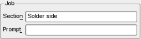

>- If you are on the way to define a CAM job that consists组成 of several sections it is useful to name them. 
>In the Section line, it is possible to enter a section name which will be shown also in the tab above上面.
>If, for example, you assign the section name Wheel: Generate Aperture File, only the title Wheel is visible as a tab name.
>The additional description can be read in the section line.
>The colon ends the title in the tab.

如果您正在定义由多个部分组成的 CAM Job，那么对它们进行命名是很有帮助的。
在 Section 栏中可以输入某个部分的名称，该名称将作为标签显示。
如果您将某部分名称定义为 Wheel：Generate Aperture File，则只有标题 Wheel 会显示为标签名。
在 Section 栏中可以看到其他的描述。
但是冒号之前的内容才能作为标签。
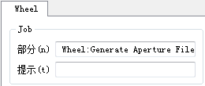

>- In case you wish to display a message box on the screen before executing this section, enter special message text in the Prompt field.
>For example: Please insert a new sheet of paper! The output does not continue until confirmation of this message.

如果您希望在执行该部分之前在屏幕上显示一个消息框，请在 Prompt 栏中输入特定的信息。
例如：Please insert a new sheet of pater！在确认该信息后会继续输出。

### 6.5 Offset:
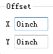

>- Define an offset in x and y direction.
>The values can be given in Inches or Millimetres, for example, 15mm or 0.5inch.

在 x 和 y 轴方向上定义误差。
该值的单位可以是英寸或毫米，比如 15mm 或者 0.5inch。

### 6.6 Tolerance:公差
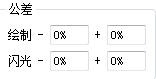
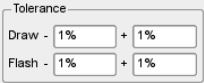

>Tolerances for Draw and Flash apertures are necessary for devices that use an aperture file, like GERBER or GERBER_23. 
>Usually one allows a tolerance of 1% in all fields.
>This is necessary to compensate补偿 small rounding舍入 errors that can arise出现 during the conversion from mm to inch values and vice versa反之亦然 as the aperture table is generated.

对使用 aperture 光圈孔径的驱动而言，Draw 和 Flash 的光圈孔径的容差是必要的，像 GERBER or GERBER_23 这样的驱动。
通常在所有区域都允许 1% 的容差。
这对于在生光圈成孔径表时毫米转换到英寸（或者相反）中产生的小直径误差的补偿是很有必要的。

>Devices for drill data generation that use a separate分离的 drill table (rack file) invoke a Drill entry条目. 
>A tolerance of ± 2.5% is enough to compensate for rounding errors that possibly can arise during the conversion from mm to inch.

使用单独的钻孔表（Rack 文件）生成钻孔数据的驱动会调用 Drill 项。
为了补偿毫米到英寸转换中可能产生的圆形误差，需要至少± 2.5%的容差。

### 6.7 Emulate: 仿真

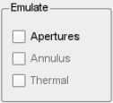

>- If an aperture with the exact value is not available in the aperture file, you can allow Aperture emulation. 
>The CAM Processor is allowed to use smaller drawing apertures for emulation. 
>Plotting time and costs will increase, and therefore you should try to avoid aperture emulation.
>- Arcs with flat endings (CHANGE CAP FLAT) are always emulated for Gerber output, which means that they are drawn with small lines.
>Arcs with round endings (CHANGE CAP ROUND), however, not.

如果一个具有绝对值的光圈孔在孔径文件中无法使用时，您可以启用 Aperture 仿真。
CAM 处理程序可以使用更小的孔进行仿真。
但是制图时间和成本都会增加，因此您应该尽量避免孔仿真。
以直线结尾的弧形（CHANGE CAP FLAT 命令）总是会针对 Gerber 输出进行仿真，这意味着它们使用细线绘制。
而以弯曲线结尾的弧形（ CHANGE CAP ROUND命令）则不会仿真。
`If your layout contains objects that are rotated in any angle, you have to activate aperture emulation. Certain pad shapes must be drawn with a smaller round aperture.如果您的 PCB 设计图包含了以任意角度旋转的多个元件，则您需要启用 Aperture 仿真。某些焊盘形状必须带有较小的孔径。`

### 6.8 Page:
>- Define the Height and Width of the sheet you want to plot on. 
>Values are in Inches by default. 
>Values can also be given in Millimetres, like 297mm.

 定义您绘图页面的宽度和高度。
 默认单位是英寸。
 也可以以毫米为单位输入数值，比如输入 297mm。

### 6.9 Pen:

>- The **Diameter** of the plotting pen is given in here. 
>The value has to be in Millimetres.

绘图笔的直径可以在这里定义。
该值的单位必须为毫米。
>- For plotters that support adjustable pen **Velocity** you can define a value given in cm/s (centimetres per second). 
>No value here results in a default value given by the plotter.

对于支持绘图笔可变速度的绘图仪，您可以以 cm/s（厘米每秒）的形式来定义数值。
如果不输入数值，则使用绘图仪的默认值。

### 6.10 Sheet:
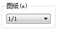

>- Select the sheet of the schematic you want to output.

选择您要输出的原理图的页面。

## 7. Automating the Output with CAM Processor Jobs
通过 CAM 处理程序的 Jobs 自动输出

### 7.1 定义一个新的 Job
Defining a New CAM Job
>A Job consists of one or more sections that allow you to generate a full set of manufacturing data with only a few mouse clicks. 
>A section is a group of settings, as described above in the Set Output Parameters chapter, which defines the output of one file.

Job 包含了一个或多个部分，允许您通过简单的鼠标单击就能生成整套制造数据。
一个部分代表一组设定，正如在设置输出参数一章中描述的一样，这种设定定义了一个文件的输出。
>Define a job as follows:

通过以下步骤来定义 Job：
>- Start the CAM Processor.
>No job is loaded at first, unless there is a file called eagle.cam in the cam directory目录 or an existing现有 job is called up automatically by an EAGLE project file.

启动 CAM 处理程序。
除了在 CAM 目录中已经存在了一个名为 EAGLE.cam 的文件或者 EAGLE 项目文件已经自动打开了一个已有的 Job，否则在 CAM 处理程序启动时不会载入。
>-  If has not already been done, load the board file which you want to define the job for (also possible for schematics).

如果没有载入，请载入您想要为之定义 Job 的电路板文件（也可以是原理图）。
>-  It is best that you load an existing现存的 job, for example gerb274x.cam, through the CAM Processor's File/Open/Job menu.

最好是通过 CAM 处理程序的文件/打开/作业菜单载入一个已经存在的 Job，例如 gerb274x.cam。
>-  Save this job under a new name with File/Save job... So the original原始 job file remains保持 unchanged.

通过菜单 File/Save job... 来将该 Job 保存为一个新的名称，这样原始 Job 文件会保持不变。
>-  Click the Add button.
>The currently active section with all its parameter settings is copied now.

点击添加按钮
这时当前活动部分的所有参数设置将会进行复制。
>-  Enter a new descriptive text in the Section line.

在**部分**文本框中输入新的描述文本。
>-  If you wish to get a message shown before executing this section,enter a specific text prompt提示 in the Prompt line.

如果您希望在执行该部分前看到提示信息，则请在提示文本框中输入特定的文本提示信息。
>-  Set all parameters now:
>Device, the layers for the output, the output File, a Scale factor, if needed, the Style options (Mirror, Rotate, Upside down...).

现在设置所有的参数：
驱动、要输出的层、输出文件、放大倍数（如果需要）、类型选项（反转、旋转、倒转...）等。
>- Define further sections in the same way using different names.
>Very important: First use Add to create a new section, then set the parameters.

通过相同的方式用不同的名称来定义更多的部分。
非常重要：首先用添加按钮来创建新的部分，然后设置其参数。
>- Delete a section, if needed, by clicking the Del button.

在需要时通过单击删除按钮来删除某个部分。
>- Save all the sections of your new job as a job file under a name of your choice with File/Save job...

通过文件/保存作业...单将您的新 Job 的所有部分保存为一个您命名的 Job 文件。

>All the sections of the job will be executed automatically one after another if you click the Process job button. 
>One specific特定的 (the currently shown) section will be executed if you click the Process section button.

如果您单击处理作业按钮，则会自动依次允许 Job 的所有部分。
如果您单击处理 section 按钮，则会执行某个特定的部分（当前显示的部分）。

>The Description button allows a descriptive text of the CAM job that will be displayed in the Control Panel.

通过描述按钮可以实现让 Control Panel 显示 CAM Job 的描述性文本。

### 7.2 将 gerber.cam Job 延伸到多层板
Extending gerber.cam Job for Multilayer Boards

>The gerber.cam job can be used as the basis of the job for multilayer boards.
>It must simply be extended for the additional inner layers.

gerber.cam Job 可作为多层板工作的基础。
只需要将它延伸到其他内部层中即可。

>Example:
>You want to output the files for a board with SMD components on the top and bottom sides. 
>The board has two additional inner layers. 
>Layer 2 and layer 15 which is named VCC.
>You need silkscreen prints for the upper and lower sides, solder stop masks, and masks for the solder cream for both sides.
>Before you start to change the CAM job you should save the job under a new name through the File/Save job as.. menu.

例如：
假设您为一块顶层和底层都有 SMD 元件的电路板生成文件。并且该电路板还包含了两个内部层。
第 2 层和名称为 VCC 的第 15 层。
您需要对上层和下层，以及为两个面的阻焊层和焊膏层进行丝印层打印。
在您开始修改 CAM Job 前，您应该通过文件/保存作业..菜单将该 Job 保存为一个新的名称。
>Proceed as described in the previous section. 
>The CAM job then contains the following sections:

然后按照之前章节介绍的方法操作。
之后 CAM Job 会包含以下部分：

___

___

___

___

___

___

___

___

___

___

>Check once more whether all the necessary layers for the creation of the aperture table are active in the first section. 
>The output file generated in the first section cannot be used. 
>For this reason, the file `boardname.$$$` should be deleted.

请再次检查是否在第一部分中所有用于创建光圈孔径表的层都处于活动状态。
第一部分生成的输出文件不能使用。
因此，应该删除 `boardname.$$$` 文件。

`For inner layers, you always have to activate the layers Pads and Vias! 对于内部层来说，您需要将 Pads 和 Vias 层始终设置为活动状态！`

### 7.3 Error Message: Apertures Missing
错误提示信息：未找到 Apertures 孔径数据

>If the error message APERTURES MISSING – NO PLOT FILE HAS BEEN PRODUCED appears after starting the modified CAM Job, the Gerber info file boardname.gpi contains information about the reason of the problem.

如果在启动修改后的 CAM Job 时出现错误提示信息APERTURES MISSING - NO PLOT FILE HAS BEEN PRODUCED，则可以在 Gerber 信息文件 boardname.gpi 中找到造成该问题的原因。
>The error could possibly be not all apertures were defined or some could not be found in the table due to missing tolerance settings.
>Ensure all used layers were activated in the Generate a Wheel file section?

该错误可能是没有对所有的孔径进行定义，或者由于容差设置丢失而造成孔径表中某些孔径数据无法找到。
在生成 Wheel 文件的部分中，确保所有需要使用的层都被激活。
>It could also be the case that there are parts placed in any angle with pads that don't have a round shape in the layout. 
>You have to activate the aperture emulation then to have a successful file creation.

另外也可能是 PCB 设计图中有一部分以任意角度放置的元件所使用的焊盘不是圆形。
这时您需要启用孔仿真以便获得正确的文件。

### 7.4 Gerber 信息文件
Gerber Info Files
>The CAM Processor generates for each Gerber plot file created an additional Gerber info file with the extension .gpi. 
>This text file informs告诉 you about used apertures, the data format of the Gerber device, about possible aperture emulations or tolerances, and so on.

CAM 处理程序为每个 Gerber 绘图文件生成一个额外的 Gerber 信息文件，扩展名为.gpi。
该文本文件可以让您了解所使用的孔径数据，Gerber 驱动的数据格式，以及可能的孔仿真或容差等信息。
>If you define a job for Gerber output with data files that use the extensions proposed in the table above, the info file will be overwritten with each succeeding section.

如果您为 Gerber 的输出所定义 Job ，其使用的数据文件采用之前表格中提出的扩展名，则该信息文件会被每一个正确的部分所覆盖。
>If your board manufacturer or your plot service wants to have these additional information files (they are typically not necessary), use the %I{xxx} placeholder占位符 as follows:
>For Output File enter   *%N.xxx%I{.info}*

如果您的电路板制造商或者您的绘图设备需要这些额外的信息文件（一般不需要它们），请通过以下方式来使用%I{xxx}占位符：
对于输出文件请输入 %N.xxx%I{.info}。(填入文件文本框)

>Here %N stands for the board name, xxx stands for any characters for the file extension, %I{.info} generates an additional extension .info for the Gerber info files.

这里 %N 表示电路板名称，xxx 表示文件扩展名，%I{.info}会为 Gerber 信息文件生成一个额外的扩展名.info。
>The output files generated will look like this:
>Gerber file: *boardname.xxx*
>Info file: *boardname.xxx.info*

所生成的输出文件如下：
Gerber 文件： boardname.xxx
信息文件： boardname.xxx.info
>Example:
>The board myboard.brd is loaded. 
>The File field contains %N.cmp%I{.info}. 
>The output file is called myboard.cmp, and the info file is named myboard.cmp.info.
>The files will be written into the same directory目录 as the board file is.

例如：
如果载入了电路板文件 myboard.brd，
并且 File 栏中为 %N.cmp%I{.info}。
则输出文件为 myboard.cmp，信息文件为 myboard.cmp.info。
该文件将保存在与电路板文件相同的目录下。

### 7.5 Drill Data Generation with Separate Rack File
通过单独的 Rack 钻头文件生成 Drill Data
>If you prefer drill data in another data format, for example Sieb&Meyer 1000 or 3000 (SM1000, SM3000) or the Excellon format with a separate rack file (EXCELLON_RACK), a drill table is required first.

如果你喜欢钻头数据在另外一种数据格式中，例如Sieb&Meyer1000或3000（SM1000，SM3000）或者Excellon格式使用一个单独的 rack file（EXCELLON_RACK），则首先需要一个钻孔表。

~~如果您要使用单独的钻头文件生成其他数据格式的钻孔文件，例如Sieb&Meyer1000或3000（SM1000，SM3000）或者Excellon格式（EXCELLON_RACK），则首先需要一个钻孔表。~~

#### 1. Define a Drill Configuration (Rack) File
定义钻孔配置文件（Rack 钻架）

>This file is usually created by drillcfg.ulp (RUN command) started directly in the Layout Editor window and will be named boardname.drl.

该文件通常由drillcfg.ulp创建，在布局编辑器窗口中直接启动drillcfg.ulp (RUN command) ，此时将会生成并被命名为 boardname.drl 的Rack 文件
>It is of course also possible to define a drill table with the aid of a text editor.
>For data generation enter the table's path and file name in the CAM Processor's Rack field.

当然也可以用一个文本编辑器来定义钻孔表。
在 CAM 处理程序的 Rack 栏中输入钻孔表的路径和文件名以便生成数据。

>Example of a drill configuration file:
>钻孔配置文件实例：
>T01 0.010
>T02 0.016
>T03 0.032
>T04 0.040
>T05 0.050
>T06 0.070

=
>All dimensions are given here in inches. 
>It is also possible to enter the values with their unit, e.g. 0.010in or 0.8mm. 
>Comments注释 in drill configuration files may be used and are identified标识 by a semicolon, which may stand at the start of a line or be preceded by a space.

这里所有的尺寸单位是英寸。
也可以同时输入单位，比如 0.010in 或者 0.8mm。
钻孔配置文件中的注释可以通过分号来标识和使用，该分号的位置在注释之前并且可以在分号前加空格。

#### 2. Define Job for Drill Data Output
为 Drill Data 输出定义 Job
>-  Start the CAM Processor

启动 CAM 处理程序
>-  Load the predefined job excellon.cam, e.g. with File/Open/Job.

通过文件/打开/作业菜单载入预先定义的 Job，比如 excellon.cam。
>- Change the output Device to EXCELLON_RACK, SM1000 or SM3000 and check the parameters. 
>Layers 44, Drills, and 45, Holes, must be selected only. 
>No other layers! Use the Layers/show selected menu to get a summary of the active layers.
>☞  If you want to have separate files for plated and non­plated drillings, select here Layer 44, Drills, only and insert插入 a further section that outputs layer 45, Holes, in a separate file with the Add button after the following item项目. 
>Check with your board manufacturer to see if this is the method they prefer.

将输出驱动修改为 EXCELLON_RACK、SM1000 或 SM3000，并检查参数。
必须而且只能选中第 44 层（Drills 层），以及第 45 层（Holes 层）。
不能选中其他层！使用 Layer/显示所选菜单来查看活动的层。
☞ 如果您想为电镀钻孔和非电镀钻孔分别使用不同的文件，请在此仅选中第 44 层（Drills 层）；并在完成以下步骤后，通过 Add 按钮来在一个单独的文件中输入另一个部分，以便输出第 45 层（Holes 层）。
请与您的电路板制造商联系以确认是否可用这种方式。
>-  After changing the output device the CAM Processor requires要求 a Rack file as a tool guide. 
>Type in .drl or click the Rack button and choose the path to your rack file in the file dialog.
>☞ In the event you wish to distinguish plated and non­plated holes:
>Add a new section which outputs only layer 45, Holes, into a second drill file with modified file name. 
>Possibly .hol for holes.

在修改输出驱动后 CAM 处理程序需要一个钻头文件作为引导工具。
请在文件按钮弹出的文本框直接中输入.drl 或者单击 Rack 按钮并选择您的钻盘文件的路径。
☞ 如果您希望对电镀孔和非电镀孔进行区分：
请在第二个钻孔文件中，添加一个修改了文件名的新的部分，该部分只输出第 45 层（Holes 层）。
文件扩展名可以是.hol。
>- Save the job file via File/Save job with a new name

通过文件/保存作业将该 Job 文件保存为一个新的名称。
`A tolerance of ± 2.5% should be allowed for drill diameter selection in order to compensate补偿 rounding舍入 errors that possibly can arise产生 during the conversion from mm to inch and vice versa in the drill table.在钻孔直径选择时需要启用 ±2.5%的容差，以便对钻孔表中由于毫米到英寸（或者相反）转换而引起的可能的钻孔错误进行补偿。`

#### 3. Drill Info File 钻孔信息文件
>The file name.dri is generated with each drill data output. 
>It contains the list of used tools and further information about the data format.

文件 name.dri 是由每一个钻孔数据输出生成的。
它包含了所使用的工具信息以及关于数据格式的更多信息。

>If the error message DRILLS MISSING – NO PLOTFILE HAS BEEN PRODUCED appears, the info file contains information which drill diameter could not be found in the drill table. 
>Add the missing diameter in the drill table with a text editor or check the given values for tolerances.

如果弹出错误提示信息 DRILLS MISSING – NO PLOTFILE HAS BEEN PRODUCED，则表示信息文件所包含的钻孔直径信息无法在钻孔表 Rack 中找到。
可以通过某个文本编辑器来添加丢失的直径数据或者检查容差的值。
>The info file is written into the same directory目录 as the output file. 
>You may send this file to your PCB manufacturer, if requested.

信息文件保存在输出文件相同的目录下。
您可以在需要时将该文件发送给电路板制造商。

## 8 Device Driver Definition in eagle.def

在 eagle.def 中定义设备驱动文件

>Output device drivers are defined in the eagle.def text file. 
>Here you will find all the information that is needed for the creation of your own device driver.
>The best way is to copy the block for an output device of the same general category类别, and then alter修改 the parameters where necessary必要.
>The file eagle.def can be found in the eagle/bin directory.

输出设备驱动器的定义包含在 EAGLE.def 文本文件中。
其中您可以找到创建您自己的设备驱动器所需的所有信息。
最佳方式是复制属于相同类别的输出设备的参数，然后再需要的时候再对参数进行修改。
文件 EAGLE.def 位于 EAGLE/bin 目录下。

在 EAGLE.def 可以查看这些驱动的基本设置，
并且可以新建和修改

### 8.1 Creating Your Own Device Driver
>Please use a text editor that does not introduce any control codes into the file.

请使用不包含任何控制代码的文本编辑器。

#### 1. Example 1: Gerber(auto) device, Millimetre

[GERBER_MM33]
Type = PhotoPlotter
Long = "Gerber photoplotter"
Init = "G01*\nX000000Y000000D02*\n"
Reset = "X000000Y000000D02*\nM02*\n"
ResX = 25400
ResY = 25400
Wheel = ""
Move = "X%06dY%06dD02*\n" ; (x, y)
Draw = "X%06dY%06dD01*\n" ; (x, y)
Flash = "X%06dY%06dD03*\n" ; (x, y)
Units = mm
Decimals = 4
Aperture = "%s*\n" ; (Aperture code)
Info = "Plotfile Info: \n" \
"\n" \
"Coordinate Format : 3.3 \n" \
"Coordinate Units : 1/1000mm \n" \
"Data Mode : Absolute \n" \
"Zero Suppression : None \n" \
"End Of Block : * \n" \
"\n"
[GERBERAUTO_MM33]
@GERBER_MM33
Long = "With automatic wheel file generation"
Wheel = "" ; avoids message!
AutoAperture = "D%d"; (Aperture number)
FirstAperture = 10
MaxApertureSize = 2.0

#### 2. Example 2: EXCELLON Device, Output with Leading Zeros
[EXCELLON-LZ]
Type = DrillStation
Long = "Excellon drill station"
Init = "%%\nM48\nM72\n"
Reset = "M30\n"
ResX = 10000
ResY = 10000
;Rack = ""
DrillSize = "%sC%0.4f\n" ; (Tool code, tool size)
AutoDrill = "T%02d" ; (Tool number)
FirstDrill = 1
BeginData = "%%\n"
Units = Inch
Decimals = 0
Select = "%s\n" ; (Drill code)
Drill = "X%06.0fY%06.0f\n" ; (x, y)
Info = "Drill File Info:\n"\
"\n"\
" Data Mode : Absolute\n"\
" Units : 1/10000 Inch\n"\
"\n"

### 8.2 Units in the Aperture and Drill Table
>When automatically generated with the GERBERAUTO driver, the aperture table contains values in inches.

在通过 GERBERAUTO 驱动自动生成文件时，光孔径表中包含的值的单位为英寸。
>This is also the case for the drill table which is automatically written into the drill data file with the output device EXCELLON.

由输出驱动 EXCELLON 自动写入钻孔数据文件的钻孔表同样使用该单位。
>If your PCB manufacturer insists坚持 on mm units for aperture sizes and drill diameters, you can achieve获得 this by altering改变 the GERBER or GERBERAUTO respectively for the EXCELLON driver.

如果您的电路板制造商需要以 mm 为单位的光圈孔尺寸和钻孔直径，您可以为 EXCELLON 驱动分别修改 GERBER 或 GERBERAUTO 来满足其要求。(这句话有点问题，看不出 GERBER 和 EXCELLON 间的相互关系，感觉应该是并列的)
>Use a text editor that does not introduce any control codes to edit the eagle.def file, look for the line

请使用不包含任何控制代码的文本编辑器来编辑 EAGLE.def 文件，然后查找以下语句

[GERBER]
or 或者
[GERBERAUTO]
and add/edit in this section the lines 
然后在该部分中添加/编辑语句
Units = mm
Decimals = 4
In order to change the drill table units look for the line
查找一下语句来修改钻孔表的单位
[EXCELLON]
and change:并修改
Units = Inch
to 为
Units = mm

## 9.  Gerber Files for Photoplotters with Fixed Aperture Wheels 

带有 Aperture Wheels 的光学绘图仪 Gerber 文件

>This section goes into more detail on the definition of the aperture table.

该章节更加详细的介绍了光圈孔径表的定义。
>Some board manufacturers may perhaps也许 still be using a Gerber plotter that works with a fixed aperture wheel. 
>In such a case it is necessary to adapt适应 the aperture table to the restricted facilities of the Gerber plotter. 
>Files for Gerber photoplotters光绘机 with fixed aperture wheels are generated with the GERBER driver. 
>It is essential必须 to confer协商 with your photoplot service ahead of time, so as to adjust EAGLE to the available apertures. 
>The aperture table has to be defined manually. 

某些电路板制造商可能仍在使用固定孔径轮的 Gerber 绘图仪。
在这种情况下需要将孔径表进行调整以适应有限制要求的 Gerber 绘图仪。
针对固定孔径轮光绘图仪的文件由 GERBER 驱动生成。
提前与您的绘图仪服务商联系非常重要，这样才能对 EAGLE 进行调整以满足正确的孔径数据要求。
孔径表需要手动定义。
>There are various各种 types of apertures. 
>They differ in size and shape. 
>The most common are circle, octagon, and square. 
>The drawing aperture (Draw) used for tracks is normally a round aperture.

光圈孔径包含多种类型。
它们的尺寸和形状各不相同。
最常见的有圆形、八边形、正方形、~~热焊盘和圆环形~~等等。
用于走线的绘制孔 (Draw) 通常是圆形孔径。
>You must specify the aperture configuration before you can generate files for a fixed aperture wheel photoplotter. 
>To do this, enter the configuration file for apertures name.whl e.g. with the EAGLE Text Editor, and then load this file into the CAM Processor by clicking the Wheel button after selecting the GERBER device driver (see Set Output Parameters beginning with page 302).

在你为固定孔径轮光绘图仪生成文件之前，你必须指定光圈孔配置参数。
要实现该操作，为光圈孔文件 name.whl 输入配置文件，如使用 EAGLE 文本编辑器。在选定 FERBER 设备驱动后，通过单击 Wheel 按钮加载该文件到 CAM 处理程序中。（请参考第 258/302页中的设置输出参数章节）

### 9.1 Defining the Aperture Table (Wheel)
>The CAM Processor distinguishes区别 Draw apertures from Flash apertures. 
>The first type is used to draw objects (e.g. tracks). 
>The second type is used to generate symbols (e.g. pads) by a light flash. 
>Only if draw apertures are defined can the plotter draw lines. 
>Therefore, if the plotter doesn't distinguish between draw and flash apertures, you must additionally define round or octagonal apertures as draw apertures.

CAM 处理程序能够识别 绘图光圈（ Draw apertures ）与 曝光光圈（ Flash apertures）两种类型。
第一种类型用于绘制对象（例如：走线）。
第二种类型用于通过闪光灯来生成符号（比如：焊盘）。
只有当定义了绘图光圈时绘图仪才能绘制走路。
因此，如果绘图仪不能分辨绘图光圈与曝光光圈，则您还需要另外将圆形孔或八边形孔定义为绘图孔。

>The following apertures are available:

以下为可用的孔：

**Name** **Dimension**
Draw绘图孔 diameter直径
Round圆形孔 diameter直径
Square正方形孔 length边长0
Octagon八边形孔 diameter直径
Rectangle长方形孔 length-X x width-Y X 长度 x Y 宽度
Oval椭圆孔 diameter-X x diameter-Y X 直径 x Y 直径
~~Annulus圆环 外部直径 x 内部直径~~
~~Thermal热焊盘 外部直径 x 内部直径~~

>Use of aperture shapes in the CAM Processor:
>CAM 处理程序中的光圈外形：

Draw绘图孔 draws wires and emulates apertures 
绘制线路和对孔进行仿真

Round圆形孔 draws round pads and vias 
绘制圆形焊盘和通孔

Square正方形孔 draws square pads, SMDs and vias 
绘制正方形焊盘、SMD 和通孔

Octagon八边形孔 draws octagonal pads and vias with the same X- and Y-dimensions 
使用相同的 X 和 Y 轴尺寸绘制八边形焊盘和通孔

Rectangle长方形孔 draws rectangles and SMDs 
绘制长方形焊盘和 SMD

Oval椭圆孔 draws pads with different X- and Y-dimensions 
使用不同的 X 和 Y 轴尺寸绘制焊盘 

~~Annulus 在电源层中绘制隔离环~~
~~Thermal 在电源层中绘制连接线路~~

Aperture configuration file example:
孔径配置文件实例：

D020 round 0.004
D033 round 0.059
D052 square 0.059
D105 oval 0.090 x 0.030
D101 rectangle 0.075 x 0.060
D110 draw 0.004
D111 draw 0.005
实例二
D001 Annulus 0.004 x 0.000
D002 Annulus 0.005 x 0.000
D017 Annulus 0.063 x 0.000
D020 round 0.004
D033 round 0.059
D040 square 0.004
D052 square 0.059
D054 thermal 0.090 x 0.060
D057 thermal 0.120 x 0.080
D105 oval 0.090 x 0.030
D100 rectangle 0.060 x 0.075
D101 rectangle 0.075 x 0.060
D110 draw 0.004
D111 draw 0.005

>The D code determines the tool number, then follows the aperture shape after at least one blank character, then the dimensions are defined. 
>All values default to inches, unless a unit is added, for example 0.010in or 0.8mm.
>Comments are marked with semicolons at the beginning of a line, or with a semicolon following a blank character.

D 码代表工具编号，其后以至少一个空格隔开输入孔的形状，最后是所定义的尺寸。
除非指定单位，否则所有值默认为英寸，例如指定单位 0.010in 或 0.8mm。
注释以文本开头的分号来表示，或者在分号前加空格来表示。

### 9.2 Aperture Emulation 孔仿真
>If objects exist存在 in a drawing which is not compatible with the available aperture sizes, it is possible to emulate the desired dimensions尺寸 by selecting the Emulate Apertures option. 
>The CAM Processor then selects smaller apertures to emulate dimensions which are not matched相配 by aperture sizes.
>Emulation results in longer plot times and higher film costs, so it should be avoided whenever possible.

如果绘图中存在的对象和可用光圈孔尺寸不兼容，就可以选择 Emulate Apertures 选项来仿真需要的尺寸。
CAM 处理程序会选择尺寸不相符的孔当中较小的孔径来
对尺寸进行仿真。
仿真会造成更长的绘图时间和更高的胶片成本，因此应该尽
可能的避免。
~~如果分别启用了 Emulate Thermal 或者 Emulate Annulus 选项，则电源层中的 Thermal 或 Annulus 孔只会使用绘图孔仿真功能。~~
>The file name.gpi indicates which apertures are emulated.

文件 name.gpi 提供了经过仿真的孔的信息。

## 10. 实例介绍修改满足特定设计需求的Job 文件

通过本章前面的内容已阐述了 EAGLE 软件的 CAM 输出的驱动以及PCB 制板厂商需要的Gerber 文件， 下面分别介绍如何修改 Job 文件来满足设计所需的 Gerber 文件输出。
### 10.1 两层电路板的CAM 输出流程如下: 
(请注意:下面介绍的两层电路板为顶层丝印，具有SMD 表面贴装元件并需要量产)

· 在PCB 编辑器中单击CAM 按钮，打开CAM 处理程序。
· 使用File/ Open/Board 加载一个具有 SMD 贴片元件封装的PCB 文件，本例选择 EAGLE
软件自带的 PCB 例程文件 demo2 . brd 。
· 使用File/ Open/ Job 加载EAGLE 软件预定义的 gerb274x. cam 。
· 在 gerber274x. cam 预设的 5 个层标签中均选中第 20 Dimension 层。
· 选中 Solder stop mask SOL 选项卡，单击右下角 Add 按钮添加一个新的选项卡。
· 在新的选项卡中修改选项卡的名称为: Cream Frame CMP ，即顶层焊膏层; Output 驭动GERBER 274X 保持不变；输出文件名改为: %N.crc; 选中第20 Dimension 层、第31 tCream 层， 其他设置保持不变。
· 选中 Crcam Frame CMP 选项卡，单击右下角 Add 按钮添加另一个新的选项卡。
· 在新的选项卡中修改层标签的名称为: Drill Data ，选择Output 驱动为 EXCELLON ，输出文件名为: %N.drd ，选中第20 Dimension 层、第44 Drills 层和第45 Holes 层，其他设置保持不变。
· 至此，完成了双面电路板、顶层丝印、顶层贴片元件的所有CAM 设置，单击File/ Savejob. . . 保存修改后的 job 文件为gerb274x - 2layer. cam ，供以后使用，完成修改后的 Job 文件如图8 . 7 所示。单击Process Job 按钮，即可输出满足本例程需求的所有文件，具体文件和说明信息如表

demo2. cmp 元件层(顶层)
demo2.sol 焊接层( 底层)
demo2.plc 顶层丝印层
demo2.s tc 顶层阻焊层
demo2.sts 底层阻焊层
demo2.crc 顶层焊膏层
demo2.drd Drill Data 钻孔数据文件
demo2.dri 信息文件，必要时才需要
demo2.gpi 信息文件， 可以不需要

### 10.2 四层电路板的CAM 输出流程
(请注意:下面介绍的四层电路板为通孔设置，双面层丝印，顶层具有 SMD 表面贴装元件并需要量产;第 2 层设置为Supply 层并分配 GND 网络; 第 15 层为一般信号层，主要用于电源布线)
在PCB 编辑器中单击 CAM 按钮，打开 CAM 处理程序程序。
- 使用File/ Open/ Board 加载PCB 文件，这里选择本书后面部分所采用的实例设计文件 MSP-EXP430F5438. brd 。
- 使用File/ Open / Job 加载前面保存的 gerb274x-21ayer. cam Job 文件。
- 选中Silk screen CMP 选项卡，单击右下角Add 按钮添加一个新的选项卡。
- 在新的选项卡中修改选项卡的名称为: Silk screen SOL ，即底层丝印层， Output 驱动 GERBER_274X 保持不变，输出文件名改为: % N.pls ，选中第20 Dimension 层、第22 bPlace 层和第26 bNames 层，其他设置保持不变。
- 选中 Component side 选项卡，单击右下角Add 按钮添加一个新的选项卡。
- 在新的选项卡中修改选项卡的名称为: `Layer2 $GND` ，即地层， Output 驱动 GERBER_274X 保持不变，输出文件名改为: %N.ly2 ，选中第 20 Dimension  层、第2 $GND 层，其他设置保持不变。
- 单击右下角Add 按钮添加一个新的选项卡。
- 在新的选项卡中修改选项卡的名称为: Layer15 Power ，即电源层; Output 驱动 GERBER_274X 保持不变，输出文件名改为: % N. l15 ，选中第20 Dimension 层、第15 VCC 层、第17 Pads 层和第18 Vias 层，其他设置保持不变。
- 至此，完成了通孔四层板、双面丝印、顶层贴片元件的所有CAM 设置，单击File/ Save job. . . 保存修改后的job 文件为: gerb274x - 4layer. cam ，供以后使用。

四层板例程产生的文件
