# 0x09_原理图及PCB设计实例
> GitHub@[orca-j35](https://github.com/orca-j35)，所有笔记均托管在 [eagle-notes](https://github.com/orca-j35/eagle-notes) 仓库

## 1. 秒脉冲发生器原理的绘制
绘制原理图的具体步骤如下:
· 栅格和层设置;
· 加载原理图外框;
· 添加和编辑元件;
· 查看和修改元件属性;
· 连线;
· 检查错误。

### 1.1 栅格和层设置
对于栅格和层， 一般采用默认设置。

### 1.2 加载原理框图
为了使画出的原理图美观，整齐和规范，可以在原理图中添加一个外框，外框里包含版本、日期、标题、作者等信息。
由于本实例的侧重点是实现秒脉冲发生器的原理罔绘制和 PCB 设计，故实例中没有添加原理图外框。

### 1.3 添加和编辑元件
在向原理阁编辑中中添加元件之前，先要了解所需要的元件，本实例需要用到的元件如下表。电源是以符号的形式存在元件库中，所以没有封装名。

| 元件名 |         所在库          |  device  |   package    |
| :----: | :---------------------: | :------: | :----------: |
|   IC   | st-microelectronice.lbr |  NE555   |   DIL- 08    |
| R1、R2 |      resistor.lbr       |   R-EU   |    0204V     |
| C1、C2 |      resistor.lbr       |   C-EU   | C025-024X044 |
|  电源  |       Supply.lbr        | VCC、GND |              |

注：EU 为欧洲标准的简写 / US 为美国标准的简写

元件的布局，要求整齐。
如果元件杂乱元章地放置在原理图中，不仅会影响布局的效率，更可能产生不必要的错误。
所以需要用到移动、复制、删除、剪切等命令，依据原理图对元件摆放进行必要的布局。
这些命令可与与 GROUP 命令配合使用，进行群组操作。
SMASH 拆分命令，可将元件的文本和元件拆分，然后通过 MOVE 命令将元件文本移动到合适的位置。

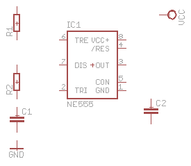

### 1.4 查看和修改元件属性
通过 INFO 命令，查看元件属性。

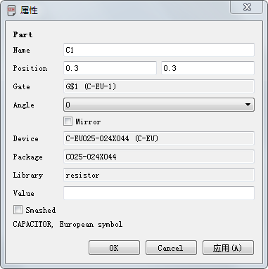
下面以电容为例来说明。
- Name 表示元件的名称，是为了绘制原理图方便的通俗名称，可以在图中手动修改，也可以通过单击命名按钮早或者使用 name 命令来修改。
- Position 表示元件的位置，例如图中的 0.2 代表横坐标，0.3  代表纵坐标。
- Gate 表示可以单独放到原理图中的某个元件的一部分。
- Angle ：元件放置的角度，默认是 0°，可在属性表格中修改，也可使用 Rotate旋转 命令修改。
- Mirror：镜像，勾选后元件的引脚位置会左右互换。
- Device：元件符号名，是原理图和原价库的一种对应形式，它和 Name 的区别是：Device 是元件库中的名字，不可随意修改，而 Name 可以根据习惯任意设置。
- Package：元件封装名。
- Library：元件所在的库。
- Value： 对元件值进行标注，例如可以在对话框输入 1F，如果层设置里设置了显示 value 层，则会出现在原理图编辑器。通过 value 命令，可以直接对值进行修改。
- Smashed：拆分元件的文本。

### 1.5 连线
使用 NET 命令在原理图中绘制网络线段。
V0 是通过 TEXT 文本命令添加的。
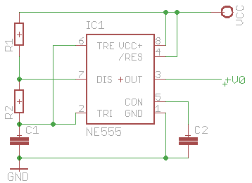
- 引脚可以不相连，只要有相同的网络名，它们就存在相同的网络中。
- 一条网络线在另外一条网络线上终止时，会自动形成节点，表示它们是相同的网络。
- 网络线之间尽量不要交叉。
- 总线是多条实际网络的集合，它本身没有任何意义，只是为了原理图设计方便。

### 1.6 检查错误 ERC
连线完毕之后，通过执行 ERC 命令能检查原理图中存在的电气连接性错误，比如网络连接是否完整、电源引脚是否连接、是否有未连接的引脚。

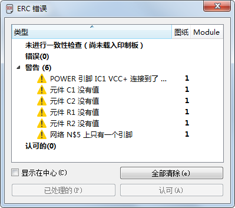

ERC 错误分两类， 一类是错误，另一类是警告， 对于不影响绘图的错误和警告可以选择认可。

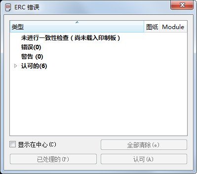

## 2. 秒脉冲发生器的 PCB 设计
通过 Board 命令生成 PCB 文件。
新生成的 PCB 文件中所有的元件都会放置在 PCB 外框的边缘，元件之间的电气连接由一系列的鼠线来表示。

在 EAGLE 软件中，如果 PCB 文件所对应的元件放置在 PCB 外框的边缘，是无法进行操作的。需要 MOVE 和 GROUP 联合将所有元件移到外框里面。
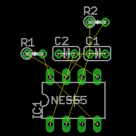

PCB 布线设计：手动布线、自动布线。
对于初学者可以先学会简单的自动布线，本实例采用默认配置的自动布线。
运行 AOTU 打开自动布线器，采用默认配置，直接单击 OK 按钮，软件会自动完成 PCB 的布线工作。
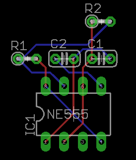

最后对 PCB 设计进行错误检查，DRC 命令。
运行 error 显示 DRC 错误 对话框。
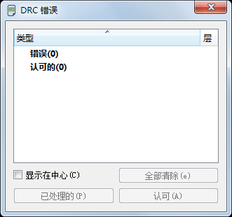

## 3.原理图和 PCB 设计流程
电路设计时需要遵循的基本流程：
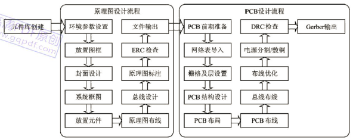
某些设计步骤不是一成不变的，可以根据自己的设计要求进行部分改动，有些步骤则穿插于整个设计中，需要灵活运用。

## 4. 创建满足设计需求的元件库
在原理图设计开始之前，创建满足自己需求的元件。
创建元件库的唯一标准就是严格遵循元件的数据手册，原理图符号则要满足信号流向及阅读习惯，PCB 封装则必须遵循数据手册的引脚尺寸、排列顺序、间距、高度等参数。
否则所设计的PCB 将会变成废品，从而导致项目时间推迟和成本增加。
可以按照前面元件库创建章节的要求创建满足自己需求的元件。
当然，库元件并不仅仅局限于在原理图设计开始前创建，也可以在需要调用该元件时创建。

## 5. 原理图设计步骤及实例
在开始原理图设计之前，应该首先明确的是一份完整的原理图所应该包含的内容。
一般而言， 一份完整的原理图应该包括原理图外框、原理图封面、系统框图(电路板布局图)、原理图图纸、必备的标注和版本记录等信息。

### 5.1 设置原理图栅格与层

包括 EAGLE 软件在内的绝大多数 EAD 软件的元件库中，所有原理图符号都是以 0.1 inch 或 100 mil 为单位绘制而成。
因此，在任何情况下 EAGLE 原理图的栅格都应设置为 0.1 inch 或 100 mil，否则容易造成信号网络难以连接的情况。
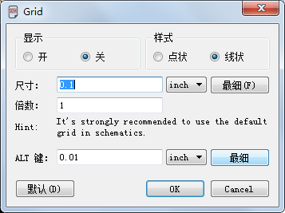

适当的层设置对于原理图至关重要。
所有的电路设计软件都有严谨的层设置选项，
EAGLE 对于层的定义同样非常严格，原理图默认的层包括 91~98 层的范围：

• 91 Nets : 绘制具有电气属性的信号连线。
• 92 Busses : 绘制总线形式的信号连线。
• 93 Pins : 放置元件引脚的连接点。
• 94 Symbols : 放置元件符号，同时也用来放置原理图外框。
• 95 Names : 放置元件符号的名称。
• 96 Values : 放置元件的值。
• 97 Info : 放置用户添加的信息。
• 98 Guide: 放置向导信息。

除了 Nets、Busses、Pins 是具有电气属性的层以外，其余的层都是用来显示或者添加备注信息，其主要作用是尽可能丰富的提供原理图的相关信息，它们之间的区别不是非常大。

对于 Nets、Busses、Pins ，需要做到专层专用，否则原理图的电气连接会非常混乱，导致原理图产生错误。

用于可以从 100 层以后开始添加自定义层。参考 Display 命令。

原理图层颜色的设置应当做到清晰、明确，即每层的颜色应当与其他层的颜色具有明显的区别，不能采用相近的颜色，更不能采用相同的颜色表示不同的层。
EAGLE 预先设置了从91~98 层的颜色，如果没有特殊要求，建议使用EAGLE 默认的层颜色设置。

EAGLE 默认有16 种颜色可供选择，如果需要使用到更多的颜色，可以通过 SET 命令弹出的设置窗口中的 Colors 选项卡中的调色板进行自定义设置，或者运行EAGLE 官方网站提供的脚本文件 newcolors.scr 来增加颜色，该脚本文件可以在以下链接下载: 
ftp :// ftp.cadsoft.de/ eagle/ userfi les/ misc/ newcolors.scr

### 5.2 放置原理国外框(Frame)

原理图外框 Frame 主要有两个区域：绘图区域和信息区域。
绘图区域：用于原理图的绘制及坐标识别。
信息区域：包括原理图内容、原理图名称、版本信息、文件号，绘制时间、设计者等信息，对原理图做必要的标注。

所有原理图的绘制都必须在原理图外框范围内进行。

frames.lbr 库附带了很多原理图外框符号供用户调用，用户也可以自定义自己的外框，参考原价库编辑器中的 Frame 内容。

使用 ADD 命令添加外框，也可使用 Frame 命令直接绘制。
原理图外框的其中一个角(最好是左下角)必须放到坐标原点上。

本例中在原理阁信息区域中填写了原理图内容、原理阁名称、文档号、版本信息、绘制时间等一系列信息。
这些信息对于原理阁来说是必不可少的内容，能够使原理图更加规范并且具有更好的可维护性。

除非原理图特别简单，一般情况下， 原理图总会使用多界面来设计。
可以在原理图缩略框内有键单击并添加新的原理图界面，在原理图的每一个页面中都要添加相同的原理框外框，并
填写必要的信息。
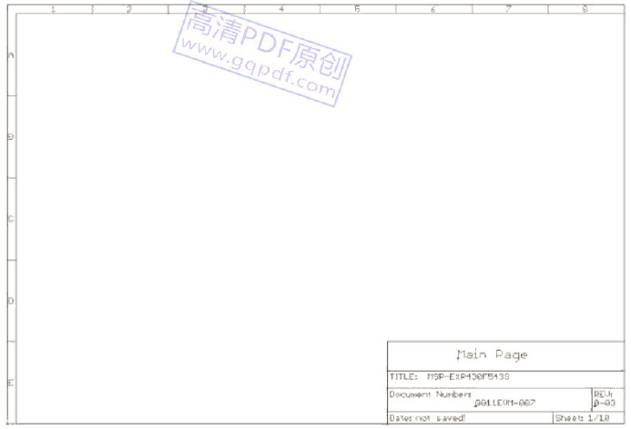
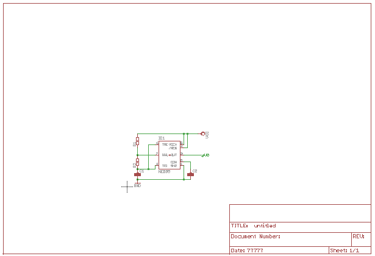

### 5.3 绘制原理图到面
绘制原理图封面是为了方便原理图的管理， 一份优秀的原理图设计，必然会遵循严格的设计规范，而封面则是这些设计规范中最重要的部分之一。
封面的作用有两点: 一是便于原理图的归档和查找；另一个则是便于阅读者快速地了解原理图的内容。
如果没有封面，读者可能要查看整个原理图才能了解其中的内容，这将降低工作效率，也消弱了原理图的可读性和可维护性。
原理图封面中的内容一般包括公司信息、责任部门、原理图名称、原理图编号、原理图版本号、设计者、发布时间、内容描述等。
内容描述是对本原理图所包含模块的说明和介绍，便于让阅读者对原理图所包含的内容有一个大概的了解。
在 EAGLE 中绘制封面非常简单，直接在原理图外框内部添加文本信息即可。
另外通过EAGLE 自带的 ULP 程序 import-bmp. ulp ，还可以在封面中导人 BMP 图片，例如导人公司
商标。

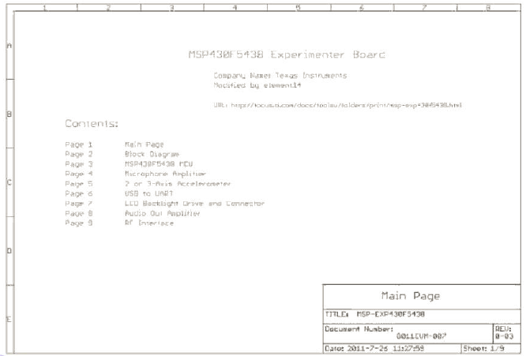

### 5.4 绘制原理图系统框图(电路板布局图)

封面完成后就可以开始绘制原理图的系统框图了。

系统框图是使用矩形框和连线等非电气特性的绘图工具来表示电路工作原理和组成概况的一种结构图。

图中用框表示各个自定义的功能模块，用连线来表达各功能模块之间的主要连接关系。

通过框图，阅读者可以很快地了解整个系统的功能结构、主要单元电路的位置、名称以及各单元电路之间的信号传输方向，并且直观地了解信号在单元电路中的处理过程，为具体分析电路提供指导性信息。
或者绘制电路板布局图，为后续 PCB 设计提供指导，也便于阅读者了解电路板的布局情况。

原理图的框图范例：
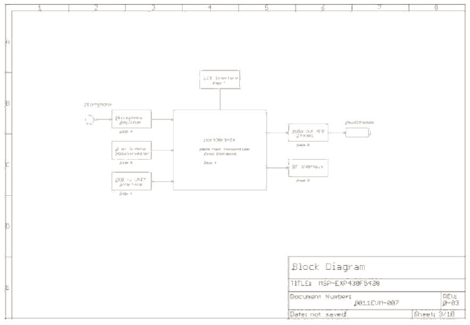

在原理图编辑器中使用 WIRE 命令可以在任意的非电气层(即Nets 、Busses 和 Pins 以外的层)上面绘制框图。
通常框与原理图外框都放置在 Syrnbols 层，其余的信息则放置在 Info 层上。
各个长方形用于表示不同的功能模块，在这些模块之间的各种连线表示各模块的连接关系。

### 5.5 放置元件

通过 ADD 命令放置元件，放置元件可以依据前面绘制完成的框图，将各功能模块涉及的元件依次放置到相应的界面中去。

元件的放置并非"放下即可"，还需要同时考虑放置的位置是否有利于之后信号线路的连接工作。
如，元件的摆放显得杂乱无章，势必给信号连接造成不必要的难度。

原理图的设计需要做到简洁、工整、美观、疏密有致，因此应该确保元件在原理图中分布清晰，尽量根据不同的模块来分区域放置元件。

原则上不同模块应该分别放到不同的原理图页面，旁路电容应当接近相应的电源引脚放置，模拟器件应当尽量放置在一起，等等。

这样做不仅能够降低原理图中连接信号的难度，并且为之后的 PCB 布局提供了一个示意性的指导， 从而能够增加PCB 布局布线工作的效率。

元件的放置不是一次性的工作， 一定要结合后面的连线等步骤来调整元件布局。

### 5.6 连接信号网络 
连接信号网络可以在放置好元件后进行，也可以一边调整元件布局， 一边进行信号网络连接。

连接信号网络就是对原理图的元件进行电气连接，使各个元件之间按照设计要求产生电气关系，这也是原理图设计的根本目的。

在连接信号线时必须做到细心和严谨，并严格按照电路原理、信号流向和芯片手册提供的参考电路来进行电气连接。
如果信号连接出现错误，会为以后的工作带来不必要的麻烦。
因此在进行信号网络连接之前，应当充分阅读设计文档和芯片资料，建议把整个原理图在设计和芯片方面的某些需要特别注意的地方保存为一个文档，以方便在设计时查看。
以下是在连接信号网路时的一些通用规则:

- 尽可能多地对信号网络命名，网络名称最好能反应出该信号的功能且易于识别(比如:不推荐使用 `NET_001`, `A_007` 命名，可以使用:`DATA _01`，`CLK _IN` 等) ，推荐使用
LABEL 命令将多数的信号网络名称显示出来便于阅读和检查，更利于后期PCB 设计时布线参考。
- 尽量避免复杂且相互交叉的连接关系，此时可以使用命名相同的网络名称来实现电气连接(尽管表面上它们并没有连接，但相同的网络名称表示它们实际上已经连接)。
- 考虑引脚间电平的兼容性，不同电平的信号需要经过电平转换才能进行互连。
- 不同的电源网络必须有明确的标志，不能有模棱两可的情况，并禁止相互直接连接。
- 对于有正负极和额定功率的元件，必须严格按照元件手册的要求连接，包括供电电流、电压和电源正负极等，并严格检查。
- 除了全局性信号网络(电源和接地等) ，其他网络在进行多界面连接时必须使用交叉连接 ( 网络的XREF 属性 )。
- 为了增加原理图的可读性，在绘制数据、地址等有规律的信号网络时，尽量采用总线的方式连接。

除了上面的通用规则外，在EAGLE 软件中还有一些需要注意的地方:
- 推荐使用NET 命令，而不是WIRE 命令连线。
NET 命令是EAGLE 软件专门设计用来连接信号网络的命令，所绘制的连线默认在 Nets 层，具备电气属性。WIRE 命令绘
制的连线仅仅在 Nets 层才具备电气属性。
- 一次性完成两个端点之间的信号网络。EAGLE 软件允许一条信号网络一端浮空，这种方式可以分几次完成一条信号线的连接，但却产生了两个网络名称。为了杜绝这种错误，建议一次性完成两端点之间的信号线连接。
- 在EAGLE 中，尽量不要采用"十字交叉"方式连接信号网络。尽管 EAGLE 可以自动在十字节点添加节点符号，但是如果两条十字相交的信号线起初的网络名并不相同，即并没有相互连接，而是之后通过NAME 命令修改为相同网络名实现的连接，这时十字交叉点上不会自动添加节点，因此会导致ERC 电气检查错误。

按照上面的规则，就可以快速、安全地完成信号网络连接工作。

### 5.7 绘制纵向

随着原理图的规模越来越大，原理图的连线也越来越密集，为了提高原理图的可读性和美观，需要使用总线来减少信号连线的数量。

总线在原理图中就是一组功能类似的信号线的集合，几乎在所有的设计软件中都通过较粗的连线来表示总线，并且多用于数字电路，比如在数字电路中无处不在的数据线和地址线， 一般都用总线的形式来表示，绘制总线需要用到 BUS
命令。
原理图中的总线范例如下图：

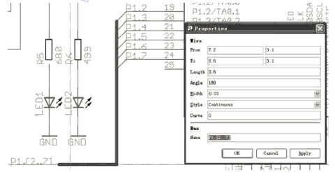

在EAGLE 中绘制总线和其他软件并没有什么区别，但唯一需要注意的EAGLE 总线的命名格式， EAGLE 总线的名称包含了总线上所连接的所有信号网络的名称，比如上图中的总线名称为P1.[ 2..7]，表示该总线上连接了网络P1.2 到P1.7 。
名称中带有顺序字符的信号可以采用与P1.[ 2..7 ]相似的方法表示，不带有顺序字符的信号则需要用**逗号隔开**。

### 5.8 添加原理图标注信息
在元件、节点以及网络附近等处使用 WIRE 和 TEXT 命令(也可以使用 CIRCLE 、ARC 、RECT 和 POLYGON 命令)添加必备的标注信息，是衡量绘图者是否专业的一项依据(是否添加了标注对于原理图的电气特性没有任何影响) 。

原理图标注的目的是为了让一份原理图易于阅读，便于理解和检查，并有很好的可维护性，同时能为 PCB 设计提供指导。

标注信息贯穿整个原理图设计中，可以在绘制原理图的任何时候进行，原则上应该在所有元件和网络连线完成后进行。

标注信息是对原理图中关键部分进行解释和说明的描述信息，不具备任何电气特性，因此，禁止在Nets ， Buses 和Pins 层中添加标注信息。
在Info 层添加标注信息是一种良好的习惯。

标注信息的添加位置没有任何约束和限制，不同的原理图需要添加的内容不同。
下面是原理图中常见添加标注信息的地方:

- 如果一界面原理图中有多个比较独立的模块，则需要对其中一些模块标注。
- 原理图中有不同的跳线、元件或者其他需要进行选择的地方， 需要添加配置表。
- 特殊节点的信号描述，比如: 放大器的输入信号幅度和频宽、ADC (Analog/ Digital Converter ，模数转换)的参考电压幅度和误差、时钟PLL (Pulse Locked Loop ，锁相环) 输出频率和稳定度、DC/ DC 输出能力、电流源的输出电流、PWM( Pulse Width Modulation，脉宽调制)信号的频率及驱动能力、射频功率放大器的输出能力等。
- 特殊电路描述，比如: 射频电路中的阻抗匹配、差分信号网络，如USB (Universal Serial BUS ，通用串行总线) , HDMI (High Definition Multimedia Int erface ，高清晰度多媒体
接口) ,SATA (Serial Advanced Technology Attachment ，串行高级技术附件) 等的阻抗匹配及在PCB 设计中的布线规则。
· 特殊元件的描述，比如: MOSFET (Metal-Oxide-Semiconductor Field-Effect Translstor，金属氧化物半导体场效应管)的引脚布局、射频功率放大器热焊盘设计、天线设
计等。

### 5.9 ERC 检查及排除错误

经过前面的几个步骤，原理图的绘制工作基本完成，为了避免原理图中出现疏漏和错误，ERC(电气规则检查)检查和修改是必不可少的步骤。
执行 ERC 命令能检查原理图中存在的电气连接性错误，比如网络连接是否完整、电源引脚是否连接、是否有未连接的引脚等。
ERC 错误报告中的每一条信息都必须认真检查，仔细阅读错误描述并做出相应的处理。
有些错误和警告确实属于原理图设计中的问题，此时应修改原理图直到通过；有些错误和警告是规则不允许的，但实际电路确实需要这样设计，此时应忽略并添加到 Approved 认可列表中。

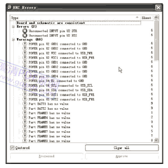

下面列举两种常见的 ERC 错误类型:

第一种错误描述为No SUPPLY for POWER pin XXX ，意思是类型标记为 Pwr 的电源引脚XXX 没有连接到电源信号。
由于在某些情况下引脚不需要始终连接到电源信号，例如第
一个错误中的元件充电模块的功能引脚，因此为了避免EAGLE 将这种情况标记为错误，在允许的情况下应该在元件库中将这种引脚类型设置成除了 Pwr 之外的其他类型，比如 I/O 和Pas 类型，这样就能够避免ERC 报错。

第二种错误描述为 Only INPUT pins on net XXX ，意思是网络SPI_CLK 只有输入端，也就是该网络只有一个连接端点。
检查原理图，是因为设计时手误，把另一端的网络名称写成了`SPI_SCK` ，名称的不一致导致这两个引脚没有连接上。
在本例中，修改了`SPI_SCK` 的名称为SPI_CLK 后，网络连接成功，重新进行 ERC 检查时，没有发现相同的错误。

经过了ERC 检查的原理图，并不能说是万无一失， ERC 检查仅仅是一些电气规则检查，其他的电路原理等不能检查。
因此，一份完整的、没有任何错误的原理因必须经过反复的检查才能实现。
检查包括自己检查和他人检查， 一般需要两人以上来进行检查，并需要通过原理图的评审。

### 5.10 输出文件
输出文件主要是指生成一些供生产、存档和后续设计使用的文档。
一般需要生成网络表文件、元件清单CBOM) 、PDF 或者图像形式的原理图。

网络表：记录了各元件之间的网络连接关系，可以用于原理图到 PCB 的导人;
元件清单(BOM) ：记录了使用元件的名称、数量和封装信息，用于生产和采购;
PDF 原理图：用于存档和非设计人员的阅读。
在EAGLE 软件中可以很方便地得到以上的文件。
具体方法是单击File→ Export ， EAGLE 就会弹出可以输出文件的菜单。

BOM 元件清单是由EAGLÐ-软件附带的 BOM.ulp 实现。
值得注意的是，任何一种 EDA 工具都不可能产生一份完整的、可以直接用于采购的材料清单。
要想让EAGLE 软件产生一份、尽可能完整的BOM清单，必须在原理图中对每一个元件添加足够的信息，并保证信息的一致性、准确性，以确保对生成的 BOM 文件最少的改动。

## 6. PCB 设计步骤及实例
本节以 TI 公司的 MSP430 评估板为基础进行讲解。
http://www.ti.com/tool/msp-exp430f5438

通常 PCB 的设计流程可以分为 PCB 设计前期准备、PCB 结构设计、PCB 元件布局、PCB布线、布线优化、调整丝印、添加标注、DRC 检查等。

#### 6.1 PCB 设计前期准备
PCB 设计的前期准备包括创建PCB 设计规则文档、个性化设置、设计规则( Design Rules ) 设置、创建PCB 文件。

##### 1. PCB 设计规则文档 
严格来讲， PCB 设计规则文档会对整个PCB 设计进行规划和定义，包括网络簇参数、电路板尺寸，定位孔等结构、PCB 布局、PCB 设计规则以及特殊信号处理等。
PCB 设计规则文档是指导PCB 设计人员按照一定的设计和工艺标准来设计电路板，并作为检查依据。
PCB 设计规则文档可以根据不同的电路图设计以及不同的设计团队进行适当的修改。

##### 2. 网络簇(Net Classes) 设置
在原理图编辑器和PCB 编辑器中均可以对网路簇进行设置，建议优先在原理图编辑器中设置，以便于从原理图输入到PCB 图中时能保持参数设置一致。
网络簇可以让设计人员对具备相似属性的信号网络的布线参数进行统一设置，包括网路簇名称、布线宽度、过孔直径以及网络簇内部各个网络之间或者不同网络簇之间的间距。
设置完成后的布线参数将在手动布线、跟随布线和自动布线中严格被执行，同时也作为PCB 设计中DRC检查的规则。
值得注意的是， 网路簇的布线参数具有最高优先级，包括设计规则(Design Rules) 在内的参数设置如果和网路簇发生冲突时， EAGLE 软件将采用网路簇设置的参数。
根据PCB 设计规则文挡，结合实际电路板的制作工艺和复杂程度，设计人员可以设置满足需求的网络簇参数。
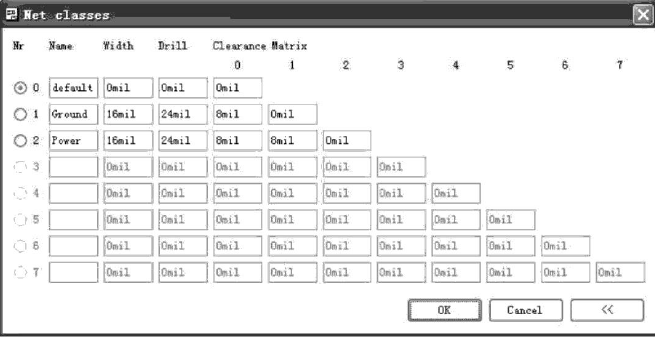

##### 3. 个性化设置
软件使用的个性化设置。
设计者可以对 EAGLE 软件的一些界面、颜色和参数等进行个性化设置。
单击Options /User interfaces 即可打开设置对话框。
本实例仅仅修改原理图和 PCB 的光标显示类型(选择Large ) ， 其他保持系统默认，单击OK 按钮保存并退出
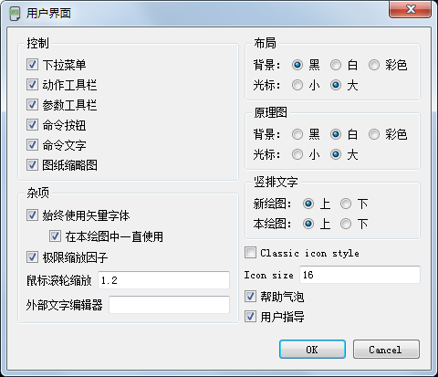

##### 4. Design Rules 规则设置
Design Rules 规则设置作为PCB 设计中电路板层叠结构、布局、布线以及后期检查的基础，是PCB 前期处理中最重要的一步。
设置该部分规则需要一定的PCB 设计经验以及相关的设计规则文档，并且和电路板加工厂商进行必要的沟通，告知对方PCB 板的层叠关系，层定义和阻抗要求等，电路板加工厂商会根据客户的要求和他们的加工工艺建议 PCB 板的一些设计规则(比如过孔尺寸、差分信号阻抗匹配、板厚、安全距离等) 。
根据电路板加工厂商的建议来修改和设置规则是 PCB 设计人员较常采取的方式。
下面结合本实例分别设置File、Layers、Clearances、Distance 、Sizes、Restring、Shapes、Supply、Masks 、Misc 共10 个选项卡。

- **File 选项卡**
File 选项卡主要用于加载以前的设计规则和保存当前的设计规则。
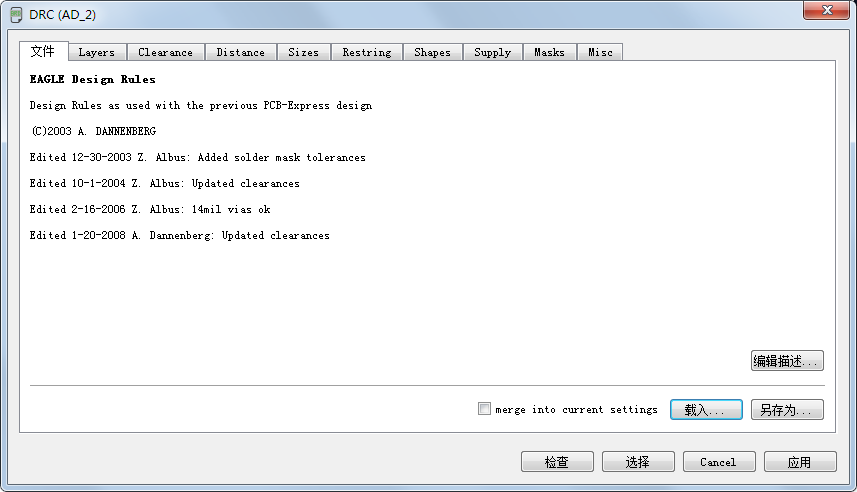

- **Layers 选项卡**
下图所示的 Layers 界面为本实例 PCB 的层叠关系、镀铜厚度和板厚设置参数。
使用了第1 、2 、15 和16 层组成4 层PCB 板，顶层和底层作为信号层，内部的两层作为电源层。
顶层和底层的镀铜厚度为0.017 8mm ，中间两层的镀铜厚度为0.035 6mm ，隔离层的厚度分别为12mil 、27mil 、12mil板厚为1. 402 2mm 。
输入数值和单位时，会根据单位的不同，自动调整。
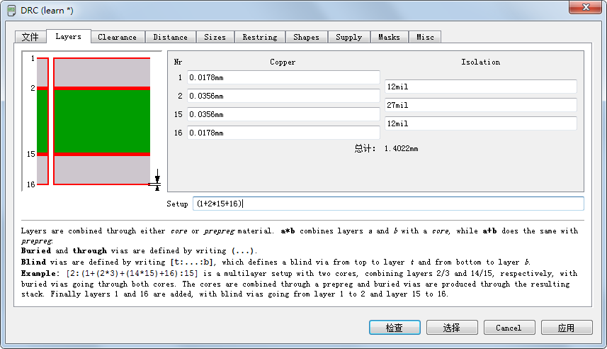

层叠结构对 PCB 的 EMC(电磁兼容性) 性能有很大的影响，通过良好的层叠结构，还可以抑制电磁干扰 EMI 下面列举一些基本的PCB 层叠规则:
· 两个信号层尽量避免直接相邻。相邻的信号层之间容易引人串扰，从而导致电路功能失效。
· 信号层应该与一个内部电源或地层相邻，利用内部电源层或地层的覆铜来提供屏蔽。
· 内部电源层和地层应该相邻，实现内部电源层和地层之间更好地搞合。
· 高速信号层或者时钟层应该在 PCB 中间，且应该在两个内部电源层或地层之间，这样既不会受到外界干扰，也不会干扰其他的信号。
· 在可能的情况下，尽量使用对称的层叠结构。这样可以降低PCB 加工的难度，提高 PCB 的可靠性。

下表列出了常见多层电路板层叠结构的参考方案，这些都是经过实际验证可以直接使用的层叠结构，它们大多数都符合PCB 板的层叠规则，并且具有良好的对称性。

- **Clearance** 安全间距设置
Clearance 界面主要用于设置PCB 各种元素之间的最小距离(也称安全距离) ，包括布线、直插式焊盘、表贴式焊盘和过孔相互之间的最小距离，本实例， PCB 设计中的几个安全间距值全部采用软件默认的 8mil 即可。
最小间距设置要根据 PCB 的信号频率、布线密度、电流大小，结合电路板生产商的加工工艺及成本等综合考虑。
考虑到当前电路板生产商的加工工艺水平，原则上不推荐设置小于 4mil 的安全间距，5 、6 、8mil 的间距最常见。
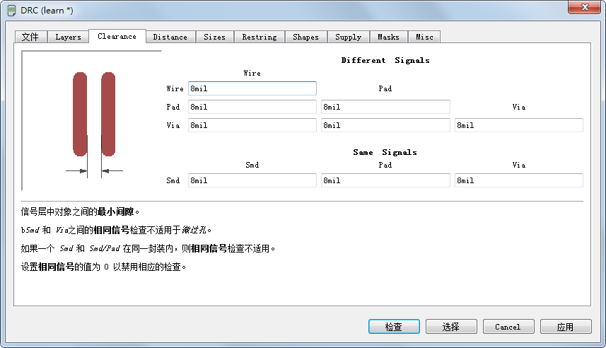

- **Distance** 
设置 PCB 板中各元素距离板边的安全距离，包括铺铜、过孔、定位孔和布线等。还可设置钻孔内径间的距离。
设置该参数的目的在于使PCB 板内部的电气信号与板外的信号隔离.从而易于生产、装配，并提供产品使用寿命。
本实例统一设置为8mil 。
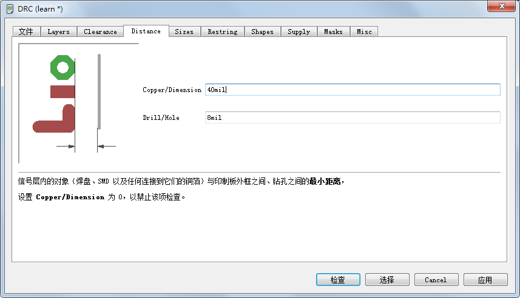

- **Sizcs 选项卡，**
设置最小布线宽度、最小钻孔内径、最小微型过孔外径、最小盲孔比。
根据不同 PCB 设计需求修改相应的参数，并确保电路板加工厂商的加工工艺能实现。

微型过孔和盲孔的的加工工艺复杂，精度要求高，相应的加工成本也高，在常规PCB 设计中尽量避免采用。
由于微型过孔和盲孔的加工涉及PCB 的层叠关系，需要设置时请一定遵循电路板加工厂商的建议。

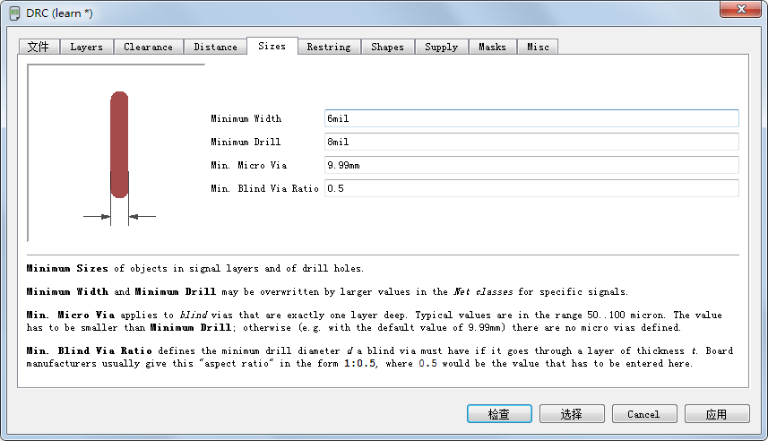

- **Restring 选项卡**，
设置直插式焊盘、过孔和微型过孔的 Restring 宽度，Res tring 是环绕在直插式焊盘和过孔外面的铜圈。
本例中直插式焊盘和过孔的 Restring 宽度都设定为6~20mil，微型过孔的 Restring 宽度设置为 4~20mil 。
其实在PCB 设计中，有一些常用过孔的内外径比例，可以满足绝大多数PCB 设计的要求:
• 20 / 10mil 或者24 / 10mil : 用于信号线，可以满足一般的要求。
• 16 / 8mil: 用于BGA ( 球栅阵列 )内部布线。
• 40/ 24 : 用于电源、布线。
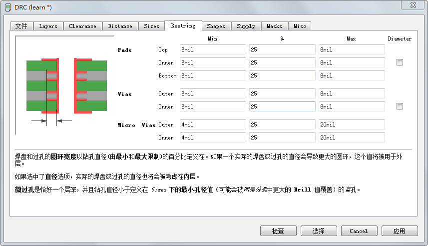

- **Shapers**
设置表贴式焊盘和直插式焊盘的外观形状。
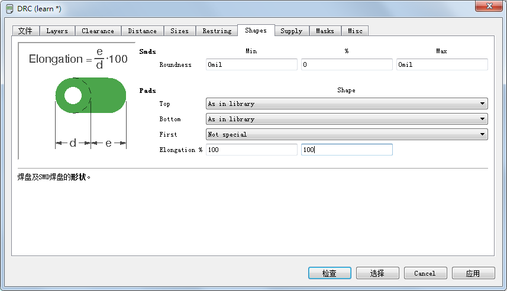

- **Supply**
设置热焊盘的连接宽度和隔离宽度。此部分如果不是有特殊要求，保持默认即可。
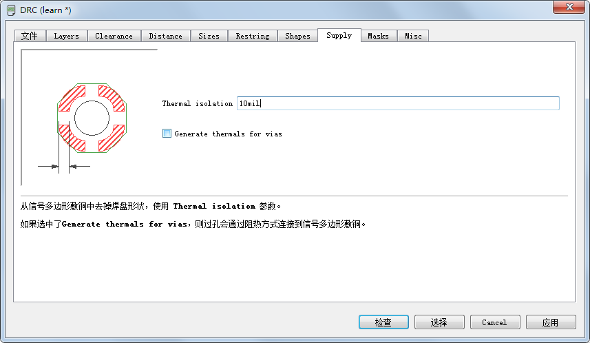

- **Masks** 选项卡
设置阻焊和焊膏的宽度。
阻焊宽度的设置是为了防止焊锡溢出，便于焊接; 焊膏宽度的设置只针对表贴式焊盘。
在本实例中，阻焊设置为1mil ，表示焊盘之外 1 mil 的区域为阻焊油漆禁止刷人的区域。
焊膏和阻焊的尺寸被设置成一样的。
Limit 选项设置为15mil ，表示小于或者等于15mil 的过孔没有阻焊区域，而大于15mil 的过孔则有阻焊区域。
对于Limit 选项如此设置的依据，可以这样理解: 较小的过孔主要位于器件和布线密集区，比如 BGA (Ball Grid Array ，球栅阵列封装) 器件下部，在BGA 器件下部的过孔如果没有阻焊油漆的覆盖，焊接时很容易与BGA 器件的引脚
粘连，引起短路，所以较小的过孔，都必须设置为有阻焊油漆的覆盖，即没有阻焊区域。这一点很重要， 可以向电路板加工厂商特别说明! 对于这一数值的设置，需要根据PCB 板使用的过孔大小而定。
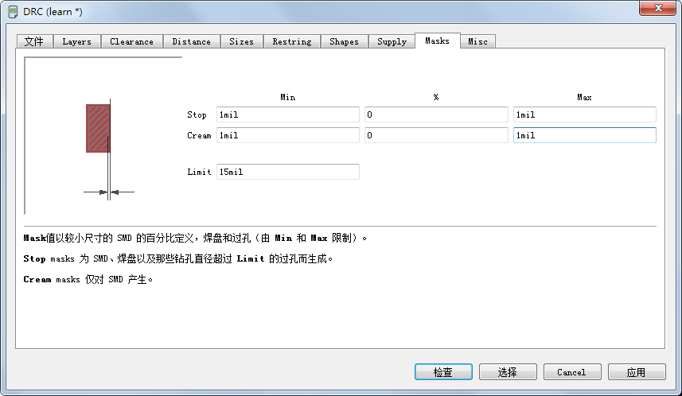

- **Misc**
用于一些检查选项的选择，根据自己的要求选择即可。
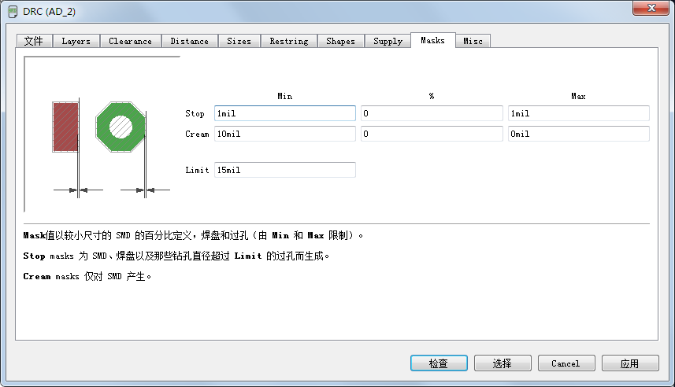

##### 5. 创建 PCB 文件
EAGLE 软件允许直接建立PCB 文件而不需要原理图，不过不推荐使用这种方式。
一般的做法是设计完原理图并确认无误后，直接单击BOARD 命令按钮，仅仅需要如此简单的一步操作即可创建一份和原理图电气特性一致的PCB 文件。
在下图中可以看到，所有器件被分类排放在PCB 编辑器的原点左边，右边用于定义PCB的外形结构。
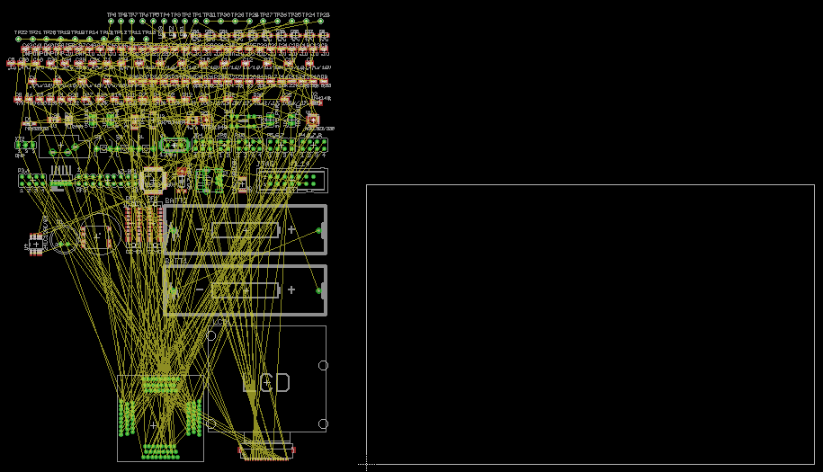

#### 6.2 栅格及层设置
PCB 设计中首先考虑设置栅格，在PCB 设计的不同时期对栅格尺寸的要求不同。

PCB 结构设计时根据结构图中的单位和尺寸选择相关的单位(mm 或者mil) 和最小分辨尺寸。

元件布局时根据 PCB 图中元件的多少选择合适的单位和尺寸，推荐使用 mil 为单位，分辨率为5 mil 的整数倍，比如10  mil 、15 mil 、20 mil 等。

需要精确布局特定元件时必须更改栅格单位和尺寸来和元件相匹配，比如某些输入、输出端口、开关位置等。

布线时推荐使用 5 mil ，特殊情况比如使用 mm 为单位设计的QFP(Quad Flat Package ，方型扁平封装)、BGA 封装例外。

使用 DISPLAY 命令可以对 PCB 各层的颜色等信息进行修改，本实例使用软件默认颜色配置，并对电源层和地层进行设置。

~~在 Display 对话框中修改第 2 层 Route2 为 Supply 层( 如果没显示第二层，请在 Design Rules 中的 Layers 标签中将其设置为 4 层电路板)，并命名为 GND ，则所有的 GND 网络将分配到 GND 层并产生梅花状的热焊盘。~~
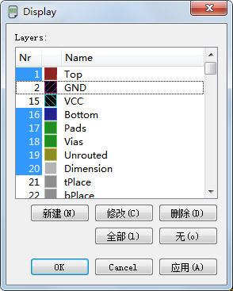
由于本实例中有多个电源网络将分配到第15 层 ( Route15 )，因此不能使用上述方法完成电源层网路分配，只能将其设置成一般的信号层，并通过分区域灌铜实现。

#### 6.3 PCB 结构设计
值 PCB 外形结构
一般情况下，使用 WIRE 命令在第20 层 (Dimension) 绘制PCB 板的外形、尺寸、机械定位以及特殊开槽等结构。
由于 PCB 板多数情况会安装到特定的位置或机构内，结构设计必须要严谨、准确，不能出现丝毫差错。
本实例是一块开发平台，对结构设计没有特殊的要求。
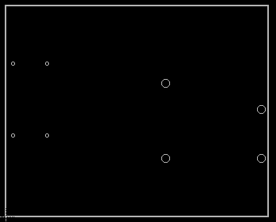

#### 6.4 元件布局
一块合格的 PCB 板不仅仅要求机械结构和电气性能达到设计要求， 而且外观也要求美观。
合理的元件布局不仅可以降低布线难度、减少布线层数、尽量避免不同电路混合，而且能达到外观要求。
元件布局关系到整个 PCB 设计的成败和成本，是整个PCB 设计中很重要的环节。

元件布局需要考虑的因素包括满足电气性能、降低EMI (Electro Magnetic Interference ,电磁干扰) 、模块化分区、元件质量和散热需求、排到整齐、接口位置和装配等，这些因数有些相辅相成，有些则相互矛盾， 根据实际设计需求使用不同优先级布局方式，尽可能平衡各种利弊，合理布局。

元件布局请参考以下基本规则:
- 栅格设置合理: 视电路设计复杂程度选择5 /10 /15 / 20mil 布局， 不建议用更小栅格避免布局不整齐， 增加调整工作量。
- 尽可能单面布局元件: 可以降低焊接成本和装配限制，特殊情况才采用双面布局。
- 优先布局元件: 对安装位置有限制的质量大、高度高、发热大的元件、需要电磁屏蔽的元件、外部接口元件等，设置限高或禁止布局/ 布线区。
- 规划布局区域: 尽可能确保模拟电路、数字电路、射频电路、大功率、高电压电路等布局分配合理且相互独立，以降低信号干扰、串扰，降低EMI。
并预留电源和地信号宽度(单层和双层板) ，或者电源层和地层合理分割(多层板)。
- 模块化布局:同一功能模块的电路尽可能放在同一区域，且优先布局核心元件或电路，相同模块布局尽量一致，去耦电容必须尽量靠近其去搞对象相关引脚位置。
- 特殊电路或元件处理: 蛇形等长布线(DDR 的数据/地址)或者阻抗匹配电路(射频/ 差分电路)需要预估布线区域宽度；噪声源(时钟电路)或者易被噪声干扰的电路或元件需要预留屏蔽空间。
- PCB 板上的元件应分布均匀、疏密一致。在保证电气性能的前提下，尽可能相互平行或垂直排列元件，以求整齐、美观，同一类型的元件( 二极管、电解电容等)尽可能按照同一旋转方向布局。
- 元件之间必须留出足够的装配空间， 一般情况下不允许元件重叠，必须重叠元件时一定要确认下面一层元件的高度等信息，以免无法装配。
本实例基本按照上述规则进行布局，完成的PCB 布局如图所示。
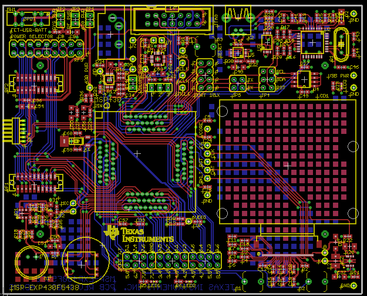

#### 6.5 PCB 布线
完成了元件布局后，紧接着的就是 PCB 布线阶段。EAGLE 软件提供手动布线、跟随布线和自动布线3 种布线方式，本节仅讲述手动布线。

PCB 布线遵循以下基本规则：
- 一般PCB 设计推荐使用 5mil 栅格布线，可以减少后期布线优化时间以及 DRC 间距错误排除。只有在高密度PCB 设计或者小间距充件封装(BGA 等)时切换至较小栅格。
- 使用直线或钝角布线，禁止采用直角或者锐角有线。
- 除电源网络外，同一信号网络的布线宽度尽量保持相同。
- 严格依照 PCB 设计规则 ( 布线长度、宽度、差分线、蛇形线等 ) 进行布线，特殊情况例外。
- 信号网络尽量走直线，少走弯曲线， 过孔最好不超过3 个，长度越短越好。
- 原则上不允许跨区域布线，比如数字信号不能进入对信号很敏感的模拟电路区域。
- 电源网络和地网络必须以最短的路径连接公共网络。在多层板中，每个电源和地网络均需要单独添加过孔进入内部层；在双层/单层板中则尽快和主干电源及地网络布线连接。

PCB 布线遵循以下先后顺序:
- 不一定非要优先对电源和地网络布线，但在所有的布线过程中必须为其预留足够的空间，也即优先考虑。
- 高频信号优先布线。
- 信号网络密集区域优先布线，比如BGA 区域。
如果元件布局合理，则PCB 布线就显得比较轻松。
但实际情况和理想之间有一定距离，因此，在布线的过程中经常需要对布局进行局部修改以便能更好完成布线。

本实例中PCB 设计难度适中， 按照上面的思路较容易完成布线工作，结果如图

#### 6.6 布线优化
布线优化就是对PCB 的布线进行调整。
在PCB 设计中，布线优化也是必不可少的流程。
大致的调整思路如下:
- 修饰布线: 包括不必要的拐角、布线宽度不一致、布线上或者引脚处有毛刺、布线没有和焊盘中心连接等。
- 查看是否有更好的元件布局从而更有利于布线。
- 查看是否有减小布线长度的另外一个途径，并修改。
- 检查是否有垂直或者锐角布线，并修改。

#### 6.7 分割电源层和地层并敷铜
在前面层设置中已说明，没有将本实例PCB 板的第15 层CVCC 层)设置为Supply 层，而是设置为一般信号层，因为将在本层分配 VCC ， DVCC 和 USB PWR 共3 个电源网络。
使用 POLYGON 命令，分别在 VCC ， DVCC 和 USB PWR 网络位于 VCC 层的区域内画一段封闭的多边形区域。并分别修改多边形区域的名称为VCC ， DVCC 和USB _ PWR ，
下图所示为电源层多边形区域，和执行RATSNEST 命令为每个多边形外框敷铜后的样图。
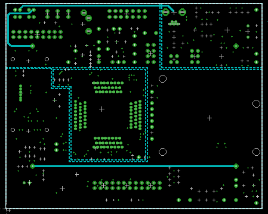
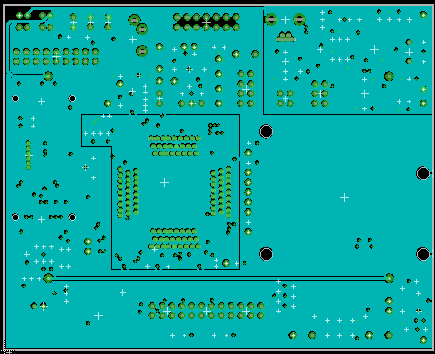

请注意: 相邻多边形区域敷铜区间的最佳间距为10 ~ 15mil，多边形敷铜区和电路板外框也最好保持15mil 以上。

第2 层(GND) 在PCB 设计之前已被设置为 Supply 层， Supply 层的 Gerber 数据是以负片的形式输出。
在处理这样的图层时，仅仅需要使用 WIRE 命令在第二层沿着电路板外框绘制一个封闭的多边形图形即可(线宽20mil)。
绘制完成的结果如下图。
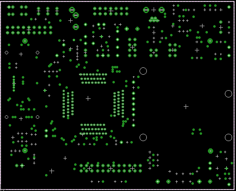

请注意: 该多边形区域的布线宽度最少 15 mil 以上，这样可以确保第二层的敷铜区距离电路板外框达到 15 mil 。
严格地讲，内部电源层和地层的敷铜区外沿最好不要重叠。
除了多层电路板内部电源层和地层的分割，表层(特别是底层)多数情况下也需要敷铜，特殊元件的封装附近有时候也要敷铜、大电流电路(特别针对电源设计)除了增加布线宽度，敷铜也是常见的处理办法。

#### 6.8 丝印层
丝印层的处理包括元件编号的处理和添加其他附属说明文本或图形。

丝印层的信息不具有电气特性， ERC 和DRC 不会对丝印层进行检查，这个步骤只能靠电路设计者手工检查和修改，忽略丝印层的处理将可能导致灾难性的后果。

下面列举一些常见丝印层处理的规则:
- 丝印层内容必不可少，特殊要求的 PCB 板可以没有丝印层。
- 禁止丝印层上的内容覆盖元件封装的焊盘，避免造成元件虚焊或无法焊接。
- 原则上元件编号需要在其封装处就近显示，特殊情况可移至其他地方， 并使用连接线标注。
- 文字排列方向：PCB 板上所有的文字(包括元件编号)选择同一排列方向，水平方向从左至右，垂直方向从下至上(或从上至下，只能选其一) 。
- 正常情况下，丝印层文字要确保能在元件装配后还能显示，不能被元件覆盖，且不能重叠。
- 可以对元件重新编号便于焊接、调试、和维修等。
- 为特定的元件添加必要的文字、图表等，如二极管极性标注、跳线配置表、LED 颜色、输入/输出端口的信号类型、接口信号分布、电源电压值等。
- 添加必要的设计信息，如公司名称、公司LOGO 、电路板名称、电路板编号等。

#### 6.9 DRC 检查
DRC 检查是对前面所有工作的检查，也是检查电路板是否因违背设计规则而造成了错误，并提供错误信息和图示指导设计人员进行修改。
在前面 PCB 设计阶段列举了很多看起来不是很重要的布局和布线规则，其目的是为了尽可能减少 DRC 报错。
一块比较复杂的PCB 板，如果不严格执行布局布线规则，则在 DRC 阶段必将花大量的时间来修改和调整，严重时将不得不重新布局和布线。
本实例执行 DRC 检查后的错误报告如下图所示。
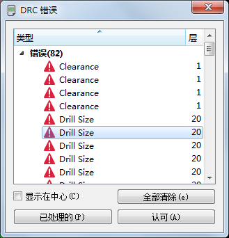

列举其中三类常见 Clearance 、Drill Size 和 Overlap 错误加以解释并修改，其余的 DRC 错误可以阅读 EAGLE 软件的帮助文件:
- **Clearance 间距错误**: 如图所示的 Clearance 错误，源于Design Rules 中 Clearance 标签内对同一网络的间距设置为8 mil。同一网路的间距可以修改为 0 ，重新执行DRC ，则错
误消失。 
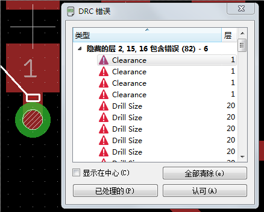

- **Drill Size 钻孔尺寸错误**: Drill Size 错误需要仔细检查，右边 Via 属性窗口显示该 Via 的钻孔直径16mil，在 Design Rules 规则设置范围内，但是其网络簇却属于 Ground ， 打开Net Classes 界面发现Ground 的 Drill 设置为24mil 。
前面提过，网路簇的布线优先级高于任何默认其他设置，本处 DRC 执行的规则是网络簇规则而不是 Design Rules的规则。
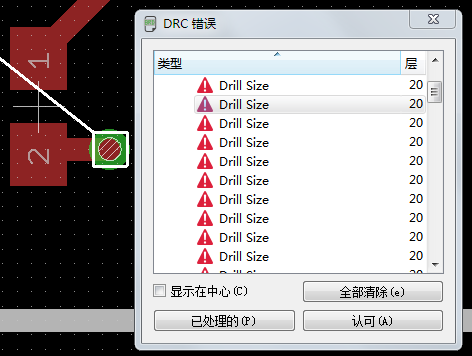
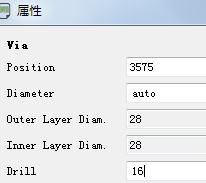
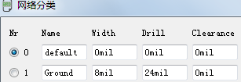

- **Overlap 重叠错误**: 重叠错误在 PCB 封装中最容易出现，打开该元件的封装即可发现错误在于创建 PCB 封装时有矩形铜区和 SMD 焊盘重叠。此类错误仅仅是违背设计规则，但实际 PCB 板需要这样连接，可以选择 Approve 同意此类错误，布局布线不做任何修改。严格按照 PCB 封装创建原则建库可以避免此类错误。
DRC 的错误报告必须逐条加以确认和修改，直至错误显示为零，方可进入下一阶段。
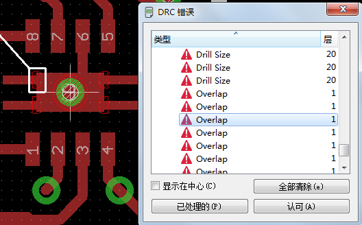

#### 6.10 设置并输出 Gerber 文件
输出 Gerber 文件是 PCB 设计的最后一个阶段，在这一阶段需要产生一份完整无误并适合PCB 制板厂商加工工艺、SMT 装配及焊接工艺的Gerber 文件。

在 EAGLE 的 CAM 处理程序中， 一般建议使用GERBER_274X 驱动来产生 RS - 274 X 格式文件，钻孔数据则由 EXCELLON
驱动产生，这也是PCB 制板厂商普遍认同并接收的G erb er 文件格式。
本实例中介绍的 PCB 为双面丝印、双面元件放置(底层仅仅只有电池元件，可以忽略)的4 层电路板，在CAM 处理程序中选中不同的层和相关的驱动，就能产生需要的 Gerber 文件，详细配置下表。
CAM 处理程序中的各层选项
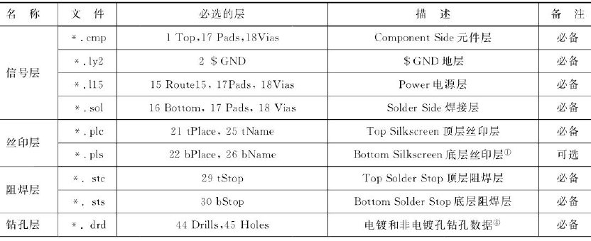

- .pls 底层丝印层文件仅在双面均有丝印时输出，单面丝印不用输出。
- . crc /. crs 焊膏层仅用于需要使用 SMT 焊接工艺的文件，用于制作丝印钢网。手工焊接时不错要输出，量产时必备。
- . dim 电路板外形结构文件， 一般情况下将第 20 Dimension 层添加到其他文件中，则可以不用输出该层数据。
- . drd 钻孔层，所有的孔均为电镀孔。如果要单独输出电镀孔和非电镀孔数据，必须将第44 Drill 层和第45 Holes层分别输出。

.dri ：是由每一个钻孔数据输出生成的。它包含了所使用的工具信息以及关于数据格式的更多信息。

.drl：boardname.drl 文件通常由drillcfg.ulp创建，在布局编辑器窗口中直接启动drillcfg.ulp (RUN command) ，此时将会生成并被命名为 boardname.drl 的Rack 文件

.gpi ：Info file, not needed here 信息文件，这里没有必要使用

输出文件的后缀名是比较随意的，更改后缀名后，文件任然可以打开，显示效果不变。

按照上面的要求设置好后， 单击 Process Job 即可完成 Gerber 文件的输出，对于有敷铜区的电路图，需要先使用Ratsne t 命令完整敷铜， 才能输出。

本实例中由于所有顶层丝印数据已经被人为复制到第 122 _ tplace 层，因此仅仅需要选择第 122 _tplace 层即可输出顶层丝印的全部数据。

装配文件用于电路板焊接时参考，有时候证需要输出。
在EAGLE 中选择第17 Pads 层、第20 Dimension 层、第21 tP lace 层、第25 tName 层以及第31 tCream 层即可输出装配文件。

本实例的完整 Gerber 文件：
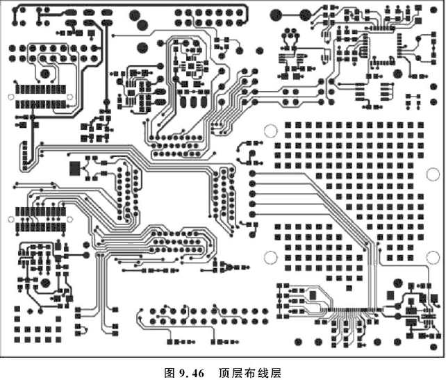
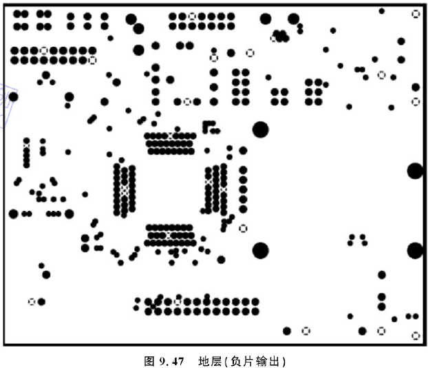
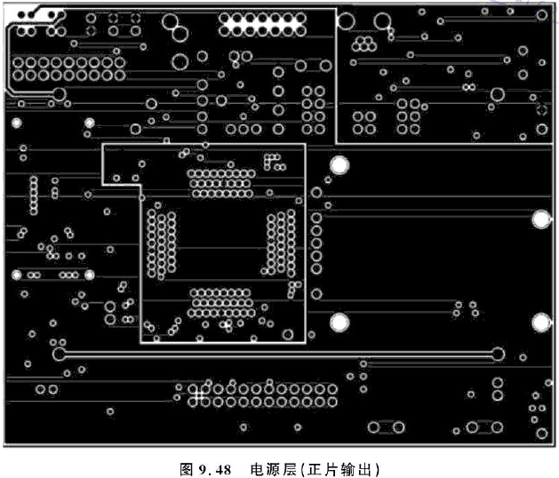
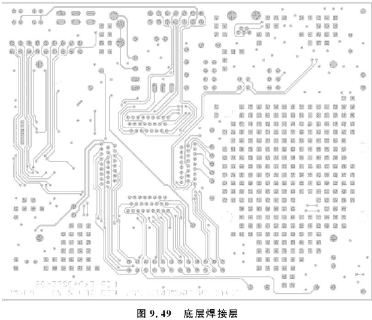
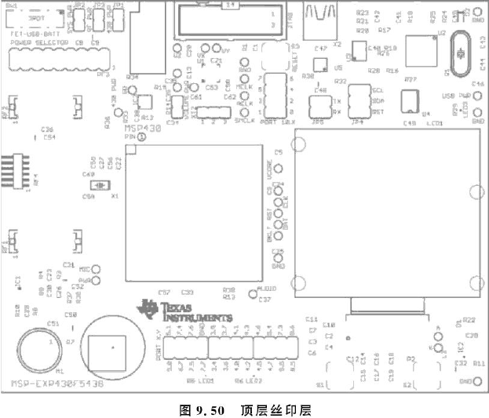
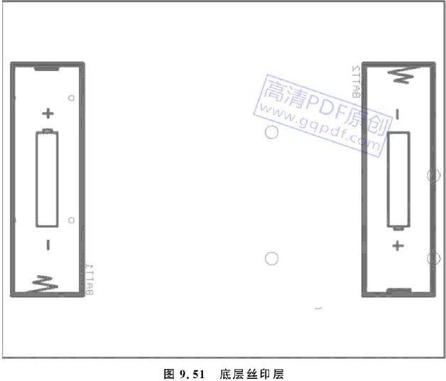
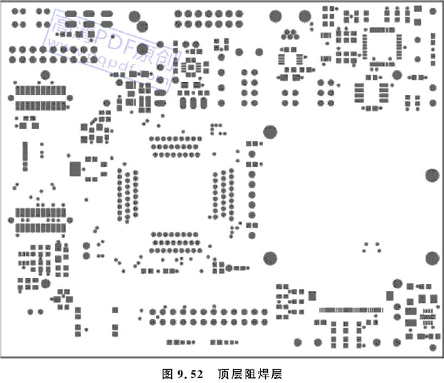
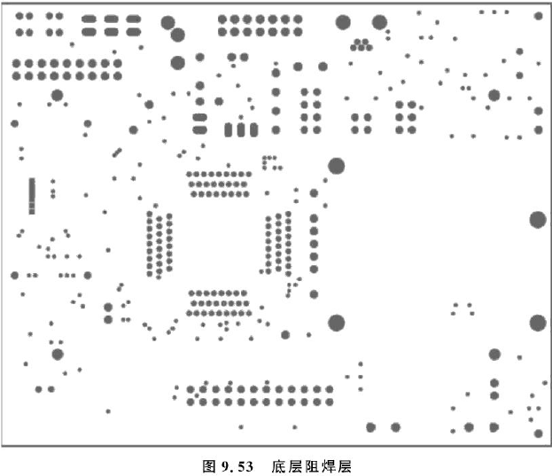
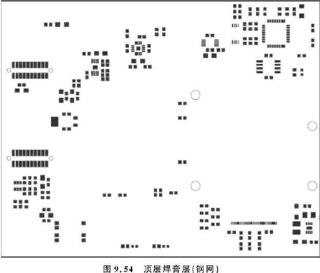
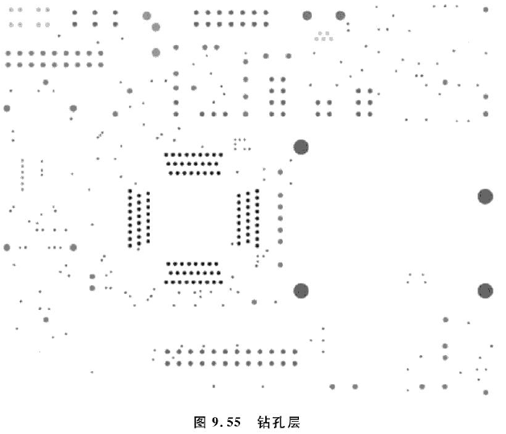