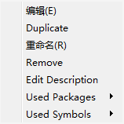
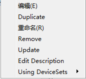

# 1x01_重要修改信息
> GitHub@[orca-j35](https://github.com/orca-j35)，所有笔记均托管在 [eagle-notes](https://github.com/orca-j35/eagle-notes) 仓库

含英文用户手册 Version7 / 5thEdition

建议曾经使用过 EAGLE 早期版本的用户阅读 Linux 和 MAC 系统下的 UPDATE 文件或者 Windows 系统下的 UPDATE.TXT 文件。该文件位于 EAGLE/doc 目录下包含了对版本升级的说明。请您在使用新版 EAGLE 之前先阅读该文件。
之前未提到的信息或者在该用户手册完成后已经被修改的信息也在 UPDATE或 UPDATE.TXT 文件中或者在 README 文件中（如果存在该文件的话）进行了说明。

在帮助页面中能够找到详细的信息，特别是关于 EAGLE 命令语言和 EAGLE 用户语言的信息。
用过该手册您可以很快对该软件有一个基本的了解，并且还可以利用帮助功能中便捷的搜索功能来快速查找某些问题的答案。
以下内容是相对于第 5 版 EAGLE 所作出的重要修改。

## 1.1 EAGLE 电源层
电源层（即名称以`$`开头的层）不再作为特殊的层。
新版本中用于电源信号的层需要通过信号多边形来实现。
当载入老版本的 EAGLE 电路板文件时，电路板中所包含的所有电源层都会自动将名称开头的符号`$`移动到末端。
这样能够避免将电源层作为负片输出的自动脚本程序出现错误，同时又能显示出该层曾经被作为电源层使用。

电源层的功能将被一个具有特定名称的信号多边形所代替。该多边形位于之前的电源层上，形状为矩形，覆盖了Dimension 层上所有 WIRE 命令绘制的线段所定义的区域、或者由焊盘或过孔所定义的区域。自动布线器设置会将生成了多边形的层设定为激活状态（首选方向为“*”），并且该层上所有通路的花销（Cost）都设定为 99。

特别提醒：
在更新了老版本 EAGLE 的电路板电源层后，请运行 RATSNEST 命令，以便验证所有的焊盘仍然与相应的信号连接。

## 1.2 新的内部数据格式
EAGLE 第 6 版所保存的文件不能用于老版本的 EAGLE。
新版 EAGLE 的内部数据格式基于 XML。
数据结构以文档化的形式保存在 EAGLE 安装目录下 doc 文件夹内的 eagle.dtd 文件中。

## 1.3 新的 CUT 和 COPY 命令功能
在老版本 EAGLE 中 COPY 命令仅用于在同一个绘图区内复制选中的对象，而 Windows 中的 COPY 命令则是将选中的对象（即 GROUP 命令选中的对象组）复制到系统的剪贴板。

在 EAGLE 第 6 版中，COPY 命令的主要功能已经和其他 Windows 程序下的复制操作相同，也能够将当前选中的对象组复制并放入剪贴板中。
同时仍然完整保留了之前在同一绘图区中复制对象、以及在不同元件库之间复制对象的功能，因为这些功能对于保证脚本和 ULP 程序的正常工作非常重要。
过去常常让 Windows 用户感到不适的还有 EAGLE 的 CUT 命令只能将当前对象组复制到剪贴板中，而不能同时从绘图区中删除。 
考虑到 CUT 命令的删除功能很少用于激活了正反向标注功能的电路板图和原理图，因此新版 EAGLE删除了菜单栏和命令工具栏中的 CUT 命令。
但是该命令仍然可以在命令框或者脚本中运行。
通过以下命令行
SET Cmd.Copy.ClassicEagleMode 1
可以将 COPY 和 CUT 命令恢复到老版本中的功能。
请注意执行该命令行后只有重新打开编辑器窗口才能生效。

## 1.4 多边形敷铜
多边形敷铜增加了一种新的填充类型，名称叫做 cutout。
这种敷铜形式能够在同一个层中被其他信号的多边形裁剪。
因此即便在内部层中也能够创建限制区域。
在元件封装中绘制的多边形敷铜不再支持等级参数（rank）。
作出这一修改是因为有可能出现绘制任意形状的焊盘的情况。

## 1.5 DRC 和 ERC 检查中经认可的错误
当您载入老版本 EAGLE 所创建的文件并且运行 ERC/DRC 检查时，已经被认
可的错误信息将再次以未认可的状态出现，这时您需要重新认可一次。
通过选中检查窗口中的 Errors 标题项然后单击 Approve all 按钮就可以一次性认可所有错误信息。
出现这种情况是由于 EAGLE 第 6 版具有更高的内部分辨率。

## 1.6 新命令 
DIMENSION 尺寸测量工具
MEANDER 绘制蛇形线，以便调整 PCB 设计中线路的长度

## 1.7 Make Edition
>V7.4 – A new license Make Pro is available that offers flexible board size. 
>See chapter 3.2 for details.

V7.4 - 一个新的许可 Make Pro 可用于提供灵活的电路板尺寸
详见英文用户手册 3.2。

## 1.8 Library Editor Improvements
库编辑器改进
>V7.4 – From now on it is also possible to copy Symbols within a library and from one library into another.
>The context menu of an object displayed in Table of Contents of a Library now contains an entry Duplicate.

V7.4 - 从现在起，还可以在一个元件库的内部拷贝 symbol ，也可以从一个元件库拷贝到另一个。
在 Table of Contents of a Library 中的对象的上下文菜单中，现在包含一个 复制 入口。

## 1.9 CAM Job
>V7.4 – A new CAM job file gerb274x­-mill­-drill.cam has been added. 
>It creates Gerber data for a two­layer board including milling contours (if any) in layer 46, Milling, and drill data in EXCELLON format in one job.

V7.4 – 一个新的 CAM 作业文件 gerb274x­-mill­-drill.cam 被添加。
它为两层电路板创建 Gerber 数据，包括在46 Milling层中的铣削轮廓(如果有)，在同一个作业中包含 EXCELLON 格式的钻孔数据。

## 1.10 Table of Contents in the Library Editor
>V7.3 – After opening the Library Editor a table of contents with the Devices, Packages and Symbols of this library is shown. 
>Through the context menu of an entry you can initiate different actions, like rename, remove, edit. 
>It is also indicated which Symbols or Packages are used in a Device or by which Device(s) is a Package or a Symbol used.
>The ADD dialog in the Device Editor has now a preview for the symbols available.

V7.3 – 在打开元件库编辑器后，一个包含这个库中的Devices, Packages and Symbols的表单将被显示。
通过右键菜单中的条目，你可以启动不同的动作，像重命名、 删除、 编辑。
它也表示 哪些 Symbols or Packages被用于一个 Device ，或 a Package or a Symbol 使用了哪个Device(s) 。

## 1.11 Improved Tree View in the Control Panel
>V7.3 – The tree view has a new branch Documentation that allows direct access to manuals and documentation. 
>The Libraries branch now shows the Symbols. 
>Packages and Symbols are show in separate folders now. 
>Additional files, like PDF, JPG, BMP are shown in the tree view.

V7.3 - 树状视图有一个新的分支 Documentation ，允许直接访问 用户手册 和 文档。
现在库分支会显示 symbol。
Packages 和 Symbols 显示在不同的文件夹中。
附加文件，如 PDF, JPG, BMP 被显示在树状视图中。

## 1.12 Hierarchical Schematic Design
层次化原理图设计

>V7.0 – It is possible to create a structured schematic that contains subunits, called modules. 
>Modules are smaller parts of a schematic, which will be represented in the main level of the schematic by module instances. 
>The individual module instances are represented as simple symbols (blocks).
>Module instances are connected by nets via ports. 
>The hierarchical structure can have an arbitrary depth.

7.0 - 可以创建一个结构化的原理图，这样的原理图包含一个子单位，被叫做模块。
模块是原理图的一小部分，在原理图的第一个层次中模块被表示为模块实例。
单个模块实例被表示为简单的块符号。
模块实例由网络通过端口相连。
层次化的结构可以有任意的深度。

## 1.13 New Icon Design
新的图标设计
>V7.0 – The user interface of EAGLE shows up with a new set of icons, which is shown by default. 
>It is possible to switch between the new and the classic design.

V7.0 - 鹰的用户界面显示一套新的图标，默认情况下显示。
可以在新设计和经典设计之间进行切换。

## 1.14 Autorouter 自动布线器
>V7.0 – The EAGLE Autorouter now supports the calculation of multiple autorouter jobs at a time and the use of multi­core processors. 
>There are new setup options, such as the automatic choice of the routing grid, or automatically determining the preferred directions in the signal layers.
>The setting for effort determines the number of calculated routing jobs. 
>Each of the proposed jobs can be customized.
>In addition, there is the possibility to use the so­-called TopRouter as a kind of pre-­router. 
>It works with a new gridless algorithm which first tries to establish the connections and then uses the classic EAGLE Autorouter for optimization.

V7.0 EAGLE 自动布线器现在支持多个自动布线器作业在同一时间进行计算，以及利用多个处理器核心。
在自动布线器中增加了新的选项，例如 布线栅格的自动选择，或在信号层中自动决定首选方向。
effort 决定了布线计算作业的数量。
每个被推荐的作业能进行定制。
此外，使用所谓 TopRouter 作为一种预布线的可能。
TopRouter 的工作原理是，在第一建立连接时使用一种新的无栅格算法，然后使用经典的 EAGLE 自动布线器进行优化。

## 1.15 New Commands 新命令
>V7.0 – MODULE Create a module and insert a module instance in a hierarchical schematic
>V7.0 – PORT Definition of a port for a module instance

V7.0 - MODEL 创建一个模块，并插入一个模块实例到一个层次化的原理图中
V7.0 - PORT 为模块实例定义端口。