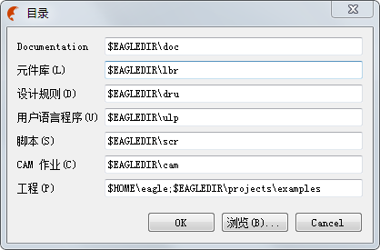

# 1x03_变量参数
> GitHub@[orca-j35](https://github.com/orca-j35)，所有笔记均托管在 [eagle-notes](https://github.com/orca-j35/eagle-notes) 仓库

##  1. 文本变量

**>NAME** 
Component name (eventually + gate name) 1)
元件名称（最终显示名 + gate 名称） 1）

**>VALUE** 
Component value/type 1)
元件的值/类型 1）

**>PART** 
Component name 2)
元件名称 2）

**>GATE** 
Gate name 2)
Gate 名称 2）

**>MODULE** 
Module name (only on module sheets)
模块名(仅针对模块页面)

**>SHEET** 
Sheet number of a circuit diagram in the form of, for example: 1/3 3)
在窗体中的原理图的页面编号 for example: 1/3 3）

**>SHEET_TOTAL** 
`Sheet number in a hierarchical schematic in the form of >SHEETNR_TOTAL/>SHEETS_TOTAL`
在窗体中的层次化原理图的页面编号

**>SHEETS** 
Total number of sheets 3)
原理图页面总数 3）

**>SHEETS_TOTAL** 
Total number of sheets including the module sheets
原理图页面的总数，其中包含模块页面

**>SHEETNR** 
Current sheet number 3)
当前原理图页面编号 3）

**>SHEETNR_TOTAL** 
Current sheet number including the module sheets
当前页面数，其中包含模块页面

**>ASSEMBLY_VARIANT** 
Name of assembly variant
装配变量的名称

**>DRAWING_NAME** 
Drawing name
绘图名称

**>LAST_DATE_TIME** 
Time of the last modification
最后修改时间
**>PLOT_DATE_TIME** 
Time of the plot creation
绘图创建时间

1） Only for package and symbol 仅针对封装和符号
2） Only for symbol 仅针对符号
3） Only for symbol or circuit diagram 仅针对符号或电路图

All texts starting with the character >, will be interpreted as placeholder texts for attributes. 
See ATTRIBUTE command.
所有以“>”符号开头的文本都是表示属性的占位符文本。
请参考 ATTRIBUTE 命令。

**>CONTACT_XREF**
在线圈附近增加触点图标，并标明其交叉关联坐标。

**>XREF**
在symbol 中使用，用于标识交叉关联坐标。

## 2. 变量
`$EAGLEDIR` 是指当前 EAGLE 的安装目录
