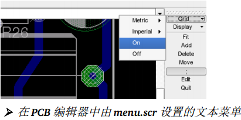

# 1x06_文本菜单的配置
> GitHub@[orca-j35](https://github.com/orca-j35)，所有笔记均托管在 [eagle-notes](https://github.com/orca-j35/eagle-notes) 仓库


通过一个脚本文件（例如 menu.scr）您就可以配置文本菜单，例如：

```
# 命令菜单设置
# #
这是一个设置复杂命令菜单的范例，包括了子菜单和自定名称的命令。
MENU '[designlink22.png] Search and order {\
General : Run designlink-order.ulp -general; |\
Schematic : Run designlink-order.ulp; \
}' \
'Grid { \
Metric { \
Fine : Grid mm 0.1; | \
Coarse : Grid mm 1; \
} | \
Imperial { \
Fine : Grid inch 0.001; | \
Coarse : Grid inch 0.1; \
} | \
On : Grid On; | \
Off : Grid Off; \
}' \
'Display { \
Top : Display None Top Pads Vias Dim; | \
Bottom : Display None Bot Pads Vias Dim; | \
Placeplan { \
Top : Display None tPlace Dim; | \
Bottom : Display None bPlace Dim; \
} \
}' \
'---' \
'Fit : Window Fit;' \
Add Delete Move ';' Edit Quit \
;
```

每行结尾的反斜线“\”表示继续执行下一行的命令。
这里 MENU 命令从注释之后的第一行执行到最后一行。
如果在括号“{}”中一条命令后紧跟另一条命令，则必须使用竖线“|”隔开。
MENU 命令支持小图标显示，比如以上实例中的图片designlink22.png。
默认情况下图片应保存在 eagle/bin 文件夹下。
也可以采用指向图片文件的路径来指定所用图片。

